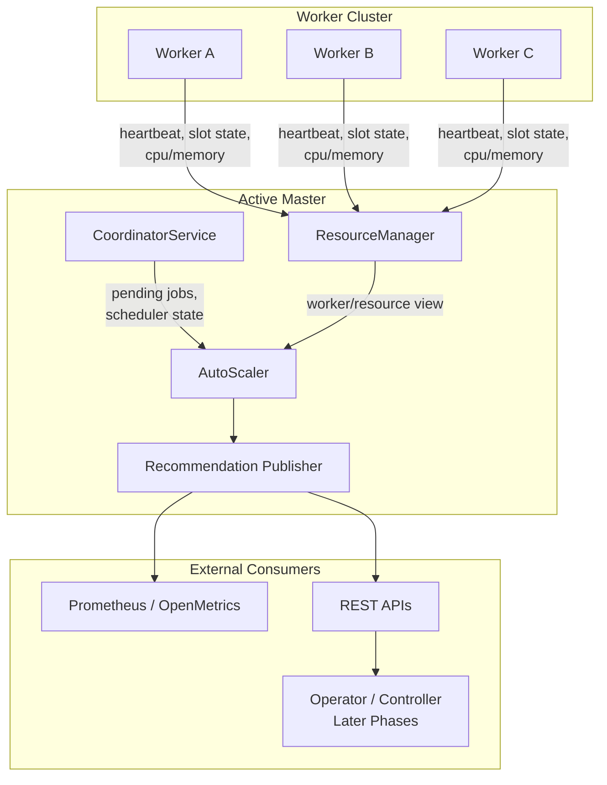
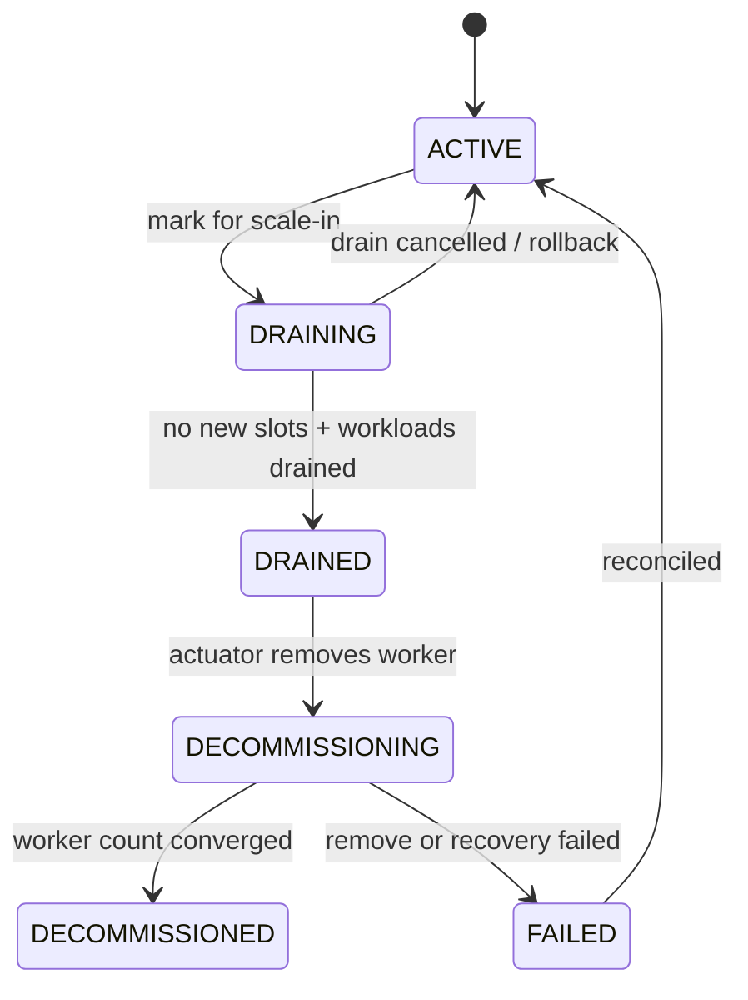
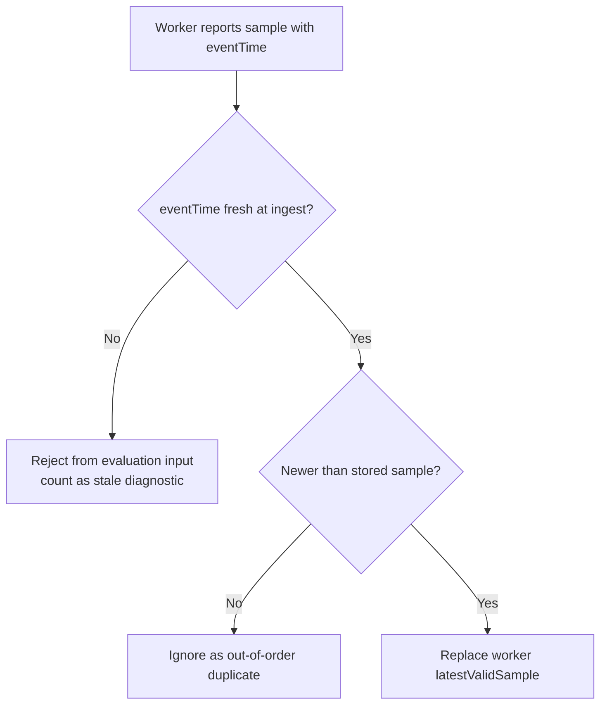
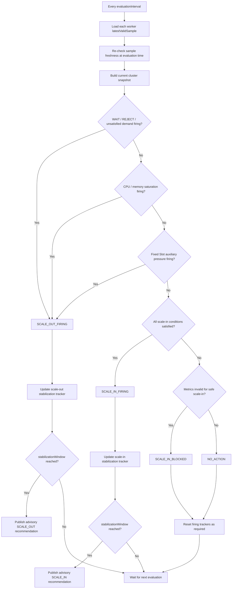

# STIP: Zeta Engine Autoscaling

| Field | Value |
| --- | --- |
| STIP | Zeta Engine Autoscaling |
| Issue | [#11663](https://github.com/apache/seatunnel/issues/11663) |
| Status | Draft |
| Last Updated | 2026-09-04 |

## 1. Abstract

This STIP proposes a native autoscaling framework for the SeaTunnel Zeta Engine.

The proposal is intentionally phased:

- **Phase 1** introduces an **advisory-only** autoscaling control loop that evaluates worker-capacity pressure and publishes structured scaling recommendations through REST APIs and Prometheus metrics.
- **Later phases** introduce pluggable scale-out execution, worker drain, and safe scale-in.

The scope of this STIP is **worker cluster capacity scaling**. It does not include running-job parallelism rescaling, execution graph reconstruction, or live task migration.

The key Phase 1 design decisions are:

- **Phase 1 is advisory-only and does not change actual worker count**
- **Both Fixed Slot and Dynamic Slot are supported, but Dynamic Slot does not use slot utilization**

## 2. Motivation, Scope, and Non-Goals

### 2.1 Motivation

Zeta already exposes several prerequisites for autoscaling:

- worker heartbeat reporting
- slot-aware scheduling
- partial worker system-load reporting
- pending-job visibility
- Prometheus and realtime metrics exposure

However, Zeta still lacks a native control loop that can translate scheduler pressure and worker saturation into a consistent autoscaling recommendation.

This creates three practical gaps:

- Kubernetes users must rely on external HPA or custom controllers that do not understand Zeta-native scheduling pressure.
- Non-Kubernetes deployments have no standard autoscaling mechanism.
- Worker removal is unsafe today because it is treated as a worker failure and may restart affected pipelines.

### 2.2 Scope

This STIP covers **worker capacity scaling** only.

It includes:

- adding worker capacity for jobs blocked by insufficient cluster resources
- evaluating cluster pressure from scheduler and worker-level signals
- producing structured scale-out and scale-in recommendations
- exposing those recommendations through machine-readable interfaces
- converging external worker capacity toward the desired target in later phases

### 2.3 Non-Goals

This STIP does not include:

- rescaling the parallelism of a running job
- rebuilding a running execution graph
- repartitioning source splits online
- live task migration between workers
- guaranteed throughput improvement for already running streaming jobs
- automatic mitigation of connector-side, database-side, or sink-side bottlenecks

Running-job rescaling should be addressed by a separate STIP because it requires state redistribution and connector-specific recovery guarantees.

## 3. Current State and Design Constraints

### 3.1 Current State

The current master side already owns most of the data needed for a first autoscaling phase:

- worker registry and heartbeat-derived worker profiles
- cluster slot and resource overview
- pending job queue
- slot allocation strategy state
- worker resource diagnostics and metrics endpoints

Current recovery, however, still relies on **checkpoint plus pipeline restart**. Zeta does not provide a worker drain protocol or live task migration. As a result, direct worker removal is not a safe scale-in path.

### 3.2 Phase 1 Constraints

Phase 1 is the minimum reviewable unit and therefore stays intentionally narrow:

- **advisory-only**
- **single AutoScaler**
- **single default scope**
- **no actuator invocation**
- **no worker drain**
- **no job topology changes**

### 3.3 Design Principles

- **Advisory-first**: Phase 1 publishes recommendations only.
- **Backward compatible**: autoscaling is disabled by default and does not change current scheduling behavior unless enabled.
- **Transparent**: each recommendation must be explainable from its inputs.
- **Safe by construction**: incomplete metrics may allow conservative scale-out but must block scale-in.
- **Extensible**: the Phase 1 interfaces must remain compatible with later actuator and drain phases.

### 3.4 Architecture Context

## 4. Proposed Architecture

### 4.1 Core Model

An `AutoScaler` module is introduced on the master side and integrated with the active-master lifecycle. Its job is to:

1. collect worker and scheduler signals
2. evaluate autoscaling policy
3. publish a structured `ScalingRecommendation`
4. invoke an actuator in later phases

Exactly **one AutoScaler instance** is active in the cluster at any time.

### 4.2 Active Master Ownership

Ownership rules are:

- the AutoScaler runs only on the active master
- it stops immediately when the node loses active-master ownership
- every recommendation and action carries a `masterEpoch`
- stale actions from older epochs must be rejected
- a new active master must reconcile persisted state instead of replaying incomplete actions blindly

### 4.3 Recommendation Model

Phase 1 recommendations are advisory-only, but they still need a stable identity and enough
decision context to be auditable and safely consumed by later phases.

Recommended **Phase 1** fields:

| Field | Purpose |
| --- | --- |
| `masterEpoch` | active-master fencing identity |
| `generation` | monotonic recommendation revision within one `masterEpoch` |
| `action` | `SCALE_OUT`, `SCALE_IN_CANDIDATE`, `SCALE_IN_BLOCKED`, `NO_ACTION` |
| `observedAt` | evaluation time at which the recommendation was produced |
| `reason` | human-readable explanation |
| `currentWorkers` | observed worker count |
| `recommendedWorkers` | target worker count |
| `triggerConditions` | matched signals that caused the decision |
| `blockingConditions` | missing or failing conditions that prevented a stronger action |
| `metricsSnapshot` | key input values used by the decision |
| `metricsValid` | whether worker-level decision inputs were valid enough for safe evaluation |
| `staleWorkerCount` | number of workers whose latest sample was stale at evaluation time |
| `recommendationOnly` | whether the recommendation is advisory-only |
| `validUntil` | optional expiry bound for consumers |
| `timestamp` | recommendation generation time |

Consumers must reject recommendations whose `masterEpoch` is older than the currently active
control loop epoch. Within the same `masterEpoch`, consumers must also reject recommendations whose
`generation` is older than the latest accepted generation.

Within one `masterEpoch`, `generation` must increase strictly monotonically for every newly emitted
recommendation. When a new active master takes ownership and starts a new `masterEpoch`, the
generation sequence is reset for that new epoch.

Later phases may extend the recommendation contract with stronger reconciliation fields for active
execution.

Recommended **later-phase** extensible fields:

| Field | Purpose |
| --- | --- |
| `recommendationId` | stable identity for the decision |
| `triggerConditions` | matched conditions |
| `blockingConditions` | unmet safety conditions |
| `convergenceStatus` | whether an external actuator has accepted and converged on the target |
| `appliedAt` | later-phase execution timestamp |

### 4.4 Worker Drain as a Later-Phase Dependency

Worker drain is not part of Phase 1, but the STIP must define it because safe scale-in depends on it.

## 5. Decision Model and Scaling Policy

### 5.1 Signal Classes

The autoscaling policy must not treat all metrics as signals of the same kind.

It must also be explicit that scaling decisions are **not** made from a single utilization metric.
In particular, `slot-level utilization` and `worker-level utilization` can disagree:

- a worker may appear busy in terms of slots while remaining light on CPU or memory
- a worker may appear light in terms of slots while already being saturated on CPU or memory

This is expected because slot pressure reflects scheduling shape, while CPU and memory reflect
actual runtime resource consumption. CPU-bound, memory-bound, and I/O-bound workloads can produce
very different relationships between these signals.

The proposal uses a **hierarchical multi-signal model**:

| Signal Class | Question It Answers | Examples | Priority |
| --- | --- | --- | --- |
| Scheduler blocking signals | Is scheduling already blocked by insufficient capacity? | `WAIT`, `REJECT`, unsatisfied `ResourceProfile` | highest |
| Worker saturation signals | Are compute or memory resources actually saturated? | average CPU, average memory, stale samples | medium |
| Slot-capacity heuristic signals | Is scheduling capacity tight under the current slot configuration? | slot utilization in Fixed Slot mode | lowest |

This distinction matters because slot occupancy and worker-level resource utilization can disagree.

For Phase 1, these scheduler blocking signals should be grounded in explicit master-side state:

- `WAIT` should be derived from pending scheduling state, including blocked job count, oldest
  blocked age, and unsatisfied resource demand
- `REJECT` should be derived from structured resource-allocation rejection events or equivalent
  scheduler-side shortage records, rather than inferred from utilization alone

Normative decision rule:

- scaling decisions must not be based on slot utilization alone
- worker-level utilization is the **primary resource-saturation signal**
- slot utilization is a **strong but secondary scheduling signal**
- scheduler blocking signals such as `WAIT`, `REJECT`, and unsatisfied `ResourceProfile` demand take precedence over both

### 5.2 Fixed Slot and Dynamic Slot Semantics

| Slot Mode | Slot Utilization Semantics | Phase 1 Decision Inputs |
| --- | --- | --- |
| Fixed Slot | `assignedSlots / configuredTotalSlots` | slot utilization, CPU, memory, `WAIT`, `REJECT` |
| Dynamic Slot | `UNKNOWN` | CPU, memory, unassigned resources, `WAIT`, `REJECT` |

Normative rules:

- `slot utilization` is a **scheduling-capacity heuristic**, not a direct measure of real resource saturation
- `slot utilization` must never be the single source of truth for cluster pressure
- `slot utilization` is valid only in **Fixed Slot** mode
- **Dynamic Slot** must report slot utilization as `UNKNOWN`
- Dynamic Slot decisions must rely on worker-level signals and scheduler blocking signals
- even in **Fixed Slot** mode, slot utilization must not override stronger evidence from worker saturation or scheduler blocking

### 5.3 Conflict Resolution

The decision policy must define how conflicting signals are interpreted.

| Case | Interpretation | Policy Guidance |
| --- | --- | --- |
| high slot utilization, low CPU/memory | many lightweight tasks or tight slot configuration | do not scale out from slot pressure alone; require sustained demand or scheduler blocking |
| low slot utilization, high CPU/memory | few but resource-heavy tasks | scale-out may still be justified from worker saturation |
| low slot utilization, low average CPU/memory, but `WAIT/REJECT` exists | resource-shape mismatch or fragmented capacity | treat as scheduler pressure; do not suppress scale-out because averages look low |
| high slot utilization, high CPU/memory | scheduling pressure and resource pressure both exist | strong scale-out signal |
| low slot utilization, low CPU/memory, no `WAIT/REJECT` | cluster appears idle and schedulable | possible scale-in candidate, subject to safety checks |

The resulting priority order is:

1. scheduler blocking signals
2. worker-level utilization
3. slot utilization in Fixed Slot mode only

This means the autoscaler should not scale solely because slot pressure is high if the stronger
signals do not support that conclusion, and it should still be able to recommend scale-out when
worker saturation or scheduler blocking exists even if slot pressure appears low.

### 5.4 Phase 1 Policy Shape

Phase 1 uses **explicit hierarchical rules**, not a weighted pressure score, as the primary decision contract.

That choice is intentional:

- it is easier to review and explain
- it keeps `WAIT` and `REJECT` as explicit hard signals
- it avoids diluting scheduler blocking signals into a generic score
- it keeps future score-based refinement possible without changing Phase 1 semantics

A weighted score or feature model may be introduced in a later phase as a secondary refinement layer, but it must not override hard triggers or hard blockers.

### 5.5 Worker Sample Freshness and Snapshot Semantics

Phase 1 does not evaluate every raw worker metric event as an independent decision input.
Instead, the active AutoScaler maintains at most one **latest valid sample** for each worker.

A worker sample is considered **ingest-valid** only when:

- it carries a worker-observed `eventTime`
- `masterNow - eventTime <= freshnessWindow + clockSkewTolerance`

Phase 1 should define a conservative default `clockSkewTolerance`, such as **5s**, to absorb small
clock offsets between workers and the active master without making sample freshness ambiguous across
nodes.

If `eventTime > masterNow + clockSkewTolerance`, the sample must be treated as invalid or
suspicious and excluded from evaluation input, because the worker-observed time is too far ahead of
the active master to be trusted safely.

If a sample is ingest-valid, it replaces the previously stored sample for that worker only when its
`eventTime` is newer than the currently stored one. If a sample is already stale on arrival, it
must not enter the effective evaluation state, although it may still be counted for diagnostics.

This gives Phase 1 two explicit guarantees:

- the control loop evaluates a **cluster snapshot of latest valid worker samples**
- the control loop does **not** depend on storing a full history of raw worker metric events

Scheduler-side signals such as `WAIT`, `REJECT`, and unsatisfied `ResourceProfile` demand are
evaluated from active-master state directly and are not subject to worker-sample freshness checks.

### 5.6 Evaluation Cadence and Stabilization Semantics

Phase 1 separates three time concepts:

- `freshnessWindow`: maximum allowed age of a worker sample for decision use
- `evaluationInterval`: how often the autoscaling control loop evaluates the current cluster snapshot
- `stabilizationWindow`: how long a scale condition must remain continuously satisfied before a recommendation is emitted

The stabilization window is defined semantically as an **elapsed wall-clock duration**, not as a
fixed number of evaluator ticks. A scale condition becomes eligible only when it has remained
continuously satisfied from `firstSatisfiedAt` until `now`, and
`now - firstSatisfiedAt >= stabilizationWindow`.

In implementation, this elapsed duration should be measured with a **monotonic engine clock** so
that stabilization timing is not distorted by wall-clock jumps, NTP correction, or host time
adjustments. Wall-clock timestamps remain useful for diagnostics, audit payloads, and operator
visibility.

For each evaluation result, the AutoScaler maintains a condition tracker such as
`scaleOutFirstSatisfiedAt` or `scaleInFirstSatisfiedAt`. A tracker must be reset when:

- the current evaluation result is not firing
- a required decision input becomes invalid or missing
- the active master changes and a new `masterEpoch` begins

For scale-in, any loss of worker-sample freshness resets the scale-in stabilization state
immediately, because scale-in is a safety-sensitive decision.

For scale-out, explicit scheduler shortage signals such as `WAIT`, `REJECT`, or unsatisfied demand
may continue to sustain the scale-out condition even when some worker resource samples are
temporarily unavailable.

### 5.7 Scale-Out Policy

Scale-out is triggered when a worker-level utilization signal or an explicit scheduler shortage
signal remains above threshold for the stabilization window. Slot pressure is only an auxiliary
signal and must not trigger scale-out by itself.

Default scale-out policy:

| Signal | Default Rule |
| --- | --- |
| `WAIT` oldest blocked age | sustained beyond threshold |
| unsatisfied resource demand | sustained beyond threshold |
| `REJECT` shortage evidence | sustained beyond threshold |
| average CPU utilization | > `0.8` |
| average memory utilization | > `0.8` |
| fixed-slot utilization | > `0.8`, Fixed Slot only |

Signal collection guidance:

| Signal | Phase 1 Collection Guidance |
| --- | --- |
| `WAIT` oldest blocked age | derived from pending scheduling state on the active master |
| unsatisfied resource demand | derived from resource profiles that remain unschedulable |
| `REJECT` shortage evidence | derived from explicit allocation rejection or no-enough-resource events |
| average CPU utilization | aggregated from worker heartbeat-reported load |
| average memory utilization | aggregated from worker heartbeat-reported load |
| fixed-slot utilization | derived from assigned vs configured slots in Fixed Slot mode |

Additional rules:

- scheduler blocking signals are evaluated first
- worker CPU and memory are the primary utilization inputs
- Fixed Slot utilization is auxiliary only
- Dynamic Slot never uses slot utilization
- default stabilization window is **300s**
- default recommendation step is **`+1 worker per cycle`**

### 5.8 Scale-In Policy

Scale-in is more restrictive. It is triggered only when **all required conditions** remain satisfied for a longer stabilization window.

Default scale-in policy:

| Requirement | Default Rule |
| --- | --- |
| no `WAIT` blocking | required |
| no `REJECT` shortage evidence | required |
| valid and fresh metrics | required |
| average CPU utilization | < `0.3` |
| average memory utilization | < `0.3` |
| fixed-slot utilization | < `0.3`, Fixed Slot only |
| above `minWorkers` | required |

Additional rules:

- scale-in is fundamentally a **worker-level safety** decision
- slot-level idleness alone must not trigger scale-in
- Dynamic Slot supports scale-in, but the slot-utilization condition is skipped
- if scheduler safety cannot be established from fresh worker-level metrics, scale-in must be blocked
- default stabilization window is **600s**

### 5.9 Anti-Oscillation

The design uses three layers of protection:

| Mechanism | Purpose |
| --- | --- |
| stabilization window | suppress transient spikes |
| cooldown | prevent repeated actions after convergence |
| hysteresis | separate scale-out and scale-in thresholds |

Default hysteresis is approximately:

- scale-out region around `0.8`
- scale-in region around `0.3`

In advisory mode, generating a recommendation does **not** start cooldown. In active mode, cooldown starts only after the action has converged and actual worker count reaches the target.

Advisory recommendations must be idempotent. Re-publishing the same recommendation identity does
not create additional side effects, and it must not start cooldown before an external actuator in a
later phase reports convergence.

### 5.10 Phase 1 Control Loop

Phase 1 evaluation runs as a periodic control loop on the active master:

1. Every `evaluationInterval`, build the current cluster snapshot from the latest stored worker samples.
2. For each worker sample, re-check whether it is still fresh at evaluation time.
3. Exclude stale samples from safe worker-level decisions and count them in freshness diagnostics.
4. Read scheduler-side blocking signals, including `WAIT`, `REJECT`, and unsatisfied resource demand.
5. Evaluate the hierarchical rules in priority order:
   - scheduler blocking signals first
   - worker CPU and memory saturation next
   - slot utilization only as an auxiliary signal in Fixed Slot mode
6. Produce the current evaluation result as one of:
   - `SCALE_OUT_FIRING`
   - `SCALE_IN_FIRING`
   - `NO_ACTION`
   - `SCALE_IN_BLOCKED`
7. If the same firing condition remains continuously satisfied for at least the configured
   `stabilizationWindow`, emit an advisory recommendation.
8. If the condition is broken at any later evaluation, reset the corresponding stabilization tracker.

## 6. Interfaces, Observability, and Compatibility

### 6.1 Prometheus and OpenMetrics

The autoscaler should expose a dedicated `seatunnel_autoscaler_*` metric family.

Because **Phase 1** has only one default `ScalingScope`, the initial metric set does not need
scope-aware labels.

Recommended metrics:

| Metric | Meaning |
| --- | --- |
| `recommended_workers` | recommended worker count |
| `current_workers` | observed worker count |
| `recommended_delta` | signed worker-count delta |
| `recommendations_total{action}` | recommendation counter |
| `action_status{status}` | later-phase execution status |
| `cooldown_remaining_seconds` | later-phase cooldown visibility |
| `metrics_valid` | whether safe decision inputs are valid |
| `stale_workers` | stale worker sample count |
| `input_avg_cpu` | aggregated CPU input |
| `input_slot_utilization{slot_mode}` | slot utilization, Fixed Slot only |
| `input_blocked_jobs` | scheduler blocking visibility |
| `input_resource_rejections` | scheduler rejection visibility |

`recommended_workers` is an **absolute target value**. It is suitable for an operator, webhook controller, or custom consumer, but it is **not** directly compatible with standard Kubernetes HPA replica semantics.

If multi-scope support is introduced in a later phase, scope-aware labels can be added through an
explicit compatibility strategy instead of being pre-allocated in the Phase 1 metric schema.

### 6.2 REST APIs

Recommended endpoints:

| Method | Path | Purpose |
| --- | --- | --- |
| `GET` | `/autoscaler/status` | latest recommendation and summary status |
| `GET` | `/autoscaler/history` | recent recommendation history |
| `GET` | `/autoscaler/metrics` | current aggregated metrics snapshot |
| `PUT` | `/autoscaler/config` | runtime config update, later phase |
| `POST` | `/autoscaler/pause` | pause autoscaling, later phase |
| `POST` | `/autoscaler/resume` | resume autoscaling, later phase |

Every recommendation record should contain both machine-readable fields and a human-readable reason string so operators can audit why a recommendation was emitted.

A Phase 1 recommendation payload should expose enough information for an operator to reproduce the
decision from observable inputs. At minimum, the REST payload should include:

- `masterEpoch`
- `generation`
- `observedAt`
- `action`
- `currentWorkers`
- `recommendedWorkers`
- `recommendationOnly`
- `metricsValid`
- `staleWorkerCount`
- `triggerConditions`
- `blockingConditions`
- `metricsSnapshot`
- `reason`

At minimum, `metricsSnapshot` should expose the observability fields required to reconstruct the
decision basis:

- `avgCpuUtilization`
- `avgMemoryUtilization`
- `slotUtilization` in Fixed Slot mode, otherwise `UNKNOWN`
- `blockedJobCount`
- `oldestWaitAgeMillis`
- `unsatisfiedResourceDemandCount`
- `resourceRejectCount`
- `freshWorkerCount`
- `staleWorkerCount`
- `evaluationIntervalMillis`
- `stabilizationWindowMillis`
- `firstSatisfiedAt`

### 6.3 Compatibility

| Area | Compatibility Rule |
| --- | --- |
| runtime behavior | disabled by default |
| scheduling semantics | unchanged unless autoscaling is enabled |
| REST APIs | no breaking changes to existing endpoints |
| slot-service semantics | no change to existing contracts |
| extension path | new functionality is additive |

### 6.4 Controller Boundary

Only **one replica writer** may control a target workload. HPA, operator, built-in Kubernetes actuator, and webhook controller must be mutually exclusive in active execution phases.

## 7. Delivery Plan

### 7.1 Phase Overview

| Phase | Scope | Result |
| --- | --- | --- |
| Phase 1 | advisory-only control loop | pressure collection, evaluation model, recommendations |
| Phase 2 | actuator integration and scale-out execution | external scale-out convergence |
| Phase 3 | safe scale-in execution | controlled worker removal with drain |

### 7.2 Phase 1 Deliverables

Phase 1 delivers:

- a singleton AutoScaler on the active master
- a single default `ScalingScope`
- metric validity and freshness semantics
- support for both Fixed Slot and Dynamic Slot
- explicit Dynamic Slot rule: **do not use slot utilization**
- hierarchical rule-based recommendation generation
- recommendation publication through REST APIs and Prometheus metrics
- periodic snapshot-based evaluation driven by `evaluationInterval`
- per-condition stabilization tracking driven by wall-clock `stabilizationWindow`
- no actuator invocation
- no worker drain
- no direct worker-count mutation

### 7.3 Phase-by-Phase Goals

The three phases are designed to be incremental.

- **Phase 1** establishes the full advisory loop: collect cluster pressure signals, build the evaluation model, generate structured scaling recommendations, and make the end-to-end recommendation flow observable through REST APIs and metrics.
- **Phase 2** consumes the Phase 1 scale-out recommendation output and connects it to external capacity management, starting with scale-out execution in environments such as Kubernetes.
- **Phase 3** consumes the Phase 1 scale-in recommendation output and introduces the controlled drain and recovery workflow required for safe worker removal.

These later phases extend Phase 1 without changing its core recommendation semantics.

## 8. Risks and Validation

### 8.1 Key Risks

| Risk | Impact | Mitigation |
| --- | --- | --- |
| scaling oscillation | unstable worker count | stabilization windows, cooldown, hysteresis |
| slot-pressure semantics diverge from worker resource saturation | unstable or confusing recommendations | explicit signal hierarchy and auxiliary-only slot semantics |
| stale or incomplete metrics | premature scale-in or misleading decisions | scale-in blocked unless worker-level metrics are valid and fresh |
| stale master actions after failover | duplicate execution | `masterEpoch` fencing and reconciliation |
| misleading Dynamic Slot capacity semantics | incorrect decisions | slot utilization is `UNKNOWN` in Dynamic Slot mode |
| deleting the wrong StatefulSet worker in later phases | drain and replica mismatch | highest-ordinal mapping before removal |
| multi-controller replica conflicts | repeated capacity overwrite | one replica writer only |
| savepoint succeeds but restore fails in later phases | prolonged streaming downtime | drain transaction, retry/backoff, alerting |

### 8.2 Validation Strategy

Validation should cover:

- unit tests for Fixed Slot and Dynamic Slot decision semantics
- unit tests for `WAIT` and `REJECT` pressure evaluation
- unit tests for signal-conflict cases such as slot busy but CPU idle, and slot idle but CPU busy
- unit tests for resource-shape mismatch where averages are low but scheduler blocking still exists
- unit tests for stabilization windows, min/max bounds, and metrics validity
- contract tests for stale worker-sample rejection at ingest time
- contract tests for future-skewed `eventTime` rejection beyond `clockSkewTolerance`
- contract tests for stale `generation` rejection within one `masterEpoch`
- contract tests for duplicate advisory recommendation idempotency
- contract tests for stabilization tracker reset on missing or invalid worker samples
- contract tests for restart recovery and tracker reset after active-master failover
- integration tests for REST APIs and Prometheus metrics
- HA tests for master failover, stale `masterEpoch`, and reconciliation
- idempotency tests for repeated action identifiers in later phases
- end-to-end tests for scale-out convergence in active mode
- end-to-end tests for batch drain and streaming stop-and-restore in later phases

### 8.3 Summary

This STIP proposes a native, phased, and safety-first autoscaling framework for SeaTunnel Zeta Engine.

The proposal is organized into three implementation phases:

- **Phase 1** focuses on collecting cluster pressure signals, defining the evaluation model, and producing advisory scaling recommendations so the full recommendation path can run end to end.
- **Phase 2** focuses on taking the scale-out recommendations from Phase 1 and connecting them to external systems, such as Kubernetes, to make worker scale-out executable.
- **Phase 3** focuses on taking the scale-in recommendations from Phase 1 and making scale-in safe through worker drain and controlled recovery.

The core Phase 1 contract remains:

- one active-master AutoScaler
- advisory-only recommendations
- hierarchical multi-signal policy
- support for both Fixed Slot and Dynamic Slot
- **no slot-utilization decision signal in Dynamic Slot mode**

This gives SeaTunnel a reviewable and backward-compatible foundation for autoscaling, while keeping safe scale-in and active execution as explicit later phases.
