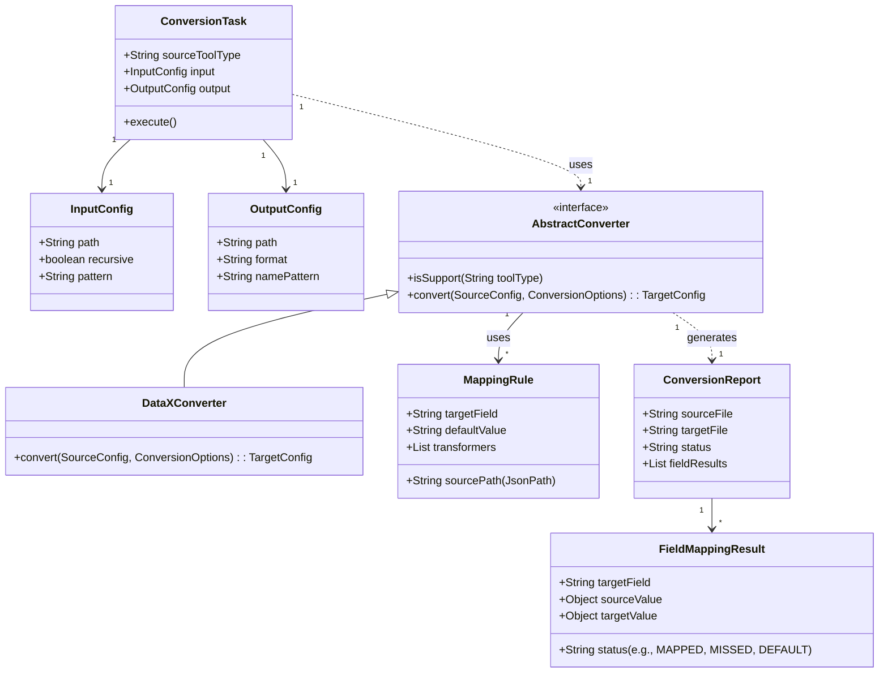

# X2SeaTunnel 领域模型说明

## 1. 领域模型概述

X2SeaTunnel 的核心领域是**配置转换**，其主要职责是将一种数据集成工具（源）的配置文件，通过一系列预定义的规则，转换为 SeaTunnel（目标）的配置文件。整个领域模型围绕着**转换任务 (ConversionTask)**、**转换器 (Converter)**、**映射规则 (MappingRule)** 和**转换报告 (ConversionReport)** 这几个核心概念构建。

- **核心业务概念**：
    - **转换任务 (ConversionTask)**：定义了一次完整的转换过程，包括源工具类型、输入路径、输出配置等。
    - **配置 (Config)**：分为源配置（如 DataX JSON）和目标配置（SeaTunnel HOCON/JSON）。
    - **映射规则 (MappingRule)**：定义了从源配置字段到目标配置字段的映射关系，是“拉取式”转换逻辑的核心。
    - **转换器 (Converter)**：封装了特定工具（如 DataX）的转换逻辑，利用映射规则执行转换。

- **业务边界**：
    - **输入**：接收命令行参数或 YAML 配置文件来定义一个转换任务。
    - **处理**：解析源配置文件，根据映射规则进行字段提取、转换和填充。
    - **输出**：生成目标 SeaTunnel 配置文件和一份详细的转换报告。

## 2. 核心实体关系图

## 3. 实体属性详细说明

### ConversionTask (转换任务)
代表一次完整的转换作业，由命令行参数或 YAML 文件实例化。

| 属性名 | 类型 | 说明 |
|---|---|---|
| sourceToolType | String | 源工具类型，如 `datax`, `sqoop` |
| input | InputConfig | 输入配置对象 |
| output | OutputConfig | 输出配置对象 |

### AbstractConverter (转换器接口)
定义了转换器的基本行为，是实现新工具支持的扩展点。

| 属性/方法 | 类型 | 说明 |
|---|---|---|
| isSupport(String) | boolean | 判断该转换器是否支持指定的工具类型 |
| convert(...) | TargetConfig | 执行转换逻辑，返回目标配置对象 |

### MappingRule (映射规则)
定义了单个字段的映射逻辑，是规则驱动的核心。

| 属性名 | 类型 | 说明 |
|---|---|---|
| targetField | String | 目标配置文件中的字段名 |
| sourcePath | String | 源配置文件中对应值的 JSON Path 路径 |
| defaultValue | String | 如果源路径找不到值，使用的默认值 |
| transformers | List<Transformer> | 值转换器列表，用于处理复杂转换（如类型转换、字符串拼接） |

### ConversionReport (转换报告)
记录单次文件转换的结果，用于用户审计和问题排查。

| 属性名 | 类型 | 说明 |
|---|---|---|
| sourceFile | String | 源文件名 |
| targetFile | String | 生成的目标文件名 |
| status | String | 整体转换状态 (SUCCESS, FAILED, WARNING) |
| fieldResults | List<FieldMappingResult> | 字段级别的映射结果列表 |

## 4. 关键业务场景下的模型交互

**场景：执行一次 DataX JSON 到 SeaTunnel HOCON 的转换**

1.  **初始化**：用户通过命令行 `sh bin/x2seatunnel.sh -t datax -i /path/to/datax.json -o /path/to/output.conf` 启动程序。
2.  **创建任务**：程序解析命令行参数，创建一个 `ConversionTask` 实例。
3.  **选择转换器**：`ConversionTask` 根据 `sourceToolType` ("datax")，通过工厂模式或 SPI 机制找到并实例化 `DataXConverter`。
4.  **加载规则**：`DataXConverter` 加载与 DataX-to-SeaTunnel 相关的 `MappingRule` 集合。
5.  **执行转换**：
    - `DataXConverter` 读取 `datax.json` 文件内容。
    - 遍历 `MappingRule` 列表。
    - 对于每个规则，使用其 `sourcePath` 从 `datax.json` 中提取值。
    - 如果需要，应用 `Transformer` 对值进行转换。
    - 将最终值填充到 `TargetConfig` 对象中对应的 `targetField`。
    - 同时，将每个字段的映射过程和结果记录到 `ConversionReport` 的 `FieldMappingResult` 中。
6.  **生成输出**：
    - `DataXConverter` 将填充好的 `TargetConfig` 对象序列化为 HOCON 格式的字符串。
    - 将字符串写入到指定的输出文件 `/path/to/output.conf`。
    - 将 `ConversionReport` 对象序列化为文件（如 JSON 或 Markdown），供用户查看。
