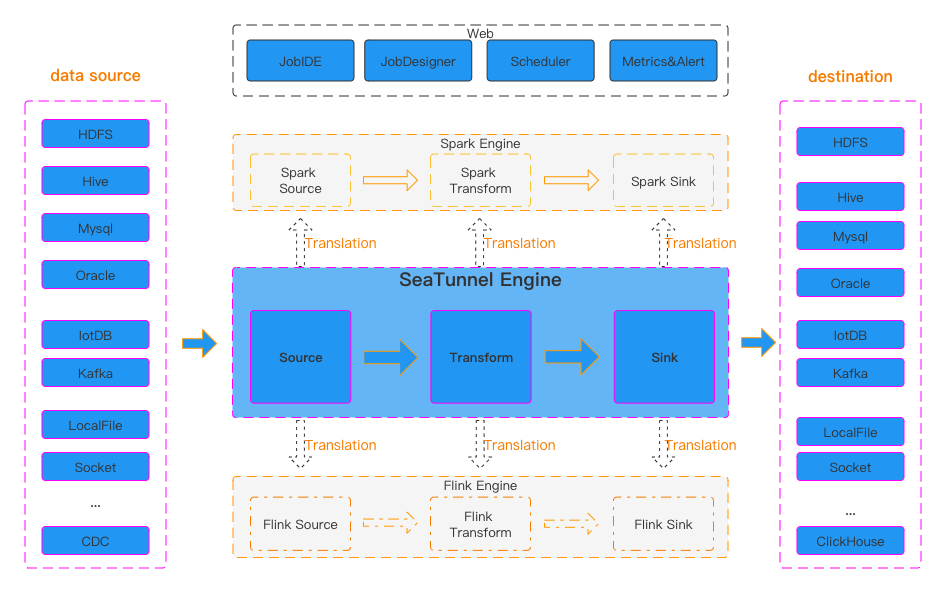

# About SeaTunnel

SeaTunnel is a very easy-to-use, ultra-high-performance, distributed data integration platform that supports real-time
synchronization of massive data. It can synchronize tens of billions of data stably and efficiently every day, and has
been used in production by nearly 100 companies.

## Why we need SeaTunnel

SeaTunnel focuses on data integration and data synchronization, and is mainly designed to solve common problems in the field of data integration:

- Various data sources: There are hundreds of commonly-used data sources with incompatible versions. With the emergence of new technologies, more data sources are appearing. It is difficult for users to find a tool that can fully and quickly support these data sources.
- Complex synchronization scenarios: Data synchronization needs to support various synchronization scenarios such as offline-full synchronization, offline-incremental synchronization, CDC, real-time synchronization, and full database synchronization.
- High resource demand: Existing data integration and data synchronization tools often require vast computing resources or JDBC connection resources to complete real-time synchronization of massive small tables. This has increased the burden on enterprises.
- Lack of quality and monitoring: Data integration and synchronization processes often experience loss or duplication of data. The synchronization process lacks monitoring, and it is impossible to intuitively understand the real situation of the data during the task process.
- Complex technology stack: The technology components used by enterprises are different, and users need to develop corresponding synchronization programs for different components to complete data integration.
- Difficulty in management and maintenance: Limited to different underlying technology components (Flink/Spark), offline synchronization and real-time synchronization often have be developed and managed separately, which increases the difficulty of management and maintainance.

## Features of SeaTunnel

- Rich and extensible Connector: SeaTunnel provides a Connector API that does not depend on a specific execution engine. Connectors (Source, Transform, Sink) developed based on this API can run on many different engines, such as SeaTunnel Engine, Flink, and Spark, that are currently supported.
- Connector plug-in: The plug-in design allows users to easily develop their own Connector and integrate it into the SeaTunnel project. Currently, SeaTunnel supports more than 100 Connectors, and the number is surging. Here is the list of [currently-supported connectors](Connector-v2-release-state.md)
- Batch-stream integration: Connectors developed based on the SeaTunnel Connector API are perfectly compatible with offline synchronization, real-time synchronization, full-synchronization, incremental synchronization and other scenarios. They greatly reduce the difficulty of managing data integration tasks.
- Supports a distributed snapshot algorithm to ensure data consistency.
- Multi-engine support: SeaTunnel uses the SeaTunnel Engine for data synchronization by default. SeaTunnel also supports the use of Flink or Spark as the execution engine of the Connector to adapt to the existing technical components of the enterprise. SeaTunnel supports multiple versions of Spark and Flink.
- JDBC multiplexing, database log multi-table parsing: SeaTunnel supports multi-table or whole database synchronization, which solves the problem of over-JDBC connections; and supports multi-table or whole database log reading and parsing, which solves the need for CDC multi-table synchronization scenarios to deal with problems with repeated reading and parsing of logs.
- High throughput and low latency: SeaTunnel supports parallel reading and writing, providing stable and reliable data synchronization capabilities with high throughput and low latency.
- Perfect real-time monitoring: SeaTunnel supports detailed monitoring information of each step in the data synchronization process, allowing users to easily understand the number of data, data size, QPS and other information read and written by the synchronization task.
- Two job development methods are supported: coding and canvas design. The SeaTunnel web project https://github.com/apache/seatunnel-web provides visual management of jobs, scheduling, running and monitoring capabilities.

## SeaTunnel work flowchart

The runtime process of SeaTunnel is shown in the figure above.

The user configures the job information and selects the execution engine to submit the job.

The Source Connector is responsible for parallel reading the data and sending the data to the downstream Transform or directly to the Sink, and the Sink writes the data to the destination. It is worth noting that Source, Transform and Sink can be easily developed and extended by yourself.

SeaTunnel is an EL(T) data integration platform. Therefore, in SeaTunnel, Transform can only be used to perform some simple transformations on data, such as converting the data of a column to uppercase or lowercase, changing the column name, or splitting a column into multiple columns.

The default engine use by SeaTunnel is [SeaTunnel Engine](seatunnel-engine/about.md). If you choose to use the Flink or Spark engine, SeaTunnel will package the Connector into a Flink or Spark program and submit it to Flink or Spark to run.

## Connector

- **Source Connectors** SeaTunnel supports reading data from various relational, graph, NoSQL, document, and memory databases; distributed file systems such as HDFS; and a variety of cloud storage solutions, such as S3 and OSS. We also support data reading of many common SaaS services. You can access the detailed list [here](connector-v2/source). If you want, You can develop your own source connector and easily integrate it into SeaTunnel.

- **Transform Connector** If the schema is different between source and Sink, You can use the Transform Connector to change the schema read from source and make it the same as the Sink schema.

- **Sink Connector** SeaTunnel supports writing data to various relational, graph, NoSQL, document, and memory databases; distributed file systems such as HDFS; and a variety of cloud storage solutions, such as S3 and OSS. We also support writing data to many common SaaS services. You can access the detailed list [here](connector-v2/sink). If you want, you can develop your own Sink connector and easily integrate it into SeaTunnel.

## Who uses SeaTunnel

SeaTunnel has lots of users. You can find more information about them in [users](https://seatunnel.apache.org/user).

## Landscapes

  
&nbsp;&nbsp;
  
SeaTunnel enriches the <a href="https://landscape.cncf.io/card-mode?category=streaming-messaging&license=apache-license-2-0&grouping=category&selected=sea-tunnal">CNCF CLOUD NATIVE Landscape</a >.

## Learn more

You can see [Quick Start](/docs/category/start-v2) for the next steps.
