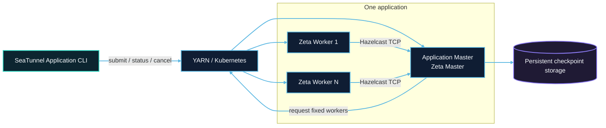
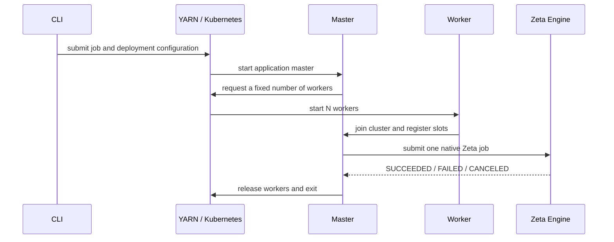
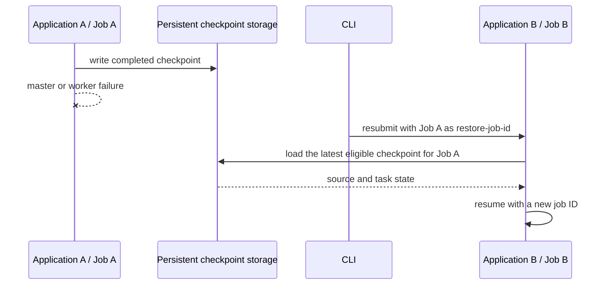

# Application Mode architecture overview

Application Mode creates an independent Zeta cluster for one SeaTunnel job. The platform starts and reclaims processes. Zeta continues to own worker registration, slot scheduling, task execution, and checkpoints.

## Roles and responsibilities

| Role | Responsibility |
| --- | --- |
| Submission client | Read job and deployment configuration; submit, inspect, or cancel an application |
| Resource platform | Start master and workers, record application state, and reclaim compute resources |
| Master | Create an isolated Zeta cluster, request workers, submit one job, and coordinate cleanup |
| Worker | Provide fixed slots and execute source, transform, and sink task groups |
| Checkpoint storage | Preserve job state required for recovery outside application processes |

One master can coordinate multiple workers. Fixed slot capacity is `application.worker-count × application.worker.slots`; effective parallelism also depends on the job topology.

## Runtime flow

Closing the CLI does not cancel the remote application. Cancellation is explicit, which allows detached submission followed by status or cancellation using the application ID.

## Failure and recovery

This release has one master and sets `backup-count=0`. Losing the master or a worker fails the current application. There is no automatic takeover or worker replacement inside that application.

Persistent checkpoints and live HA are different capabilities. A job can write checkpoints to HDFS, OSS, S3, COS, or a Kubernetes persistent volume. After a failure, create a new application with the historical Zeta job ID. The new master loads the latest eligible checkpoint and restores source and task state.

Storage must survive both applications. A YARN checkpoint directory must be outside staging. A Kubernetes PVC is caller-owned and is not deleted by the application. See the platform recovery guides for exact steps.

## Platform differences

| Resource | YARN | Kubernetes |
| --- | --- | --- |
| Master | ApplicationMaster container | Kubernetes Job Pod |
| Worker | YARN container | Worker Pod |
| Runtime files | Distribution localized from a shared filesystem | One image shared by master and workers |
| State | YARN application state | Kubernetes Job condition |
| Cleanup | Release containers and remove staging | Delete worker Pods and application resources |

Continue with [YARN Application Mode](yarn/overview.md) or [Kubernetes Application Mode](kubernetes/overview.md).
