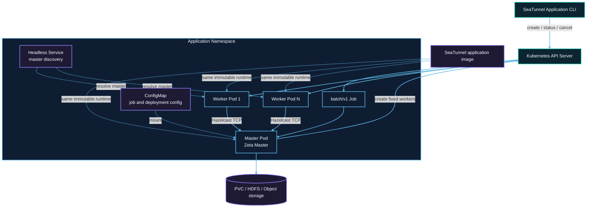

# Kubernetes cluster architecture

Each submission creates resources with a unique application ID in the target namespace. The Job Pod runs the master. Worker Pods do not mount Kubernetes API tokens and communicate with the master through Hazelcast TCP.



## Resource creation order

1. The submitter creates a suspended Job with `backoffLimit: 0`.
2. After receiving the Job UID, it creates an owner-referenced ConfigMap and headless Service.
3. It unsuspends the Job after localization is ready and waits for the master Pod to run.
4. The master starts an isolated Zeta cluster and creates a fixed number of worker Pods through the Kubernetes API.
5. Workers resolve the master through the headless Service, join the cluster, and register slots.
6. The master submits one Zeta job after every worker is ready.
7. After the job terminates, the master removes workers and exits. The Job records `Complete` or `Failed`.

## RBAC boundary

The submitter identity creates Jobs, ConfigMaps, and Services and performs status and cancellation operations. The application ServiceAccount only needs to read its Job and manage worker Pods. Only the master mounts the ServiceAccount token; workers do not access the Kubernetes API.

## Network and capacity

Hazelcast TCP must be allowed between master and workers. A NetworkPolicy must permit application Pods to reach the master port and required member traffic.

The master does not provide task slots. Fixed capacity is:

```text
application.worker-count × application.worker.slots
```

Pod requests equal limits. Namespace quota, LimitRange, admission policies, and node capacity can prevent scheduling.

## Ownership and durable data

The ConfigMap and Service are owned by the Job and are garbage-collected when it is deleted. Workers are explicitly cleaned by the application and carry application labels for fallback deletion.

A caller-owned checkpoint PVC has no Job owner reference, so success, failure, cancellation, or TTL expiry does not delete it. Remote checkpoint storage is also independent of the application lifecycle.
