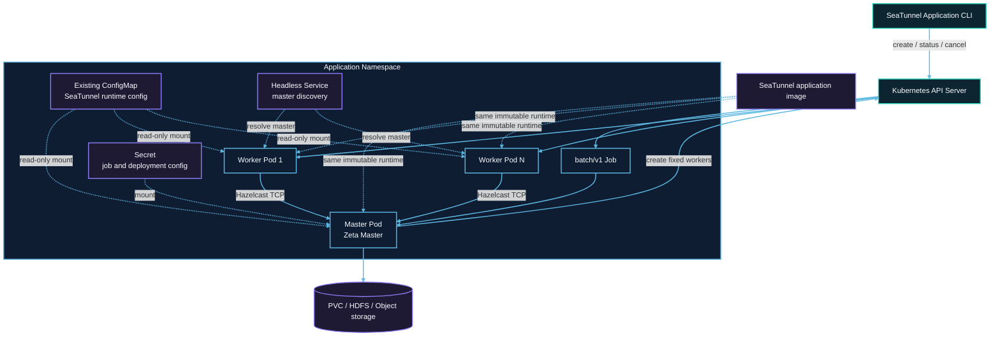

# Kubernetes cluster architecture

Each submission creates resources with a unique application ID in the target namespace. The Job Pod runs the master. Worker Pods do not mount Kubernetes API tokens and communicate with the master through Hazelcast TCP.



## Resource creation order

1. The submitter validates the user-owned runtime ConfigMap, then creates a suspended Job with `backoffLimit: 0`.
2. After receiving the Job UID, it creates an owner-referenced Secret and headless Service.
3. After the API confirms both dependent resources, it unsuspends the Job and waits for the master Pod to run. A TCP startup probe gives the Zeta master its configured startup window; readiness and liveness probes then check the Hazelcast master port.
4. The master starts an isolated Zeta cluster and creates a fixed number of worker Pods through the Kubernetes API. Each worker has a process liveness probe, and the master watches application-labelled Pod snapshots for deletion and terminal phases.
5. Workers resolve the master through the headless Service, join the cluster, and register slots. Pod phase is used for failure detection; Zeta registration remains the source of worker readiness and slot capacity.
6. The master submits one Zeta job after every worker is ready.
7. After the job terminates, the master removes workers and exits. The Job records `Complete` or `Failed`.

## RBAC boundary

The submitter identity creates Jobs, Secrets, and Services and performs status and cancellation operations. The application ServiceAccount only needs to read its Job and manage worker Pods. Only the master mounts the ServiceAccount token; workers do not access the Kubernetes API.

## Network and capacity

Hazelcast TCP must be allowed between master and workers. A NetworkPolicy must permit application Pods to reach the master port and required member traffic.

The master does not provide task slots. Fixed capacity is:

```text
application.worker-count × application.worker.slots
```

Pod requests equal limits. Namespace quota, LimitRange, admission policies, and node capacity can prevent scheduling.

The Kubernetes API acknowledges Job, Secret, and Service creation synchronously before the Job is started. Runtime watches are therefore used for externally changing Pod lifecycle state, while a failed or ambiguous submission request triggers cleanup of every application-labelled resource.

## Ownership and durable data

The Secret and Service are owned by the Job and are garbage-collected when it is deleted. Workers are explicitly cleaned by the application and carry application labels for fallback deletion. The runtime ConfigMap is user-owned, shared by the master and workers, and retained after application cleanup.

A caller-owned checkpoint PVC has no Job owner reference, so success, failure, cancellation, or TTL expiry does not delete it. Remote checkpoint storage is also independent of the application lifecycle.
