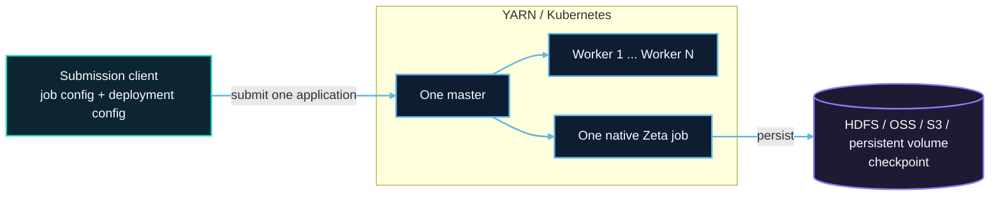

# Application Mode (experimental)

Application Mode runs an independent SeaTunnel job on YARN or Kubernetes. It is intended for teams that already operate a resource platform and do not want to maintain a long-running shared SeaTunnel cluster. Every submission creates a temporary Zeta master and a fixed set of workers for one job. The platform reclaims the compute resources when the job terminates.

Application Mode uses the native Zeta Engine, connectors, and checkpoint mechanism. It does not depend on Flink or Spark, and it does not place multiple jobs in one application.

## When to use Application Mode

- A job should own its master, workers, dependencies, and failure boundary.
- YARN or Kubernetes should provision, observe, and clean up the compute resources.
- A batch job should release resources when it finishes, or a streaming job should run as an independent application.
- Worker count, CPU, memory, and slots can be determined before submission.
- After a master or worker failure, a new application may recover from a durable checkpoint.

## When not to use Application Mode

- Use a Zeta standalone deployment when one long-running SeaTunnel cluster must host multiple jobs.
- The workload requires automatic master failover, worker replacement, autoscaling, or application restart.
- The YARN or HDFS environment requires Kerberos.
- The workload must run with the Flink or Spark engine.

## How a submission runs

1. The CLI reads the job and deployment configuration and asks the selected platform provider to create an application.
2. The platform starts one application master, which starts the only Zeta master in the same process.
3. The master requests a fixed number of workers. Each worker joins the application's isolated cluster through Hazelcast TCP discovery.
4. After every worker registers, the master submits one job to Zeta and continuously maps its state to the platform application.
5. When the job succeeds, fails, or is canceled, the master releases workers and exits. The platform completes the remaining cleanup.

One master can coordinate three or more workers. Effective parallel capacity depends on `application.worker-count × application.worker.slots` and the job topology.

## Reliability boundary

This release has one master and sets `backup-count=0`. No standby member can take over a running master, so it does not provide live high availability. Losing a worker also fails the application; the worker is not replaced inside that application.

Durable checkpoint recovery remains available. Store checkpoints in HDFS, OSS, S3, COS, or a Kubernetes persistent volume during the initial execution. After a failure, submit a new application and identify the historical Zeta job ID whose latest eligible checkpoint should be loaded. The new execution receives a new platform application ID and a new Zeta job ID.

For retention, storage dependencies, connector compatibility, and recovery limits, see the platform guides and [Checkpoint Storage](../engines/zeta/checkpoint-storage.md). See [failure and recovery](architecture.md#failure-and-recovery) for the distinction between durable recovery and live failover.

## Supported platforms

| Platform | Resource layout | Start here |
| --- | --- | --- |
| YARN | One ApplicationMaster and a fixed number of worker containers; a shared filesystem localizes the distribution | [YARN Application Mode](yarn/overview.md) |
| Kubernetes | One Job hosting the master and a fixed number of worker pods; all processes use the same image | [Kubernetes Application Mode](kubernetes/overview.md) |

The standard SeaTunnel distribution includes both YARN and Kubernetes providers. The result remains the standard `apache-seatunnel-<version>-bin.tar.gz`; Application Mode does not introduce a separate distribution.

## Current scope

| Capability | Current behavior |
| --- | --- |
| Job and cluster | One submission creates one job in one isolated Zeta cluster |
| Workers | Supports a fixed number of workers and parallel task execution |
| Lifecycle | Submit, inspect status, wait for completion, and cancel |
| Failure handling | Startup timeout, insufficient resources, and master or worker loss fail the application |
| Recovery | Manually submit a new application from a durable checkpoint |
| HA and scaling | No automatic master failover, worker replacement, or autoscaling |

## Recommended reading order

| Phase | Document | Description |
| --- | --- | --- |
| Choose a platform | [YARN guide](yarn/overview.md) / [Kubernetes guide](kubernetes/overview.md) | Prepare the environment, build the distribution, and submit the first job |
| Configure deployment | [YARN configuration](yarn/configuration.md) / [Kubernetes configuration](kubernetes/configuration.md) | Platform permissions, resources, image, and distribution settings |
| Configure recovery | [YARN checkpoint recovery](yarn/checkpoint-recovery.md) / [Kubernetes checkpoint recovery](kubernetes/checkpoint-recovery.md) | Durable storage, recovery after failure, and cleanup |
| Understand the deployment | [Architecture](architecture.md) | Runtime topology, roles, lifecycle, and reliability boundary |
