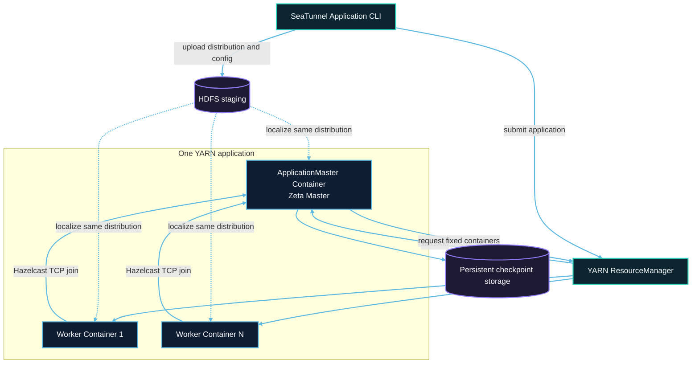

# YARN cluster architecture

Each submission creates one YARN application. The submission client prepares and uploads files. The ApplicationMaster then owns the master, workers, and job lifecycle.



## Submission lifecycle

1. The client allocates an application ID from the ResourceManager.
2. It creates a private `0700` staging directory and uploads the distribution, job configuration, and resolved Hadoop configuration.
3. The ResourceManager starts the ApplicationMaster, and the NodeManager localizes and extracts the same distribution.
4. The ApplicationMaster starts an isolated Zeta master and requests a fixed number of worker containers through `AMRMClient`.
5. `NMClient` starts worker JVMs. Workers join the isolated Hazelcast cluster using the master's actual address.
6. After all workers register their membership and slots, the master submits one Zeta job.
7. When the job reaches a terminal state, the master releases workers, unregisters the YARN application, and removes staging.

## Network and capacity

YARN containers use host networking. NodeManagers must allow the master Hazelcast port and worker ports. `application.master.port` is the starting master port. On collision, the master selects a later free port and passes the actual address to workers.

The master does not provide task slots. Fixed capacity is:

```text
application.worker-count × application.worker.slots
```

Requests must also fit queue quotas, the ResourceManager maximum container capability, and available NodeManager capacity.

## Staging and checkpoints

Staging belongs to one application and is deleted after termination. Checkpoints must use a location outside staging. HDFS may localize the distribution while HDFS, OSS, S3, or COS stores checkpoints.

Losing the ApplicationMaster or a worker fails the current application. Recovery creates a new application and does not join the previous Hazelcast cluster. See [Checkpoint recovery](checkpoint-recovery.md).
