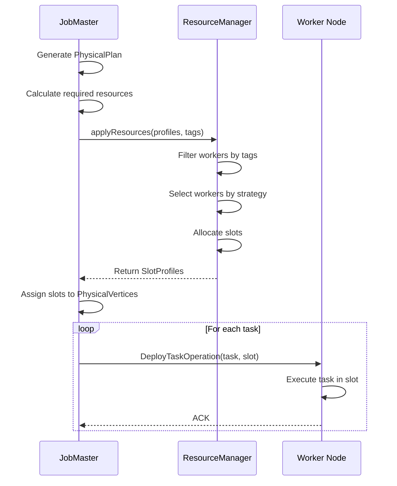
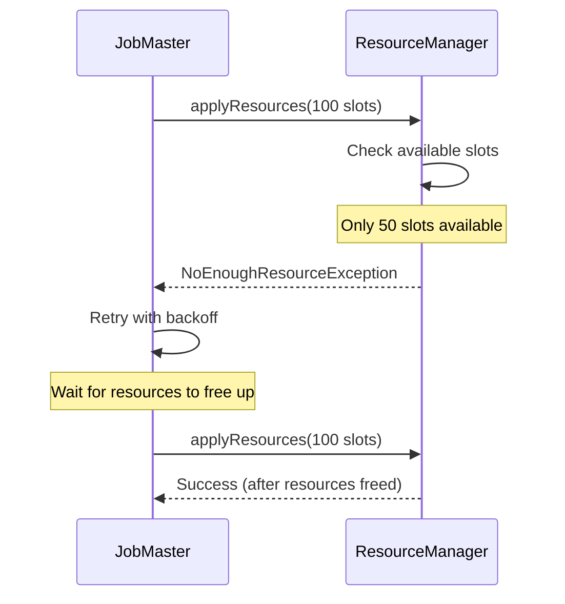
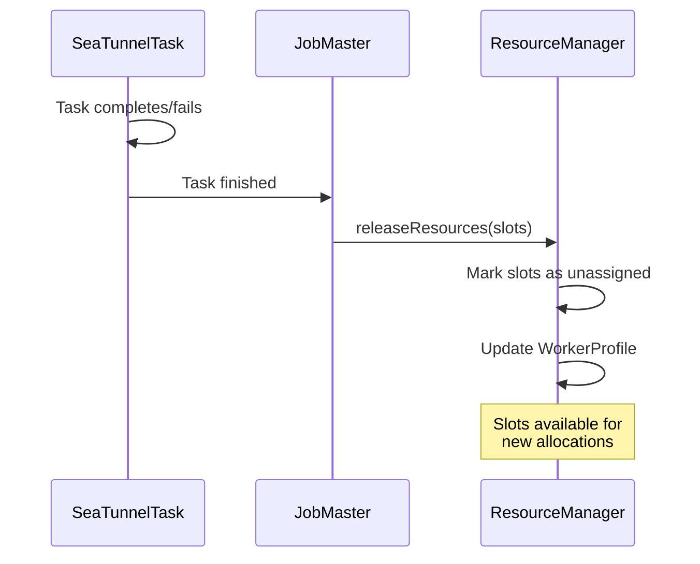

# Resource Management

## 1. Overview

### 1.1 Problem Background

Distributed execution engines must efficiently manage computing resources:

- **Resource Allocation**: How to assign tasks to workers fairly and efficiently?
- **Load Balancing**: How to distribute workload evenly across workers?
- **Resource Isolation**: How to prevent resource contention between jobs?
- **Dynamic Scaling**: How to add/remove workers without disrupting jobs?
- **Heterogeneous Resources**: How to handle workers with different capabilities?

### 1.2 Design Goals

SeaTunnel's resource management system aims to:

1. **Fine-Grained Control**: Slot-based allocation for precise resource management
2. **Flexible Strategies**: Multiple allocation strategies for different scenarios
3. **Tag-Based Filtering**: Assign tasks to specific worker groups
4. **High Availability**: Tolerate worker failures with automatic reassignment
5. **Observability**: Track resource usage and availability in real-time

### 1.3 Architecture Overview

```
┌──────────────────────────────────────────────────────────────┐
│                         JobMaster                             │
│                                                                │
│  ┌────────────────────────────────────────────────────┐      │
│  │  Request Resources                                  │      │
│  │  • Calculate required slots                        │      │
│  │  • Specify resource profiles (CPU, memory)         │      │
│  │  • Apply tag filters (optional)                    │      │
│  └────────────────────────────────────────────────────┘      │
└──────────────────────────────┬───────────────────────────────┘
                               │
                               ▼
┌──────────────────────────────────────────────────────────────┐
│                     ResourceManager                           │
│                                                                │
│  ┌────────────────────────────────────────────────────┐      │
│  │  Worker Registry                                    │      │
│  │  • WorkerProfile (per worker)                      │      │
│  │    - Total resources                               │      │
│  │    - Available resources                           │      │
│  │    - Assigned slots                                │      │
│  │    - Unassigned slots                              │      │
│  └────────────────────────────────────────────────────┘      │
│                                                                │
│  ┌────────────────────────────────────────────────────┐      │
│  │  Allocation Strategies                              │      │
│  │  • RandomSlotAssignStrategy                        │      │
│  │  • SlotRatioSlotAssignStrategy                     │      │
│  │  • SystemLoadSlotAssignStrategy                    │      │
│  └────────────────────────────────────────────────────┘      │
│                                                                │
│  ┌────────────────────────────────────────────────────┐      │
│  │  Slot Management                                    │      │
│  │  • Allocate slots                                  │      │
│  │  • Release slots                                   │      │
│  │  • Track slot usage                                │      │
│  └────────────────────────────────────────────────────┘      │
└──────────────────────────────┬───────────────────────────────┘
                               │
                               ▼
┌──────────────────────────────────────────────────────────────┐
│                      Worker Nodes                             │
│                                                                │
│  Worker 1                Worker 2                Worker N     │
│  ┌──────────┐           ┌──────────┐           ┌──────────┐  │
│  │ Slot 1   │           │ Slot 1   │           │ Slot 1   │  │
│  │ Slot 2   │           │ Slot 2   │           │ Slot 2   │  │
│  │ ...      │           │ ...      │           │ ...      │  │
│  └──────────┘           └──────────┘           └──────────┘  │
└──────────────────────────────────────────────────────────────┘
```

## 2. Core Concepts

### 2.1 Slot

A **Slot** is the fundamental unit of resource allocation.

```java
public class SlotProfile {
    // Unique slot identifier
    private final long slotID;

    // Worker address where this slot resides
    private final Address worker;

    // Resource capacity of this slot
    private final ResourceProfile resourceProfile;

    // Optional tags for filtering
    private final Map<String, String> tags;
}
```

**Key Properties**:
- **Granular**: Each slot can host one or more tasks (task fusion)
- **Typed**: Slots have resource profiles (CPU, memory)
- **Tagged**: Slots can be labeled for specialized assignment
- **Stateful**: Slots track assignment status (assigned/unassigned)

**Example**:
```java
SlotProfile slot = new SlotProfile(
    slotID: 1001,
    worker: new Address("worker-1", 5801),
    resourceProfile: new ResourceProfile(
        cpu: new CPU(1.0),           // 1 CPU core
        heapMemory: new Memory(512), // 512MB heap
        offHeapMemory: new Memory(256) // 256MB off-heap
    ),
    tags: Map.of("zone", "us-west-1a", "type", "compute")
);
```

### 2.2 ResourceProfile

Describes resource requirements or capacity.

```java
public class ResourceProfile {
    private final CPU cpu;
    private final Memory heapMemory;
    private final Memory offHeapMemory;
}

public class CPU {
    private final double cores; // Number of CPU cores
}

public class Memory {
    private final long megabytes; // Memory in MB
}
```

**Usage**:
- **Task Requirements**: JobMaster specifies required resources per task
- **Slot Capacity**: Each slot advertises its available resources
- **Matching**: ResourceManager matches task requirements to slot capacity

### 2.3 WorkerProfile

Represents a worker node's resources and slot inventory.

```java
public class WorkerProfile {
    // Worker address
    private final Address address;

    // Total resources (all slots combined)
    private final ResourceProfile totalResourceProfile;

    // Currently available resources
    private final ResourceProfile availableResourceProfile;

    // Slots assigned to jobs
    private final List<SlotProfile> assignedSlots;

    // Slots available for assignment
    private final List<SlotProfile> unassignedSlots;

    // Worker metadata
    private final Map<String, String> tags;
}
```

**Lifecycle**:
1. **Registration**: Worker registers with ResourceManager on startup
2. **Heartbeat**: Worker sends periodic heartbeats with updated resource info
3. **Allocation**: ResourceManager assigns slots from unassigned pool
4. **Release**: Completed tasks free slots, moving them back to unassigned pool
5. **Deregistration**: Worker leaves cluster (graceful or failure)

## 3. Resource Manager

### 3.1 Interface

```java
public interface ResourceManager {
    /**
     * Apply for resources (called by JobMaster)
     */
    CompletableFuture<List<SlotProfile>> applyResources(
        long jobId,
        List<ResourceProfile> resourceProfiles,
        List<TagFilter> tagFilters
    ) throws NoEnoughResourceException;

    /**
     * Release resources (called by JobMaster after task completion)
     */
    void releaseResources(long jobId, List<SlotProfile> slots);

    /**
     * Worker heartbeat (called by TaskExecutionService)
     */
    void heartbeat(WorkerProfile workerProfile);

    /**
     * Handle worker removal (failure or graceful shutdown)
     */
    void memberRemoved(MembershipEvent event);
}
```

### 3.2 Implementation: AbstractResourceManager

```java
public abstract class AbstractResourceManager implements ResourceManager {
    // Registered workers
    protected final ConcurrentMap<Address, WorkerProfile> registerWorker;

    // Slot assignment strategy
    protected final SlotAssignStrategy slotAssignStrategy;

    // Heartbeat timeout
    protected final long heartbeatTimeout;

    @Override
    public CompletableFuture<List<SlotProfile>> applyResources(
        long jobId,
        List<ResourceProfile> resourceProfiles,
        List<TagFilter> tagFilters
    ) {
        // 1. Filter workers by tags
        List<WorkerProfile> candidates = filterWorkersByTags(tagFilters);

        // 2. Select workers using strategy
        List<SlotProfile> allocatedSlots = new ArrayList<>();
        for (ResourceProfile profile : resourceProfiles) {
            SlotProfile slot = slotAssignStrategy.selectSlot(candidates, profile);
            if (slot == null) {
                throw new NoEnoughResourceException("No available slot for " + profile);
            }
            allocatedSlots.add(slot);

            // Mark slot as assigned
            markSlotAssigned(slot);
        }

        return CompletableFuture.completedFuture(allocatedSlots);
    }

    @Override
    public void releaseResources(long jobId, List<SlotProfile> slots) {
        for (SlotProfile slot : slots) {
            // Mark slot as unassigned
            markSlotUnassigned(slot);
        }
    }
}
```

## 4. Slot Assignment Strategies

### 4.1 RandomSlotAssignStrategy

Randomly selects a worker with available slots.

```java
public class RandomSlotAssignStrategy implements SlotAssignStrategy {
    private final Random random = new Random();

    @Override
    public SlotProfile selectSlot(
        List<WorkerProfile> workers,
        ResourceProfile requiredProfile
    ) {
        // Filter workers with enough resources
        List<WorkerProfile> eligible = workers.stream()
            .filter(w -> hasEnoughResources(w, requiredProfile))
            .collect(Collectors.toList());

        if (eligible.isEmpty()) {
            return null;
        }

        // Random selection
        WorkerProfile selected = eligible.get(random.nextInt(eligible.size()));

        // Return first available slot
        return selected.getUnassignedSlots().stream()
            .filter(s -> s.getResourceProfile().satisfies(requiredProfile))
            .findFirst()
            .orElse(null);
    }
}
```

**Pros**:
- Simple and fast
- No coordination overhead
- Good for homogeneous clusters

**Cons**:
- No load balancing
- May create hotspots

### 4.2 SlotRatioSlotAssignStrategy

Prefers workers with higher ratio of available slots.

```java
public class SlotRatioSlotAssignStrategy implements SlotAssignStrategy {
    @Override
    public SlotProfile selectSlot(
        List<WorkerProfile> workers,
        ResourceProfile requiredProfile
    ) {
        // Calculate slot ratio for each worker
        WorkerProfile best = workers.stream()
            .filter(w -> hasEnoughResources(w, requiredProfile))
            .max(Comparator.comparingDouble(w ->
                (double) w.getUnassignedSlots().size() /
                (w.getAssignedSlots().size() + w.getUnassignedSlots().size())
            ))
            .orElse(null);

        if (best == null) {
            return null;
        }

        return best.getUnassignedSlots().stream()
            .filter(s -> s.getResourceProfile().satisfies(requiredProfile))
            .findFirst()
            .orElse(null);
    }
}
```

**Pros**:
- Better load balancing
- Distributes tasks evenly
- Prevents worker overload

**Cons**:
- Slightly more computation
- May not consider actual CPU/memory load

### 4.3 SystemLoadSlotAssignStrategy

Selects worker with lowest system load (CPU/memory usage).

```java
public class SystemLoadSlotAssignStrategy implements SlotAssignStrategy {
    @Override
    public SlotProfile selectSlot(
        List<WorkerProfile> workers,
        ResourceProfile requiredProfile
    ) {
        // Find worker with lowest load
        WorkerProfile best = workers.stream()
            .filter(w -> hasEnoughResources(w, requiredProfile))
            .min(Comparator.comparingDouble(w -> calculateLoad(w)))
            .orElse(null);

        if (best == null) {
            return null;
        }

        return best.getUnassignedSlots().stream()
            .filter(s -> s.getResourceProfile().satisfies(requiredProfile))
            .findFirst()
            .orElse(null);
    }

    private double calculateLoad(WorkerProfile worker) {
        // CPU load + memory load (weighted average)
        double cpuLoad = 1.0 - (worker.getAvailableResourceProfile().getCpu().getCores() /
                                worker.getTotalResourceProfile().getCpu().getCores());
        double memLoad = 1.0 - (worker.getAvailableResourceProfile().getHeapMemory().getMegabytes() /
                                worker.getTotalResourceProfile().getHeapMemory().getMegabytes());

        return 0.7 * cpuLoad + 0.3 * memLoad; // Weighted
    }
}
```

**Pros**:
- Considers actual resource usage
- Best for heterogeneous clusters
- Optimizes cluster utilization

**Cons**:
- Requires real-time metrics
- Higher computation cost
- May thrash if loads change rapidly

## 5. Tag-Based Slot Filtering

### 5.1 Use Cases

**Data Locality**:
```hocon
source {
  JDBC {
    url = "jdbc:mysql://db-west-1:3306/..."
    tag = "zone:us-west-1" # Assign to workers in same zone
  }
}
```

**Resource Specialization**:
```hocon
transform {
  ML-Transform {
    model = "..."
    tag = "resource:gpu" # Assign to GPU workers
  }
}
```

**Multi-Tenancy**:
```hocon
env {
  job.name = "tenant-a-job"
  tag = "tenant:a" # Assign to tenant A's workers only
}
```

### 5.2 TagFilter

```java
public class TagFilter {
    private final String key;
    private final String value;

    public boolean matches(Map<String, String> tags) {
        return value.equals(tags.get(key));
    }
}
```

**Filtering Process**:
```java
List<WorkerProfile> filterWorkersByTags(List<TagFilter> filters) {
    return registerWorker.values().stream()
        .filter(worker -> {
            for (TagFilter filter : filters) {
                if (!filter.matches(worker.getTags())) {
                    return false;
                }
            }
            return true;
        })
        .collect(Collectors.toList());
}
```

## 6. Resource Allocation Flow

### 6.1 Normal Allocation



### 6.2 Insufficient Resources



### 6.3 Resource Release



## 7. Failure Handling

### 7.1 Worker Failure

**Detection**:
- Heartbeat timeout (default: 60 seconds)
- Hazelcast member removed event

**Recovery**:
```java
@Override
public void memberRemoved(MembershipEvent event) {
    Address failedWorker = event.getMember().getAddress();

    // 1. Remove worker from registry
    WorkerProfile failed = registerWorker.remove(failedWorker);

    // 2. Notify JobMasters of slot losses
    List<SlotProfile> lostSlots = failed.getAssignedSlots();
    for (SlotProfile slot : lostSlots) {
        long jobId = getJobIdForSlot(slot);
        JobMaster jobMaster = getJobMaster(jobId);

        // 3. Trigger job failover
        jobMaster.notifySlotLost(slot);
    }
}
```

**JobMaster Response**:
1. Mark tasks on failed slots as FAILED
2. Restore from latest checkpoint
3. Request new slots from ResourceManager
4. Redeploy tasks

### 7.2 ResourceManager Failure

**High Availability**:
- ResourceManager state is stateless (worker registry rebuilt from heartbeats)
- New ResourceManager instance starts on master failover
- Workers re-register via heartbeat mechanism

**Recovery**:
```java
public void start() {
    // Start accepting worker heartbeats
    scheduledExecutor.scheduleAtFixedRate(() -> {
        // Check for timed-out workers
        long now = System.currentTimeMillis();
        registerWorker.entrySet().removeIf(entry -> {
            long lastHeartbeat = entry.getValue().getLastHeartbeat();
            return (now - lastHeartbeat) > heartbeatTimeout;
        });
    }, heartbeatInterval, heartbeatInterval, TimeUnit.MILLISECONDS);
}
```

## 8. Configuration

### 8.1 Slot Configuration

```hocon
seatunnel.engine {
  # Slot configuration per worker
  slot-service {
    # Number of slots per worker
    number-of-slots = 2

    # Dynamic slot allocation (future)
    dynamic-slot = false
  }
}
```

### 8.2 Resource Strategy

```hocon
seatunnel.engine {
  resource-manager {
    # Slot assignment strategy
    # Options: random, slot-ratio, system-load
    slot-assign-strategy = "slot-ratio"

    # Heartbeat configuration
    heartbeat.interval = 10000 # ms
    heartbeat.timeout = 60000  # ms
  }
}
```

### 8.3 Resource Profile

```hocon
seatunnel.engine {
  # Default resource profile per slot
  slot-service {
    default-resource-profile {
      cpu.cores = 1.0
      heap-memory.mb = 512
      off-heap-memory.mb = 256
    }
  }
}
```

## 9. Monitoring and Metrics

### 9.1 Key Metrics

**Cluster-Level**:
- `cluster.workers.total`: Total number of registered workers
- `cluster.workers.active`: Workers with recent heartbeat
- `cluster.slots.total`: Total slots across all workers
- `cluster.slots.available`: Unassigned slots
- `cluster.slots.assigned`: Slots in use

**Per-Worker**:
- `worker.cpu.available`: Available CPU cores
- `worker.memory.available`: Available memory (MB)
- `worker.slots.total`: Total slots on worker
- `worker.slots.assigned`: Assigned slots
- `worker.heartbeat.last`: Last heartbeat timestamp

**Per-Job**:
- `job.slots.requested`: Slots requested by job
- `job.slots.allocated`: Slots successfully allocated
- `job.resource.wait_time`: Time waiting for resources

### 9.2 Observability

**Resource Dashboard Example**:
```
Cluster Resources:
  Workers: 10 (all healthy)
  Total Slots: 20
  Available Slots: 8
  Utilization: 60%

Top Resource Consumers:
  job-123: 6 slots (mysql-cdc → elasticsearch)
  job-456: 4 slots (kafka → jdbc)
  job-789: 2 slots (file → s3)

Worker Distribution:
  worker-1: 2/2 slots (100%)
  worker-2: 1/2 slots (50%)
  worker-3: 2/2 slots (100%)
  ...
```

## 10. Best Practices

### 10.1 Slot Sizing

**General Guideline**:
```
Slots per Worker = CPU Cores - 1 (reserve 1 for OS)

Example:
  8-core machine → 6-7 slots
  16-core machine → 14-15 slots
```

**Memory per Slot**:
```
Heap Memory = Total Memory * 0.7 / Number of Slots

Example:
  32GB machine, 6 slots
  Heap per slot = 32GB * 0.7 / 6 ≈ 3.7GB
```

### 10.2 Strategy Selection

**Use RandomSlotAssignStrategy when**:
- Homogeneous cluster (all workers identical)
- Simple deployments
- Fast allocation more important than perfect balance

**Use SlotRatioSlotAssignStrategy when**:
- Need good load balancing
- Mixed job sizes
- Moderate cluster size (< 100 workers)

**Use SystemLoadSlotAssignStrategy when**:
- Heterogeneous cluster
- Workers have varying CPU/memory
- Optimizing resource utilization is critical

### 10.3 Tag Usage

**Data Locality**:
```hocon
# Tag workers by region/zone
worker-1: tag = "zone:us-west-1a"
worker-2: tag = "zone:us-east-1b"

# Assign source to same zone as data
source {
  S3 {
    path = "s3://bucket-us-west-1/..."
    tag = "zone:us-west-1a" # Minimize cross-region traffic
  }
}
```

**Resource Isolation**:
```hocon
# Dedicated workers for critical jobs
worker-1,2,3: tag = "priority:high"
worker-4,5,6: tag = "priority:normal"

env {
  job.name = "critical-job"
  tag = "priority:high"
}
```

## 11. Related Resources

- [Engine Architecture](engine-architecture.md)
- [DAG Execution](dag-execution.md)
- [Architecture Overview](../overview.md)

## 12. References

### Key Source Files

- [ResourceManager.java](../../../seatunnel-engine/seatunnel-engine-server/src/main/java/org/apache/seatunnel/engine/server/resourcemanager/ResourceManager.java)
- [AbstractResourceManager.java](../../../seatunnel-engine/seatunnel-engine-server/src/main/java/org/apache/seatunnel/engine/server/resourcemanager/AbstractResourceManager.java)
- [SlotProfile.java](../../../seatunnel-engine/seatunnel-engine-common/src/main/java/org/apache/seatunnel/engine/common/runtime/SlotProfile.java)
- [WorkerProfile.java](../../../seatunnel-engine/seatunnel-engine-common/src/main/java/org/apache/seatunnel/engine/common/runtime/WorkerProfile.java)

### Further Reading

- [Google Borg](https://research.google/pubs/pub43438/) - Large-scale cluster management
- [Apache YARN](https://hadoop.apache.org/docs/current/hadoop-yarn/hadoop-yarn-site/YARN.html) - Resource management in Hadoop
- [Kubernetes](https://kubernetes.io/docs/concepts/scheduling-eviction/kube-scheduler/) - Container orchestration and scheduling
