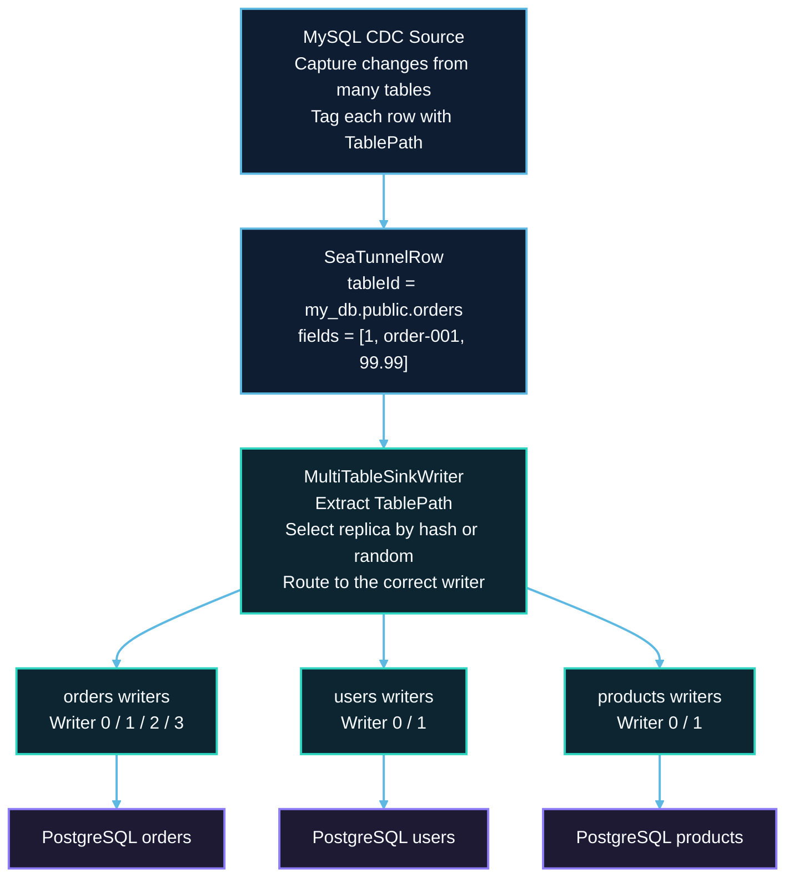
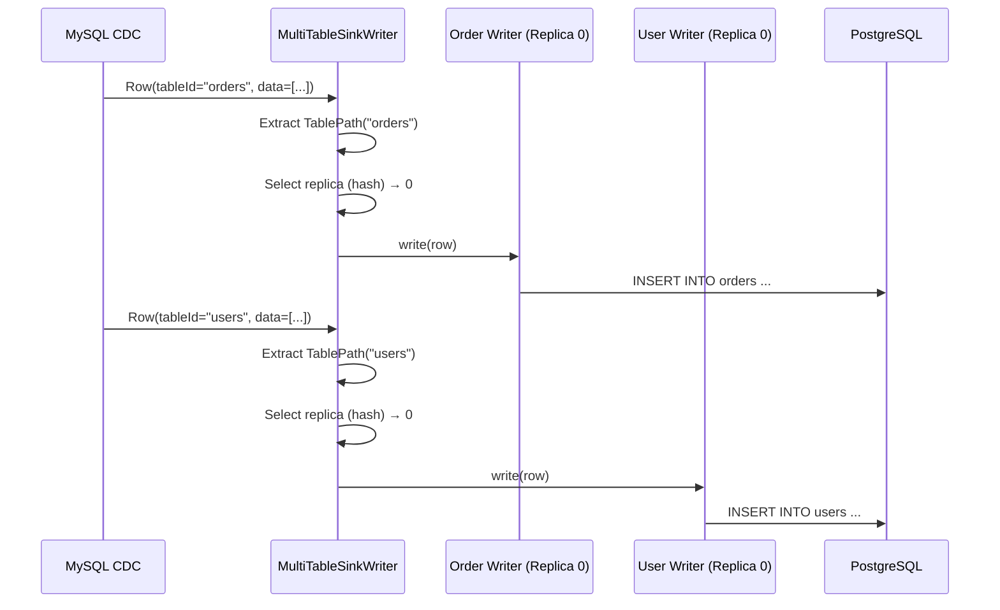
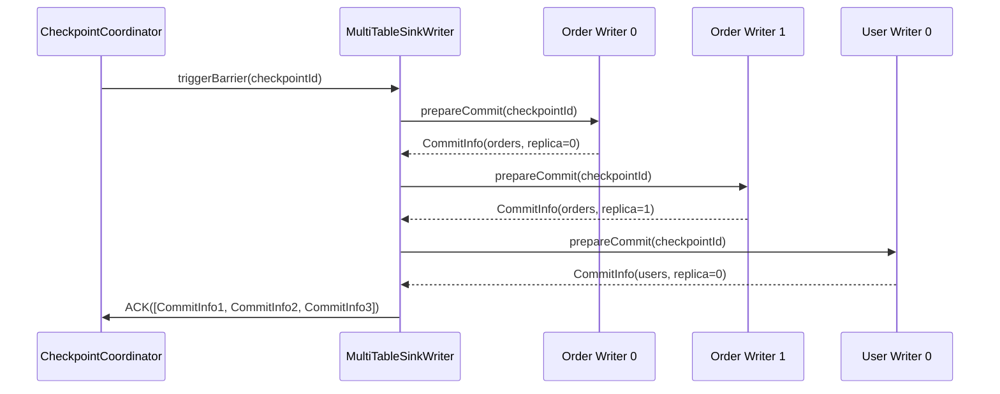

# Multi-Table Synchronization Architecture

## 1. Overview

### 1.1 Problem Background

Database migration and CDC scenarios often require synchronizing hundreds of tables:

- **Resource Efficiency**: How to avoid creating one job per table?
- **Consistent Snapshot**: How to ensure all tables start from same point in time?
- **Schema Routing**: How to route data to correct target tables?
- **Independent Schemas**: How to handle different schemas per table?
- **Parallel Writing**: How to maximize throughput for multiple tables?

### 1.2 Design Goals

SeaTunnel's multi-table synchronization aims to:

1. **Single Job, Multiple Tables**: Synchronize hundreds of tables in one job
2. **Resource Efficiency**: Share resources across tables
3. **Schema Independence**: Each table maintains its own schema
4. **Dynamic Routing**: Route records to correct sink based on table identity
5. **Horizontal Scalability**: Support replica writers for high throughput

### 1.3 Use Cases

**Database Migration**:
```hocon
source {
  MySQL-CDC {
    # Capture all tables in database
    database-name = "my_db"
    table-name = ".*" # Regex: all tables
  }
}

sink {
  JDBC {
    # Write to PostgreSQL
    url = "jdbc:postgresql://..."
  }
}
```

**Multi-Table CDC**:
```hocon
source {
  MySQL-CDC {
    table-name = "order_.*|user_.*|product_.*" # Multiple table patterns
  }
}

sink {
  Elasticsearch {
    # Different indices per table
  }
}
```

## 2. Core Abstractions

### 2.1 TablePath

Unique identifier for routing records to tables.

```java
public class TablePath implements Serializable {
    private final String databaseName;
    private final String schemaName;
    private final String tableName;

    // Unique string representation
    public String getFullName() {
        return String.join(".", databaseName, schemaName, tableName);
    }
}
```

**Example**:
```java
TablePath orderTable = TablePath.of("my_db", "public", "orders");
TablePath userTable = TablePath.of("my_db", "public", "users");
```

### 2.2 SeaTunnelRow with TableId

Records carry table identity for routing.

```java
public class SeaTunnelRow {
    private final String tableId; // TablePath serialized
    private final SeaTunnelRowKind rowKind; // INSERT, UPDATE, DELETE
    private final Object[] fields;

    public TablePath getTablePath() {
        return TablePath.deserialize(tableId);
    }
}
```

### 2.3 SinkIdentifier

Unique identifier for sink writers (table + replica index).

```java
public class SinkIdentifier implements Serializable {
    private final TableIdentifier tableIdentifier;
    private final int index; // Replica index

    // For multi-table: one identifier per table per replica
    // Example: (orders, 0), (orders, 1), (users, 0), (users, 1)
}
```

## 3. MultiTableSource Architecture

### 3.1 Structure

```java
public class MultiTableSource<T, SplitT, StateT>
    implements SeaTunnelSource<T, SplitT, StateT> {

    // Underlying sources (one per table)
    private final Map<TablePath, SeaTunnelSource<T, SplitT, StateT>> sources;

    // Produced catalog tables
    private final List<CatalogTable> catalogTables;
}
```

### 3.2 Creation

```java
// From configuration
MultiTableSource<SeaTunnelRow, ?, ?> multiSource =
    MultiTableSource.builder()
        .addSource(orderTablePath, orderSource)
        .addSource(userTablePath, userSource)
        .addSource(productTablePath, productSource)
        .build();
```

### 3.3 Enumerator: Unified Split Assignment

```java
public class MultiTableSourceSplitEnumerator {
    private final Map<TablePath, SourceSplitEnumerator> enumerators;

    @Override
    public void handleSplitRequest(int subtaskId) {
        // Round-robin across table enumerators
        for (Map.Entry<TablePath, SourceSplitEnumerator> entry : enumerators.entrySet()) {
            TablePath tablePath = entry.getKey();
            SourceSplitEnumerator enumerator = entry.getValue();

            // Request split from table enumerator
            enumerator.handleSplitRequest(subtaskId);
        }
    }

    @Override
    public void addReader(int subtaskId) {
        // Register reader with all table enumerators
        for (SourceSplitEnumerator enumerator : enumerators.values()) {
            enumerator.addReader(subtaskId);
        }
    }
}
```

### 3.4 Reader: Multi-Table Data Reading

```java
public class MultiTableSourceReader {
    private final Map<TablePath, SourceReader> readers;
    private final Queue<TablePath> readOrder; // Round-robin queue

    @Override
    public void pollNext(Collector<SeaTunnelRow> output) {
        if (readOrder.isEmpty()) {
            return;
        }

        // Round-robin read from tables
        TablePath currentTable = readOrder.poll();
        SourceReader reader = readers.get(currentTable);

        // Read from current table
        reader.pollNext(new Collector<SeaTunnelRow>() {
            @Override
            public void collect(SeaTunnelRow row) {
                // Tag row with table path
                row.setTableId(currentTable.serialize());
                output.collect(row);
            }
        });

        // Re-add to queue for next round
        readOrder.offer(currentTable);
    }

    @Override
    public void addSplits(List<SplitT> splits) {
        // Route splits to correct table readers
        for (SplitT split : splits) {
            TablePath tablePath = extractTablePath(split);
            SourceReader reader = readers.get(tablePath);
            reader.addSplits(Collections.singletonList(split));

            // Add table to read order if not present
            if (!readOrder.contains(tablePath)) {
                readOrder.offer(tablePath);
            }
        }
    }
}
```

## 4. MultiTableSink Architecture

### 4.1 Structure

```java
public class MultiTableSink<IN, StateT, CommitInfoT, AggregatedCommitInfoT>
    implements SeaTunnelSink<IN, StateT, CommitInfoT, AggregatedCommitInfoT> {

    // Underlying sinks (one per table)
    private final Map<TablePath, SeaTunnelSink> sinks;

    // Number of writer replicas per table
    private final int replicaNum;

    // Input catalog tables
    private final List<CatalogTable> catalogTables;
}
```

### 4.2 Writer: Multi-Table Writing with Replicas

`MultiTableSinkWriter` does not write rows inline. Each row is routed to one of
`blockingQueues`, and a `MultiTableWriterRunnable` worker drains that queue and writes
through the sub-writers assigned to it. The queue index *is* the replica index.

The listing below keeps the real class, field, and method names so it can be read
side by side with
`seatunnel-api/src/main/java/org/apache/seatunnel/api/sink/multitablesink/MultiTableSinkWriter.java`.
It is **simplified**: schema-change short-circuiting, quarantine checks, retry, and
exception wrapping are elided. It is not a copy of the source.

```java
public class MultiTableSinkWriter
        implements SinkWriter<SeaTunnelRow, MultiTableCommitInfo, MultiTableState>,
                SupportSchemaEvolutionSinkWriter {

    // Sub-writers, keyed by (table identifier, replica index)
    private final Map<SinkIdentifier, SinkWriter<SeaTunnelRow, ?, ?>> sinkWriters;

    // Primary-key field index per table id. An empty Optional means "table has no
    // primary key"; a missing key means "no sub-writer is registered for this table".
    private final ConcurrentMap<String, Optional<Integer>> sinkPrimaryKeys;

    // One queue per writer thread. The queue index is the replica index.
    private final List<BlockingQueue<MultiTableWriterRunnable.QueueElement>> blockingQueues;

    // Sub-writers grouped by queue index; each runnable owns exactly one group
    private final List<ConcurrentMap<SinkIdentifier, SinkWriter<SeaTunnelRow, ?, ?>>>
            sinkWritersWithIndex;

    private final List<MultiTableWriterRunnable> runnable;
    private final Random random = new Random();
    private final MultiTableFailurePolicy failurePolicy;

    @Override
    public void write(SeaTunnelRow element) throws IOException {
        ensureQueueWorkersSubmitted();
        subSinkErrorCheck();

        // 1. Rows carry the table id, not a TablePath
        String tableId = element.getTableId();
        Optional<Integer> primaryKey = tableId == null ? null : sinkPrimaryKeys.get(tableId);

        if ((primaryKey == null && sinkPrimaryKeys.size() == 1)
                || (primaryKey != null && !primaryKey.isPresent())) {
            // 2a. No primary key to route on: spread rows across queues.
            //     No per-key ordering guarantee.
            int index = random.nextInt(blockingQueues.size());
            offerRowElement(index, element);

        } else if (primaryKey == null) {
            // 2b. No sub-writer registered for this table. Quarantine it and keep the
            //     other tables running, or fail the job, per the failure policy.
            if (failurePolicy.continueOtherTables()) {
                handleTableFailure(tableId, MultiTableFailurePhase.RUNTIME_WRITE, ...);
                return;
            }
            throw new RuntimeException("multi table sink can not write table: " + tableId);

        } else {
            // 2c. Primary key present: route by its hash so equal keys always reach the
            //     same queue, which is what preserves per-key ordering.
            Object object = element.getField(primaryKey.get());
            int index = 0;
            if (object != null) {
                // Known issue: Math.abs(Integer.MIN_VALUE) returns Integer.MIN_VALUE
                // unchanged (still negative), so a key hashing to it yields a negative
                // queue index. See section 5.3.
                index = Math.abs(object.hashCode()) % blockingQueues.size();
            }
            offerRowElement(index, element);
        }
    }
}
```

Because rows are queued rather than written inline, the checkpoint methods must first
drain the queues. Both `prepareCommit(long)` and `snapshotState(long)` begin with
`checkQueueRemain()`, then call the corresponding method on every sub-writer while
holding that sub-writer's `MultiTableWriterRunnable` lock. Their real bodies are
dominated by parallel task submission, per-table retry, and failure-policy handling,
and are not reproduced here.

### 4.3 Committer: Multi-Table Commit Coordination

```java
public class MultiTableSinkCommitter<CommitInfoT>
    implements SinkCommitter<CommitInfoT> {

    // Committers per table
    private final Map<TablePath, SinkCommitter<CommitInfoT>> committers;

    @Override
    public List<CommitInfoT> commit(List<CommitInfoT> commitInfos) throws IOException {
        List<CommitInfoT> failed = new ArrayList<>();

        // Group commit infos by table
        Map<TablePath, List<CommitInfoT>> groupedInfos = groupByTable(commitInfos);

        // Commit per table
        for (Map.Entry<TablePath, List<CommitInfoT>> entry : groupedInfos.entrySet()) {
            TablePath tablePath = entry.getKey();
            List<CommitInfoT> tableCommitInfos = entry.getValue();

            SinkCommitter<CommitInfoT> committer = committers.get(tablePath);

            // Commit for this table
            List<CommitInfoT> tableFailed = committer.commit(tableCommitInfos);
            failed.addAll(tableFailed);
        }

        return failed;
    }

    private Map<TablePath, List<CommitInfoT>> groupByTable(List<CommitInfoT> commitInfos) {
        Map<TablePath, List<CommitInfoT>> grouped = new HashMap<>();

        for (CommitInfoT commitInfo : commitInfos) {
            TablePath tablePath = extractTablePath(commitInfo);
            grouped.computeIfAbsent(tablePath, k -> new ArrayList<>()).add(commitInfo);
        }

        return grouped;
    }
}
```

## 5. Replica Mechanism

### 5.1 Why Replicas?

**Problem**: Single writer per table becomes bottleneck for high-throughput tables.

**Solution**: Multiple replica writers per table for parallel writing.

| Mode | Write layout | Effect |
|------|--------------|--------|
| Without replicas | `orders` table → single writer | A single writer becomes the bottleneck |
| `replicaNum = 4` | `orders` table → writer `0/1/2/3`, each handling about `250 writes/sec` | Throughput is spread across replicas |

### 5.2 Replica Configuration

```hocon
sink {
  JDBC {
    url = "..."

    # Multi-table configuration
    multi_table_sink_replica = 4 # replicas per table (applies to all tables)
  }
}
```

### 5.3 Replica Selection Strategies

Both strategies select a queue index in `[0, blockingQueues.size())`. See
`MultiTableSinkWriter.write(SeaTunnelRow)` for the full branch structure.

**Hash-based (primary key available)** — the same key always reaches the same queue,
which is what preserves ordering for that key:

```java
int index = Math.abs(object.hashCode()) % blockingQueues.size();
```

:::caution Known issue

`Math.abs(Integer.MIN_VALUE)` returns `Integer.MIN_VALUE`, which is still negative, so a
key whose hash is exactly `Integer.MIN_VALUE` produces a negative index whenever the queue
count is not a power of two, and the subsequent `blockingQueues.get(index)` throws
`IndexOutOfBoundsException`. This page documents the behaviour currently on `dev`; the
defect is tracked in [#11720](https://github.com/apache/seatunnel/issues/11720), and this
section should be updated when a fix lands.

:::

**Random (no primary key available)** — spreads load, with no stable routing guarantee:

```java
int index = random.nextInt(blockingQueues.size());
```

`random.nextInt(bound)` is used rather than a time-derived expression such as
`System.nanoTime() % n`. `System.nanoTime()` is documented as possibly negative, so that
expression can produce a negative index for exactly the same reason `Math.abs` can above.

## 6. Schema Management in Multi-Table

### 6.1 Independent Schemas

Each table maintains its own schema:

```java
public class MultiTableSink {
    // Schema per table
    private final Map<TablePath, CatalogTable> catalogTables;

    public CatalogTable getCatalogTable(TablePath tablePath) {
        return catalogTables.get(tablePath);
    }
}
```

### 6.2 Schema Evolution Routing

A schema change is not applied by looping over sub-writers directly. It is enqueued as a
**barrier** onto every queue, so each worker applies it at the same position in its own
row stream and no row crosses the change out of order. Simplified, with the failure
collection and post-enqueue error recheck elided:

```java
public class MultiTableSinkWriter implements SupportSchemaEvolutionSinkWriter {

    @Override
    public void applySchemaChange(SchemaChangeEvent event) throws IOException {
        subSinkErrorCheck();

        // Events for tables this writer does not serve return immediately,
        // without waking the queue workers.
        if (!hasSourceMatchedWriter(event)) {
            return;
        }

        ensureQueueWorkersSubmitted();
        subSinkErrorCheck();
        enqueueSchemaChangeBarrier(event);
    }

    private void enqueueSchemaChangeBarrier(SchemaChangeEvent event) throws IOException {
        // One barrier shared by all workers; it releases once every worker has arrived.
        SchemaChangeBarrier barrier =
                new SchemaChangeBarrier(
                        event,
                        runnable.size(),
                        e -> dispatchSchemaChangeToTargets(e, schemaChangeFailures));

        for (BlockingQueue<MultiTableWriterRunnable.QueueElement> queue : blockingQueues) {
            offerQueueElement(queue, MultiTableWriterRunnable.schemaChangeRequest(barrier));
        }
    }
}
```

## 7. Data Flow Example

### 7.1 Full Pipeline



### 7.2 Write Flow



### 7.3 Checkpoint Flow



## 8. Performance Optimization

### 8.1 Replica Sizing

**Rule of Thumb**:
Use this sizing heuristic:

- `replicaNum = ceil(table write rate / single writer throughput)`
- Example: if `orders` writes at `10,000 writes/sec` and one writer sustains `2,500 writes/sec`, choose `replicaNum = 4`

### 8.2 Table-Specific Replicas

```java
// Future enhancement: different replicas per table
Map<TablePath, Integer> replicaConfig = Map.of(
    TablePath.of("orders"), 4,      // High-throughput table
    TablePath.of("users"), 2,       // Medium-throughput
    TablePath.of("config"), 1       // Low-throughput
);
```

### 8.3 Batch Writing

```java
public class MultiTableSinkWriter {
    private final Map<SinkIdentifier, List<SeaTunnelRow>> buffers;
    private static final int BATCH_SIZE = 1000;

    @Override
    public void write(SeaTunnelRow row) {
        SinkIdentifier identifier = selectWriter(row);

        List<SeaTunnelRow> buffer = buffers.computeIfAbsent(
            identifier,
            k -> new ArrayList<>()
        );

        buffer.add(row);

        if (buffer.size() >= BATCH_SIZE) {
            flushBuffer(identifier, buffer);
        }
    }
}
```

## 9. Monitoring and Observability

### 9.1 Key Metrics

**Per-Table Metrics**:
- `table.{tableName}.records_written`: Records written per table
- `table.{tableName}.bytes_written`: Bytes written per table
- `table.{tableName}.write_latency`: Write latency per table

**Per-Replica Metrics**:
- `table.{tableName}.replica.{index}.records`: Records per replica
- `table.{tableName}.replica.{index}.utilization`: Replica utilization

**Global Metrics**:
- `multitable.tables.total`: Total number of tables
- `multitable.writers.total`: Total number of writers (tables × replicas)
- `multitable.throughput`: Aggregate throughput

### 9.2 Monitoring Dashboard

```
Multi-Table Job: mysql-to-postgres

Tables: 100
Writers: 250 (avg 2.5 replicas per table)
Throughput: 50,000 records/sec

Top Tables by Throughput:
  1. orders: 15,000 rec/sec (4 replicas)
  2. events: 10,000 rec/sec (4 replicas)
  3. users: 5,000 rec/sec (2 replicas)
  ...

Replica Distribution:
  orders:
    Replica 0: 3,750 rec/sec (25%)
    Replica 1: 3,800 rec/sec (25.3%)
    Replica 2: 3,700 rec/sec (24.7%)
    Replica 3: 3,750 rec/sec (25%)
```

## 10. Best Practices

### 10.1 Table Selection

Table include/exclude patterns are connector-specific. Please refer to the specific Source connector documentation for the supported option keys and formats.

### 10.2 Replica Configuration

**Start Conservative**:
```hocon
sink {
  JDBC {
    # Start with 1 replica, increase if bottleneck
    multi_table_sink_replica = 1
  }
}
```

**Monitor and Tune**:
```bash
# Check if single replica is bottleneck
# If write latency high → increase replicas
multi_table_sink_replica = 2  # Double capacity
```

### 10.3 Schema Management

**Pre-create Target Tables**:
```sql
-- Better: pre-create all target tables
CREATE TABLE orders (...);
CREATE TABLE users (...);
CREATE TABLE products (...);
```

**Enable Auto-Create (Carefully)**:
```hocon
sink {
  JDBC {
    # Auto-create missing tables
    schema-evolution {
      enabled = true
      auto-create-table = true
    }
  }
}
```

### 10.4 Error Handling

Error tolerance and retry policies are typically connector-specific. Avoid relying on undocumented `multi-table.*` option keys unless they are defined by the connector you use.

SeaTunnel also provides a framework-level failure policy for multi-table jobs:

```hocon
env {
  multi_table {
    failure_policy = "CONTINUE_OTHER_TABLES"
  }
}
```

When `failure_policy` is set to `CONTINUE_OTHER_TABLES`:

- table-scoped failures during table discovery, sink initialization, save mode handling, or `MultiTableSink` runtime writes are recorded and printed with `table`, `phase`, `plugin`, `exception`, and summarized `reason`
- healthy tables continue to run instead of being blocked by a small number of abnormal tables
- batch jobs still finish as `FAILED` if any table was isolated
- streaming jobs keep running while healthy tables remain active

Shared failures such as source connection loss, checkpoint coordinator failures, plugin loading failures, or OOM conditions still abort the whole job.

## 11. Limitations and Considerations

### 11.1 Current Limitations

**Shared Parallelism**:
- All tables share same parallelism
- Cannot set different parallelism per table

**Fixed Replicas**:
- Same replica count for all tables
- High-throughput and low-throughput tables treated equally

**Memory Overhead**:
- Each writer maintains separate buffer
- 100 tables × 4 replicas = 400 writers in memory

### 11.2 Workarounds

**High-Throughput Tables**:
```hocon
# Option 1: Separate job for hot tables
job-1 { source { table-name = "orders" } } # Dedicated job

job-2 { source { table-name = "user_.*|product_.*" } } # Rest
```

**Memory Optimization**:
```hocon
# Reduce buffer size per writer
sink {
  JDBC {
    batch-size = 500 # Smaller batches
  }
}
```

## 12. Future Enhancements

### 12.1 Dynamic Replicas

Per-table replica overrides are not supported by the current `multi_table_sink_replica` option (it applies to all tables). If you need per-table replicas, it requires additional connector/framework capabilities.

### 12.2 Adaptive Replicas

```java
// Auto-adjust replicas based on throughput
if (table.getWriteRate() > threshold) {
    increaseReplicas(table);
} else if (table.getWriteRate() < lowThreshold) {
    decreaseReplicas(table);
}
```

## 13. Related Resources

- [CatalogTable and Metadata](../api-design/catalog-table.md)
- [Sink Architecture](../api-design/sink-architecture.md)
- [DAG Execution](../engine/dag-execution.md)
- [Schema Evolution](../../introduction/configuration/schema-evolution.md)

## 14. References

### Key Source Files

- [MultiTableSink.java](../../../../seatunnel-api/src/main/java/org/apache/seatunnel/api/sink/multitablesink/MultiTableSink.java)
- [SinkIdentifier.java](../../../../seatunnel-api/src/main/java/org/apache/seatunnel/api/sink/multitablesink/SinkIdentifier.java)
- [TablePath.java](../../../../seatunnel-api/src/main/java/org/apache/seatunnel/api/table/catalog/TablePath.java)

### Example Implementations

- MySQL CDC Source: `seatunnel-connectors-v2/connector-cdc/connector-cdc-mysql/`
- JDBC Sink: `seatunnel-connectors-v2/connector-jdbc/`
