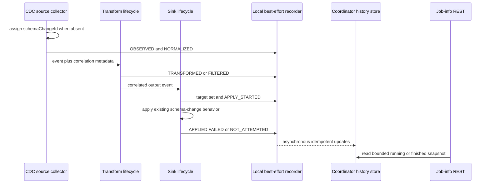

# Schema Evolution Timeline Design

This document proposes the first backend contract for [GH-11355](https://github.com/apache/seatunnel/issues/11355) and [STIP-36](https://github.com/apache/seatunnel/issues/11790). It does not describe an implemented API yet.

## Problem

SeaTunnel carries schema-change events from CDC sources through transforms and sink writers, but the current runtime exposes only independent logs from those stages. An operator cannot inspect one job-scoped record to determine:

- which schema change was observed;
- whether a transform changed or filtered it;
- how the source table resolved to one or more target tables;
- whether each target supported and applied the change; or
- whether a failed target left other targets successfully changed.

The existing runtime already has useful integration points:

- `SeaTunnelSourceCollector` receives normalized `SchemaChangeEvent` objects;
- `TransformFlowLifeCycle` invokes each transform's `mapSchemaChangeEvent` method and can observe replacement or filtered events;
- `SinkFlowLifeCycle` invokes schema evolution for a single writer; and
- `MultiTableSinkWriter` resolves the complete target set and applies a schema change at its shared barrier.

The proposal records framework-owned decisions at those boundaries. It does not add another schema-change state machine.

## Relationship to Schema-Change Correctness

[GH-11402](https://github.com/apache/seatunnel/issues/11402) owns schema ordering, replay, checkpoint, restore, and schema-epoch correctness. This design consumes those decisions and reports what the runtime observed.

Timeline storage must never:

- acknowledge or reject a schema change;
- change target dispatch order;
- make a checkpoint wait;
- trigger a retry or restore; or
- convert a successful schema change into a failed one.

When timeline recording is unavailable, the existing schema-change path continues unchanged.

## Scope

The first implementation should provide a bounded timeline for running and finished Zeta jobs.

It should:

- correlate one normalized event across source, transform, routing, and sink stages;
- preserve source and resolved target table identities;
- expose normalized decisions, target outcomes, and reason codes;
- retain partial fan-out outcomes without reporting false success;
- exclude raw DDL from the default response;
- survive supported task transport and active-master failover; and
- expire with the existing finished-job history lifecycle.

The first implementation should not add:

- a durable compliance or audit-log guarantee;
- unlimited event retention;
- a second ordering or replay protocol;
- raw connector payloads in the stable response;
- automatic schema repair; or
- a Web UI before the backend contract is validated.

## Runtime Flow



Recorder calls are local and non-blocking. Network and HA writes happen asynchronously outside the source, transform, sink, and checkpoint critical paths.

## Correlation Identity

### Carrier

The preferred first implementation adds optional correlation metadata to `SchemaChangeEvent` while preserving existing event constructors:

```java
default String getSchemaChangeId() {
    return null;
}

default void setSchemaChangeId(String schemaChangeId) {
    // Legacy connector events may initially ignore correlation metadata.
}
```

`TableEvent`, which is the base class for SeaTunnel's built-in schema-change events, stores the value. The source collector assigns an opaque UUID when the built-in event first enters the runtime and no ID is present.

A custom event implementation that does not retain the optional metadata remains compatible, but its later stages are reported with correlation unavailable. The timeline must not claim exact end-to-end correlation for that event.

A framework helper copies event metadata whenever a transform returns a replacement event:

```java
SchemaChangeEventMetadata.copy(sourceEvent, replacementEvent);
```

The helper copies only framework-owned metadata such as correlation ID and job identity. It does not copy connector statements or transform-owned schema fields.

This approach is preferred over object identity, table/type/timestamp hashes, or an external side map because those alternatives do not survive replacement events, serialization, or replay.

### Compatibility Gate

The implementation must treat the new field as optional and verify legacy/current Java serialization before it is merged. Existing constructors and event type meanings remain unchanged. If an explicit `serialVersionUID` is required, the implementation must first capture the value generated by the current class and use that value rather than choosing a new one.

The same serialized event keeps its correlation ID across task transport or engine replay. If a connector reconstructs a new event after reading the source again from an earlier offset, it is a new runtime observation and receives a new ID unless the correctness contract in GH-11402 later provides a durable native replay identity. The timeline must not guess equivalence from table name, event type, DDL, or timestamp.

## Execution Attempts and Deduplication

Every recorded update also carries the current pipeline execution attempt identity supplied by the engine. A deduplication key is:

```text
schemaChangeId + executionAttemptId + stage + targetIdentity
```

Repeated delivery of the same stage in one attempt is idempotent. A replay under a new execution attempt remains visible under the same logical event instead of overwriting the earlier outcome.

If execution-attempt identity is not available on a path, the update is marked unavailable and must not be presented as exact replay information.

## Record Model

One logical event produces one `SchemaEvolutionRecord`:

```json
{
  "schemaChangeId": "2cb23eb5-9716-42b2-b3a4-7f07a79c9368",
  "sequence": 42,
  "jobId": "123456789",
  "sourceTable": "inventory.products",
  "eventType": "ADD_COLUMN",
  "eventCreatedAt": 1786900000000,
  "observedAt": 1786900000100,
  "state": "TERMINAL",
  "outcome": "PARTIALLY_APPLIED",
  "attempts": [
    {
      "executionAttemptId": "attempt-2",
      "decisions": [],
      "targets": []
    }
  ],
  "totalTargetCount": 2,
  "returnedTargetCount": 2,
  "targetsTruncated": false,
  "omittedAttemptCount": 0
}
```

Stable fields contain framework-owned facts only. Connector offsets, raw DDL, vendor error objects, and arbitrary payloads are not part of the default contract.

## Decision Stages

The first version uses these stages when the corresponding path is observed:

- `OBSERVED`: the source collector received the event;
- `NORMALIZED`: the event is a supported SeaTunnel `SchemaChangeEvent`;
- `TRANSFORMED`: a transform returned a changed event;
- `FILTERED`: a source rule or transform intentionally removed the event;
- `TARGET_RESOLVED`: sink target discovery completed;
- `POLICY_EVALUATED`: a configured behavior policy was evaluated;
- `CAPABILITY_EVALUATED`: sink support was determined;
- `APPLY_STARTED`: apply began for one target; and
- `COMPLETED`: one target or a pre-sink filtered event reached a terminal outcome.

Not every path emits every stage. Missing stages are reported as unavailable and are not inferred.

## Target Identity and Fan-Out

A target identity must distinguish parallel and multi-sink paths. It contains the sink vertex identity, writer or sub-writer identity when available, and the resolved physical target table. Connector object identity is not exposed.

`MultiTableSinkWriter` knows the complete dispatch target set before application starts. It should record that set before invoking any target, then record each target outcome around the existing `applySchemaChange` call.

Target outcomes are:

- `APPLIED`;
- `IGNORED`;
- `FILTERED`;
- `UNSUPPORTED`;
- `FAILED`; and
- `NOT_ATTEMPTED`.

`NOT_ATTEMPTED` is used when fail-fast behavior stops dispatch after an earlier target failure. Its reason code is `ABORTED_AFTER_TARGET_FAILURE`. It is not reported as `FAILED` or `UNKNOWN`.

The parent outcome is calculated only from the recorded target set:

- `APPLIED` when every required target is applied;
- `FILTERED` when the event terminates before target dispatch;
- `IGNORED` when policy intentionally ignores every target;
- `FAILED` when no target is applied and at least one target fails;
- `PARTIALLY_APPLIED` when at least one target is applied and another fails or is not attempted; and
- `UNKNOWN` while target membership or terminal outcomes are incomplete.

This calculation is diagnostic. It does not decide whether the job should fail or continue.

## Recorder Failure Contract

Recording is best effort at every stage:

1. The producer updates a small local immutable snapshot or queues a bounded update.
2. A worker operation sends batches asynchronously to the coordinator.
3. The coordinator merges updates atomically into the job-scoped history entry.
4. Producer, transport, or store failures increment a low-cardinality metric and emit a rate-limited warning.

The history response includes `droppedUpdateCount` and `lastRecorderErrorAt` when the coordinator can retain that health update. If the entire history store is unavailable, logs and metrics remain the only evidence. The runtime must not synthesize a successful target outcome to hide missing recorder data.

Recorder exceptions are caught outside the existing schema-change result. They cannot replace, suppress, or wrap the source, transform, or sink exception.

## Storage and Retention

The coordinator owns a dedicated HA-backed job entry. An atomic job-entry update performs sequence allocation, deduplication, merge, and eviction.

The first version uses these bounds:

- retain at most 500 logical event records per job;
- retain at most 16 execution attempts per logical event;
- retain at most 100 target outcomes per attempt;
- retain at most 4 KiB of valid UTF-8 for each optional error summary;
- evict the oldest terminal logical record first; and
- expire finished history with `history-job-expire-minutes`.

In-progress records are not evicted to make room for a newer event. If all retained records are in progress and the job has reached its bound, the new record is dropped, `droppedRecordCount` is incremented, and normal schema processing continues. This keeps the store strictly bounded without silently removing an active operation.

When attempt or target details exceed their limits, the oldest terminal attempt or excess target details are omitted and the response exposes the total count, returned count, and truncation flag.

When the job becomes terminal, `JobHistoryService` writes one bounded finished snapshot with its own matching TTL. The snapshot is best effort and does not change the job's terminal state.

## REST Contract

The proposed endpoint is:

```text
GET /job-info/{jobId}/schema-evolution?limit=100&beforeSequence=42
```

Optional filters:

- `table`: exact source or target table;
- `outcome`: normalized parent outcome.

Behavior:

- return records in descending sequence order;
- default `limit` to 100 and cap it at the retained maximum;
- return the same model for running and finished jobs;
- return an empty collection for a known job with no records;
- use existing job-not-found behavior for unknown or expired jobs;
- expose dropped and truncated data explicitly; and
- keep existing `/job-info/{jobId}` fields unchanged.

Only exact route shapes are accepted. Additional path segments use existing not-found behavior.

## Security and Privacy

The endpoint uses the same `BasicAuthFilter` boundary as other engine job-detail endpoints.

Before persistence:

- raw DDL and connector-native payloads are excluded;
- optional error summaries are redacted and UTF-8 bounded;
- arbitrary exception objects are never stored; and
- table and worker metadata follow the existing job-detail authorization boundary.

Documentation must state that table names and bounded error summaries can still contain operationally sensitive information when REST authentication is disabled.

## Compatibility

The feature is additive:

- existing jobs require no configuration changes;
- schema-change ordering, filtering, and sink behavior remain unchanged;
- existing REST fields remain unchanged;
- recorder failure never changes job correctness;
- old events without correlation metadata remain readable; and
- connectors may initially expose only framework-owned facts.

The public REST model is not frozen until correlation serialization, multi-target behavior, restore/replay identity, and finished-history retention are validated end to end.

## Validation Plan

Coverage should include:

- source observation and normalization;
- transform replacement preserving correlation metadata;
- source and transform filtering;
- single-target success and failure;
- multi-target success, fail-fast, continue-on-error, and partial application;
- repeated stage delivery without duplicate decisions;
- replay under another execution attempt;
- active-master failover preserving acknowledged records;
- strict record, attempt, target, and error bounds;
- recorder/store failure not changing schema behavior;
- running and finished REST responses; and
- legacy/current event serialization compatibility.

At least one E2E path should use MySQL CDC with a schema-evolution-capable JDBC sink. A negative path should use an unsupported event or sink.

## Delivery Plan

1. Agree on this correlation, fan-out, retention, recorder, and REST contract.
2. Add the internal record model, optional event correlation metadata, serialization compatibility tests, and local recorder interface.
3. Add bounded HA-backed active and finished history storage with atomic merge tests.
4. Add source and transform decision capture.
5. Add single-writer and multi-table target outcome capture.
6. Add REST routing, validation, authentication-boundary, and compatibility tests.
7. Add E2E recovery and multi-target tests plus operational documentation.
8. Add the Web UI in a separate pull request after the backend model is stable.

Each implementation slice should have its own issue after this design is accepted. GH-11355 remains the feature umbrella and STIP-36 remains the design source of truth.

## Acceptance Criteria

1. One built-in schema-change event keeps one correlation ID through source, transform replacement, task transport, and supported replay.
2. A newly reconstructed source event is not falsely deduplicated using table, type, DDL, or timestamp.
3. Repeated updates in one execution attempt are idempotent.
4. A replay under a new execution attempt remains visible without overwriting the earlier attempt.
5. Multi-target outcomes expose applied, failed, and not-attempted targets without false aggregate success.
6. Records, attempts, targets, and error summaries remain within fixed bounds and expose dropped or truncated data.
7. Raw DDL is not present in the default stored or REST model.
8. Recorder, transport, or store failures do not change schema-change or job behavior.
9. Running and finished jobs expose the same response model.
10. Existing schema evolution and job-info behavior remain backward compatible.
11. Legacy event serialization remains readable after optional correlation metadata is added.
12. English and Chinese documentation describe the final contract and its limitations.
