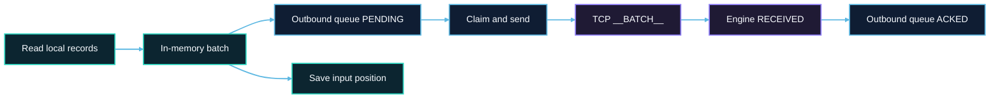
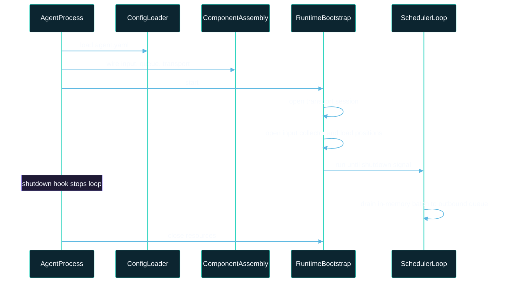
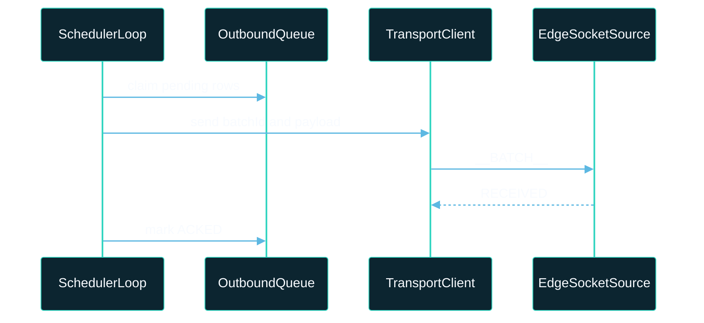

# Architecture Overview

This document describes the system design of SeaTunnel Edge Agent: boundaries, data flow, durability, and integration with the engine. For installation, agent.yaml parameters, and day-to-day operations, see [Edge Agent](./about.md).

## 1. Background and Goals

### 1.1 Problem Background

In many production networks, the Zeta cluster cannot directly access edge-local files (including application logs and NDJSON paths on disk). A dedicated edge collector process is needed to:

- read local records close to the source,
- tolerate intermittent network connectivity,
- deliver data into a running SeaTunnel pipeline without embedding engine workers at edge sites.

### 1.2 Design Goals

SeaTunnel Edge Agent is designed with:

1. Independent deployment: packaging and lifecycle are decoupled from engine workers; the agent runs as an independent process on edge hosts. See [Edge Agent — Deployment Guide](./deployment-guide.md) for install layout.
2. Durable outbound buffering: WAL-backed outbound queue with explicit state transitions.
3. Protocol alignment with Zeta: reuse the EdgeSocket line protocol (`__AUTH__` / `__BATCH__` → RECEIVED); see [EdgeSocket source connector](../connectors/source/EdgeSocket.md).
4. Simple operations: YAML configuration and predictable scheduler loop; operational detail lives in [Edge Agent](./about.md).
5. Clear boundaries: sending path and delivery semantics are explicitly bounded for stable operations and extensibility.

### 1.3 Architecture Positioning

| Aspect | Edge Agent | SeaTunnel Engine |
|--------|------------|------------------|
| Runtime location | Edge host process | Cluster coordinator and worker tasks |
| Input access | Local files on the edge host (glob paths, including log files) | Connector-reachable systems (databases, messaging, object storage, etc.) |
| Durability and state | Local WAL outbound queue and input position store | Checkpointing, job state, and task-level recovery |
| Network role | Dials Engine EdgeSocket ingress endpoint | Exposes ingress and orchestrates internal task execution |
| Primary role | Edge data ingest and forwarding | End-to-end data integration and pipeline execution |

### 1.4 Responsibility Boundaries

To keep architecture decisions explicit, treat these boundaries as stable contracts:

| Boundary | Owned by Edge Agent | Owned by Engine / Job |
|----------|---------------------|------------------------|
| Durability boundary | Persist local outbound rows and retry until the engine returns RECEIVED | Durable processing after ingest is accepted |
| Checkpoint boundary | Not checkpoint-aware in this release (`__COMMIT__` not used) | Checkpoint lifecycle and exactly-once semantics |
| Failure ownership | Local file read, local WAL state, transport reconnect behavior | Source ingress policy, downstream transform/sink correctness |

## 2. Logical Architecture

### 2.1 Deployment Topology

```text
┌─────────────────────────────────────────────────────────────────┐
│                         Edge host                               │
│  ┌───────────────────────────────────────────────────────────┐  │
│  │                    Edge Agent process                     │  │
│  │  Input collector ──► Scheduler & batching                 │  │
│  │         │              │                                  │  │
│  │         │              ├──► Outbound queue (WAL)           │  │
│  │         └──► Input position store (local persistence)    │  │
│  │                            │                              │  │
│  │                            └──► Transport client          │  │
│  └───────────────────────────────────────────────────────────┘  │
└─────────────────────────────────────────────────────────────────┘
                                │ TCP line protocol
                                ▼
┌─────────────────────────────────────────────────────────────────┐
│                  SeaTunnel Engine (Zeta)                        │
│  EdgeSocket Source ingress at configured output.endpoint        │
└─────────────────────────────────────────────────────────────────┘
```

Trust boundary: the agent trusts local filesystem access and its own local persistent stores. The engine trusts the configured output.token on `__AUTH__`. There is no automatic cluster endpoint discovery; output.endpoint is configured statically.

### 2.2 Data Plane

Records move through the agent on a single-threaded scheduler loop:



Control plane (configuration load, plugin selection, lifecycle start/stop) runs once at startup and on shutdown; the hot path above is the data plane.

### 2.3 Repository Modules

Implementation is split into three Maven modules (names for repository navigation only):

| Layer | Responsibility | Module |
|-------|----------------|--------|
| Runtime core | YAML resolution, process lifecycle, scheduler loop, outbound queue and input position persistence | seatunnel-edge-agent-starter |
| Transport and encoding | EdgeSocket or console sink, reconnect policy, raw/packet payload modes | seatunnel-edge-agent-transport |
| Input plugins | File collector, NDJSON normalization, multiline assembly | seatunnel-edge-agent-connector |

Distribution packaging is produced by seatunnel-dist edge-agent assemblies; see [Download](./download.md).

## 3. Runtime Behavior

### 3.1 Startup and Shutdown



On graceful shutdown, the scheduler drains any in-memory batch into the outbound queue before exit so records are not lost in RAM.

### 3.2 Main Loop

Each iteration of the scheduler loop:

1. Poll input — read up to queue.poll-batch-size events from the configured input collector (input.*).
2. Buffer in memory — accumulate events until agent.bulk-max-size or agent.flush-interval-ms.
3. Flush to persistence — append events to the outbound queue as PENDING rows; persist input positions from each event (file offset / line metadata).
4. Send outbound — claim pending rows, encode payload, send via transport; on RECEIVED, mark rows ACKED.
5. Housekeeping — mark exhausted PENDING rows as DEAD, resurrect SENDING rows, delete acknowledged rows per queue.acked-retention-ms, sleep agent.idle-sleep-ms when idle.

### 3.3 Outbound Queue State Machine

Each outbound record transitions:

```text
PENDING
  │ claim for send (attempt_count++)
  ▼
SENDING
  │ send success + engine RECEIVED
  ├──────────────► ACKED
  │
  └ send failure / timeout / crash before RECEIVED
                 ▼
               PENDING (attempt counter increased; via resurrect)
  │
  └ attempt_count >= retry.max-attempts
          ▼
        DEAD (no further sends; operator cleanup)
```

resurrect periodically moves SENDING rows back to PENDING so a crash between claim and RECEIVED does not strand data. retry.max-attempts stops claiming rows that exceeded the limit; markExceededAsDead moves them to DEAD.

File positions are persisted when events are appended to the outbound queue (same flush as WAL insert), not when the engine acknowledges a batch. Recovery relies on WAL rows plus saved input positions.

## 4. Outbound Queue and Input Positions

The agent maintains two separate local persistence concerns:

| Store | Purpose | Updated when | Recovery after restart |
|-------|---------|--------------|------------------------|
| Outbound queue | Durability until the engine returns RECEIVED for a batch | Events are flushed from memory; rows move PENDING → SENDING → ACKED | SENDING rows revert to PENDING; unsent data is retried |
| Input position store | Resume reading local files without re-reading already persisted events | Same flush as outbound append (per-event position) | Collector reopens at saved byte offset / line |

Keeping them separate avoids coupling “what was sent to the network” with “where to read next on disk.” A network outage should not reset file tail positions; conversely, advancing a file cursor must not imply the remote pipeline has committed data.

The agent persists outbound records and position records in local persistent storage: outbound records drive retryable sends, and position records support resume recovery.

## 5. Network and EdgeSocket Contract

### 5.1 Endpoint Model

The transport client connects to the statically configured output.endpoint (host:port). There is no cluster service discovery. Changing the ingest host requires updating configuration and restarting the agent.

### 5.2 Wire Protocol

The agent implements the collector side of [EdgeSocket](../connectors/source/EdgeSocket.md). It does not send `__COMMIT__`. Durability on the agent is the WAL row ACKED state after RECEIVED, not engine checkpoint polling.

| Step | Agent → Engine | Engine → Agent | Agent handling |
|------|----------------|----------------|----------------|
| Auth | `__AUTH__:<token>` | ACK / AUTH_FAILED / REJECTED | REJECTED: fail fast, no auto-reconnect (duplicate collector) |
| Batch | `__BATCH__:<batchId>:<payload>` | RECEIVED / RETRY / `QUEUE_FULL:<ms>` / DECRYPT_FAILED | QUEUE_FULL: wait and resend; DECRYPT_FAILED: fatal configuration error |

:::note ACK and RECEIVED

ACK belongs to authentication. RECEIVED belongs to batch ingest and is the only success response that advances a WAL row from SENDING to ACKED.

:::

batchId is the WAL row batch_id used on the wire (`__BATCH__:<batchId>:...`), allocated from edge_agent_meta.next_batch_id and monotonic for that agent database. It is not the WAL row primary key id.



### 5.3 Reconnect Policy

On I/O failures (and retryable transport-level failures):

1. invalidate the current socket session,
2. retry configured endpoint candidates (typically one static host),
3. reconnect, re-authenticate, and resume claiming pending outbound rows. Transport reconnect backoff follows output.* transport settings; scheduler replay pacing follows retry.*.

### 5.4 Protocol Contract vs Implementation Detail

Stable protocol contract:

- The agent authenticates with `__AUTH__:<token>` and sends `__BATCH__:<batchId>:<payload>`.
- RECEIVED acknowledges ingest acceptance for that batch.
- The agent does not send `__COMMIT__` in this release.

Current runtime behavior:

- batchId is persisted as WAL row batch_id and allocated from edge_agent_meta.next_batch_id.
- Runtime uses a single scheduler loop for sending.

## 6. Reliability and Delivery Semantics

### 6.1 Failure Scenarios

| Failure | Behavior |
|---------|----------|
| Agent process crash | SENDING outbound rows restored to PENDING on restart; in-memory batch lost unless graceful shutdown drained it |
| Temporary network outage | Row stays SENDING on send failure; scheduler backs off; resurrectSending moves stale SENDING rows back to PENDING, then reconnect and retry |
| Collector endpoint change | Update output.endpoint and restart agent |
| Graceful shutdown | In-memory batch flushed to outbound queue before exit |

### 6.2 Delivery mode

When agent.delivery-guarantee is not configured, it defaults to BEST_EFFORT.

#### BEST_EFFORT (default)

- The agent keeps a local WAL outbound queue and retries until the engine returns RECEIVED (or the row is marked DEAD after retry.max-attempts).
- The same WAL row may be sent more than once after failures, crashes between claim and RECEIVED, resurrectSending, or operator db wal-retry-dead.
- The agent does not send `__COMMIT__`; durability ends at engine RECEIVED for a batch.

Design for downstream: treat the output boundary as may deliver duplicates — use idempotent sinks or deduplication keys when you need strict uniqueness. See [Configuration — agent](./configuration.md#agent).

#### NON

- No WAL or source position persistence — the agent runs completely stateless.
- Events are read from input, batched in memory, and sent directly via transport. On send failure, the event is dropped with a warning log.
- On restart, file reading resumes based on input configuration (e.g. `read-from-beginning`), not saved positions. Previously sent data may be re-read and re-sent.
- `queue.*` and `retry.*` configuration sections are ignored in NON mode.

### 6.3 Boundary with Engine Checkpointing

| Concern | Edge Agent | SeaTunnel Engine |
|---------|------------|------------------|
| Durability until engine RECEIVED | WAL-backed outbound queue | — |
| Pipeline exactly-once / checkpoint | — | Checkpoint mechanism on tasks |
| Commit cursor to agent | Not used (`__COMMIT__` not sent) | — |

The agent’s contract ends when the engine returns RECEIVED for a batch. Further correctness is the job’s responsibility.

### 6.4 Failure-to-Action Runbook

| Symptom | Primary signal | Likely owner | First action |
|---------|----------------|--------------|--------------|
| AUTH_FAILED | Agent transport/auth log | Agent + job config | Align output.token and Engine token, then restart agent |
| REJECTED | Agent transport/auth log | Deployment policy | Check duplicate collector identity / listener policy conflict |
| Growing backlog (PENDING/SENDING) | WAL summary and queue depth | Agent side first | Check endpoint reachability, transport retries, and engine ingest pressure |
| Repeated DEAD rows | WAL status transitions | Agent config + payload compatibility | Inspect dead rows, fix root cause, then decide purge vs retry |

## 7. Configuration and Extension

### 7.1 Configuration Surface

Runtime behavior is driven by a single agent.yaml with top-level sections agent, input, queue, retry, and output. A typical deployment configures input (with paths) and production output (transport + endpoint); when queue and retry are not configured, defaults apply (sqlite-path: data/wal.db, built-in retry policy).

For every key, type, default, and validation rule, use the authoritative [Edge Agent — Configuration Reference](./configuration.md). Example file in the repository and install package: [seatunnel-edge-agent/config/agent.yaml](../../../seatunnel-edge-agent/config/agent.yaml) under the install root config/ directory.

### 7.2 Input

Only the file input is implemented today (input.type defaults to file). Configure input.paths with globs to tail local files; application logs, NDJSON, and rotated log files are all expressed as paths (for example /var/log/*.log). There are no separate log or event input types.

See [Input Configuration](./input-configuration.md) for parameters and examples. Additional input.type values are SPI extension points via EdgeInputReaderFactory.

### 7.3 Output and Payload Encoding

Transport vs console, endpoint alignment with the engine, and RAW vs PACKET scenarios are documented in [Output Configuration](./output-configuration.md). Wire-level responses: [EdgeSocket Source](../connectors/source/EdgeSocket.md).

Plugins are selected by input.type and output.type in YAML; adding a new input or transport implementation is an extension point without changing the scheduler contract.
