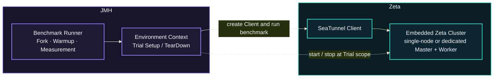

# Zeta Benchmark

This guide explains why SeaTunnel benchmarks are needed, how they are structured, how to interpret
their metrics, how to run them locally, and how to diagnose and compare performance. Architecture
diagrams and research references accompany the practical examples.

## Why Benchmarks Are Needed

:::tip A Faster, More Stable Engine

The goal of benchmarking is to help the SeaTunnel Zeta engine run more consistently, process data
faster, and use compute and storage resources more efficiently as it evolves.

:::

As data volumes grow and use cases expand, the engine must sustain throughput and control latency
under greater load while supporting checkpointing, state storage, and observability. Benchmarks
help identify bottlenecks that limit processing capacity and reveal performance variability as
load increases, providing evidence for improvements in efficiency and runtime stability.

They also give the community a shared way to validate performance: quantify the benefit of an
optimization, detect potential regressions earlier, and let contributors reproduce and compare
results. Building a growing set of baselines and test scenarios helps the community assess each
change and improve engine performance over time.

## Architecture



### Responsibilities and Lifecycle

JMH manages forked JVMs, warmup, measurement, and result collection. The environment context
prepares fixtures and, when required, starts the runtime shown above. The measured method invokes
the production operation under investigation, and teardown releases resources.

Fixture preparation, environment startup, and cleanup belong outside the timed operation unless
their cost is the subject of the test. The benchmark should make this boundary explicit and verify
that the measured work produces a valid result.

### Execution Settings

The shared JMH configuration defines 3 forks, 3 warmup iterations, and 5 measurement iterations.
Each fork runs in an independent JVM. Warmup precedes the samples used to calculate the Score;
method annotations and command-line arguments can override the shared defaults.

Thread count, heap size, garbage collector, and JVM-visible processor count are experiment
settings. Record their effective values and keep them consistent between revisions. A limit on
JVM-visible processors does not provide operating-system CPU affinity.

### Environment and Reproducibility

Resource requirements depend on the selected workload. Keep unrelated machine activity low and
use the same machine for baseline and candidate. Record the JDK, JVM settings, input parameters,
and code revisions alongside the raw results.

A benchmark establishes the behavior of the operation and workload it measures. Validate broader
production benefits under the relevant deployment conditions.

## Metrics and Result Interpretation

### JMH Metrics

A JMH result answers four questions: what ran, how it was measured, what the result was, and how
stable the evidence was.

```text
Benchmark    (Parameters)    Mode    Cnt    Score    Error    Units
```

| Field | Meaning | How to read it |
|---|---|---|
| `Benchmark` / `Parameters` | Method and workload parameters | Must match when comparing results. |
| `Mode` | `thrpt` measures throughput; `avgt` average time; `sample` duration distribution; `ss` single-shot time | Higher is better for `thrpt`; lower is better for time modes. |
| `Cnt` | Measurement samples used in the statistics, excluding warmup | For throughput and average time, usually `forks × measurement iterations`. |
| `Score` | Mean performance across measurement samples | `Score = Σxᵢ / n`. Use Mode and Units to determine direction. |
| `Error` | Confidence-interval half-width, in the same unit as Score | `Interval = [Score − Error, Score + Error]`. Smaller means a more precise mean estimate. |
| `Units` | Unit of Score | `ops/time` is throughput; `time/op` is elapsed time per operation. |
| `CV` | Relative sample variability calculated by the SeaTunnel report | `CV = sample standard deviation / abs(Score) × 100%`. Lower means more tightly grouped samples. |

Here, `xᵢ` is one measurement sample, `n` is Cnt, and `abs` means absolute value. Also verify
the JDK, thread count, and JVM arguments before comparing results.

### Comparison Report Metrics

`B` is Baseline and `C` is Candidate; `median` summarizes valid per-run values.
Calculate B/C separately for each revision. Verify SHAs, methods, parameters, and environments first.

| Field | Purpose | Calculation | Interpretation |
|---|---|---|---|
| Benchmark | Identifies the method | Match full method name and parameters | The table displays a shortened name. |
| Parameters | Identifies the workload | Recorded test parameters | Must match on both sides. |
| Score B / C | Representative performance | `median(per-run Score)` | Higher throughput or lower elapsed time is better. |
| Score Change | Performance change | Throughput: `(C / B − 1) × 100%`; time: `(1 − C / B) × 100%` | Positive means improvement; negative means regression. |
| CV B / C | Sample variability | `median(per-run CV)` | Lower means more tightly grouped samples. |
| CV Change | Change in variability | `(CV C / CV B − 1) × 100%` | Negative means less variability. |
| Error B / C | Relative uncertainty | `median(per-run Error / abs(Score) × 100%)` | A percentage, not raw JMH's absolute Error. |
| Error Change | Change in relative uncertainty | `(Error C / Error B − 1) × 100%` | Negative means less relative uncertainty. |
| Unit | Common unit for Score | For example, `ops/ms` or `us/op` | Other numeric columns are percentages. |

`abs` means absolute value. Missing usable data or a zero change denominator produces `n/a`.
A displayed `0.00%` may reflect rounding; recalculate from the original JSON.

:::info Changes and Statistical Conclusions

These changes are not significance tests. A successful workflow does not guarantee the absence of regression.

:::

### Assess the Evidence

First confirm that the intended revision and method ran successfully, the output passed its
correctness checks, and both revisions used the same settings. Then inspect the Score together
with Error, CV, and individual fork/iteration samples.

| Observation | Interpretation and next step |
|---|---|
| Repeated runs show a consistent improvement with limited variability | Report the change together with its workload and measurement boundary. |
| The difference is small relative to variability, or changes direction between runs | Treat the result as inconclusive and repeat under controlled conditions. |
| Most methods shift together on the same revision | Check machine load, CPU frequency, JDK, and environment metadata before attributing the shift to code. |
| A method consistently regresses | Use profiling to locate the additional cost, then repeat the unprofiled comparison. |

Preserve every sample. A single favorable iteration or a large percentage alone is not enough to
establish a repeatable improvement.

### Visualization

Generate JMH JSON with `-rf json -rff <file>`, open
[JMH Visualizer](https://jmh.morethan.io/), and compare scores, errors, forks, and iterations by
method name and parameters.

Parameter values may be combined into chart labels; consult the legend and original JSON to
identify each experiment. Keep the raw JMH files when sharing charts so others can inspect the
underlying samples. The scripts `tools/benchmarks/save_jmh_result.py` and
`tools/benchmarks/regression_report.py` generate normalized JSON and Markdown reports.

## Local Execution

### Build and Prepare

Run commands from the repository root. Enable the `benchmark` profile to build the JMH runner:

```bash
./mvnw -Pbenchmark -pl seatunnel-benchmarks -am -DskipTests package
git rev-parse HEAD
java -version
```

The runner is `seatunnel-benchmarks/target/benchmarks.jar`. Rebuild after changing the checkout
or benchmark code: the current Git HEAD does not prove that an existing JAR contains that revision.
Record uncommitted production or fixture changes alongside the SHA.

In IntelliJ IDEA, enable `benchmark` under Maven `Profiles` and select `Reload All Maven Projects`.
If the module is still absent, add `seatunnel-benchmarks/pom.xml` as a Maven project and reload.

### Execute Through the JAR

List available methods with `-l`. Replace `<benchmark-method>` in the examples with the full method
name from that output, retaining the trailing `$`. Use `-lp` to inspect its parameters:

```bash
java -jar seatunnel-benchmarks/target/benchmarks.jar -l
java -jar seatunnel-benchmarks/target/benchmarks.jar \
  '<benchmark-method>$' -lp
```

Run one method with its configured warmup, measurement, and forks, and save JMH JSON:

```bash
java -jar seatunnel-benchmarks/target/benchmarks.jar \
  '<benchmark-method>$' \
  -rf json -rff seatunnel-benchmarks/target/benchmark-result.json
```

Selectors are regular expressions. Use the full method name followed by `$` to select one method.
Check the matches with `-l` before a long run.

:::caution Smoke Checks Are Not Performance Evidence

A short smoke check can add
`-f 1 -wi 1 -i 1 -w 1s -r 1s`; its result is only a functional check.

:::

Use `-p` to override workload parameters supported by the selected method. Replace `<parameter>`
and `<value>` with a parameter name from `-lp` and the desired value:

```bash
java -jar seatunnel-benchmarks/target/benchmarks.jar \
  '<benchmark-method>$' \
  -p '<parameter>=<value>' \
  -rf json -rff seatunnel-benchmarks/target/benchmark-result.json
```

Change one workload parameter at a time when exploring its effect. Keep the selector, parameters,
thread count, JDK, and JVM settings identical when comparing revisions.

## Performance Diagnostics and Comparison

### Compare a PR

The `Benchmarks` workflow compares a baseline and a PR under the same workload and runtime
environment. It answers one central question: did the change make the selected operation faster,
or did it introduce a regression?

#### Workflow Inputs

Open GitHub Actions, select `Benchmarks`, and choose `Run workflow`:

| Input | Value |
|---|---|
| `Use workflow from` | Branch containing the workflow, normally `dev`; this is not the revision being measured. |
| `seatunnel_ref` | Baseline branch, tag, or SHA; prefer a fixed SHA. |
| `pr_number` | Numeric ID of the candidate PR; leave empty to run only the baseline. |
| `benchmarks` | Select a predefined benchmark suite or test. |
| `custom_benchmarks` | Optionally enter one exact method, `<benchmark-method>$`; this overrides `benchmarks`. |

Baseline and Candidate must contain the same benchmark method and fixtures, or their results cannot
be paired. Avoid `.*` for routine PR comparisons because it runs every method and parameter
combination; select only operations affected by the change.

The workflow alternates revisions on the same worker to reduce bias from machine conditions changing
over time:

```text
Baseline → Candidate → Candidate → Baseline
```

Java 8 and Java 11 run this comparison separately, and the report summarizes two runs of each
revision.

After the run, confirm that the job reached JMH measurement and verify the SHAs, method, and
parameters in the summary. See [Comparison Report Metrics](#comparison-report-metrics) for field
definitions and formulas; rerun an inconclusive result. The artifact provides the raw JMH JSON,
normalized report, and environment details.

### Performance Diagnostics

:::info Use Profiling to Explain the Result

Use profiling to explain an observed performance change, an unexpected Score, or high Error/CV.
The diagnostic runner keeps its report separate because profiler overhead makes its Score unsuitable for
regression comparisons.

:::

A diagnostic selector must resolve to exactly one benchmark method;
selectors such as `.*` or a class name that matches several methods are rejected.

#### Workflow Inputs

`Benchmarks Diagnostics` profiles one revision; it does not run a baseline/candidate comparison.

| Input | What to enter |
|---|---|
| `Use workflow from` | Branch containing the diagnostic workflow and tools, normally `dev`. |
| `seatunnel_ref` | Branch, tag, or SHA to diagnose when no PR is selected. |
| `pr_number` | Optional trusted PR ID. When set, its head replaces `seatunnel_ref` as the diagnostic target. |
| `benchmark` | One method selector, `<benchmark-method>$`, obtained from `-l`. Selectors matching multiple methods are rejected. |
| `java_version` | `8` or `11`; use the JDK of the normal run being investigated. |
| `profile` | `cpu` for execution hot spots, `wall` for elapsed-time stacks including waits, `lock` for lock contention, `gc` for allocation/GC metrics, or `all` for separate runs of all four. |
| `capture_jfr` | Enable to add a separate JFR recording for offline analysis. |
| `jmh_args` | Optional JMH arguments or workload parameters, using the selected method's `-lp` output. Leave empty for defaults; forks remain fixed at 1. |

#### Run Profiling Locally

Use the same script to diagnose a built benchmark locally. The following example profiles CPU;
replace `cpu` with `wall`, `lock`, or `gc` to select another mode:

```bash
bash tools/benchmarks/profile_benchmarks.sh profile cpu \
  --benchmark '<benchmark-method>$'

bash tools/benchmarks/profile_benchmarks.sh capture jfr --benchmark '<benchmark-method>$'
```

| Argument | Purpose |
|---|---|
| `profile <mode>` | Select CPU hotspots, elapsed-time stacks, lock contention, or GC allocation analysis. |
| `--benchmark` | Select exactly one benchmark method. |
| `--repository` | Optional directory containing a built benchmark JAR. |
| `--output` | Optional output directory that does not exist or is empty. |
| `-- <JMH arguments>` | Optional overrides for warmup, measurement, or workload settings. |

CPU, wall-clock, and lock modes require async-profiler and `ASYNC_PROFILER_HOME`. GC and JFR use
JMH's built-in profilers. Diagnostic runs use one fork and create a separate directory under
`seatunnel-benchmarks/target/profiles` by default.

#### Read Diagnostic Artifacts

First confirm the target revision, benchmark settings, and sample results in the job summary, then
download the artifact for the selected mode. CPU, wall-clock, and lock modes provide flame graphs;
GC provides allocation and collection summaries. Use the JMH log and JSON to verify the run.
Enabling `capture_jfr` also creates a JFR recording for offline analysis.

Zero samples in lock mode normally means that the run did not observe lock contention. Because a
profiler changes execution cost, use diagnostics only to locate the cause; confirm an improvement or
regression with the unprofiled PR comparison.

## Research References

1. Andy Georges, Dries Buytaert, and Lieven Eeckhout,
   [Statistically Rigorous Java Performance Evaluation](https://dri.es/files/oopsla07-georges.pdf),
   OOPSLA 2007.
2. Tomas Kalibera and Richard Jones,
   [Rigorous Benchmarking in Reasonable Time](https://dl.acm.org/doi/10.1145/2491894.2464160),
   ISMM 2013.
3. Jeyhun Karimov et al.,
   [Benchmarking Distributed Stream Data Processing Systems](https://arxiv.org/pdf/1802.08496),
   ICDE 2018.

