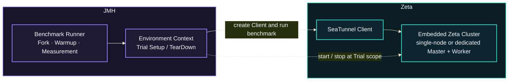

# Zeta Benchmark

This chapter explains how to run repeatable Zeta benchmarks under fixed resources and load, and how
to interpret throughput, latency, and stability without overstating the result. A comparison is
meaningful only when the code revision, JDK, machine, JVM limits, workload, and JMH configuration are
recorded and kept consistent.

The benchmarks run the current in-repository Zeta code and provide a repeatable local baseline. They
exclude real connectors, external systems, network costs, and multi-node communication, so they do
not replace a production proof of concept.

## How It Works

The `seatunnel-benchmarks` module provides these types of tests:

- `SeaTunnelRowBenchmark` measures hot paths such as row creation, access, copying, projection, and
  size calculation.
- `SeaTunnelPipelineBenchmark` starts an embedded single-node Zeta cluster and runs complete bounded
  jobs through the normal client and configuration parser APIs.
- `CheckpointingTimeBenchmark` keeps one streaming job running and measures the time required to
  complete explicitly triggered regular checkpoints.
- `CheckpointStorageBenchmark` measures checkpoint ID allocation, completed-checkpoint persistence,
  and checkpoint-overview updates after checkpoint coordination has completed.
- `IMapJobStorageBenchmark` measures task-state transitions, metrics reports, active and completed
  job growth, and running-job recovery through the production IMaps.
- `IMapDagStorageBenchmark` measures persisted `JobDAGInfo` growth and reload with controlled DAG
  sizes.
- `IMapWalStorageBenchmark` measures file-backed IMap WAL append cost, byte growth, and recovery as
  live-key count and per-key history depth change independently.

For benchmarks that require the Zeta runtime, JMH controls the forks, warmup, measurement, and Trial
lifecycle. The Environment Context creates the Client and starts embedded Zeta during Trial setup.
Setup and teardown are outside the timing; only operations performed by the `@Benchmark` method are
measured.



In `SeaTunnelPipelineBenchmark`, the Source follows an absolute open-loop schedule. Each row carries
its planned generation time. If Zeta falls behind, planned time continues to advance, so queueing
and backlog remain visible in event-time latency instead of being hidden while the Source waits for
the engine.

### Test Scope

| JMH selector | Data path and purpose |
|---|---|
| `sourceSink` | `Source -> Sink`; baseline Zeta data path. |
| `sourceTransformSink` | `Source -> Transform -> Sink`; adds row copy and deterministic Transform work. |
| `sourceTransformSinkWithObservability` | The same Transform pipeline with realtime busyness observability and a bounded async boundary enabled. |
| `sourceTransformSinkWithTrace` | The same Transform pipeline with StainTrace enabled. |
| `sourceTransformSinkWithObservabilityAndTrace` | Realtime observability and StainTrace enabled together, isolating their combined overhead. |

These scenarios compare one controlled data path while changing only Transform or observability
features. The observability scenario measures instrumentation and async-boundary overhead; it does
not artificially throttle the Sink or create backpressure. To test overload, set
`offeredRatePerSecond` above engine capacity and inspect throughput, P99, and latency growth.

### Default Resources

| Setting | Default |
|---|---:|
| JVM heap | Fixed 4 GiB `-Xms` / `-Xmx` |
| JVM-visible processors | 4 |
| Garbage collector | G1 with pre-touch |
| Zeta slots / pipeline parallelism | 12 / 4 |
| Records per invocation | 1,000,000 |
| Offered rate | 600,000 rows/s |
| Payload size | 256 characters |
| Transform work | 64 hash operations per row |
| StainTrace sampling interval | 10,000 rows |
| StainTrace file flush interval | 1 second |
| JMH forks | 3 |
| Warmup / measurement iterations | 3 / 5 |

The benchmark class passes these JVM limits to each fork. No additional heap configuration is
required at launch. With the default load and parallelism, the StainTrace interval produces about
100 sampled rows per invocation and 15 samples per second per Worker, below the default
50-sample-per-second Worker budget. The one-second flush interval keeps local trace output active
during each measured job instead of deferring file writes across several invocations.

## Run the Benchmarks

### Build the Benchmark Runner

```bash
./mvnw -Pbenchmark -pl seatunnel-benchmarks -am -DskipTests package
```

### Import the Module in IntelliJ IDEA

The module is behind the inactive `benchmark` Maven profile, so IDEA may not import it when the
root project is first opened. In the Maven tool window, expand `Profiles`, enable `benchmark`, and
click `Reload All Maven Projects`. If the module is still absent, right-click
`seatunnel-benchmarks/pom.xml`, select `Add as Maven Project`, and reload Maven once more.

List every JMH method:

```bash
java -jar seatunnel-benchmarks/target/benchmarks.jar -l
```

### Run a Complete Pipeline

For a steady-load evaluation, fix one pipeline and payload size and save standard JMH JSON. The
following command checks whether Zeta can sustain 600,000 scheduled rows per second:

```bash
java -jar seatunnel-benchmarks/target/benchmarks.jar \
  'sourceTransformSink$' \
  -p offeredRatePerSecond=600000 \
  -p parallelism=4 \
  -p payloadSize=256 \
  -p transformOperations=64 \
  -rf json \
  -rff seatunnel-benchmarks/target/zeta-pipeline-result.json
```

Change only `offeredRatePerSecond` while finding the capacity boundary. Start above expected
capacity and lower the rate until output is complete and P99 no longer grows throughout the run.
For example, use `-p offeredRatePerSecond=1000000` to start a capacity comparison above the default
load. Use `0` only to measure an unpaced throughput ceiling; without an open-loop schedule, that
mode cannot expose latency caused by queued input.

Run all five pipeline scenarios with the default workload:

```bash
java -jar seatunnel-benchmarks/target/benchmarks.jar SeaTunnelPipelineBenchmark
```

JMH accepts a class name, method name, or regular expression. For example, run all Trace methods:

```bash
java -jar seatunnel-benchmarks/target/benchmarks.jar \
  'SeaTunnelPipelineBenchmark.*Trace'
```

JMH selectors are regular expressions. Append `$` when selecting one exact method; without it,
`sourceTransformSink` also matches methods whose names start with that text.

### Run the SeaTunnelRow Microbenchmarks

```bash
java -jar seatunnel-benchmarks/target/benchmarks.jar SeaTunnelRowBenchmark \
  -rf json \
  -rff seatunnel-benchmarks/target/seatunnel-row-result.json
```

For a quick functional validation, add `-f 1 -wi 0 -i 1 -r 1s` to shorten the run. A single un-warmed
sample is not valid performance evidence.

### Run the Checkpoint Benchmark

```bash
java -jar seatunnel-benchmarks/target/benchmarks.jar CheckpointingTimeBenchmark
```

The benchmark runs both `recordSize=1b` and `recordSize=1kb`. `checkpointSingleInput` uses a
controlled input rate and equal Source/Sink parallelism. Its dedicated JMH environment starts an
isolated two-node Zeta cluster with separate master and worker roles and one streaming job per trial.
The master has no worker slots, the worker executes the pipeline, and IMap backup count is zero. A
separate checkpoint engine configuration (not the shared benchmark engine configuration) enables
the `engine*` MapStore with the HDFS file storage implementation on the local filesystem, and stores
checkpoints through the HDFS checkpoint plugin in local mode. Every invocation explicitly triggers
one regular checkpoint and waits until Zeta has persisted and completed it. The score is checkpoint
completion time in `s/op`, so lower is better. Job startup, workload ramp-up, persistence
verification, and job shutdown are outside the measured invocation.

### Run the Checkpoint Storage Benchmarks

```bash
java -jar seatunnel-benchmarks/target/benchmarks.jar CheckpointStorageBenchmark
```

`CheckpointStorageBenchmark` uses coordinator-produced checkpoint state and the production HDFS
checkpoint storage plugin over `file:///`. It contains three storage-only hot paths:

- `checkpointPersistenceTransaction` atomically allocates a checkpoint ID, serializes and stores a
  completed checkpoint, and updates its checkpoint overview;
- `checkpointIdAtomicIncrement` isolates the production checkpoint counter state store;
- `checkpointOverviewIncrementalUpdate` isolates the completed-count, latest-checkpoint, and
  checkpoint-history update.

Barrier delivery, task snapshotting, ACK waiting, fixture generation, durability validation, and
cleanup are outside measured time. Each invocation processes a fixed batch of 100 logical
operations and reports the normalized time per operation in `us/op`; lower is better.

These two isolated methods stay on the write-through IMap MapStore path
(`write-delay-seconds: 0`). Every measured operation therefore waits for one durable file-backed WAL
append. Sample-to-sample coefficient of variation is dominated by that durable sync cost and by
overview ProtoStuff serialization size; it is not a Java 8 vs Java 11 comparison signal. When
investigating high CV, profile the WAL writer and MapStore wait path before changing the benchmark
fixture.

Run one exact method when only one part of the persistence transaction is under investigation:

```bash
java -jar seatunnel-benchmarks/target/benchmarks.jar \
  'CheckpointStorageBenchmark.checkpointIdAtomicIncrement$'
```

### Run the IMap Job Storage Benchmarks

```bash
java -jar seatunnel-benchmarks/target/benchmarks.jar IMapJobStorageBenchmark
```

The class uses the same running-state, history, and metrics IMaps as Zeta. Fixture values come from
a real streaming job, while job startup and cleanup are outside measurement. Its methods cover:

- `taskGroupStateTransition`, with `storedTaskGroupCount=0|1000`;
- `runningMetricsReport`, with `taskCount=10|100|1000`;
- `runningJobGrowth` and `completedJobHistoryGrowth`, with
  `initialStoredJobCount=0|1000`;
- `runningJobRecovery`, with `runningJobCount=100|1000`.

The fixed growth and transition methods perform 100 logical operations and report normalized
`us/op`. Recovery evicts the in-memory values, calls the production `IMap.loadAll(true)` path, and
scans the restored entries. For example, run only the largest running-job recovery fixture:

```bash
java -jar seatunnel-benchmarks/target/benchmarks.jar \
  'IMapJobStorageBenchmark.runningJobRecovery$' \
  -p runningJobCount=1000
```

### Run the IMap DAG Storage Benchmarks

```bash
java -jar seatunnel-benchmarks/target/benchmarks.jar IMapDagStorageBenchmark
```

`finishedJobDagStore` writes a fixed batch of 100 unique production `JobDAGInfo` values through
the finished-job DAG IMap and its file-backed MapStore. `finishedJobDagLoad` evicts one value and
reloads it through MapStore. `pipelineCount=1|10|100` controls the exact number of code-built
source-to-sink pipelines in each DAG, and `storedDagCount=0|100` controls retained storage pressure.

```bash
java -jar seatunnel-benchmarks/target/benchmarks.jar \
  'IMapDagStorageBenchmark.finishedJobDagLoad$' \
  -p pipelineCount=100 \
  -p storedDagCount=100
```

### Run the IMap WAL Storage Benchmarks

`appendNewKey` and `appendHotKey` each perform 100 production IMap writes and report both normalized
time and the auxiliary `walBytesPerAppend` counter. `pipelineCount=1|10|100` changes the serialized
DAG payload. `recoverAll` executes `IMap.loadAll(true)` over a prebuilt WAL;
`uniqueKeyCount=100|1000` controls live values and `mutationsPerKey=1|10|100` controls obsolete
history that must be replayed.

Select an exact method for normal investigation. The `IMapWalStorageBenchmark` class selector runs
every append and recovery parameter combination and can take a long time:

```bash
java -jar seatunnel-benchmarks/target/benchmarks.jar \
  'IMapWalStorageBenchmark.appendHotKey$' \
  -p pipelineCount=10
```

WAL recovery can be expensive, especially with 1,000 keys and 100 mutations per key, so it is an
on-demand diagnostic rather than part of `benchmarks_core`. Run one controlled case explicitly:

```bash
java -jar seatunnel-benchmarks/target/benchmarks.jar \
  'IMapWalStorageBenchmark.recoverAll$' \
  -p uniqueKeyCount=1000 \
  -p mutationsPerKey=100
```

All four storage benchmark classes start an isolated single-node Zeta/Hazelcast environment with
IMap MapStore enabled, backup count `0`, and local file-backed IMap and checkpoint storage. They do
not require HDFS, S3, OSS, or another external storage service. Setup, validation, and cleanup do
not contribute to the reported score.

### Read Workflow Reports

The scheduled and manually triggered `Benchmarks` workflow runs each selected benchmark on Java 8
and Java 11. Each Java job uploads one artifact containing:

- the original `*.jmh.json`, preserving every fork and iteration sample;
- a versioned `*.report.json`, normalizing benchmark names, parameters, scores, errors, units,
  direction, commit, JVM, CPU, and runner metadata;
- `summary.md`, which is also rendered in the GitHub Actions Job Summary;
- the environment fingerprint and any full-pipeline sample JSON.

The normalized report includes median pipeline throughput, P50/P95/P99/max latency, latency growth,
completeness, and sustainable-sample counts. Raw samples and a schema version allow later tooling to
consume saved artifacts without parsing console logs. The workflow does not push results to a
repository branch.

Manual runs offer common selectors through `benchmarks`; `custom_benchmarks` accepts a class,
method, or regular expression and overrides that choice. `.*` selects all current and future
benchmarks. When `pr_number` is set, the workflow executes `baseline -> PR -> PR -> baseline` on the
same worker, compares the median of both runs for each revision, and reports a direction-adjusted
percentage where a positive value is favorable.

Absolute results remain sensitive to machine load, warmup, CPU frequency, and runner hardware.
Use GitHub-hosted results as trend and functional-check evidence. Prefer repeated baseline/change
runs on the same machine, as the PR comparison does, or use a fixed self-hosted runner for a future
regression gate.

### Diagnose an Unstable Benchmark

Use profiling only after a normal run shows an unexpected Score, Error, or CV. The diagnostic
runner keeps its report separate because profiler overhead makes its Score unsuitable for
regression comparisons. A diagnostic selector must resolve to exactly one benchmark method;
selectors such as `.*` or a class name that matches several methods are rejected.

Install the complete async-profiler distribution and set `ASYNC_PROFILER_HOME` before running CPU,
wall-clock, or lock profiling. The runner records JFR first and uses the bundled `jfrconv` to create
forward and reverse flame graphs. GC profiling and JFR capture use JMH's built-in profilers and do
not need async-profiler:

```bash
bash tools/benchmarks/profile_benchmarks.sh profile cpu --benchmark 'IntermediateQueueBenchmark.disruptorRecordHandoff$'
bash tools/benchmarks/profile_benchmarks.sh profile wall --benchmark 'IntermediateQueueBenchmark.disruptorRecordHandoff$'
bash tools/benchmarks/profile_benchmarks.sh profile lock --benchmark 'IntermediateQueueBenchmark.disruptorRecordHandoff$'
bash tools/benchmarks/profile_benchmarks.sh profile gc --benchmark 'IntermediateQueueBenchmark.disruptorRecordHandoff$'
bash tools/benchmarks/profile_benchmarks.sh capture jfr --benchmark 'IntermediateQueueBenchmark.disruptorRecordHandoff$'
```

CPU, wall-clock, and lock modes use JMH's async-profiler integration. GC mode uses JMH's GC
profiler, and `capture jfr` uses JMH's JFR profiler. The runner always uses exactly one fork so that
file-based profiler output cannot be overwritten by later forks. Warmup and measurement settings
still come from benchmark annotations unless they are overridden after `--`, for example
`-- -wi 1 -i 1 -w 1s -r 1s`. Each run gets a new default output directory; an explicit `--output`
directory must be empty to prevent stale artifacts from being mixed into the report.

The raw JMH JSON records async-profiler as `secondaryMetrics.async` with a `NaN` Score because it
produces files rather than a numeric secondary metric. This is expected. The diagnostic report
shows the collected sample count; when lock profiling observes no contention, it reports zero
samples and intentionally omits an empty flame graph.

The manual `Benchmarks Diagnostics` workflow requires one exact `benchmark` method and one
`java_version`. It is separate from the scheduled and manually triggered `Benchmarks` workflow,
which continues to run the Java 8/11 matrix. Selecting `all` runs CPU, wall-clock, lock, and GC
profiling as separate steps and uploads four independently downloadable artifacts; `capture_jfr`
adds a fifth JFR artifact. Each artifact contains only its mode's JFR recordings, flame graphs, text
summaries, JMH logs, and JSON reports. The job summary shows the target, benchmark settings,
per-mode results, and independent artifact names without repeating the full file inventory. On the
hosted Linux runner, CPU profiling uses async-profiler's `ctimer` event so it does not depend on
`perf_event` permissions.

## Metrics

### Sample Validity

Before interpreting performance, verify that:

- `processed_rows` equals `expected_rows`;
- `sourceSink` has a zero `checksum`;
- every Transform scenario has a non-zero `checksum`.

These conditions reject incomplete output and prove that Transform work reached the Sink.

### JMH Metrics

| Field | Description |
|---|---|
| `Score` | Processed rows per second for a Pipeline benchmark; higher is better. Row microbenchmarks retain `ops/ms`; checkpoint completion reports `s/op`; storage benchmarks report `us/op`. Time-per-operation scores are lower-is-better. |
| `Error` | Uncertainty calculated from samples inside this JMH run. |
| `Cnt` | Aggregated measurement samples, not processed rows. |
| `Units` | Unit of the score. |

`SeaTunnelPipelineBenchmark` declares 1,000,000 logical operations per invocation, so JMH converts
each completed job into its processed row count and reports `ops/s`. JMH timing includes job
submission, scheduling, and complete pipeline execution. It has a different measurement boundary
from the Sink-only `throughput_rows_per_second` value.

JMH `Error` does not include differences between machines. Do not use confidence interval overlap
from two different machines as a standalone regression decision.

### Pipeline Metrics

Each invocation writes one JSON file under `seatunnel-benchmarks/target/pipeline-results`:

| Field | Description |
|---|---|
| `offered_rate_rows_per_second` | Target rate scheduled by the Source; this is load, not achieved throughput. |
| `throughput_rows_per_second` | Achieved rate during the Sink's first-to-last receive interval. |
| `event_time_latency_p50_ms` | Median time from planned generation to Sink receipt. |
| `event_time_latency_p95_ms` / `event_time_latency_p99_ms` | Tail delay, including backlog when the engine cannot keep up. |
| `event_time_latency_max_ms` | Worst recorded delay; inspect it together with percentiles. |
| `first_half_p99_ms` / `second_half_p99_ms` | P99 in each half of the run, showing whether backlog keeps growing. |
| `latency_growth_ratio` | `(second-half P99 + 1) / (first-half P99 + 1)`; values above 1 indicate worsening latency. |
| `latency_percentiles_clamped` | Whether any reported percentile fell into the histogram's overflow bucket and is therefore only a lower bound. |
| `latency_overflow_rows` | Rows whose latency exceeded the histogram's tracked range. |
| `sustainable` | By default, requires complete output, no clamped percentile, P99 at most 1,000 ms, and growth ratio at most 1.20. |

`sustainable` is a convenience guardrail, not a universal service-level objective. Use the target
workload's throughput and latency requirements for the final decision.

## Evaluate the Result

Determine whether the load is stable before locating the source of a difference.

| Observation | Conclusion | Next step |
|---|---|---|
| Output is complete, throughput is close to offered rate, and first-half and second-half P99 are similar | The current load is in steady state | Increase offered rate and continue locating the capacity boundary. |
| Throughput is below offered rate and second-half P99 keeps rising | Backlog is growing and load exceeds sustainable capacity | Lower the rate, or increase resources and parallelism before retesting. |
| `sourceSink` is stable while `sourceTransformSink` is much slower | Transform work is the main incremental cost | Vary `transformOperations` and inspect Row copy and Transform hot paths. |
| The base Transform case is stable while an observability or Trace case is slower | The corresponding feature has measurable cost | Repeat with identical parameters and compare each feature separately and together. |
| Every benchmark for the same commit shifts sharply in one run | The execution host may have different CPU performance | Mark the run inconclusive, inspect the CPU fingerprint, and do not update a precise baseline. |

Find capacity with a sweep of fixed offered rates. Repeat each rate in independent JVMs on the same
otherwise-idle machine and preserve every sample. When comparing scenarios or commits, keep the JDK,
machine, payload, parallelism, offered rate, and Transform work identical.

## Visualization

Generate JMH JSON with `-rf json -rff <file>`, open
[JMH Visualizer](https://jmh.morethan.io/), and compare scores, errors, forks, and iterations by
method name and parameters.

JMH Visualizer combines parameter values into labels. For example,
`600000:4:256:64` means `offeredRatePerSecond=600000`, `parallelism=4`, `payloadSize=256`, and
`transformOperations=64`, in the order shown in the chart legend. JMH Score includes job submission,
scheduling, and complete pipeline execution. Inspect the Pipeline JSON throughput, latency, and
completeness fields before deciding whether the configured load is sustainable.

Files under `pipeline-results` are custom JSON rather than JMH JSON. Inspect them directly or use
`tools/benchmarks/save_jmh_result.py` and `tools/benchmarks/regression_report.py` to generate
normalized JSON and Markdown reports.

## Add a Benchmark

Keep cases small and focused on hot paths that run on one machine without external services. Useful
targets include `SeaTunnelRow` operations, format parsing and serialization, Transform hot paths,
connector option parsing, and split generation.

Extend `BenchmarkBase` to inherit the shared JMH mode, forks, warmup, measurement, state, and output
unit defaults. Keep benchmark-specific state and setup in the benchmark class. Full-pipeline engine
lifecycle and controls belong in `SeaTunnelEnvironmentContext` or a focused subclass so checkpoint,
failure-recovery, and metrics scenarios can be added without duplicating cluster setup.

## Performance Cost and Limitations

- A pipeline benchmark starts an embedded Zeta cluster and requires at least 4 GiB of available heap.
- A complete run uses 3 forks, 3 warmup iterations, and 5 measurement iterations. Running all five
  scenarios takes substantially longer than a shortened validation run.
- `ActiveProcessorCount=4` limits processors visible to the JVM; it does not provide operating-system
  CPU affinity.
- Precise comparisons require a fixed machine or alternating base and candidate on the same
  otherwise-idle machine.
- This benchmark excludes real connectors, external brokers, network, disk, and multi-node costs.

To measure production end-to-end performance, repeat the experiment with the required connectors and
external systems, and correlate the result with error logs, checkpoint status, and external-system
monitoring.

## References

1. Andy Georges, Dries Buytaert, and Lieven Eeckhout,
   [Statistically Rigorous Java Performance Evaluation](https://dri.es/files/oopsla07-georges.pdf),
   OOPSLA 2007.
2. Tomas Kalibera and Richard Jones,
   [Rigorous Benchmarking in Reasonable Time](https://dl.acm.org/doi/10.1145/2491894.2464160),
   ISMM 2013.
3. Jeyhun Karimov et al.,
   [Benchmarking Distributed Stream Data Processing Systems](https://arxiv.org/pdf/1802.08496),
   ICDE 2018.

## Related Documentation

- [Busyness and Backpressure](./busyness-and-backpressure.md)
- [Monitoring Metrics](./telemetry.md)
- [Tuning Guide](./tuning-guide.md)
