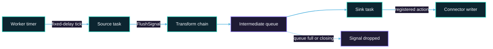

# Timer-Driven Sink Flush

Timer-driven Sink flush allows the Zeta Engine to request that a Sink writer flush buffered data
without waiting for another input record, a batch threshold, or the next checkpoint. It is intended
for low-throughput and temporarily idle streaming jobs, where buffered data might otherwise remain
in memory for an extended period.

The engine provides scheduling, signal propagation, lifecycle management, and failure propagation.
Each connector determines whether its writer can safely participate and defines the operation that
flushes its own buffers.

:::caution Delivery Semantics

Timer flush is independent of checkpoint completion and does not provide 2PC exactly-once
semantics. Current connector implementations do not enable it for checkpoint-aligned XA, 2PC, or
exactly-once writer paths.

:::

## How It Works

Without engine support, a connector can either run a background scheduler or check elapsed time
inside `write()`. A background scheduler can introduce concurrency with writes, checkpoints, and
close, while a check inside `write()` cannot run when the input is idle.

Zeta avoids these limitations by sending a `FlushSignal` through the normal data flow:



The runtime flow is:

1. Each Source task registers a fixed-delay timer when it enters the running state.
2. A timer callback creates a `FlushSignal` and sends it through the Source output while using the
   same synchronization boundary as data records and checkpoint barriers.
3. Transforms forward the signal without applying user transform logic.
4. Intermediate queues attempt to publish the signal without blocking.
5. The Sink consumes an accepted signal in stream order.
6. If the connector writer registered a flush action, the Sink invokes it from the Sink input
   processing path.

The timer callback only injects the signal. It does not run connector flush logic on the timer
thread.

## Enable Timer Flush

### Job Configuration

Configure `sink.flush.interval` in the job `env` block:

```hocon
env {
  job.mode = "STREAMING"
  sink.flush.interval = 5000
}
```

| Option | Type | Default | Description |
|---|---|---|---|
| `sink.flush.interval` | `Long` | `0` | Interval in milliseconds between timer flush signal attempts. A value greater than `0` enables scheduling in Zeta. |

The runtime does not register a timer when the value is `0` or negative. Values from `1` to `99`
milliseconds are accepted but produce a warning because a short interval can increase queue
traffic, empty flushes, and Sink I/O.

This option is effective only in Zeta. Flink and Spark do not inject `FlushSignal` records.

### Connector Support

Timer flush is opt-in for Sink connectors. Setting `sink.flush.interval` starts Source-side timers,
but a Sink flushes data only when its writer supports the feature. An unsupported Sink ignores the
signal.

Check the feature checklist on the selected Sink connector page for support status. When available,
the connector-specific timer-flush section describes its behavior and delivery semantics.

### Worker Configuration

Workers use a shared scheduled executor to inject timer signals. Its size can be configured in
`seatunnel.yaml`:

```yaml
seatunnel:
  engine:
    timer-flush-pool-size: 1
```

| Option | Type | Default | Description |
|---|---|---|---|
| `timer-flush-pool-size` | `Integer` | `1` | Number of Worker threads used to schedule and inject `FlushSignal` records. The value must be greater than `0`. |

This pool does not execute connector flush operations. Increasing its size does not make connector
flushes run in parallel.

## Ordering and Backpressure

The Source sends data records, checkpoint barriers, and flush signals through the same
synchronization boundary. An accepted signal is therefore ordered with Source output and cannot
cross a checkpoint barrier at the injection point.

Flush signals intentionally use a different backpressure policy from data and barriers:

- A `BlockingQueue` uses a non-blocking `offer()`.
- A `Disruptor` queue uses a non-blocking publish attempt.
- A full queue drops the signal instead of blocking the timer worker.
- Data records and checkpoint barriers continue to use their normal publication paths.

Consequently, timer flush is a best-effort latency mechanism. The configured interval controls
signal attempts; it does not guarantee that every Sink completes a flush at that exact cadence. If
a signal is dropped, buffered data remains available for a later timer signal, the connector's
normal batch trigger, a checkpoint, or writer close.

Scheduling uses a fixed delay rather than a fixed rate. The first signal is attempted after one
configured interval, and the next delay starts after the current callback completes. Zeta does not
issue a burst of signals to catch up after a long pause.

## Checkpoint and Delivery Semantics

Timer flush and checkpoint processing remain separate:

- A `FlushSignal` does not acknowledge or trigger a checkpoint.
- Timer flush does not replace checkpoint-driven flush, snapshot, prepare, commit, or abort.
- Timer signals and their completion are not stored in checkpoint state.
- Recovery recreates writers and restarts Source timers through the normal task lifecycle.

The engine does not inspect connector transaction settings. Each connector decides whether to
participate according to its effective writer mode.

| Writer mode | Current behavior |
|---|---|
| At-least-once writer, including a connector-managed local transaction | May support timer flush when its flush operation can be retried safely and propagates failures. |
| XA, 2PC, exactly-once, or checkpoint-aligned transactional writer | Current implementations do not enable timer flush because a timer action could violate the checkpoint transaction boundary. |
| Writer without timer flush support | Ignores `FlushSignal`. |

Timer flush can make buffered data externally visible before a checkpoint. If the task later fails,
recovery can replay records from the last successful checkpoint. A non-transactional target may
therefore receive duplicate writes. Use connector-specific idempotency features or deterministic
keys where required.

## Lifecycle and Failure Handling

- Timers start when Source tasks enter the running state.
- Normal Source close cancels its timer. Task-group cancellation and completion provide additional
  cleanup, and Worker shutdown stops the shared timer pool.
- A timer is scoped to a Source task, not to the entire job. Signal frequency and routing therefore
  follow the physical execution topology.
- When the pipeline is preparing to close, the Source, Transform, queue, and Sink stop accepting new
  timer flush work.
- If signal broadcast raises an exception, Zeta logs a warning and continues with the next
  scheduled attempt.
- Unless a Multi-Table failure policy isolates the failed table, an exception from a registered
  connector action is propagated through the task failure and recovery path.
- If a Sink has not registered an action, receiving a signal is a no-op.

Timer flush is not a job-finalization mechanism. Connector checkpoint and `close()` behavior remains
responsible for any buffered data that has not been flushed by a timer.

## Multi-Table Jobs

For a Multi-Table Sink, the Sink registers one aggregated action when at least one child writer
supports timer flush. Before invoking child actions, the Multi-Table writer waits for its internal
row queues and in-progress writes to finish. This prevents timer flush from racing with its
asynchronous writer threads.

The configured Multi-Table failure policy also applies to timer flush. `FAIL_FAST` propagates the
first child failure. A policy that continues other tables isolates the failed table and continues
flushing healthy tables.

## Monitoring

Zeta exposes timer flush counters and rates in job metrics and the Web UI:

| Metric | Meaning |
|---|---|
| `FlushSignalTotal` | Number of Source timer callbacks that completed signal broadcast. |
| `FlushSignalQPS` | Source signal generation rate. |
| `FlushSignalQueueSuccessTotal` | Number of intermediate-queue signal offers that succeeded. |
| `FlushSignalQueueFailureTotal` | Number of intermediate-queue signal offers that were dropped. |
| `FlushSignalSinkSuccessTotal` | Number of registered Sink actions that completed successfully. |
| `FlushSignalSinkFailureTotal` | Number of registered Sink actions that threw an exception. |
| `FlushSignalSinkQPS` | Rate of successfully completed Sink actions. |

These values are not expected to be equal. One Source signal can traverse multiple queues or
outputs, a queue can drop it, and an unsupported Sink does not increment Sink action metrics. In a
Multi-Table Sink, one aggregated action can flush multiple child writers while contributing one
Sink-level result.

Use queue failure counters together with the
[busyness and backpressure metrics](./busyness-and-backpressure.md). A growing queue failure count
indicates that timer signals are being dropped under load; it does not mean that data records or
checkpoint barriers were dropped.

## Tuning and Limitations

- Choose the interval based on acceptable data visibility latency and connector flush cost. Avoid
  an interval shorter than a typical Sink flush.
- Avoid intervals below `100` milliseconds. They produce a warning and can increase empty flushes,
  queue traffic, and external-system calls.
- A slow connector action runs in the Sink input path and can delay later records and checkpoint
  barriers at that Sink.
- Timer signals are best effort and are not persisted or replayed after recovery.
- Enabling `sink.flush.interval` when no Sink supports the feature creates signal traffic without
  flushing data.
- Timer flush currently works only in Zeta.

## Related Documentation

- [Job Environment Configuration](../../introduction/configuration/JobEnvConfig.md)
- [Sink Architecture](../../architecture/api-design/sink-architecture.md)
- [Checkpoint Mechanism](../../architecture/fault-tolerance/checkpoint-mechanism.md)
- [Exactly-Once Semantics](../../architecture/fault-tolerance/exactly-once.md)
- [Busyness and Backpressure](./busyness-and-backpressure.md)
- [Telemetry](./telemetry.md)
