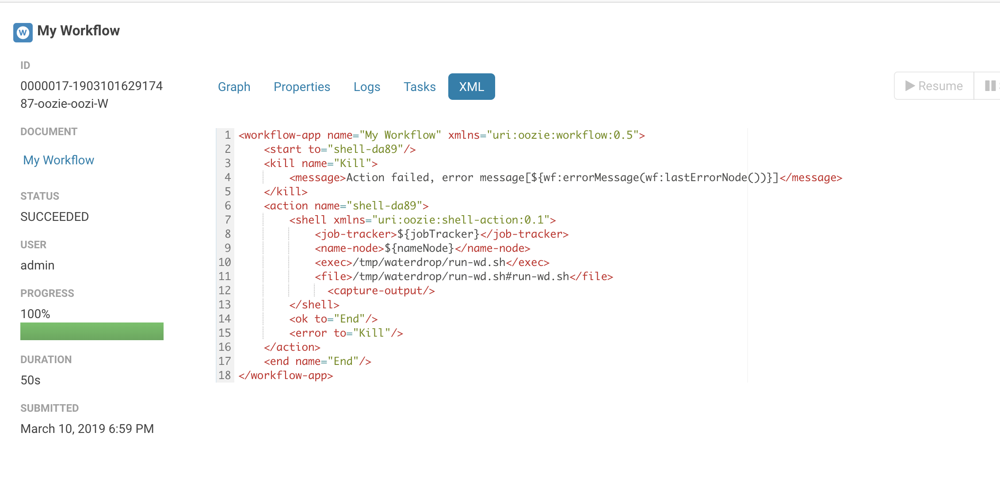
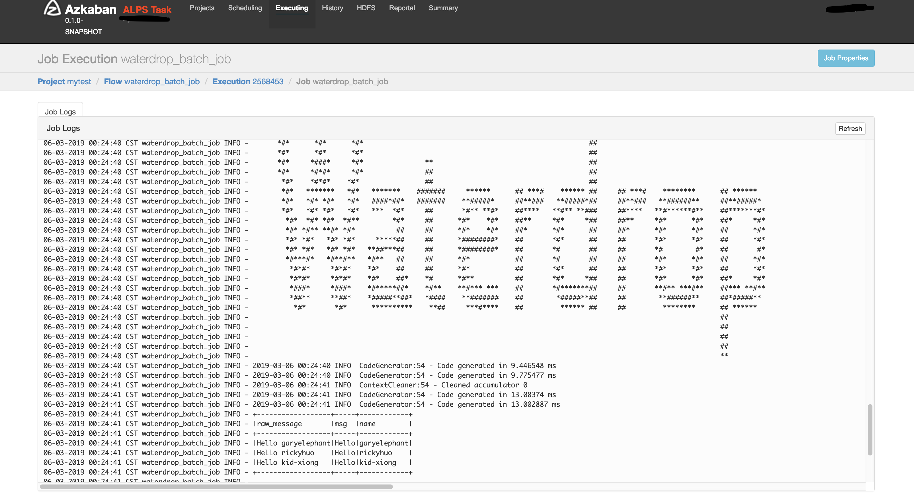

# FAQ

## Why I should install computing engine like Spark or Flink

Now SeaTunnel uses computing engines such as spark and flink to complete resource scheduling and node communication, so we can focus on the ease of use of data synchronization and the development of high-performance components. But this is only temporary.

## I have a question, but I can not solve it by myself

I encounter a problem when using SeaTunnel and I cannot solve it by myself. What should I do? Firstly search in [Issue list](https://github.com/apache/incubator-seatunnel/issues) or [mailing list](https://lists.apache.org/list.html?dev@seatunnel.apache.org) to see if someone has already asked the same question and got the answer. If you still cannot find the answer, you can contact community members for help in[ these ways](https://github.com/apache/incubator-seatunnel#contact-us) .

## how to declare variable

If you want to know how to declare a variable in SeaTunnel's configuration, and then dynamically replace the value of the variable at runtime?

Since `v1.2.4` SeaTunnel supports variables substitution in the configuration. This feature is often used for timing or non-timing offline processing to replace variables such as time and date. The usage is as follows:

Configure the variable name in the configuration, here is an example of sql transform (actually anywhere in the configuration file the value in `'key = value'` can use the variable substitution):

```
...
transform {
  sql {
    sql = "select * from user_view where city ='"${city}"' and dt = '"${date}"'"
  }
}
...
```

Taking Spark Local mode as an example, the startup command is as follows:

```bash
./bin/start-seatunnel-spark.sh \
-c ./config/your_app.conf \
-e client \
-m local[2] \
-i city=shanghai \
-i date=20190319
```

You can use the parameter `-i` or `--variable` followed with `key=value` to specify the value of the variable, where the key needs to be same as the variable name in the configuration.

## How to write a configuration item into multi-line text in the configuration file?

When a configured text is very long and you want to wrap it, you can use three double quotes to indicate it:

```
var = """
 whatever you want
"""
```

## How to implement variable substitution for multi-line text?

It is a little troublesome to do variable substitution in multi-line text, because the variable cannot be included in three double quotation marks:

```
var = """
your string 1
"""${you_var}""" your string 2"""
```

refer to: [lightbend/config#456](https://github.com/lightbend/config/issues/456)

## Is SeaTunnel supportted in Azkaban, Oozie, DolphinScheduler?

Of course, please see the screenshot below:





## Does SeaTunnel have a case of configuring multiple sources, such as configuring  elasticsearch and hdfs in source at the same time?

```
env {
	...
}

source {
  hdfs { ... }	
  elasticsearch { ... }
  jdbc {...}
}

transform {
	sql {
	 sql = """
	 	select .... from hdfs_table 
	 	join es_table 
	 	on hdfs_table.uid = es_table.uid where ..."""
	}
}

sink {
	elasticsearch { ... }
}
```

## Are there any HBase plugins?

There is hbase input plugin, download it from here: https://github.com/garyelephant/waterdrop-input-hbase

## How to use SeaTunnel to write data to Hive?

```
env {
  spark.sql.catalogImplementation = "hive"
  spark.hadoop.hive.exec.dynamic.partition = "true"
  spark.hadoop.hive.exec.dynamic.partition.mode = "nonstrict"
}

source {
  sql = "insert into ..."
}

sink {
    // The data has been written to hive through the sql source, this is just a placeholder, it does not actually work.
    stdout {
        limit = 1
    }
}
```

In addition, SeaTunnel has implemented `Hive` output plugin after `1.5.7` in `1.x` branch; in `2.x` branch, the Hive plugin of the Spark engine has been supported after version `2.0.5`: https://github.com/apache/incubator-seatunnel/issues/910.

## How does SeaTunnel write multiple instances of ClickHouse to achieve load balancing?

1. Write distributed tables directly (not recommended)

2. By adding a proxy or domain name (DNS) in front of multiple instances of ClickHouse:

   ```
   {
       output {
           clickhouse {
               host = "ck-proxy.xx.xx:8123"
               # Local table
               table = "table_name"
           }
       }
   }
   ```

3. Configure multiple instances in the configuration:

   ```
   {
       output {
           clickhouse {
               host = "ck1:8123,ck2:8123,ck3:8123"
               # Local table
               table = "table_name"
           }
       }
   }
   ```

4. Use cluster mode:

   ```
   {
       output {
           clickhouse {
               # Configure only one host
               host = "ck1:8123"
               cluster = "clickhouse_cluster_name"
               # Local table
               table = "table_name"
           }
       }
   }
   ```

## How to solve OOM when SeaTunnel consumes Kafka?

In most cases, OOM is caused by the fact that there is no rate limit for consumption. The solution is as follows:

Regarding the current limit of Spark consumption of Kafka:

1. Suppose the number of partitions of Kafka `Topic 1` you consume with KafkaStream = N.

2. Assuming that the production speed of the message producer (Producer) of `Topic 1` is K messages/second, it is required that The speed of write message to the partition is uniform.

3. Suppose that after testing, it is found that the processing capacity of Spark Executor per core per second is M per second.

The following conclusions can be drawn:

1. If you want to make spark's consumption of `Topic 1` keep up with its production speed, then you need `spark.executor.cores` * `spark.executor.instances` >= K / M

2. When data delay occurs, if you want the consumption speed not to be too fast, resulting in spark executor OOM, then you need to configure `spark.streaming.kafka.maxRatePerPartition` <= (`spark.executor.cores` * `spark.executor.instances`) * M / N

3. In general, both M and N are determined, and the conclusion can be drawn from 2: The size of `spark.streaming.kafka.maxRatePerPartition` is positively correlated with the size of `spark.executor.cores` * `spark.executor.instances`, and it can be increased while increasing the resource `maxRatePerPartition` to speed up consumption.


## How to solve the Error `Exception in thread "main" java.lang.NoSuchFieldError: INSTANCE`?

The reason is that the version of httpclient.jar that comes with the CDH version of Spark is lower, and The httpclient version where ClickHouse JDBC is based on is 4.5.2, and the package version conflicts. The solution is to replace the jar package that comes with CDH with httpclient-4.5.2 version.

## The default JDK of my Spark cluster is JDK7. After I install JDK8, how can I specify the SeaTunnel starts with JDK8?

In SeaTunnel's config file, specify the following configuration:

```shell
spark {
 ...
 spark.executorEnv.JAVA_HOME="/your/java_8_home/directory"
 spark.yarn.appMasterEnv.JAVA_HOME="/your/java_8_home/directory"
 ...
}
```

## How to specify a different JDK version for SeaTunnel on Yarn?

For example, if you want to set the JDK version to JDK8, there are two cases:

- The Yarn cluster has deployed JDK8, but the default JDK is not JDK8. you should only add 2 configurations to the SeaTunnel config file:

    ```
      env {
     ...
     spark.executorEnv.JAVA_HOME="/your/java_8_home/directory"
     spark.yarn.appMasterEnv.JAVA_HOME="/your/java_8_home/directory"
     ...
    }
  ```

- Yarn cluster does not deploy JDK8. At this time, when you start SeaTunnel attached with JDK8.For detailed operations, see the link below:
  https://www.cnblogs.com/jasondan/p/spark-specific-jdk-version.html

## What should I do if OOM always appears when running SeaTunnel in Spark local[*] mode?

If you run in local mode, you need to modify the start-seatunnel.sh startup script after  spark-submit, add a parameter `--driver-memory 4g` . Under normal circumstances, the local mode is not used in the production environment. Therefore, this parameter generally does not need to be set during On Yarn. See: [Application Properties](https://spark.apache.org/docs/latest/configuration.html#application-properties) for details .

## Where can the self-written plugins or third-party jdbc.jar be placed to be loaded by SeaTunnel?

Place the Jar package under the specified structure of the plugins directory:

```bash
cd SeaTunnel
mkdir -p plugins/my_plugins/lib
cp third-part.jar plugins/my_plugins/lib
```

`my_plugins` can be any string.

## How to configure logging related parameters in SeaTunnel-v1(Spark)?

There are 3 ways to configure Logging related parameters (such as Log Level):

- [Not recommended] Change the default `$SPARK_HOME/conf/log4j.properties`
   - This will affect all programs submitted via `$SPARK_HOME/bin/spark-submit`
- [Not recommended] Modify logging related parameters directly in the Spark code of SeaTunnel
   - This is equivalent to writing dead, and each change needs to be recompiled
- [Recommended] Use the following methods to change the logging configuration in the SeaTunnel configuration file(It only takes effect after SeaTunnel >= 1.5.5 ):

    ```
    env {
        spark.driver.extraJavaOptions = "-Dlog4j.configuration=file:<file path>/log4j.properties"
        spark.executor.extraJavaOptions = "-Dlog4j.configuration=file:<file path>/log4j.properties"
    }
    source {
      ...
    }
    transform {
     ...
    }
    sink {
      ...
    }
    ```

The contents of the log4j configuration file for reference are as follows:

```
$ cat log4j.properties
log4j.rootLogger=ERROR, console

# set the log level for these components
log4j.logger.org=ERROR
log4j.logger.org.apache.spark=ERROR
log4j.logger.org.spark-project=ERROR
log4j.logger.org.apache.hadoop=ERROR
log4j.logger.io.netty=ERROR
log4j.logger.org.apache.zookeeper=ERROR

# add a ConsoleAppender to the logger stdout to write to the console
log4j.appender.console=org.apache.log4j.ConsoleAppender
log4j.appender.console.layout=org.apache.log4j.PatternLayout
# use a simple message format
log4j.appender.console.layout.ConversionPattern=%d{yyyy-MM-dd HH:mm:ss} %-5p %c{1}:%L - %m%n
```

How to configure logging related parameters in SeaTunnel-v2(Spark, Flink)?

Currently, it cannot be set directly. The user needs to modify the SeaTunnel startup script.The relevant parameters are specified in the task submission command. For specific parameters, please refer to the official document:

- Spark official documentation: http://spark.apache.org/docs/latest/configuration.html#configuring-logging
- Flink official documentation: https://ci.apache.org/projects/flink/flink-docs-stable/monitoring/logging.html

Reference:

https://stackoverflow.com/questions/27781187/how-to-stop-info-messages-displaying-on-spark-console

http://spark.apache.org/docs/latest/configuration.html#configuring-logging

https://medium.com/@iacomini.riccardo/spark-logging-configuration-in-yarn-faf5ba5fdb01

https://stackoverflow.com/questions/27781187/how-to-stop-info-messages-displaying-on-spark-console

## Error when writing to ClickHouse: ClassCastException

In SeaTunnel, the data type will not be actively converted. After the Input reads the data, the corresponding

Schema. When writing ClickHouse, the field type needs to be strictly matched, and the mismatch needs to be done.

Data conversion, data conversion can be achieved through the following two plug-ins:

1. Filter Convert plugin
2. Filter Sql plugin

Detailed data type conversion reference: [ClickHouse Data Type Check List](https://interestinglab.github.io/seatunnel-docs/#/en/configuration/output-plugins/Clickhouse?id=clickhouse-data-type-check-list)

Refer to issue:[#488](https://github.com/apache/incubator-seatunnel/issues/488) [#382](https://github.com/apache/incubator-seatunnel/issues/382)

## How does SeaTunnel access kerberos-authenticated HDFS, YARN, Hive and other resources?

Please refer to: [#590](https://github.com/apache/incubator-seatunnel/issues/590)

## How to troubleshoot NoClassDefFoundError, ClassNotFoundException and other issues?

There is a high probability that there are multiple different versions of the corresponding Jar package class loaded in the Java classpath, because of the conflict of the load order, instead of really missing this Jar, please modify this SeaTunnel startup command, add the following parameters to the spark-submit submission place, and debug in detail through the output log.

```
spark-submit --verbose
    ...
   --conf 'spark.driver.extraJavaOptions=-verbose:class'
   --conf 'spark.executor.extraJavaOptions=-verbose:class'
    ...
```

## How to use SeaTunnel to synchronize data across HDFS clusters?

Just configure hdfs-site.xml properly, refer to: https://www.cnblogs.com/suanec/p/7828139.html

There is an article on how to modify the spark code to complete the configuration(SeaTunnel does not need to do this): https://www.jianshu.com/p/3e84c4c97610

## I want to learn the source code of SeaTunnel, where should I start?

SeaTunnel has a completely abstract and structured code implementation, and many people have chosen  SeaTunnel As a way to learn Spark, you can learn the source code from the main program entry: [Seatunnel.java](https://github.com/apache/incubator-seatunnel/blob/72b57b22688f17376fe7e5cf522b4bdd3f62cce0/seatunnel-core/seatunnel-core-base/src/main/java/org/apache/seatunnel/Seatunnel.java)

## When SeaTunnel developers develop their own plugins, do they need to understand the SeaTunnel code? Should these code integrated into the SeaTunnel project?

The plug-in developed by the developer has nothing to do with the SeaTunnel project and does not need to write your plug-in code

The plugin can be completely independent with SeaTunnel project, in which you can use java,

Scala, maven, sbt, gradle, whatever you want. This is also the way we recommend developers to develop plugins.

## Import project, compiler has exception "class not found `org.apache.seatunnel.shade.com.typesafe.config.Config`"

Run `mvn install` first.

Because in the `seatunnel-config/seatunnel-config-base` subproject, package `com.typesafe.config` has been relocated to `org.apache.seatunnel.shade.com.typesafe.config` and install to maven local repository in subproject `seatunnel-config/seatunnel-config-shade` .
