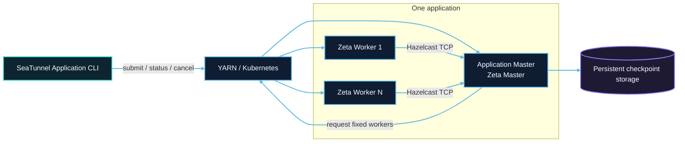
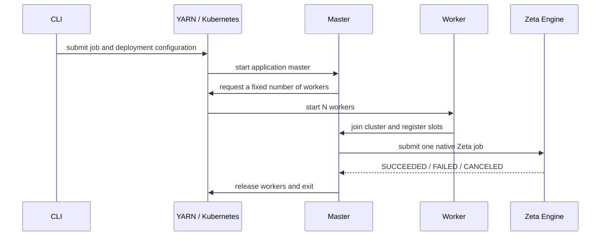
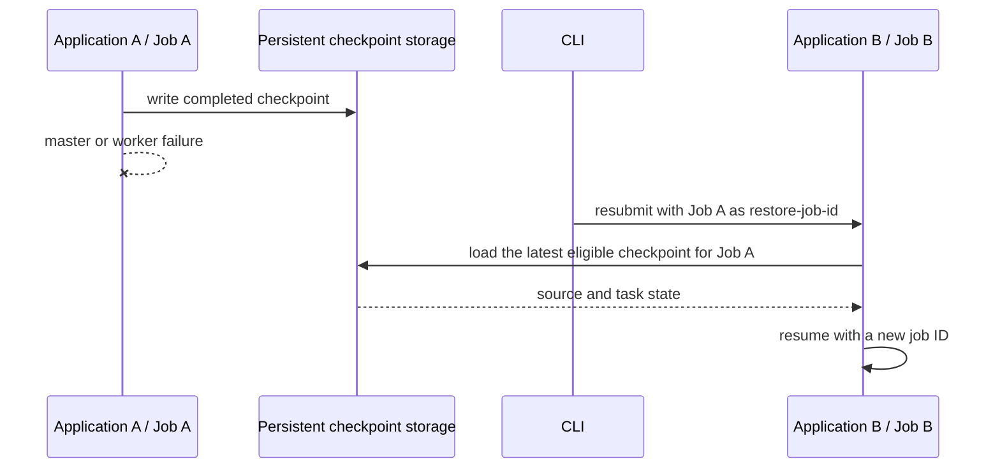

# Application Mode architecture overview

Application Mode creates an independent Zeta cluster for one SeaTunnel job. The platform starts and reclaims processes. Zeta continues to own worker registration, slot scheduling, task execution, and checkpoints.

## Roles and responsibilities

| Role | Responsibility |
| --- | --- |
| Submission client | Read job and deployment configuration; submit, inspect, or cancel an application |
| Resource platform | Start master and workers, record application state, and reclaim compute resources |
| Master | Create an isolated Zeta cluster, request workers, submit one job, and coordinate cleanup |
| Worker | Provide fixed slots and execute source, transform, and sink task groups |
| Checkpoint storage | Preserve job state required for recovery outside application processes |

One master can coordinate multiple workers. Fixed slot capacity is `application.worker-count × application.worker.slots`; effective parallelism also depends on the job topology.

Both platforms use separate master and worker entrypoints: YARN uses `SeatunnelYarnApplicationCli` and `SeatunnelYarnApplicationWorker`; Kubernetes uses `SeatunnelKubernetesApplicationCli` and `SeatunnelKubernetesApplicationWorker`. The worker entrypoint applies the cluster name, master address and fixed slot count, then calls `SeaTunnelServerStarter.createHazelcastInstance` with the prepared configuration. YARN also uses the master's distribution root to resolve jars in each worker's localized directory. Worker startup does not initialize a platform client or own application-wide cleanup. `SeaTunnelServerStarter.main` remains the ordinary configuration-driven server entrypoint. Workers use Hazelcast's shutdown hook for process termination. The application lifecycle and platform drivers own worker release. Kubernetes workers also register a Hazelcast membership listener that exits the worker when the non-lite master member leaves, so an unclean master exit cannot leave workers holding reservations until Job retention expiry.

Application configuration is split at submission: `SeatunnelApplicationConfig.load(path, overrides)` reads the optional application file, merges overrides and resolves substitutions; `SeatunnelApplicationConfig.parse(jobPath, options)` reads the separate job file and builds a typed, immutable `ApplicationSpecification`. CLI and Java callers share these methods. `YarnApplicationConfiguration` and `KubernetesApplicationParameters` own platform settings. The specification has no raw options map, platform type or file I/O. Localized configuration uses `format.version=V1` and includes only application fields and required platform runtime settings, not submitter-local archive paths or kubeconfig. Master entrypoints construct their drivers directly; no driver factory SPI is needed.

The `-a application.config` file is read only on the submission machine. Submission generates `application.properties`: YARN uploads it to `<yarn.staging-dir>/<applicationId>/application.properties` and localizes it into the container working directory; Kubernetes stores it in the application Secret and mounts it at `/etc/seatunnel-application/application.properties`. The platform Master CLI reads that file and passes the typed objects to the runner/resource manager/driver. These components and the worker entrypoints do not search for the original `application.config` file.

## Runtime flow

The concrete `ResourceManagerFactory` selects `StandaloneResourceManager` or `ApplicationResourceManager`. There are no YARN/Kubernetes-specific Engine manager subclasses or manager factories. Platform master CLIs construct the specification and driver outside Engine, capture them with the application ID and deployment type in the unified factory, and pass only that factory through native member creation. The coordinator passes its NodeEngine and EngineConfig to the factory to create the selected manager and publishes it only after successful initialization. Each concrete manager owns its initialization; the application manager invokes its injected driver directly.

The driver is initialized with a `ResourceEventHandler<WorkerType>`, a single-threaded `ScheduledExecutorService`, an IO executor, and a master-address supplier. There is no `ResourceManagerContext`, event object hierarchy, or event-type registry. The handler exposes only `onWorkerTerminated(WorkerType, String)` and `onError(Throwable)`; previous-attempt recovery and blocked-node policies are not part of this implementation. Drivers dispatch callbacks through the supplied main-thread executor and use the IO executor for asynchronous platform work. The manager owns both executors and closes them after the driver has stopped its tasks and closed its SDK clients. The address supplier reads the bound endpoint from `NodeEngine` when needed. Drivers do not report YARN exit code 0, Kubernetes `Succeeded` Pods, or intentional release as failures. Membership departure only unregisters the worker; the platform reports whether its exit was abnormal. Abnormal exits still fail the application without worker replacement. The manager retains the first unexpected failure and ignores callbacks after cleanup starts. Application identity, cluster name and deployment settings remain constructor inputs to the platform driver.

The application runtime has no separate `ApplicationClusterEntrypoint`. The platform CLI creates the configured member through `SeaTunnelServerStarter.createHazelcastInstance`, invokes `new ApplicationJobRunner(server, specification).run()`, and owns master shutdown. The shared `ApplicationJobRunner` and `ApplicationJobExecutionEnvironment` live in engine-server's `application` package. `ApplicationJobExecutionEnvironment` extends `AbstractJobEnvironment` like `ClientJobExecutionEnvironment`: it parses the job, builds the DAG and submits locally, returning a `CompletableFuture<JobResult>`. It does not wait for workers or clean up the cluster, and does not create a client connection to itself.

`ApplicationResourceManager` owns driver initialization, the bounded worker-readiness wait, asynchronous resource failures, worker release, terminal application state and driver closure. `ApplicationJobRunner` waits for resources, executes the job, and signals cancellation on interruption or resource failure. The execution environment applies that signal after submission acknowledgement so a late submission cannot escape cancellation. Canceling the result future alone does not cancel the job. The runner waits for job termination (bounded during cancellation), then asks the resource manager to finish. The platform CLI finally shuts down the master. Cleanup failures are retained with the original failure; a cancellation timeout produces a failed application.

The resource-manager core module has been removed. Deployment options belong to engine-common's `config.server` package and configuration preparation to its `config` package; immutable application/worker specifications belong to its `config.spec` package. Deployment/client contracts belong to engine-client, and runtime resource ownership belongs to engine-server.

The submission side constructs `ApplicationClusterDeployer` with a deployment type, an `ApplicationSpecification` and platform options, then calls `run()`. The loader discovers a unique platform factory; the deployer creates and closes its `ClusterDescriptor<ID>` and returns the native application ID (Hadoop `ApplicationId` for YARN, a `String` Job name for Kubernetes). Platform factories also parse the CLI's textual `--id`. The descriptor's `getApplicationStatus` and `cancelApplication` use platform APIs without connecting to the master or requiring a Zeta job ID.

`retrieve(applicationId)` discovers the running master's connection settings and returns a non-generic `SeatunnelClientProvider`, without opening an Engine connection. Each `provider.getClusterClient()` call creates a new `SeaTunnelClient` for native job operations. Creation requires network access to a live master; it cannot connect after the application has finished. The deployment contracts live in `engine-client`; engine-common does not depend on the client. Deployment, CLI status (including `--wait`) and cancellation do not require an Engine connection. The caller closes every created client independently of the descriptor; closing either releases only its own connections, without canceling the application. The shared runtime keeps the platform ID as plain text, without a custom ID wrapper.

There is no `ApplicationResult` response wrapper. Status queries return `ApplicationStatus` directly. The in-cluster execution entrypoint returns normally on success and throws on execution or reportable cleanup failure; platform entrypoints map failure to a nonzero process exit code. The resource-manager driver still publishes the final platform status and diagnostics.

Closing the CLI does not cancel the remote application. Cancellation is explicit, which allows detached submission followed by status or cancellation using the application ID.

## Failure and recovery

This release has one master and sets `backup-count=0`. Losing the master or an abnormal worker termination fails the current application; normal worker completion does not itself report an application failure. There is no automatic takeover or worker replacement inside that application.

Persistent checkpoints and live HA are different capabilities. A job can write checkpoints to HDFS, OSS, S3, COS, or a Kubernetes persistent volume. After a failure, create a new application with the historical Zeta job ID. The new master loads the latest eligible checkpoint and restores source and task state.

Storage must survive both applications. A YARN checkpoint directory must be outside staging. A Kubernetes PVC is caller-owned and is not deleted by the application. See the platform recovery guides for exact steps.

## Platform differences

| Resource | YARN | Kubernetes |
| --- | --- | --- |
| Master | ApplicationMaster container | Kubernetes Job Pod |
| Worker | YARN container | Worker Pod |
| Runtime files | Distribution localized from a shared filesystem | One image shared by master and workers |
| State | YARN application state | Kubernetes Job condition |
| Cleanup | Release containers and remove staging | Delete worker Pods and application resources |

Continue with [YARN Application Mode](yarn/overview.md) or [Kubernetes Application Mode](kubernetes/overview.md).
