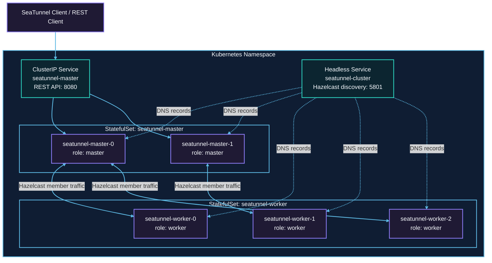

# Kubernetes Deployment

This guide explains how to deploy SeaTunnel Zeta Engine on Kubernetes. SeaTunnel supports local mode, hybrid cluster mode, and separated cluster mode. For production environments, use separated cluster mode and deploy both Master and Worker with StatefulSet.

## Deployment Modes

| Mode | Kubernetes workload | Use case | Production recommendation |
| --- | --- | --- | --- |
| [Local Mode](local-mode.md) | Pod or Job | Local verification, demos, temporary jobs | Not recommended as a long-running cluster |
| [Hybrid Cluster Mode](hybrid-cluster-mode.md) | StatefulSet | Small clusters where Master and Worker run in the same process | Supported for simple scenarios, but not the first choice |
| [Separated Cluster Mode](separated-cluster-mode.md) | Master StatefulSet + Worker StatefulSet | Production clusters, stable scheduling, independent scaling | Recommended |

## Why StatefulSet Is Recommended for Cluster Mode

In Zeta cluster mode, both Master and Worker should be deployed with StatefulSet. Deployment is not recommended for cluster members.

StatefulSet provides stable Pod names, stable network identities, and ordered rolling updates. Master nodes handle leader election, job scheduling, REST API, and IMap state management, so stable Pod identity helps member discovery and failure recovery. Worker nodes do not store IMap data in separated cluster mode, but they still provide the execution slots required by running jobs. If Deployment is used, rolling updates, eviction, or rescheduling may terminate multiple Worker Pods at the same time. Available slots can drop suddenly, causing scheduling, failover, or cluster stability issues.

The recommended production topology is shown below. This follows the Kubernetes StatefulSet model: StatefulSet manages ordered Pods, while the Headless Service provides Pod network identity and the stable Service target used by Hazelcast member discovery.



Here, `seatunnel-cluster` is a Headless Service used only for Hazelcast member discovery. `seatunnel-master` is a regular ClusterIP Service used to expose the Master REST API.

## Prerequisites

Before deployment, prepare:

- A Kubernetes cluster.
- A client environment that can run `kubectl`.
- A SeaTunnel image, for example `seatunnel:3.0.0`.
- An image registry reachable by the cluster. Configure `imagePullSecrets` for private images.
- Shared storage or object storage for checkpoint and IMap MapStore in production.

For example, start a local Minikube cluster:

```bash
minikube start --kubernetes-version=v1.23.3
```

## Image Recommendation

For production environments, pin the SeaTunnel image tag and build commonly used connectors, dependencies, and base configuration into the image. This avoids uncertainty caused by downloading dependencies at runtime.

```Dockerfile
FROM eclipse-temurin:11-jdk

ARG SEATUNNEL_VERSION
ENV SEATUNNEL_HOME="/opt/seatunnel"

RUN wget https://dlcdn.apache.org/seatunnel/${SEATUNNEL_VERSION}/apache-seatunnel-${SEATUNNEL_VERSION}-bin.tar.gz
RUN tar -xzvf apache-seatunnel-${SEATUNNEL_VERSION}-bin.tar.gz
RUN mv apache-seatunnel-${SEATUNNEL_VERSION} ${SEATUNNEL_HOME}
RUN mkdir -p ${SEATUNNEL_HOME}/logs
RUN cd ${SEATUNNEL_HOME} && sh bin/install-plugin.sh ${SEATUNNEL_VERSION}
```

Build and load the image:

```bash
SEATUNNEL_VERSION=your-release-version
docker build --build-arg SEATUNNEL_VERSION=${SEATUNNEL_VERSION} -t seatunnel:${SEATUNNEL_VERSION} -f Dockerfile .
minikube image load seatunnel:${SEATUNNEL_VERSION}
```

Replace `your-release-version` with an available Apache SeaTunnel release version.

In production clusters, push the image to a registry reachable by Kubernetes nodes.

## Managed Kubernetes Notes

The examples can be adapted to managed Kubernetes services such as Amazon EKS, Google Kubernetes Engine, Azure Kubernetes Service, Alibaba Cloud ACK, Tencent TKE, Huawei Cloud CCE, Volcengine VKE, and Red Hat OpenShift. Before production rollout, verify:

| Area | What to verify |
| --- | --- |
| Image registry | SeaTunnel images and plugin images must be pullable by the cluster. Configure `imagePullSecrets` for private images. |
| Namespace and access | Use a dedicated namespace and configure ServiceAccount, Role, and RoleBinding as needed. |
| Network discovery | Hazelcast Kubernetes discovery depends on the Headless Service. For API discovery, `namespace`, `service-name`, and `service-port` in `hazelcast*.yaml` must match the Service. For DNS discovery, `service-dns` must point to the same Headless Service. |
| Config and secrets | Store non-sensitive config in ConfigMap. Mount passwords, access keys, tokens, and other secrets through Secret or a cloud secret service. |
| Checkpoint and state storage | Multi-node clusters must use shared storage or object storage so state can be recovered after any Pod is recreated. |
| Scheduling | Plan Worker requests, limits, slots, and job parallelism together. When cluster autoscaling is enabled, Worker requests must be large enough to trigger scale-out. |
| Observability | Integrate logs and metrics with the cluster monitoring stack and retain SeaTunnel engine logs. |

## Next Steps

- For a quick trial, see [Local Mode](local-mode.md).
- For a small cluster, see [Hybrid Cluster Mode](hybrid-cluster-mode.md).
- For production deployment, start with [Separated Cluster Mode](separated-cluster-mode.md).
- For configuration details, see [Kubernetes Configuration](configuration.md).
- For operations, see [Kubernetes Operations](operations.md).
