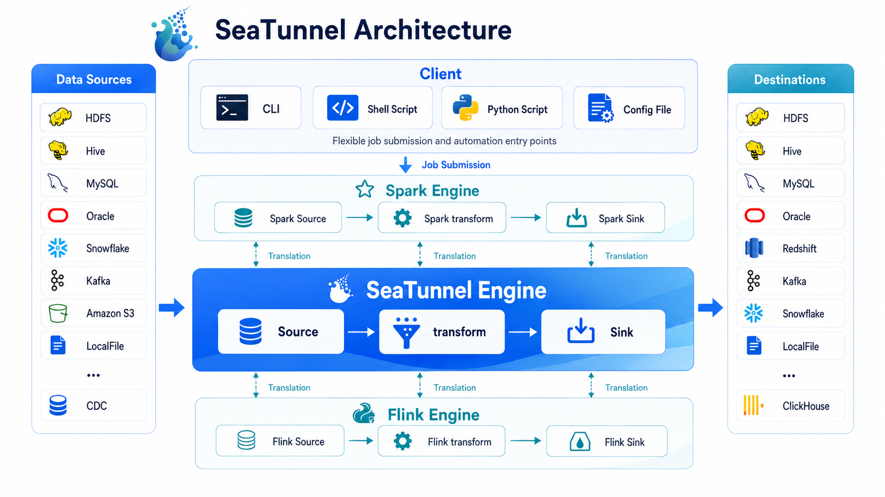

# About SeaTunnel

SeaTunnel is a multimodal, high-performance, distributed data integration platform.
It helps teams move and synchronize data across databases, files, data lakes, and streaming systems with one unified job model.

## Start Here

If this is your first time using SeaTunnel, follow this reading path:

1. [Deployment](../getting-started/locally/deployment.md): install the binary package and the plugins you need.
2. [Quick Start With SeaTunnel Engine](../getting-started/locally/quick-start-seatunnel-engine.md): run your first job with the default engine.
3. [Intro To Config File](concepts/config.md): understand the four sections every job is built from.
4. [Engine Overview](../engines/overview.md): decide whether to stay with SeaTunnel Engine or run on Flink or Spark.

If you already operate Flink or Spark clusters, you can also jump directly to
[Quick Start With Flink](../getting-started/locally/quick-start-flink.md) or
[Quick Start With Spark](../getting-started/locally/quick-start-spark.md).

## What SeaTunnel Helps You Do

SeaTunnel is designed for the jobs data teams usually need to deliver first:

* **Move data between many systems**: databases, message queues, data lakes, file systems, cloud storage, and SaaS systems.
* **Handle both batch and streaming workloads**: one connector model can serve full loads, incremental loads, CDC, and real-time synchronization.
* **Keep job definitions understandable**: a SeaTunnel job is still just `env`, `source`, `transform`, and `sink`.
* **Reduce operational cost**: SeaTunnel focuses on high throughput, lower dependency overhead, and practical observability.

## Why Teams Choose SeaTunnel

* **Connector-first design**: SeaTunnel provides a unified Connector API, so Source, Transform, and Sink plugins can be reused across engines.
* **Flexible engine choice**: start with SeaTunnel Engine (Zeta), or run on Flink or Spark when that better fits your environment.
* **Built for data synchronization**: multi-table sync, CDC scenarios, and large-scale job execution are first-class use cases.
* **Operational visibility**: jobs expose runtime metrics and task information that help you understand throughput and stability.
* **Room to grow**: teams can begin with a single local job and later move to larger clusters and more advanced deployments.

## Understand SeaTunnel In One Picture

You can understand the runtime flow in three ideas:

### 1. A SeaTunnel job is a pipeline

You describe the job in a config file, then SeaTunnel runs a pipeline from **Source** to **Transform** to **Sink**.

### 2. Connectors define what you read and write

SeaTunnel supports a broad set of [source connectors](../connectors/source),
[sink connectors](../connectors/sink), and [transforms](../transforms).
If you need custom behavior, you can also extend these plugin types.

### 3. The engine defines where the job runs

[SeaTunnel Engine (Zeta)](../engines/zeta/about.md) is the default choice and the recommended starting point for most new users.
If you already rely on Flink or Spark, SeaTunnel can submit the same connector-based job model there as well.

## Choose An Engine

| Engine | Best starting point | When to use it |
| --- | --- | --- |
| [SeaTunnel Engine (Zeta)](../engines/zeta/about.md) | Recommended for most new users | You want the simplest path to run SeaTunnel jobs end to end |
| [Apache Flink](../engines/flink.md) | Good for existing Flink users | You already operate Flink and want SeaTunnel to fit that platform |
| [Apache Spark](../engines/spark.md) | Good for existing Spark users | You already run Spark for batch workloads and want to reuse that stack |

## Continue Learning

* [How SeaTunnel Works](architecture.md): learn the runtime model without diving into deep internals.
* [Intro To Config File](concepts/config.md): understand how to write real jobs.
* [Connector documentation](../connectors/source): choose the systems you want to read from and write to.
* [System architecture](../architecture/overview.md): dive into the deeper runtime design when you need it.

## Get Help And Join The Community

* [Frequently Asked Questions](../faq.md)
* [Slack](https://s.apache.org/seatunnel-slack)
* [Users](https://seatunnel.apache.org/user)
* [GitHub](https://github.com/apache/seatunnel)
