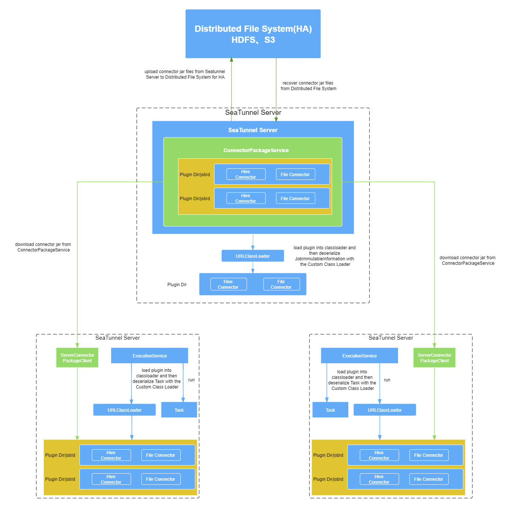
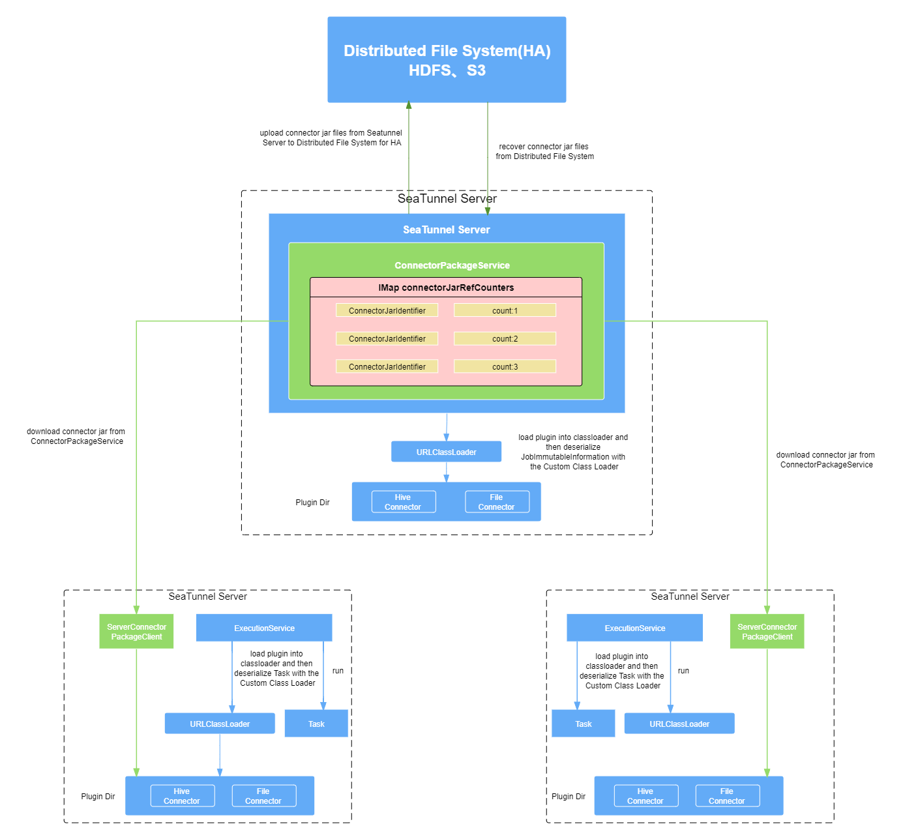

---

sidebar_position: 8
-------------------

# Optimize Apache SeaTunnel Zeta job submission

we need to optimize the logic of Zeta engine execution jobs. The server should only have the core jar package of the engine, and all connector packages are on the client side. When submitting a job,
the client side should upload the required jar packages to the server instead of just retaining the path to the jar package. When the server executes a job, it loads the jar package required for the job.
After the job is completed, the jar package is deleted.

# ConnectorJar File Type

The ConnectorPackageClient client exists on each TaskExecutor and is used for uploading and downloading Jar packages. Through ConnectorPackageClient, you can download the connector's jar package, the jar package that the connector depends on, and the user's jar and other files from the service executed by JobMaster, and store the contents of the Jar file in the local disk. All Jar package files can be roughly divided into Two types:

- COMMON_PLUGIN_JARS
- CONNECTOR_PLUGIN_JARS

The jar package of the connector specified by the user in the configuration file of the submitted job and the jar package that the connector depends on can be regarded as temporarily stored files. The life cycle of the jar package is the same as the entire task submitted to Zeta for execution.

# ConnectorJar storage strategy

Users can configure the storage strategy of the current connector Jar package and the third-party Jar package that the connector depends on through the configuration file. There are two storage strategies that can be configured, namely shared Jar package storage strategy and isolated Jar package storage strategy. Two different storage strategies provide a more flexible storage mode for Jar files. Users can configure the storage strategy to share the same Jar package file with multiple execution jobs in the engine.

## Related configuration

|             paramemter              | default value |                                                                      describe                                                                      |
|-------------------------------------|---------------|----------------------------------------------------------------------------------------------------------------------------------------------------|
| connector-jar-storage-enable        | false         | Whether to enable uploading the connector Jar package to the engine. The default enabled state is false.                                           |
| connector-jar-storage-mode          | SHARED        | Engine-side Jar package storage mode selection. There are two optional modes, SHARED and ISOLATED. The default Jar package storage mode is SHARED. |
| connector-jar-storage-path          | " "           | User-defined Jar package storage path.                                                                                                             |
| connector-jar-cleanup-task-interval | 3600s         | Engine-side Jar package cleaning scheduled task execution interval.                                                                                |
| connector-jar-expiry-time           | 600s          | Engine-side Jar package storage expiration time.                                                                                                   |

## IsolatedConnectorJarStorageStrategy



Before the job is submitted, the connector Jar package will be uploaded to an independent file storage path on the Master node.
The connector Jar packages of different jobs are in different storage paths, so the connector Jar packages of different jobs are isolated from each other.
The Jar package files required for the execution of a job have no influence on other jobs. When the current job execution ends, the Jar package file in the storage path generated based on the JobId will be deleted.

Configuration parameter example:

```yaml
jar-storage:
   connector-jar-storage-enable: true
   connector-jar-storage-mode: ISOLATED
   connector-jar-storage-path: ""
   connector-jar-cleanup-task-interval: 3600
   connector-jar-expiry-time: 600
```

Detailed explanation of configuration parameters:
- connector-jar-storage-enable: Enable uploading the connector Jar package before executing the job.
- connector-jar-storage-mode: Connector Jar package storage mode, two storage modes are available: shared mode (SHARED) and isolation mode (ISOLATED).
- connector-jar-storage-path: The local storage path of the user-defined connector Jar package on the Zeta engine.
- connector-jar-cleanup-task-interval: Zeta engine connector Jar package scheduled cleanup task interval, the default is 3600 seconds.
- connector-jar-expiry-time: The expiration time of the connector Jar package. The default is 600 seconds.

## SharedConnectorJarStorageStrategy



Before the job is submitted, the connector Jar package will be uploaded to the Master node.
First, it will be judged whether there is a current Jar package locally on the current Master node.
If other jobs have already uploaded the current Jar package, then only the current Jar package needs to be unique.
The value of RefCount associated with the identifier can be incremented.
There is no need to persist the current Jar package file to the Master node for storage,
because different jobs can share it on the Master node if they use the same Jar package file.
All Jar package files are persisted to a shared file storage path,
and Jar packages that reference the Master node can be shared between different jobs.
Under the SharedConnectorJarStorageStrategy storage strategy, the reference counts of all Jar packages are stored in hazelcast's Imap.
The key in the Map data structure is the unique identifier of the Jar package, and the value is the count of current Jar references.
What is different from IsolatedConnectorJarStorageStrategy is that all jobs under the current strategy share Jar package policies.
Therefore, if a job is executed, all its associated Jar package files cannot be deleted directly.
Instead, the refCount of the hazelcast Imap type needs to be referenced and modified.
Each Jar package stored in the Master node will be reference counted in refCount,
and all entries in the current refCount will be traversed.
It is necessary to decrement the reference count of all entries in refCount of all Jar package files required for current job execution.
SharedConnectorJarStorageStrategy will start a daemon thread for Jar cleaning work.
The configuration in the following configuration file sets the running time of the cleaning work and the survival time of the Jar package.

Configuration parameter example:

```yaml
jar-storage:
   connector-jar-storage-enable：true
   connector-jar-storage-mode: SHARED
   connector-jar-storage-path: ""
   connector-jar-cleanup-task-interval: 3600
   connector-jar-expiry-time: 600
```

Detailed explanation of configuration parameters:
- connector-jar-storage-enable: Enable uploading the connector Jar package before executing the job.
- connector-jar-storage-mode: Connector Jar package storage mode, two storage modes are available: shared mode (SHARED) and isolation mode (ISOLATED).
- connector-jar-storage-path: The local storage path of the user-defined connector Jar package on the Zeta engine.
- connector-jar-cleanup-task-interval: Zeta engine connector Jar package scheduled cleanup task interval, the default is 3600 seconds.
- connector-jar-expiry-time: The expiration time of the connector Jar package. The default is 600 seconds.

