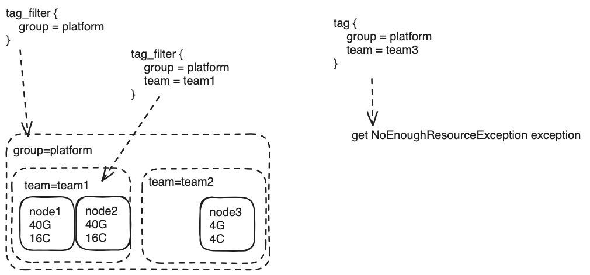

# Resource Isolation

After version 2.3.6. SeaTunnel can add `tag` to each worker node, when you submit job you can use `tag_filter` to filter the node you want run this job.

## How To Archive This:

1. update the config in `hazelcast.yaml`,

```yaml
hazelcast:
  cluster-name: seatunnel
  network:
    rest-api:
      enabled: true
      endpoint-groups:
        CLUSTER_WRITE:
          enabled: true
        DATA:
          enabled: true
    join:
      tcp-ip:
        enabled: true
        member-list:
          - localhost
    port:
      auto-increment: false
      port: 5801
  properties:
    hazelcast.invocation.max.retry.count: 20
    hazelcast.tcp.join.port.try.count: 30
    hazelcast.logging.type: log4j2
    hazelcast.operation.generic.thread.count: 50
  member-attributes:
    group:
      type: string
      value: platform
    team:
      type: string
      value: team1
```

In this config, we specify the tag by `member-attributes`, the node has `group=platform, team=team1` tags.

2. add `tag_filter` to your job config

```hacon
env {
  parallelism = 1
  job.mode = "BATCH"
  tag_filter {
    group = "platform"
    team = "team1"
  }
}
source {
  FakeSource {
    result_table_name = "fake"
    parallelism = 1
    schema = {
      fields {
        name = "string"
      }
    }
  }
}
transform {
}
sink {
  console {
    source_table_name="fake"
  }
}
```

**Notice:**
- If not set `tag_filter` in job config, it will random choose the node in all active nodes.
- When you add multiple tag in `tag_filter`, it need all key exist and value match. if all node not match, you will get `NoEnoughResourceException` exception.



3. update running node tags by rest api (optional)

for more information, please refer to [Update the tags of running node](https://seatunnel.apache.org/docs/seatunnel-engine/rest-api/)

