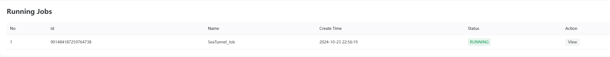
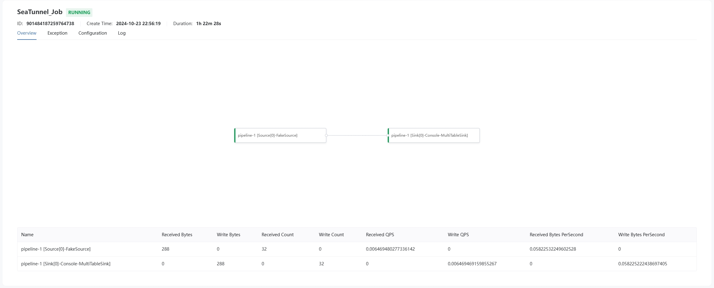
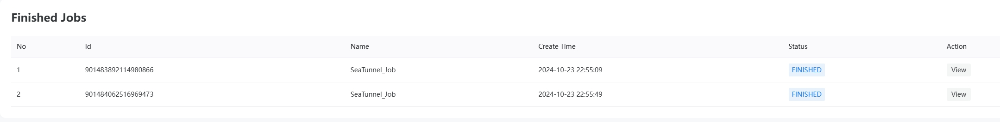
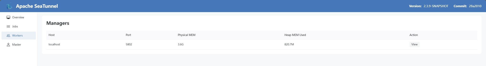
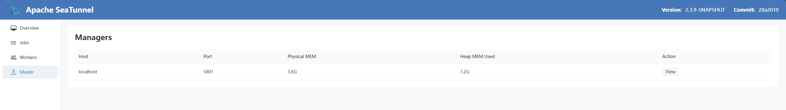

# Apache SeaTunnel Web UI Documentation

## Access

Before accessing the web ui we need to enable the http rest api. first you need to configure it in the `seatunnel.yaml` configuration file
``
http.
enable-http: true
port: 8080

```
Then visit http://ip:8080/#/overview
```

## Overview

The Web UI of Apache SeaTunnel offers a user-friendly interface for monitoring and managing SeaTunnel jobs. Through the Web UI, users can view real-time information on currently running jobs, finished jobs, and the status of worker and master nodes within the cluster. The main functional modules include Jobs, Workers, and Master, each providing detailed status information and operational options to help users efficiently manage and optimize their data processing workflows.


## Jobs

### Running Jobs

The "Running Jobs" section lists all SeaTunnel jobs that are currently in execution. Users can view basic information for each job, including Job ID, submission time, status, execution time, and more. By clicking on a specific job, users can access detailed information such as task distribution, resource utilization, and log outputs, allowing for real-time monitoring of job progress and timely handling of potential issues.



### Finished Jobs

The "Finished Jobs" section displays all SeaTunnel jobs that have either successfully completed or failed. This section provides execution results, completion times, durations, and failure reasons (if any) for each job. Users can review past job records through this module to analyze job performance, troubleshoot issues, or rerun specific jobs as needed.


## Workers

### Workers Information

The "Workers" section displays detailed information about all worker nodes in the cluster, including each worker's address, running status, CPU and memory usage, number of tasks being executed, and more. Through this module, users can monitor the health of each worker node, promptly identify and address resource bottlenecks or node failures, ensuring the stable operation of the SeaTunnel cluster.


## Master

### Master Information

The "Master" section provides the status and configuration information of the master node in the SeaTunnel cluster. Users can view the master's address, running status, job scheduling responsibilities, and overall resource allocation within the cluster. This module helps users gain a comprehensive understanding of the cluster's core management components, facilitating cluster configuration optimization and troubleshooting.

