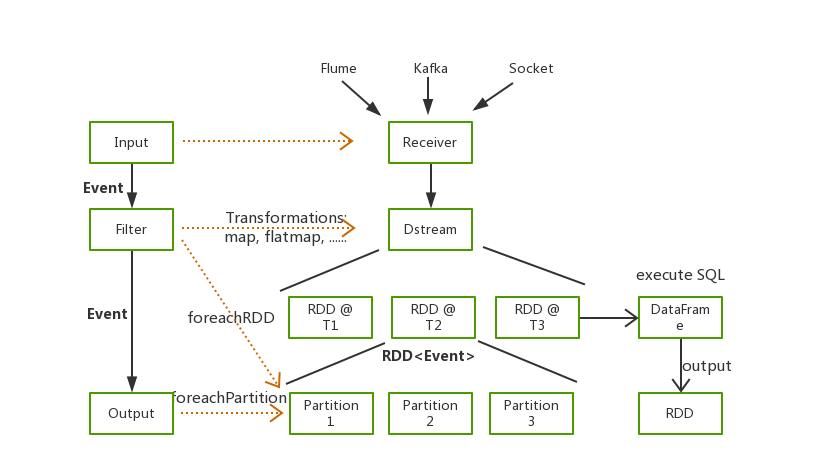

# 如何使用Spark快速将数据写入Elasticsearch


说到数据写入Elasticsearch，最先想到的肯定是Logstash。Logstash因为其简单上手、可扩展、可伸缩等优点被广大用户接受。但是尺有所短，寸有所长，Logstash肯定也有它无法适用的应用场景，比如：

   * 海量数据ETL
   * 海量数据聚合
   * 多源数据处理

为了满足这些场景，很多同学都会选择Spark，借助Spark算子进行数据处理，最后将处理结果写入Elasticsearch。

我们部门之前利用Spark对Nginx日志进行分析，统计我们的Web服务访问情况，将Nginx日志每分钟聚合一次最后将结果写入Elasticsearch，然后利用Kibana配置实时监控Dashboard。Elasticsearch和Kibana都很方便、实用，但是随着类似需求越来越多，如何快速通过Spark将数据写入Elasticsearch成为了我们的一大问题。

今天给大家推荐一款能够实现数据快速写入的黑科技——[Waterdrop](https://github.com/InterestingLab/waterdrop)，一个非常易用，高性能，能够应对海量数据的实时数据处理产品，它构建在Spark之上，简单易用，灵活配置，无需开发。





## Kafka to Elasticsearch

和Logstash一样，Waterdrop同样支持多种类型的数据输入，这里我们以最常见的Kakfa作为输入源为例，讲解如何使用Waterdrop将数据快速写入Elasticsearch

### Log Sample

原始日志格式如下:
```
127.0.0.1 elasticsearch.cn 114.250.140.241 0.001s "127.0.0.1:80" [26/Oct/2018:21:54:32 +0800] "GET /article HTTP/1.1" 200 123 "-" - "Dalvik/2.1.0 (Linux; U; Android 7.1.1; OPPO R11 Build/NMF26X)"
```

### Elasticsearch Document

我们想要统计，一分钟每个域名的访问情况，聚合完的数据有以下字段:
```
domain String
hostname String
status int
datetime String
count int
```

## Waterdrop with Elasticsearch

接下来会给大家详细介绍，我们如何通过Waterdrop读取Kafka中的数据，对数据进行解析以及聚合，最后将处理结果写入Elasticsearch中。

### Waterdrop

[Waterdrop](https://github.com/InterestingLab/waterdrop)同样拥有着非常丰富的插件，支持从Kafka、HDFS、Hive中读取数据，进行各种各样的数据处理，并将结果写入Elasticsearch、Kudu或者Kafka中。

### Prerequisites

首先我们需要安装Waterdrop，安装十分简单，无需配置系统环境变量
1. 准备Spark环境
2. 安装Waterdrop
3. 配置Waterdrop

以下是简易步骤，具体安装可以参照[Quick Start](https://interestinglab.github.io/waterdrop/#/zh-cn/quick-start)

```yaml
cd /usr/local
wget https://archive.apache.org/dist/spark/spark-2.2.0/spark-2.2.0-bin-hadoop2.7.tgz
tar -xvf https://archive.apache.org/dist/spark/spark-2.2.0/spark-2.2.0-bin-hadoop2.7.tgz
wget https://github.com/InterestingLab/waterdrop/releases/download/v1.1.1/waterdrop-1.1.1.zip
unzip waterdrop-1.1.1.zip
cd waterdrop-1.1.1

vim config/waterdrop-env.sh
# 指定Spark安装路径
SPARK_HOME=${SPARK_HOME:-/usr/local/spark-2.2.0-bin-hadoop2.7}
```

### Waterdrop Pipeline

与Logstash一样，我们仅需要编写一个Waterdrop Pipeline的配置文件即可完成数据的导入，相信了解Logstash的朋友可以很快入手Waterdrop配置。

配置文件包括四个部分，分别是Spark、Input、filter和Output。

#### Spark


这一部分是Spark的相关配置，主要配置Spark执行时所需的资源大小。
```
spark {
  spark.app.name = "Waterdrop"
  spark.executor.instances = 2
  spark.executor.cores = 1
  spark.executor.memory = "1g"
  spark.streaming.batchDuration = 5
}
```

#### Input

这一部分定义数据源，如下是从Kafka中读取数据的配置案例，

```
kafkaStream {
    topics = "waterdrop-es"
    consumer.bootstrap.servers = "localhost:9092"
    consumer.group.id = "waterdrop_es_group"
    consumer.rebalance.max.retries = 100
}
```

#### Filter

在Filter部分，这里我们配置一系列的转化，包括正则解析将日志进行拆分、时间转换将HTTPDATE转化为Elasticsearch支持的日期格式、对Number类型的字段进行类型转换以及通过SQL进行数据聚合
```yaml
filter {
    # 使用正则解析原始日志
    # 最开始数据都在raw_message字段中
    grok {
        source_field = "raw_message"
        pattern = '%{NOTSPACE:hostname}\\s%{NOTSPACE:domain}\\s%{IP:remote_addr}\\s%{NUMBER:request_time}s\\s\"%{DATA:upstream_ip}\"\\s\\[%{HTTPDATE:timestamp}\\]\\s\"%{NOTSPACE:method}\\s%{DATA:url}\\s%{NOTSPACE:http_ver}\"\\s%{NUMBER:status}\\s%{NUMBER:body_bytes_send}\\s%{DATA:referer}\\s%{NOTSPACE:cookie_info}\\s\"%{DATA:user_agent}'
   }
    # 将"dd/MMM/yyyy:HH:mm:ss Z"格式的数据转换为
    # Elasticsearch中支持的格式
    date {
        source_field = "timestamp"
        target_field = "datetime"
        source_time_format = "dd/MMM/yyyy:HH:mm:ss Z"
        target_time_format = "yyyy-MM-dd'T'HH:mm:ss.SSS+08:00"
    }
    ## 利用SQL对数据进行聚合
    sql {
        table_name = "access_log"
        sql = "select domain, hostname, int(status), datetime, count(*) from access_log group by domain, hostname, status, datetime"
    }
 }
```

#### Output
最后我们将处理好的结构化数据写入Elasticsearch。

```yaml
output {
    elasticsearch {
        hosts = ["localhost:9200"]
        index = "waterdrop-${now}"
        es.batch.size.entries = 100000
        index_time_format = "yyyy.MM.dd"
    }
}
```

### Running Waterdrop

我们将上述四部分配置组合成为我们的配置文件`config/batch.conf`。

    vim config/batch.conf

```
spark {
  spark.app.name = "Waterdrop"
  spark.executor.instances = 2
  spark.executor.cores = 1
  spark.executor.memory = "1g"
  spark.streaming.batchDuration = 5
}
input {
    kafkaStream {
        topics = "waterdrop-es"
        consumer.bootstrap.servers = "localhost:9092"
        consumer.group.id = "waterdrop_es_group"
        consumer.rebalance.max.retries = 100
    }
}
filter {
    # 使用正则解析原始日志
    # 最开始数据都在raw_message字段中
    grok {
        source_field = "raw_message"
        pattern = '%{IP:hostname}\\s%{NOTSPACE:domain}\\s%{IP:remote_addr}\\s%{NUMBER:request_time}s\\s\"%{DATA:upstream_ip}\"\\s\\[%{HTTPDATE:timestamp}\\]\\s\"%{NOTSPACE:method}\\s%{DATA:url}\\s%{NOTSPACE:http_ver}\"\\s%{NUMBER:status}\\s%{NUMBER:body_bytes_send}\\s%{DATA:referer}\\s%{NOTSPACE:cookie_info}\\s\"%{DATA:user_agent}'
   }
    # 将"dd/MMM/yyyy:HH:mm:ss Z"格式的数据转换为
    # Elasticsearch中支持的格式
    date {
        source_field = "timestamp"
        target_field = "datetime"
        source_time_format = "dd/MMM/yyyy:HH:mm:ss Z"
        target_time_format = "yyyy-MM-dd'T'HH:mm:00.SSS+08:00"
    }
    ## 利用SQL对数据进行聚合
    sql {
        table_name = "access_log"
        sql = "select domain, hostname, status, datetime, count(*) from access_log group by domain, hostname, status, datetime"
    }
 }
output {
    elasticsearch {
        hosts = ["localhost:9200"]
        index = "waterdrop-${now}"
        es.batch.size.entries = 100000
        index_time_format = "yyyy.MM.dd"
    }
}
```

执行命令，指定配置文件，运行Waterdrop，即可将数据写入Elasticsearch。这里我们以本地模式为例。

    ./bin/start-waterdrop.sh --config config/batch.conf -e client -m 'local[2]'

最后，写入Elasticsearch中的数据如下，再配上Kibana就可以实现Web服务的实时监控了^_^.

```
"_source": {
    "domain": "elasticsearch.cn",
    "hostname": "localhost",
    "status": "200",
    "datetime": "2018-11-26T21:54:00.000+08:00",
    "count": 26
  }
```

## Conclusion

在这篇文章中，我们介绍了如何通过Waterdrop将Kafka中的数据写入Elasticsearch中。仅仅通过一个配置文件便可快速运行一个Spark Application，完成数据的处理、写入，无需编写任何代码，十分简单。

当数据处理过程中有遇到Logstash无法支持的场景或者Logstah性能无法达到预期的情况下，都可以尝试使用Waterdrop解决问题。

希望了解Waterdrop与Elasticsearch、Kafka、Hadoop结合使用的更多功能和案例，可以直接进入项目主页[https://github.com/InterestingLab/waterdrop](https://github.com/InterestingLab/waterdrop)


**我们近期会再发布一篇《如何用Spark和Elasticsearch做交互式数据分析》，敬请期待.**

## Contract us

欢迎联系我们交流Spark和Elasticsearch:

> Garyelephant：  微信: garyelephant
> RickyHuo：  微信: chodomatte1994