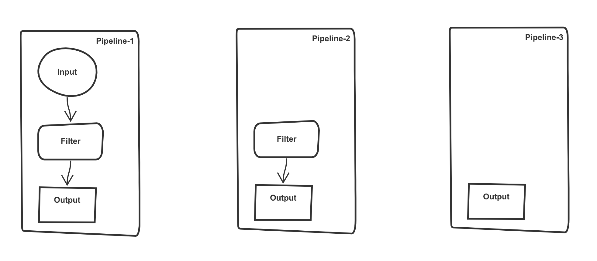

## 多数据流处理（多Pipeline处理，多源数据处理）[商业版]

---

Waterdrop 支持在一个实例中，以多Pipeline的方式来处理数据，即允许每个pipeline以自己的方式来处理数据，并输出。并且在同一个waterdrop实例中，各个pipeline对数据的处理能够做到互不影响。
在介绍如何使用多pipeline之前，我们先来看看Waterdrop的处理流程，见下图：

 

一个Pipeline可以是上面这个流程的一部分或者全部：



`pipeline-1`的处理流程是：`input{} -> filter{} -> output{}`, 在当前pipeline的input指定的数据源中获取数据，经过filter的处理，从output中输出。

`pipeline-2`的处理流程是：`filter{} -> output{}`, 从pipeline外部（外层的pipeline的input）获取数据，经过filter的处理，从output中输出。

`pipeline-3`的处理流程是：`output{}`，从pipeline外部（外层的pipeline的input）获取数据，数据可能已经经过处理，从output中输出。


多个pipeline之间，可以是互相独立的，也可以是嵌套包含的关系，如下为2个独立的pipeline：


如下为3个pipeline，里面的2个pipeline(pipeline-2, pipeline-3)包含在外面的pipeline(pipeline-1)中，数据输入后，
由pipeline-1完成一些pipeline-2,pipeline-3都需要的数据预处理，再把数据交给pipeline-2，pipeline-3各自处理，如下图：


Waterdrop的多pipeline功能，可以满足多种数据处理流程。您可根据生产环境中实际的数据处理需求，来使用多pipeline功能，不需要写代码，简单配置即可，如下:

```
pipeline<pipe1> {
  ...
}

```

> `pipeline`是进入pipeline处理流程的关键词，`<>` 中指定的`p1`是pipeline的名称，用户可自行指定。

> pipeline名称要求：由字母`a-z`,数字`0-9`以及下划线`_`任意组合，不允许其他字符出现，合法的pipeline名称举例：pipe1, p1, mypipe_1等，即需要满足正则表达式`[0-9a-zA-Z_]+`

---

下面展示几个多pipeline处理的配置示例：

**示例1：不需要多pipeline，不配置pipeline**

> Pipeline不是必须的，当不配置Pipeline时，处理流程如下：


对于上面的流程，配置如下：

```
spark {
  // spark configs
  ...
}

input {
  kafkaStream {
    ...
  }
}

filter {
  kv {
    ...
  }
  ...
}

output {
  ...
}

```

---

**示例2: 使用多pipeline输出到多个output**


对于上面的流程，配置如下：

```
spark {
  // spark configs
  ...
}

input {
  kafkaStream {
    ...
  }
}

filter {
  split {
    ...
  }
}

pipeline<pipe2> {
  output {
    elasticsearch {
      ...
    }
  }
}

pipeline<pipe3> {
  output {
    mysql {
      ...
    }
  }
}

```

---


**示例3: 使用多pipeline对数据做不同的处理，并输出**


对于上面的流程，配置如下：

```
spark {
  // spark configs
  ...
}

input {
  kafkaStream {
    ...
  }
}


pipeline<pipe2> {
  filter {
    sql {
      table_name = "t1"
      sql = "select * from t1"
    }
  }
  output {
    clickhouse {}
  }
}

pipeline<pipe3> {
  filter {
    split {
      delimiter = ","
      fields = ["key", "value"]
    }
  }
  output {
    hdfs {}
  }
}

```

---


**示例4: 使用多pipeline 从不同的数据源获取数据，做不同的处理，输出到各自指定的output**


对于上面的流程，配置如下：

```
spark {
  // spark config
  ...
}

pipeline<pipe1> {
  input {
    kafkaStream {
      ...
    }
  }

  filter {
    sql {
      table_name = "t1"
      sql = "select * from t1"
    }
  }
  output {
    elasticsearch {}
  }
}

pipeline<pipe2> {
  input {
    kafkaStream {
      ...
    }
  }

  filter {
    split {
      delimiter = ","
      fields = ["key", "value"]
    }
  }
  output {
    mysql {}
  }
}
```

---

