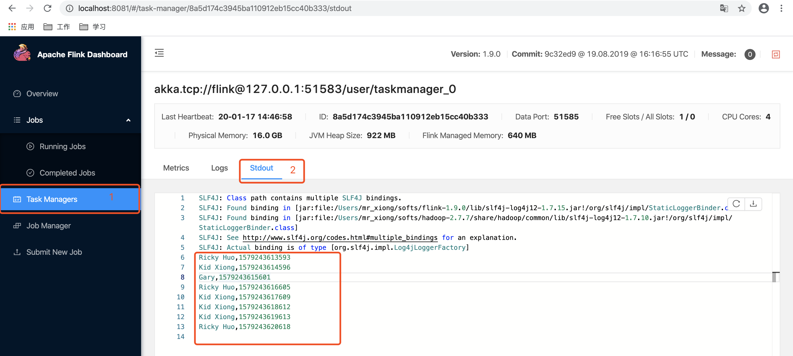

## Sink plugin : Console [Flink]

* Author: InterestingLab
* Homepage: https://interestinglab.github.io/waterdrop
* Version: 2.0.0

### Description
用于功能测试和和debug，结果将输出在taskManager的stdout选项卡

### Options
| name | type | required | default value |
| --- | --- | --- | --- |
| [common-options](#common-options-string)| string | no | - |


##### common options [string]

`Sink` 插件通用参数，详情参照 [Sink Plugin](README.md)

### Examples

```
ConsoleSink{}
```

### Note
flink的console输出在flink的web UI
