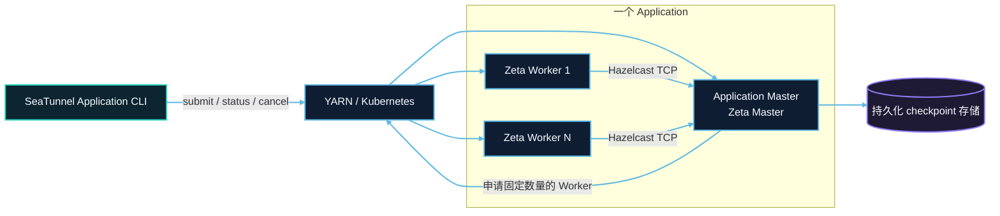
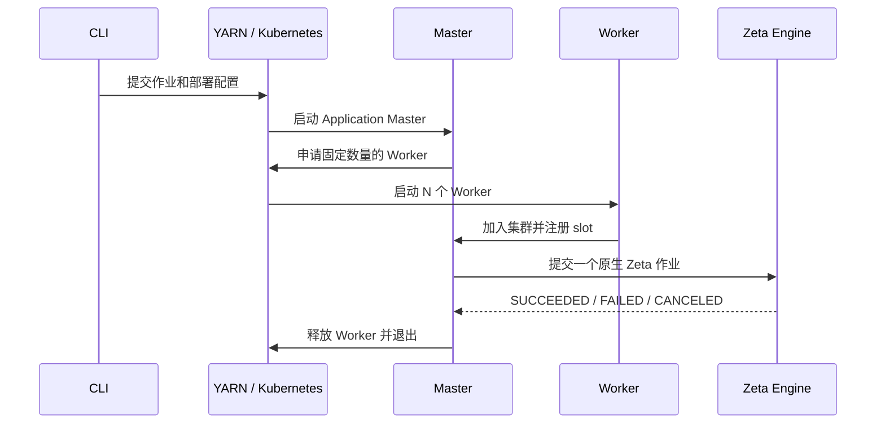
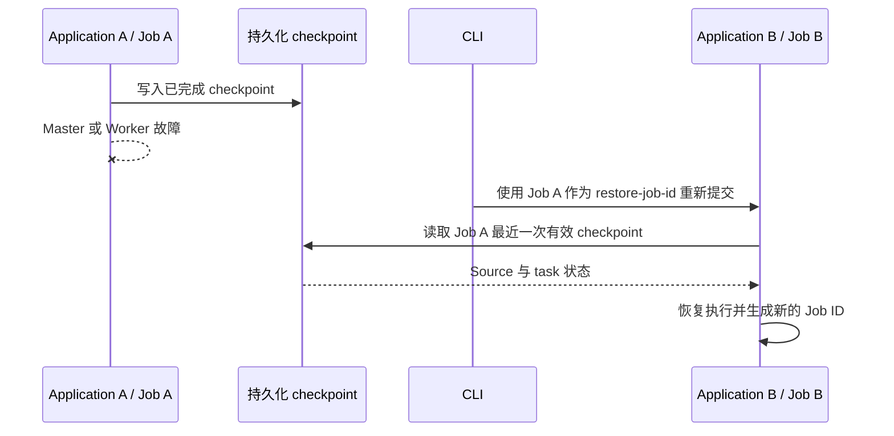

# Application Mode 架构概览

Application Mode 为一个 SeaTunnel 作业创建一个独立的 Zeta 集群。平台负责启动和回收进程，Zeta 继续负责 Worker 注册、slot 调度、任务执行与 checkpoint。

## 角色与职责

| 角色 | 职责 |
| --- | --- |
| 提交客户端 | 读取作业和部署配置，提交、查询或取消 application |
| 资源平台 | 启动 Master 和 Worker，记录 application 状态，回收计算资源 |
| Master | 创建独立 Zeta 集群，申请 Worker，提交唯一作业并协调清理 |
| Worker | 提供固定 slot，执行 Source、Transform 和 Sink task group |
| checkpoint 存储 | 在 application 进程之外保存恢复所需的作业状态 |

一个 Master 可以协调多个 Worker。固定 slot 总量为 `application.worker-count × application.worker.slots`，实际并行度还取决于作业拓扑。

## 运行流程

关闭 CLI 不会取消远端 application。取消必须显式执行，因此可以先 detached 提交，再使用 application ID 查询或取消。

## 故障与恢复

当前版本只有一个 Master，且 `backup-count=0`。Master 或 Worker 丢失会使当前 application 失败，不会在同一个 application 中自动接管或补建。

持久化 checkpoint 与在线 HA 是两个不同能力。作业可以把 checkpoint 写入 HDFS、OSS、S3、COS 或 Kubernetes 持久卷。故障后创建新的 application，并指定历史 Zeta job ID，新 Master 会读取最近一次有效 checkpoint 恢复 Source 和 task 状态。

恢复存储必须独立于两次 application 的生命周期。YARN checkpoint 目录应位于 staging 目录之外；Kubernetes PVC 由用户持有，application 不会删除它。详细步骤参见平台恢复指南。

## 平台差异

| 资源 | YARN | Kubernetes |
| --- | --- | --- |
| Master | ApplicationMaster Container | Kubernetes Job Pod |
| Worker | YARN Container | Worker Pod |
| 运行文件 | 共享文件系统本地化发行包 | Master 与 Worker 使用同一镜像 |
| 状态 | YARN application state | Kubernetes Job condition |
| 清理 | 释放 Container 并删除 staging | 删除 Worker Pod 和 application 资源 |

继续阅读 [YARN Application Mode](yarn/overview.md) 或 [Kubernetes Application Mode](kubernetes/overview.md)。
