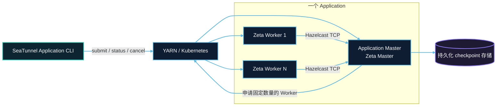
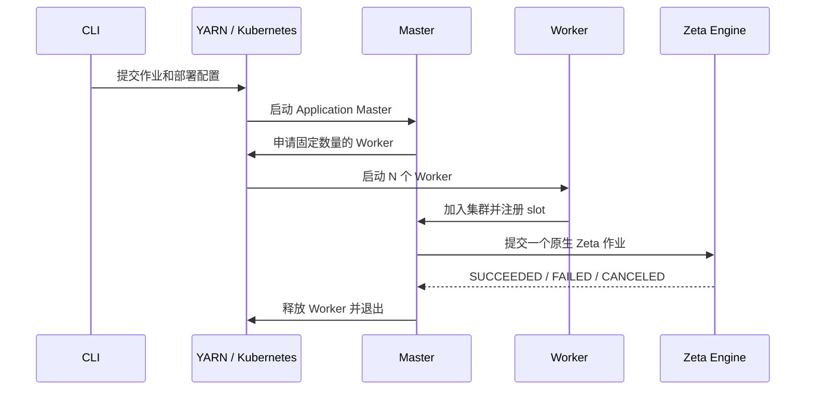
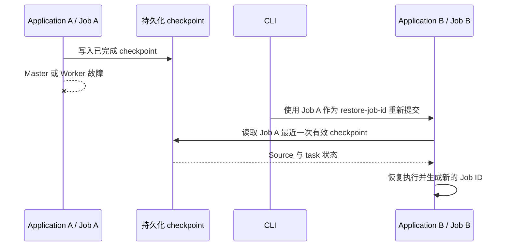

# Application Mode 架构概览

Application Mode 为一个 SeaTunnel 作业创建一个独立的 Zeta 集群。平台负责启动和回收进程，Zeta 继续负责 Worker 注册、slot 调度、任务执行与 checkpoint。

```mermaid
flowchart LR
  client["SeaTunnel Application CLI"]
  platform["YARN / Kubernetes"]

  subgraph app["一个 Application"]
    master["Application Master<br/>Zeta Master"]
    worker1["Zeta Worker 1"]
    workerN["Zeta Worker N"]
  end

  checkpoint[("持久化 checkpoint 存储")]

  client -->|submit / status / cancel| platform
  platform --> master
  master -->|申请固定数量的 Worker| platform
  platform --> worker1
  platform --> workerN
  worker1 -->|Hazelcast TCP| master
  workerN -->|Hazelcast TCP| master
  master --> checkpoint

  classDef layerBlue fill:#0f1d33,stroke:#5db8e2,stroke-width:2px,color:#f8fbff;
  classDef layerCyan fill:#0c2530,stroke:#2dd4bf,stroke-width:2px,color:#f8fbff;
  classDef layerPurple fill:#1f1a34,stroke:#8d7cf6,stroke-width:2px,color:#f8fbff;
  class client layerCyan;
  class platform,master,worker1,workerN layerBlue;
  class checkpoint layerPurple;
  linkStyle default stroke:#5db8e2,stroke-width:2px;
```

## 角色与职责

| 角色 | 职责 |
| --- | --- |
| 提交客户端 | 读取作业和部署配置，提交、查询或取消 application |
| 资源平台 | 启动 Master 和 Worker，记录 application 状态，回收计算资源 |
| Master | 创建独立 Zeta 集群，申请 Worker，提交唯一作业并协调清理 |
| Worker | 提供固定 slot，执行 Source、Transform 和 Sink task group |
| checkpoint 存储 | 在 application 进程之外保存恢复所需的作业状态 |

一个 Master 可以协调多个 Worker。固定 slot 总量为 `application.worker-count × application.worker.slots`，实际并行度还取决于作业拓扑。

两个平台都使用独立的 Master、Worker 入口：YARN 分别为 `SeatunnelYarnMasterCli`、`SeatunnelYarnWorkerCli`；Kubernetes 分别为 `SeatunnelKubernetesMasterCli`、`SeatunnelKubernetesWorkerCli`。Worker 入口设置集群名、Master 地址和固定 slot 数，再将配置传给 `SeaTunnelServerStarter.createHazelcastInstance`。YARN 额外使用 Master 的发行包根目录，解析各个 Worker 本地化目录中的 jar 路径。Worker 启动不初始化平台客户端，也不承担整个应用的清理。`SeaTunnelServerStarter.main` 保持原有的按配置启动行为。Worker 进程退出时使用 Hazelcast 自带的 shutdown hook。Worker 的回收由外层 application 生命周期和平台 driver 负责，启动器不会因集群成员变化主动关闭 Worker。如果 Master 进程在清理前异常死亡，需要由平台层负责回收 Worker。

提交时分离应用配置与平台配置：`SeatunnelApplicationConfig.load(path, overrides)` 读取可选应用文件、合并覆盖值并解析引用；`SeatunnelApplicationConfig.parse(jobPath, options)` 单独读取作业文件，构建强类型、不可变的 `ApplicationSpecification`。CLI 和 Java 调用方共用这些方法。`YarnApplicationConfiguration`、`KubernetesApplicationParameters` 分别持有平台参数。规格对象不保留原始 options map、平台类型，也不负责文件读写。本地化配置使用 `format.version=V1`，只写入应用字段和平台运行所需参数，不携带提交端本地分发包路径或 kubeconfig。Master 入口直接构造 driver，不再需要 driver factory SPI。

`-a application.config` 只在提交机器上读取。提交时生成 `application.properties`：YARN 将其上传到 `<yarn.staging-dir>/<applicationId>/application.properties`，再本地化到容器工作目录；Kubernetes 将其写入应用的 Secret，挂载到 `/etc/seatunnel-application/application.properties`。平台 Master CLI 读取该文件，再把强类型对象传给 Runner、ResourceManager 和 Driver。这些组件及 Worker 入口不会自行寻找原始 `application.config` 文件。

## 运行流程

统一的具体类 `ResourceManagerFactory` 只选择 `StandaloneResourceManager` 或 `ApplicationResourceManager`，不再保留 YARN/Kubernetes 专属的 Engine manager 子类和工厂。平台 Master CLI 在外层构造应用规格和 driver，连同应用 ID、部署类型放入统一 factory；节点创建链只透传 factory。Coordinator 将 NodeEngine 和 EngineConfig 传给 factory 创建对应 manager，初始化成功后才发布实例。两个具体 manager 分别负责初始化，ApplicationResourceManager 直接调用注入的 driver。

Driver 初始化时接收 `ResourceEventHandler<WorkerType>`、单线程 `ScheduledExecutorService`、IO 执行器和 Master 地址获取函数，不再使用 `ResourceManagerContext`、事件对象层次或事件类型注册表。Handler 只提供 `onWorkerTerminated(WorkerType, String)` 和 `onError(Throwable)`，本次不包含上一轮 Worker 恢复与节点屏蔽策略。Driver 通过传入的主线程执行器分发回调，异步平台操作使用 IO 执行器。两个执行器由 manager 持有，在 driver 停止任务并关闭 SDK 连接后统一关闭。地址按需从 `NodeEngine` 读取。YARN 退出码为 0、Kubernetes Pod 为 `Succeeded` 或主动释放 Worker 时不报错；成员离开只注销资源，由平台判断是否异常退出。异常退出仍使应用失败，不补拉 Worker。manager 保留首次意外故障，并在清理开始后忽略晚到的回调。应用 ID、集群名和部署配置仍在构造平台 driver 时传入。

运行时不再保留独立的 `ApplicationClusterEntrypoint`。平台 CLI 通过 `SeaTunnelServerStarter.createHazelcastInstance` 创建已配置的节点，调用 `new ApplicationJobRunner(server, specification).run()`，并负责关闭 Master。公共 Runner 位于 `engine-client/cluster/application`，沿用现有 client 到 server 的依赖，不引入反向依赖。`ApplicationJobExecutionEnvironment` 位于 engine-client 的 `client.job` 包，与 `ClientJobExecutionEnvironment` 一样继承 `AbstractJobEnvironment`，只负责解析配置、构建 DAG、在进程内提交作业并返回 `CompletableFuture<JobResult>`；不等待 Worker，不清理集群，也不创建客户端连接自己。

`ApplicationResourceManager` 负责 driver 初始化、有启动超时约束的 Worker 就绪等待、异步资源故障通知、Worker 释放、应用终态发布及 driver 关闭。`ApplicationJobRunner` 等待资源就绪后执行作业，在中断或资源失败时发出取消信号；执行环境在提交确认后落实该信号，避免迟到提交逃过取消。仅取消结果 Future 不会取消实际作业。Runner 等待作业终止（取消等待有超时），再调用资源管理器完成清理；平台 CLI 最后关闭 Master。清理异常附加到原始异常，取消超时会使应用按失败处理。

resource-manager core 模块已删除。部署选项放在 engine-common 的 `config.server` 包，引擎配置准备类放在其 `config` 包，应用和 Worker 的不可变规格放在其 `config.spec` 包；部署和客户端契约放在 engine-client，运行时资源归 engine-server 管理。

提交端通过构造器向 `ApplicationClusterDeployer` 注入 `ClusterClientServiceLoader`，再调用 `run(target, options, specification)`。loader 发现唯一的平台 factory；deployer 创建并关闭 `ClusterDescriptor<ID>`，返回平台原生 ID（YARN 为 Hadoop `ApplicationId`，Kubernetes 为 `String` 类型的 Job 名称）。factory 同时负责将 CLI 的 `--id` 字符串转换为平台 ID。descriptor 的 `getApplicationStatus` 和 `cancelApplication` 在内部调用资源平台 API，不连接 Master，也不需要 Zeta job ID。

`retrieve(applicationId)` 发现运行中 Master 的连接配置，返回无泛型的 `SeatunnelClientProvider`，不建立 Engine 连接。每次调用 `provider.getClusterClient()` 才创建一个新的 `SeaTunnelClient` 操作 Zeta 作业；调用方必须能访问 Master 的网络地址，应用结束后不能再建立连接。deployment 契约放在 `engine-client`，engine-common 不依赖客户端。部署、CLI 状态查询（包括 `--wait`）和取消应用均不依赖 Engine 连接。每个 client 都由调用方独立于 descriptor 关闭；关闭任意一方只释放各自连接，不会取消应用。公共运行时直接保存平台 ID 字符串，不再使用自定义 ID 包装。

接口不再返回 `ApplicationResult` 包装对象：查询直接返回 `ApplicationStatus`，集群内执行入口成功时正常返回，执行或可报告的清理失败时抛出异常。平台入口将失败映射为非零进程退出码，最终的平台状态及诊断信息仍由资源管理器 driver 发布。

```mermaid
sequenceDiagram
    participant CLI
    participant Platform as YARN / Kubernetes
    participant Master
    participant Worker
    participant Engine as Zeta Engine

    CLI->>Platform: 提交作业和部署配置
    Platform->>Master: 启动 Application Master
    Master->>Platform: 申请固定数量的 Worker
    Platform->>Worker: 启动 N 个 Worker
    Worker->>Master: 加入集群并注册 slot
    Master->>Engine: 提交一个原生 Zeta 作业
    Engine-->>Master: SUCCEEDED / FAILED / CANCELED
    Master->>Platform: 释放 Worker 并退出
```

关闭 CLI 不会取消远端 application。取消必须显式执行，因此可以先 detached 提交，再使用 application ID 查询或取消。

## 故障与恢复

当前版本只有一个 Master，且 `backup-count=0`。Master 丢失或 Worker 异常退出会使当前 application 失败；Worker 正常结束本身不触发应用失败，不会在同一个 application 中自动接管或补建。

持久化 checkpoint 与在线 HA 是两个不同能力。作业可以把 checkpoint 写入 HDFS、OSS、S3、COS 或 Kubernetes 持久卷。故障后创建新的 application，并指定历史 Zeta job ID，新 Master 会读取最近一次有效 checkpoint 恢复 Source 和 task 状态。

```mermaid
sequenceDiagram
    participant Old as Application A / Job A
    participant Store as 持久化 checkpoint
    participant CLI
    participant New as Application B / Job B

    Old->>Store: 写入已完成 checkpoint
    Old--xOld: Master 或 Worker 故障
    CLI->>New: 使用 Job A 作为 restore-job-id 重新提交
    New->>Store: 读取 Job A 最近一次有效 checkpoint
    Store-->>New: Source 与 task 状态
    New->>New: 恢复执行并生成新的 Job ID
```

恢复存储必须独立于两次 application 的生命周期。YARN checkpoint 目录应位于 staging 目录之外；Kubernetes PVC 由用户持有，application 不会删除它。详细步骤参见平台恢复指南。

## 平台差异

| 资源 | YARN | Kubernetes |
| --- | --- | --- |
| Master | ApplicationMaster Container | Kubernetes Job Pod |
| Worker | YARN Container | Worker Pod |
| 运行文件 | 共享文件系统本地化发行包 | Master 与 Worker 使用同一镜像 |
| 状态 | YARN application state | Kubernetes Job condition |
| 清理 | 释放 Container 并删除 staging | 删除 Worker Pod 和 application 资源 |

继续阅读 [YARN Application Mode](yarn/overview.md) 或 [Kubernetes Application Mode](kubernetes/overview.md)。
