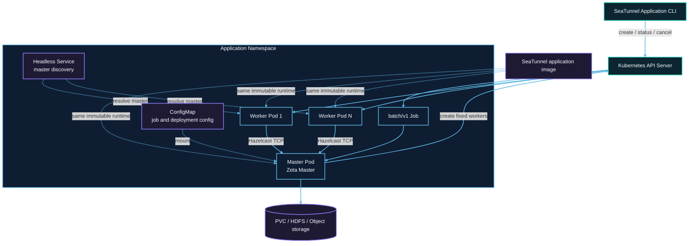

# Kubernetes 集群架构

每次提交在目标 Namespace 中创建一组带唯一 application ID 的资源。Job Pod 运行 Master；Worker Pod 不挂载 Kubernetes API token，只通过 Hazelcast TCP 与 Master 通信。



## 资源创建顺序

1. 提交器创建 `backoffLimit: 0` 的挂起 Job。
2. 获得 Job UID 后，创建带 OwnerReference 的 ConfigMap 和 Headless Service。
3. 配置准备完成后解除 Job 挂起，并等待 Master Pod 进入 Running。
4. Master 启动独立 Zeta 集群，通过 Kubernetes API 创建固定数量的 Worker Pod。
5. Worker 解析 Headless Service 指向的 Master 地址，加入集群并注册 slot。
6. 所有 Worker 就绪后，Master 提交唯一的 Zeta 作业。
7. 作业进入终态后，Master 删除 Worker 并退出；Job 状态保留为 `Complete` 或 `Failed`。

## RBAC 边界

提交端身份负责创建 Job、ConfigMap 和 Service，并执行查询与取消。Application ServiceAccount 只需要读取 Job 和管理本 application 的 Worker Pod。只有 Master 挂载 ServiceAccount token；Worker 不访问 Kubernetes API。

## 网络与容量

Master 与 Worker 之间必须允许 Hazelcast TCP。使用 NetworkPolicy 时，应放行 application 内 Pod 到 Master 端口，以及 Worker 的 Hazelcast 成员通信。

Master 不提供 task slot。总固定容量为：

```text
application.worker-count × application.worker.slots
```

Pod request 与 limit 使用相同 CPU、内存值。Namespace quota、LimitRange、准入策略和节点可用容量都可能阻止调度。

## 所有权与持久数据

ConfigMap 和 Service 由 Job 持有，删除 Job 时由 Kubernetes 回收。Worker 由 application 显式清理，并使用 application 标签辅助兜底删除。

调用方提供的 checkpoint PVC 不设置 Job OwnerReference，因此成功、失败、取消或 TTL 到期都不会删除 PVC。远程 checkpoint 存储同样独立于 application 生命周期。
