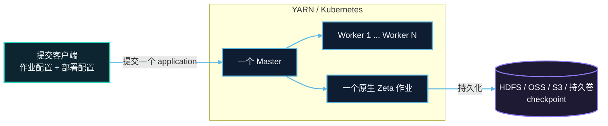

# Application Mode（实验性）

Application Mode 是 SeaTunnel 在 YARN 或 Kubernetes 上运行独立作业的部署方式。它面向已经使用资源平台、但不希望长期维护共享 SeaTunnel 集群的团队：每次提交都会为一个作业创建一套临时的 Zeta Master 和 Worker，作业结束后由平台回收计算资源。

Application Mode 使用原生 Zeta Engine、Connector 和 checkpoint 机制，不依赖 Flink 或 Spark，也不会把多个作业放进同一个 application。

## 适用场景

- 希望一个作业独占一组 Master 和 Worker，隔离资源、依赖和故障。
- 使用 YARN 或 Kubernetes 统一申请、观察和清理计算资源。
- 批作业完成后立即释放资源，或让流作业作为独立 application 长期运行。
- 可以在提交前确定 Worker 数量、CPU、内存和 slot 数。
- 接受 Master 或 Worker 故障后结束当前 application，并从持久化 checkpoint 创建新 application 恢复。

## 不适用场景

- 需要一个长期运行的 SeaTunnel 集群承载多个作业，请使用 Zeta standalone 部署。
- 需要 Master 自动接管、Worker 自动补建、自动扩缩容或 application 自动重启。
- 需要 Kerberos 认证的 YARN/HDFS 环境。
- 需要 Flink 或 Spark 引擎的 application 部署方式。

## 一次提交如何运行

1. CLI 读取作业配置和部署配置，通过目标平台的 provider 创建 application。
2. 平台启动一个 application master；它在进程内启动唯一的 Zeta Master。
3. Master 按配置申请固定数量的 Worker，Worker 通过 Hazelcast TCP 加入该 application 的独立集群。
4. 所有 Worker 注册后，Master 向 Zeta 提交一个作业并持续同步 application 状态。
5. 作业成功、失败或被取消后，Master 释放 Worker 并退出；平台完成剩余资源清理。

一个 Master 可以协调三个或更多 Worker。实际并行能力由 `application.worker-count × application.worker.slots` 以及作业拓扑共同决定。

## 可靠性边界

当前版本只有一个 Master，并设置 `backup-count=0`。运行中的 Master 没有备用节点可以接管，因此这不是在线 HA。Worker 丢失也会使 application 失败，系统不会在同一个 application 中自动补建 Worker。

这不影响基于持久化 checkpoint 的断点恢复。初次提交时把 checkpoint 保存到 HDFS、OSS、S3、COS 或 Kubernetes 持久卷；故障后提交一个新 application，并通过历史 Zeta job ID 加载最近一次可用 checkpoint。新 application 会获得新的平台 application ID 和 Zeta job ID。

checkpoint 的保留策略、存储依赖、Connector 一致性和恢复限制参见平台指南与 [Checkpoint Storage](../engines/zeta/checkpoint-storage.md)。Master 可用性与 checkpoint 恢复的区别参见[故障与恢复](architecture.md#故障与恢复)。

## 支持的平台

| 平台 | 资源形态 | 从这里开始 |
| --- | --- | --- |
| YARN | 一个 ApplicationMaster 和固定数量的 Worker Container；发行包通过共享文件系统本地化 | [YARN Application Mode](yarn/overview.md) |
| Kubernetes | 一个承载 Master 的 Job 和固定数量的 Worker Pod；Master 与 Worker 使用同一镜像 | [Kubernetes Application Mode](kubernetes/overview.md) |

标准 SeaTunnel 发行包默认包含 YARN 和 Kubernetes provider。发行包仍是标准的 `apache-seatunnel-<version>-bin.tar.gz`，不会产生另一套 application 专用发行包。

## 能力范围

| 能力 | 当前行为 |
| --- | --- |
| 作业与集群 | 一次提交对应一个作业和一个独立 Zeta 集群 |
| Worker | 支持固定数量的多个 Worker 和并行任务执行 |
| 生命周期 | 支持提交、查询状态、等待完成和取消 |
| 故障处理 | 启动超时、资源不足、Master 或 Worker 丢失会使 application 失败 |
| 恢复 | 支持从持久化 checkpoint 手动提交新 application 恢复 |
| HA 与伸缩 | 暂不支持 Master 自动接管、Worker 自动替换和自动伸缩 |

## 推荐阅读顺序

| 阶段 | 文档 | 说明 |
| --- | --- | --- |
| 选择平台 | [YARN 指南](yarn/overview.md) / [Kubernetes 指南](kubernetes/overview.md) | 准备环境、构建发行包并提交第一个作业 |
| 配置部署 | [YARN 配置](yarn/configuration.md) / [Kubernetes 配置](kubernetes/configuration.md) | 平台权限、资源、镜像或发行包参数 |
| 配置恢复 | [YARN checkpoint 恢复](yarn/checkpoint-recovery.md) / [Kubernetes checkpoint 恢复](kubernetes/checkpoint-recovery.md) | 持久化存储、故障后恢复和清理 |
| 理解部署 | [架构概览](architecture.md) | 运行拓扑、角色、生命周期和可靠性边界 |
