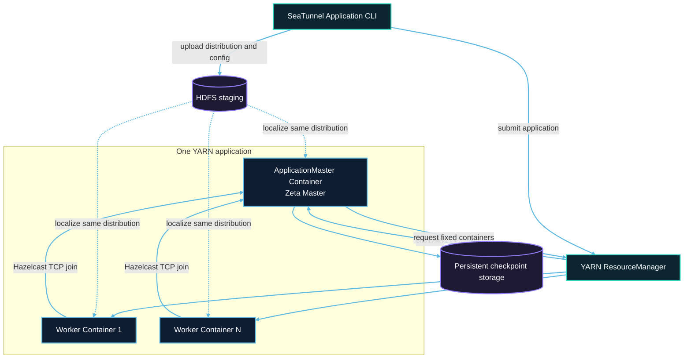

# YARN 集群架构

每次提交创建一个 YARN application。提交客户端只负责准备和上传文件；ApplicationMaster 接管之后的 Master、Worker 和作业生命周期。



## 提交流程

1. 客户端从 ResourceManager 获取 application ID。
2. 客户端创建权限为 `0700` 的 application staging 目录；application 文件上传器将校验后的发行包、作业配置和解析后的 Hadoop 配置作为一组本地化资源上传。
3. 客户端状态监视器等待 ResourceManager 启动 ApplicationMaster 或报告终态；NodeManager 本地化并解压同一发行包。
4. ApplicationMaster 启动独立 Zeta Master，并通过 `AMRMClient` 申请固定数量的 Worker Container。
5. `NMClient` 在 Container 中启动 Worker JVM。每个已分配 Container 作为一个 Worker 节点跟踪；Worker 使用 Master 的实际地址加入独立 Hazelcast 集群。
6. 所有 Worker 完成成员和 slot 注册后，Master 提交唯一的 Zeta 作业。
7. 作业进入终态后，Master 释放 Worker、注销 YARN application 并清理 staging。

## 网络与容量

YARN Container 使用宿主机网络。NodeManager 之间必须允许 Master Hazelcast 端口和 Worker 端口通信。`application.master.port` 是 Master 起始端口；发生冲突时会选择后续可用端口，并把实际地址传给 Worker。

Master 不提供 task slot。总固定容量为：

```text
application.worker-count × application.worker.slots
```

资源请求还必须满足队列配额、ResourceManager 最大 Container 能力和 NodeManager 可用容量。

## Staging 与 checkpoint

Staging 只服务于一次 application，结束后会被删除。checkpoint 必须配置在 staging 目录之外。可以使用 HDFS 暂存发行包，同时使用 HDFS、OSS、S3 或 COS 保存 checkpoint。

ApplicationMaster 或 Worker 丢失会使当前 application 失败。恢复会创建新的 application，不会重新加入旧 Hazelcast 集群。详见 [Checkpoint 恢复](checkpoint-recovery.md)。
