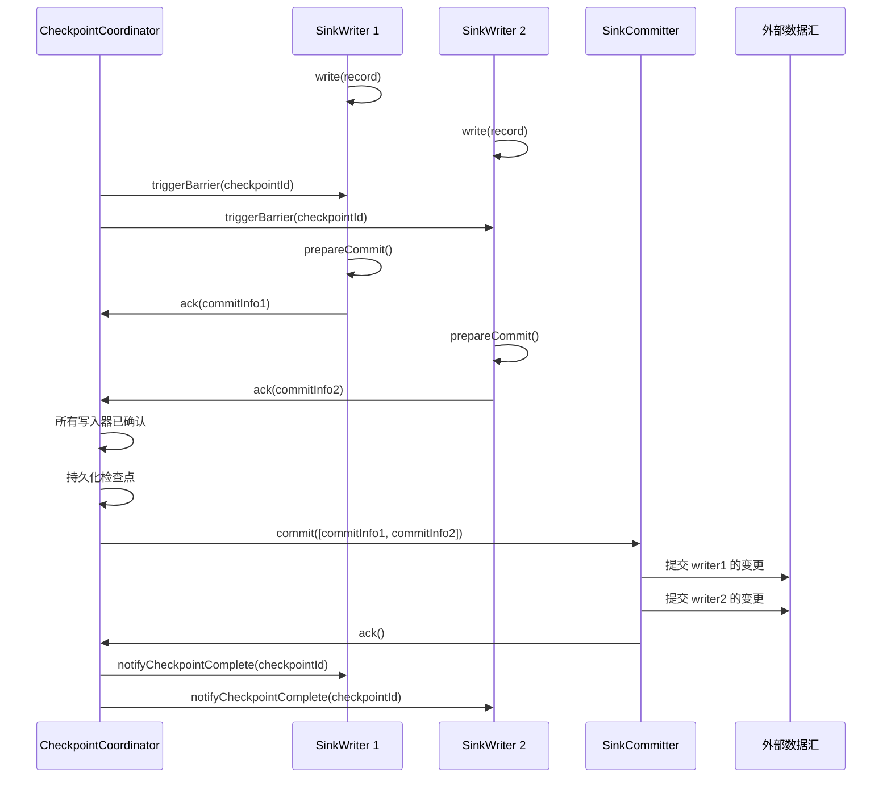
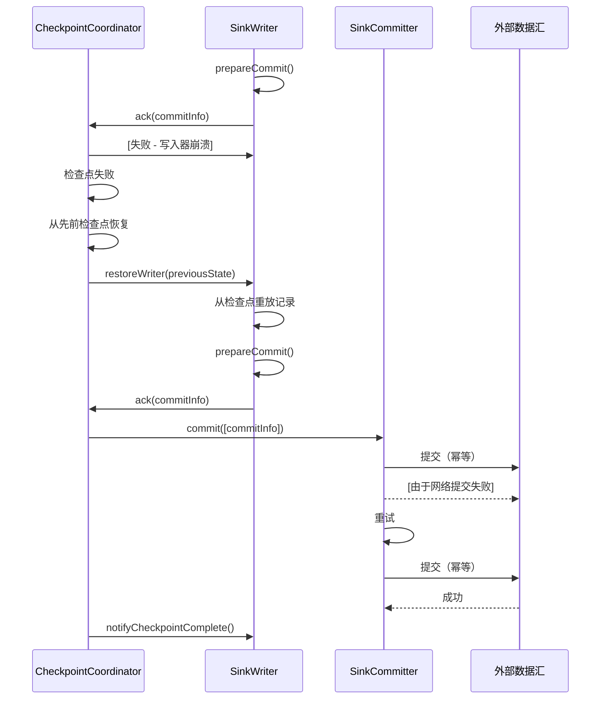

# 数据汇架构

## 1. 概述

### 1.1 问题背景

在分布式环境中向外部系统写入数据面临关键挑战：

- **精确一次保证**：如何确保每条记录精确写入一次，而不是零次或多次？
- **事务一致性**：如何在多个并行写入器之间原子性地提交写入操作？
- **容错**：如何从失败中恢复而不丢失数据或产生重复？
- **反压**：如何处理慢速数据汇而不使系统过载？
- **幂等性**：如何使重试操作安全？

### 1.2 设计目标

SeaTunnel 的数据汇 API 旨在：

1. **保证精确一次语义**：通过两阶段提交实现端到端一致性
2. **支持并行写入**：通过多个写入器实例扩展吞吐量
3. **启用全局协调**：协调分布式写入器之间的提交
4. **确保容错**：从失败中恢复而不产生数据不一致
5. **提供灵活性**：支持各种提交策略（按写入器、聚合、无）

### 1.3 适用场景

- 事务性数据库（JDBC 与 XA 事务）
- 消息队列（Kafka 与事务）
- 文件系统（原子文件重命名）
- 数据湖（Iceberg、Hudi、Delta Lake 与表事务）
- 搜索引擎（Elasticsearch 与版本控制）

## 2. 架构设计

### 2.1 整体架构

```
┌────────────────────────────────────────────────────────────────┐
│              TaskExecutionService（工作节点侧）                 │
│                                                                  │
│   ┌──────────────────────────────────────────────────────┐     │
│   │       SinkWriter<IN, CommitInfoT, StateT>            │     │
│   │                                                        │     │
│   │  • 从上游接收记录                                     │     │
│   │  • 缓冲并写入数据                                     │     │
│   │  • 准备提交信息（无副作用）                           │     │
│   │  • 快照写入器状态                                     │     │
│   │  • 检查点失败时中止                                   │     │
│   └──────────────────────────────────────────────────────┘     │
│                            │                                     │
└────────────────────────────┼─────────────────────────────────────┘
                             │ (CommitInfo)
                             ▼
┌────────────────────────────────────────────────────────────────┐
│                       JobMaster（主节点侧）                     │
│                                                                  │
│   ┌──────────────────────────────────────────────────────┐     │
│   │         SinkCommitter<CommitInfoT>（可选）           │     │
│   │                                                        │     │
│   │  • 从多个写入器接收提交信息                           │     │
│   │  • 独立提交每个写入器的变更                           │     │
│   │  • 重试失败的提交                                     │     │
│   │  • 必须是幂等的                                       │     │
│   └──────────────────────────────────────────────────────┘     │
│                            │                                     │
│                            │ (可选：AggregatedCommitInfo)       │
│                            ▼                                     │
│   ┌──────────────────────────────────────────────────────┐     │
│   │   SinkAggregatedCommitter<CommitInfoT,               │     │
│   │                          AggregatedCommitInfoT>      │     │
│   │                         （可选）                      │     │
│   │                                                        │     │
│   │  • 聚合所有写入器的提交信息                           │     │
│   │  • 执行单个全局提交操作                               │     │
│   │  • 单线程，全局协调器                                 │     │
│   └──────────────────────────────────────────────────────┘     │
│                                                                  │
└──────────────────────────────────────────────────────────────────┘
                             │
                             ▼
                    外部数据汇
               (数据库 / 文件 / 消息队列)
```

### 2.2 核心组件

#### SeaTunnelSink（工厂接口）

作为创建写入器和提交器的工厂的顶层接口。

```java
public interface SeaTunnelSink<IN, StateT, CommitInfoT, AggregatedCommitInfoT>
    extends Serializable {

    /**
     * 创建 SinkWriter（在工作节点上调用）
     */
    SinkWriter<IN, CommitInfoT, StateT> createWriter(SinkWriter.Context context)
        throws IOException;

    /**
     * 从检查点恢复 SinkWriter（在工作节点上调用）
     */
    default SinkWriter<IN, CommitInfoT, StateT> restoreWriter(
        SinkWriter.Context context,
        List<StateT> states) throws IOException {
        return createWriter(context);
    }

    /**
     * 创建 SinkCommitter（可选，在主节点上调用）
     */
    default Optional<SinkCommitter<CommitInfoT>> createCommitter() throws IOException {
        return Optional.empty();
    }

    /**
     * 从检查点恢复 SinkCommitter（可选，在主节点上调用）
     */
    default Optional<SinkCommitter<CommitInfoT>> restoreCommitter() throws IOException {
        return createCommitter();
    }

    /**
     * 创建 SinkAggregatedCommitter（可选，在主节点上调用）
     */
    default Optional<SinkAggregatedCommitter<CommitInfoT, AggregatedCommitInfoT>>
        createAggregatedCommitter() throws IOException {
        return Optional.empty();
    }

    /**
     * 获取输入模式
     */
    CatalogTable getWriteCatalogTable();

    /**
     * 设置作业上下文
     */
    default void setJobContext(JobContext jobContext) {}
}
```

**关键设计点**：
- 三层提交架构：写入器 → 提交器 → 聚合提交器
- 提交器和聚合提交器是可选的（取决于数据汇要求）
- 写入器始终是必需的（执行实际的数据写入）

### 2.3 交互流程

#### 正常写入流程（带两阶段提交）



#### 失败和重试流程



## 3. 关键实现

### 3.1 SinkWriter 接口

写入器在工作节点上运行并执行实际的数据写入。

```java
public interface SinkWriter<IN, CommitInfoT, StateT> extends Closeable {

    /**
     * 写入单条记录
     */
    void write(IN element) throws IOException;

    /**
     * 在检查点期间准备提交信息（必须没有副作用）
     */
    Optional<CommitInfoT> prepareCommit() throws IOException;

    /**
     * 如果检查点失败则中止准备的提交
     */
    default void abortPrepare() {}

    /**
     * 为检查点快照写入器状态
     */
    List<StateT> snapshotState(long checkpointId) throws IOException;

    /**
     * 通知检查点成功完成
     */
    default void notifyCheckpointComplete(long checkpointId) throws IOException {}

    /**
     * 通知检查点已中止
     */
    default void notifyCheckpointAborted(long checkpointId) throws IOException {}

    /**
     * 关闭写入器
     */
    void close() throws IOException;

    /**
     * 与框架交互的上下文
     */
    interface Context {
        int getIndexOfSubtask();
        MetricsContext getMetricsContext();
    }
}
```

**关键要求**：
- `prepareCommit()` **必须没有**副作用（尚未实际提交）
- `prepareCommit()` 返回将传递给提交器的提交信息
- `snapshotState()` 返回的状态必须捕获所有未提交的写入
- 如果 `prepareCommit()` 后检查点失败，则调用 `abortPrepare()`

**实现示例（JDBC 与 XA 事务）**：

```java
public class JdbcExactlyOnceSinkWriter implements SinkWriter<SeaTunnelRow, XidInfo, Void> {

    private final XAConnection xaConnection;
    private final XAResource xaResource;
    private final Connection connection;
    private final PreparedStatement statement;
    private final List<Xid> pendingXids = new ArrayList<>();

    @Override
    public void write(SeaTunnelRow element) throws IOException {
        try {
            // 如果需要启动 XA 事务
            if (currentXid == null) {
                currentXid = generateXid();
                xaResource.start(currentXid, XAResource.TMNOFLAGS);
            }

            // 执行 INSERT（缓冲在事务中）
            setParameters(statement, element);
            statement.executeUpdate();

        } catch (SQLException e) {
            throw new IOException("Failed to write record", e);
        }
    }

    @Override
    public Optional<XidInfo> prepareCommit() throws IOException {
        if (currentXid == null) {
            return Optional.empty(); // 没有写入数据
        }

        try {
            // 结束 XA 事务
            xaResource.end(currentXid, XAResource.TMSUCCESS);

            // 准备 XA 事务（第一阶段 - 尚无副作用）
            xaResource.prepare(currentXid);

            // 返回 XID 给提交器
            XidInfo xidInfo = new XidInfo(currentXid);
            pendingXids.add(currentXid);
            currentXid = null;

            return Optional.of(xidInfo);

        } catch (XAException e) {
            throw new IOException("Failed to prepare XA transaction", e);
        }
    }

    @Override
    public void abortPrepare() {
        // 回滚准备的事务
        if (currentXid != null) {
            try {
                xaResource.rollback(currentXid);
            } catch (XAException e) {
                LOG.error("Failed to rollback XA transaction", e);
            }
        }
    }

    @Override
    public List<Void> snapshotState(long checkpointId) {
        // 对于 XA，状态由数据库管理
        return Collections.emptyList();
    }
}
```

**实现示例（文件数据汇与原子重命名）**：

```java
public class FileSinkWriter implements SinkWriter<SeaTunnelRow, FileCommitInfo, FileWriterState> {

    private final String tempFilePath;
    private final String finalFilePath;
    private final OutputStream outputStream;
    private long bytesWritten = 0;

    @Override
    public void write(SeaTunnelRow element) throws IOException {
        // 写入临时文件
        byte[] bytes = serialize(element);
        outputStream.write(bytes);
        bytesWritten += bytes.length;
    }

    @Override
    public Optional<FileCommitInfo> prepareCommit() throws IOException {
        // 刷新并关闭临时文件（尚未重命名！）
        outputStream.flush();
        outputStream.close();

        // 返回提交信息供提交器重命名文件
        return Optional.of(new FileCommitInfo(tempFilePath, finalFilePath));
    }

    @Override
    public void abortPrepare() {
        // 删除临时文件
        new File(tempFilePath).delete();
    }

    @Override
    public List<FileWriterState> snapshotState(long checkpointId) {
        // 保存当前写入位置
        return Collections.singletonList(new FileWriterState(bytesWritten));
    }
}
```

### 3.2 SinkCommitter 接口

提交器在主节点上运行并协调多个写入器的提交。

```java
public interface SinkCommitter<CommitInfoT> extends Closeable {

    /**
     * 提交多个提交信息（来自多个写入器或重试）
     * 必须是幂等的 - 可能使用相同的 commitInfo 多次调用
     */
    List<CommitInfoT> commit(List<CommitInfoT> commitInfos) throws IOException;

    /**
     * 中止提交信息（可选）
     */
    default void abort(List<CommitInfoT> commitInfos) throws IOException {}

    /**
     * 关闭提交器
     */
    void close() throws IOException;
}
```

**关键要求**：
- `commit()` **必须**是幂等的（使用相同的 commitInfo 调用两次应该是安全的）
- 返回**失败的** commitInfos 列表（将被重试）
- 应优雅地处理部分失败

**实现示例（JDBC XA 提交器）**：

```java
public class JdbcSinkCommitter implements SinkCommitter<XidInfo> {

    private final XADataSource xaDataSource;

    @Override
    public List<XidInfo> commit(List<XidInfo> commitInfos) throws IOException {
        List<XidInfo> failed = new ArrayList<>();

        for (XidInfo xidInfo : commitInfos) {
            try {
                XAConnection xaConn = xaDataSource.getXAConnection();
                XAResource xaResource = xaConn.getXAResource();

                // 第二阶段：提交准备的事务
                xaResource.commit(xidInfo.getXid(), false);

                xaConn.close();

            } catch (XAException e) {
                if (e.errorCode == XAException.XAER_NOTA) {
                    // 事务已提交（幂等）
                    LOG.info("XA transaction already committed: {}", xidInfo.getXid());
                } else {
                    // 提交失败，将重试
                    LOG.error("Failed to commit XA transaction: {}", xidInfo.getXid(), e);
                    failed.add(xidInfo);
                }
            }
        }

        return failed; // 框架将重试失败的提交
    }

    @Override
    public void abort(List<XidInfo> commitInfos) {
        // 回滚准备的事务
        for (XidInfo xidInfo : commitInfos) {
            try {
                XAConnection xaConn = xaDataSource.getXAConnection();
                xaConn.getXAResource().rollback(xidInfo.getXid());
                xaConn.close();
            } catch (Exception e) {
                LOG.error("Failed to rollback XA transaction", e);
            }
        }
    }
}
```

**实现示例（文件提交器与原子重命名）**：

```java
public class FileSinkCommitter implements SinkCommitter<FileCommitInfo> {

    private final FileSystem fileSystem;

    @Override
    public List<FileCommitInfo> commit(List<FileCommitInfo> commitInfos) {
        List<FileCommitInfo> failed = new ArrayList<>();

        for (FileCommitInfo commitInfo : commitInfos) {
            try {
                Path tempPath = new Path(commitInfo.getTempFilePath());
                Path finalPath = new Path(commitInfo.getFinalFilePath());

                // 原子重命名（提交）
                if (fileSystem.exists(finalPath)) {
                    // 文件已提交（幂等）
                    LOG.info("File already exists, skipping: {}", finalPath);
                    fileSystem.delete(tempPath, false); // 清理临时文件
                } else {
                    boolean success = fileSystem.rename(tempPath, finalPath);
                    if (!success) {
                        failed.add(commitInfo);
                    }
                }

            } catch (IOException e) {
                LOG.error("Failed to commit file: {}", commitInfo, e);
                failed.add(commitInfo);
            }
        }

        return failed;
    }
}
```

### 3.3 SinkAggregatedCommitter 接口

聚合提交器为所有写入器执行单个全局提交。

```java
public interface SinkAggregatedCommitter<CommitInfoT, AggregatedCommitInfoT>
    extends Closeable {

    /**
     * 将多个写入器的提交信息合并为单个聚合信息
     */
    AggregatedCommitInfoT combine(List<CommitInfoT> commitInfos);

    /**
     * 提交聚合信息（单个全局操作）
     * 必须是幂等的
     */
    List<AggregatedCommitInfoT> commit(List<AggregatedCommitInfoT> aggregatedCommitInfos)
        throws IOException;

    /**
     * 中止聚合提交信息
     */
    default void abort(List<AggregatedCommitInfoT> aggregatedCommitInfos) throws IOException {}

    /**
     * 从检查点恢复提交器状态
     */
    default void restoreCommit(List<AggregatedCommitInfoT> aggregatedCommitInfos)
        throws IOException {}

    /**
     * 关闭提交器
     */
    void close() throws IOException;
}
```

**使用场景**：
- Hive 表提交（所有分区的单个 COMMIT TRANSACTION）
- Iceberg 表提交（单个表快照）
- 全局索引更新（为所有写入更新一次索引）

**实现示例（Hive 数据汇）**：

```java
public class HiveAggregatedCommitter
    implements SinkAggregatedCommitter<HiveWriteInfo, HiveCommitInfo> {

    @Override
    public HiveCommitInfo combine(List<HiveWriteInfo> commitInfos) {
        // 收集所有写入器写入的文件
        List<String> allFiles = new ArrayList<>();
        for (HiveWriteInfo writeInfo : commitInfos) {
            allFiles.addAll(writeInfo.getWrittenFiles());
        }
        return new HiveCommitInfo(allFiles);
    }

    @Override
    public List<HiveCommitInfo> commit(List<HiveCommitInfo> aggregatedCommitInfos) {
        List<HiveCommitInfo> failed = new ArrayList<>();

        for (HiveCommitInfo commitInfo : aggregatedCommitInfos) {
            try {
                // 整个表的单个全局提交
                hiveMetastore.beginTransaction();

                for (String file : commitInfo.getAllFiles()) {
                    hiveMetastore.addPartitionFile(tableName, file);
                }

                hiveMetastore.commitTransaction(); // 全局原子提交

            } catch (Exception e) {
                LOG.error("Failed to commit to Hive", e);
                hiveMetastore.rollbackTransaction();
                failed.add(commitInfo);
            }
        }

        return failed;
    }
}
```

### 3.4 代码参考

**API 接口**：
- [SeaTunnelSink.java](../../../seatunnel-api/src/main/java/org/apache/seatunnel/api/sink/SeaTunnelSink.java)
- [SinkWriter.java](../../../seatunnel-api/src/main/java/org/apache/seatunnel/api/sink/SinkWriter.java)
- [SinkCommitter.java](../../../seatunnel-api/src/main/java/org/apache/seatunnel/api/sink/SinkCommitter.java)
- [SinkAggregatedCommitter.java](../../../seatunnel-api/src/main/java/org/apache/seatunnel/api/sink/SinkAggregatedCommitter.java)

**示例实现**：
- JDBC 数据汇：`seatunnel-connectors-v2/connector-jdbc/src/main/java/org/apache/seatunnel/connectors/seatunnel/jdbc/sink/`
- Kafka 数据汇：`seatunnel-connectors-v2/connector-kafka/src/main/java/org/apache/seatunnel/connectors/seatunnel/kafka/sink/`
- 文件数据汇：`seatunnel-connectors-v2/connector-file/connector-file-base/src/main/java/org/apache/seatunnel/connectors/seatunnel/file/sink/`

## 4. 设计考量

### 4.1 设计权衡

#### 两阶段提交

**优点**：
- 强一致性保证（精确一次）
- 自动失败恢复
- 准备和提交之间的清晰分离

**缺点**：
- 增加延迟（数据仅在提交后可见）
- 需要数据汇中的事务支持
- 提交信息的额外状态
- 更复杂的实现

**何时使用**：
- 金融交易、计费、审计日志
- 任何需要精确一次保证的场景

**何时不使用**：
- 至少一次可接受（日志、指标）
- 数据汇不支持事务
- 需要超低延迟

#### 三层 vs 两层提交

**两层（写入器 → 提交器）**：
- 每个写入器的提交独立处理
- 并行提交操作
- 适用于大多数数据汇

**三层（写入器 → 提交器 → 聚合提交器）**：
- 所有写入器的提交聚合为单个操作
- 单个全局提交点
- 表级事务所需（Hive、Iceberg）

### 4.2 性能考量

#### 批量写入

```java
public class BatchSinkWriter {
    private final List<SeaTunnelRow> batch = new ArrayList<>();
    private static final int BATCH_SIZE = 1000;

    @Override
    public void write(SeaTunnelRow element) {
        batch.add(element);
        if (batch.size() >= BATCH_SIZE) {
            flushBatch();
        }
    }

    private void flushBatch() {
        // 在单个操作中写入整个批次
        statement.executeBatch();
        batch.clear();
    }
}
```

**好处**：
- 摊销每条记录的开销
- 减少网络往返
- 更好的吞吐量

#### 异步写入

```java
public class AsyncSinkWriter {
    private final BlockingQueue<CompletableFuture<Void>> pendingWrites = new LinkedBlockingQueue<>();

    @Override
    public void write(SeaTunnelRow element) {
        CompletableFuture<Void> future = CompletableFuture.runAsync(() -> {
            // 异步写入操作
            actualWrite(element);
        }, executorService);

        pendingWrites.add(future);
    }

    @Override
    public Optional<CommitInfo> prepareCommit() {
        // 等待所有待处理的写入完成
        for (CompletableFuture<Void> future : pendingWrites) {
            future.join();
        }
        pendingWrites.clear();

        return Optional.of(createCommitInfo());
    }
}
```

#### 连接池

```java
public class JdbcSinkWriter {
    private final HikariDataSource dataSource;

    @Override
    public void write(SeaTunnelRow element) {
        try (Connection conn = dataSource.getConnection()) {
            // 重用池化连接
            PreparedStatement stmt = conn.prepareStatement(sql);
            stmt.executeUpdate();
        }
    }
}
```

### 4.3 幂等性模式

#### 1. 自然幂等性（Upsert）

```java
// INSERT ON DUPLICATE KEY UPDATE (MySQL)
String sql = "INSERT INTO table (id, name) VALUES (?, ?) " +
             "ON DUPLICATE KEY UPDATE name = VALUES(name)";

// MERGE INTO (Oracle, SQL Server)
String sql = "MERGE INTO table USING (SELECT ? as id, ? as name FROM dual) src " +
             "ON (table.id = src.id) " +
             "WHEN MATCHED THEN UPDATE SET table.name = src.name " +
             "WHEN NOT MATCHED THEN INSERT (id, name) VALUES (src.id, src.name)";
```

#### 2. 去重键

```java
public class KafkaSinkWriter {
    @Override
    public void write(SeaTunnelRow element) {
        ProducerRecord<String, String> record = new ProducerRecord<>(
            topic,
            element.getField(0).toString(), // 用于去重的键
            element.toString()
        );

        // Kafka 基于（topic、partition、offset、幂等生产者）去重
        producer.send(record);
    }
}
```

#### 3. 外部去重表

```java
public class JdbcCommitter {
    @Override
    public List<XidInfo> commit(List<XidInfo> commitInfos) {
        for (XidInfo xidInfo : commitInfos) {
            String xidString = xidInfo.getXid().toString();

            // 检查是否已提交
            boolean exists = checkCommitTable(xidString);
            if (exists) {
                LOG.info("XID already committed: {}", xidString);
                continue; // 幂等
            }

            // 提交事务
            xaResource.commit(xidInfo.getXid(), false);

            // 记录提交
            insertCommitTable(xidString, System.currentTimeMillis());
        }
    }
}
```

## 5. 最佳实践

### 5.1 使用建议

**1. 选择适当的提交级别**

```java
// 简单数据汇：仅写入器（至少一次）
public class SimpleSink implements SeaTunnelSink<...> {
    SinkWriter createWriter(...) { return new SimpleWriter(); }
    // 无提交器 - 直接写入数据
}

// 事务性数据汇：写入器 + 提交器（精确一次）
public class TransactionalSink implements SeaTunnelSink<...> {
    SinkWriter createWriter(...) { return new TransactionalWriter(); }
    Optional<SinkCommitter> createCommitter() { return Optional.of(new Committer()); }
}

// 表数据汇：写入器 + 提交器 + 聚合提交器
public class TableSink implements SeaTunnelSink<...> {
    SinkWriter createWriter(...) { return new TableWriter(); }
    Optional<SinkCommitter> createCommitter() { return Optional.of(new Committer()); }
    Optional<SinkAggregatedCommitter> createAggregatedCommitter() {
        return Optional.of(new AggregatedCommitter());
    }
}
```

**2. 正确的状态管理**

```java
public class StatefulSinkWriter {
    private long recordsWritten = 0;
    private long bytesWritten = 0;

    @Override
    public List<WriterState> snapshotState(long checkpointId) {
        return Collections.singletonList(
            new WriterState(recordsWritten, bytesWritten)
        );
    }

    public StatefulSinkWriter restoreState(List<WriterState> states) {
        if (!states.isEmpty()) {
            WriterState state = states.get(0);
            this.recordsWritten = state.getRecordsWritten();
            this.bytesWritten = state.getBytesWritten();
        }
        return this;
    }
}
```

**3. 资源管理**

```java
@Override
public void close() throws IOException {
    // 按创建的相反顺序关闭
    if (statement != null) statement.close();
    if (connection != null) connection.close();
    if (dataSource != null) dataSource.close();
}
```

### 5.2 常见陷阱

**1. prepareCommit() 中的副作用**

```java
// ❌ 错误：在 prepareCommit() 中实际提交
public Optional<CommitInfo> prepareCommit() {
    connection.commit(); // 错误！这是副作用！
    return Optional.of(new CommitInfo());
}

// ✅ 正确：只准备，无副作用
public Optional<CommitInfo> prepareCommit() {
    xaResource.end(xid, XAResource.TMSUCCESS);
    xaResource.prepare(xid); // 仅准备，尚未提交
    return Optional.of(new XidInfo(xid));
}
```

**2. 非幂等提交**

```java
// ❌ 错误：直接 INSERT（非幂等）
public List<CommitInfo> commit(List<CommitInfo> commitInfos) {
    for (CommitInfo info : commitInfos) {
        executeInsert(info); // 如果调用两次可能失败！
    }
}

// ✅ 正确：UPSERT（幂等）
public List<CommitInfo> commit(List<CommitInfo> commitInfos) {
    for (CommitInfo info : commitInfos) {
        executeUpsert(info); // 多次调用安全
    }
}
```

**3. 大状态**

```java
// ❌ 错误：在状态中缓冲所有记录
public class BadWriter {
    private List<SeaTunnelRow> bufferedRows = new ArrayList<>(); // 可能很大！

    public List<State> snapshotState() {
        return Collections.singletonList(new State(bufferedRows));
    }
}

// ✅ 正确：检查点前刷新，仅跟踪元数据
public class GoodWriter {
    private long lastCommittedOffset = 0;

    public Optional<CommitInfo> prepareCommit() {
        flushBufferedRows(); // 写入外部系统
        return Optional.of(new CommitInfo(lastCommittedOffset));
    }
}
```

### 5.3 调试技巧

**1. 启用 XA 事务日志**

```java
// 记录 XA 操作以进行调试
LOG.info("Starting XA transaction: {}", xid);
xaResource.start(xid, XAResource.TMNOFLAGS);

LOG.info("Preparing XA transaction: {}", xid);
xaResource.prepare(xid);

LOG.info("Committing XA transaction: {}", xid);
xaResource.commit(xid, false);
```

**2. 跟踪提交进度**

```java
public class MonitoredCommitter {
    private final Counter commitAttempts = metricGroup.counter("commit_attempts");
    private final Counter commitSuccesses = metricGroup.counter("commit_successes");
    private final Counter commitFailures = metricGroup.counter("commit_failures");

    public List<CommitInfo> commit(List<CommitInfo> commitInfos) {
        commitAttempts.inc(commitInfos.size());

        List<CommitInfo> failed = new ArrayList<>();
        for (CommitInfo info : commitInfos) {
            try {
                doCommit(info);
                commitSuccesses.inc();
            } catch (Exception e) {
                commitFailures.inc();
                failed.add(info);
            }
        }
        return failed;
    }
}
```

**3. 测试失败场景**

```java
@Test
public void testCheckpointFailureRecovery() {
    // 写入数据
    writer.write(row1);
    writer.write(row2);

    // 准备提交
    Optional<CommitInfo> commitInfo = writer.prepareCommit();

    // 模拟检查点失败
    writer.abortPrepare();

    // 验证没有提交数据
    assertFalse(dataExistsInSink());

    // 恢复并重试
    writer.write(row1);
    writer.write(row2);
    commitInfo = writer.prepareCommit();

    // 提交应该成功
    committer.commit(Collections.singletonList(commitInfo.get()));
    assertTrue(dataExistsInSink());
}
```

## 6. 相关资源

- [架构概览](../overview.md)
- [设计理念](../design-philosophy.md)
- [数据源架构](source-architecture.md)
- [检查点机制](../fault-tolerance/checkpoint-mechanism.md)
- [精确一次语义](../fault-tolerance/exactly-once.md)

## 7. 参考资料

### 示例连接器

- **简单数据汇**：ConsoleSink（输出到标准输出）
- **文件数据汇**：FileSink（原子文件重命名）
- **数据库数据汇**：JdbcSink（XA 事务）
- **流式数据汇**：KafkaSink（Kafka 事务）
- **表数据汇**：IcebergSink（表提交）

### 进一步阅读

- [两阶段提交协议](https://en.wikipedia.org/wiki/Two-phase_commit_protocol)
- [XA 事务](https://www.oracle.com/java/technologies/xa-transactions.html)
- [Kafka 事务](https://kafka.apache.org/documentation/#semantics)
- [Iceberg 表格式](https://iceberg.apache.org/spec/)
