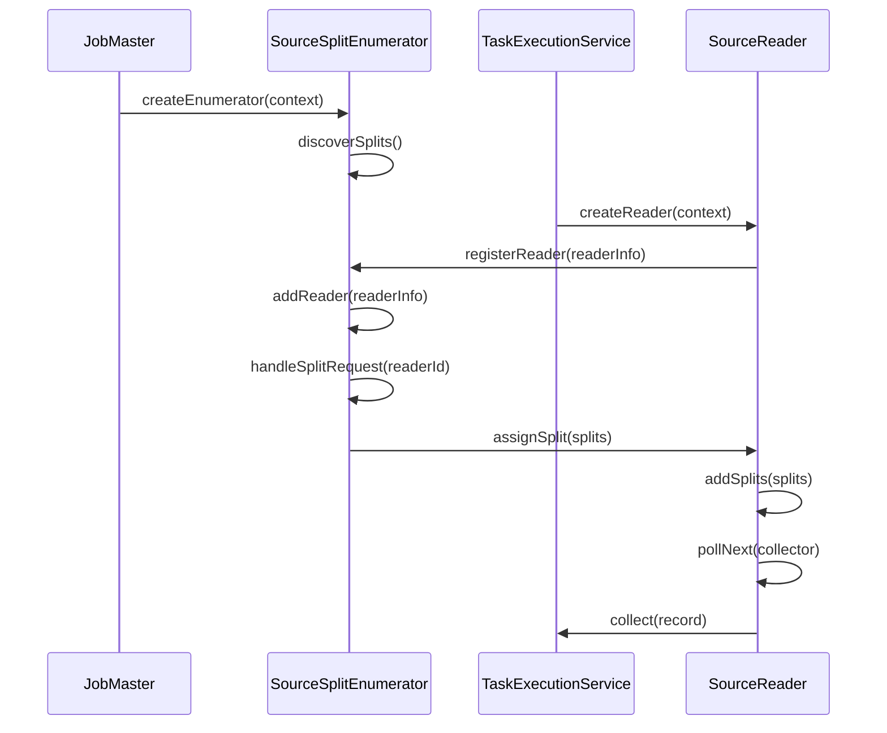
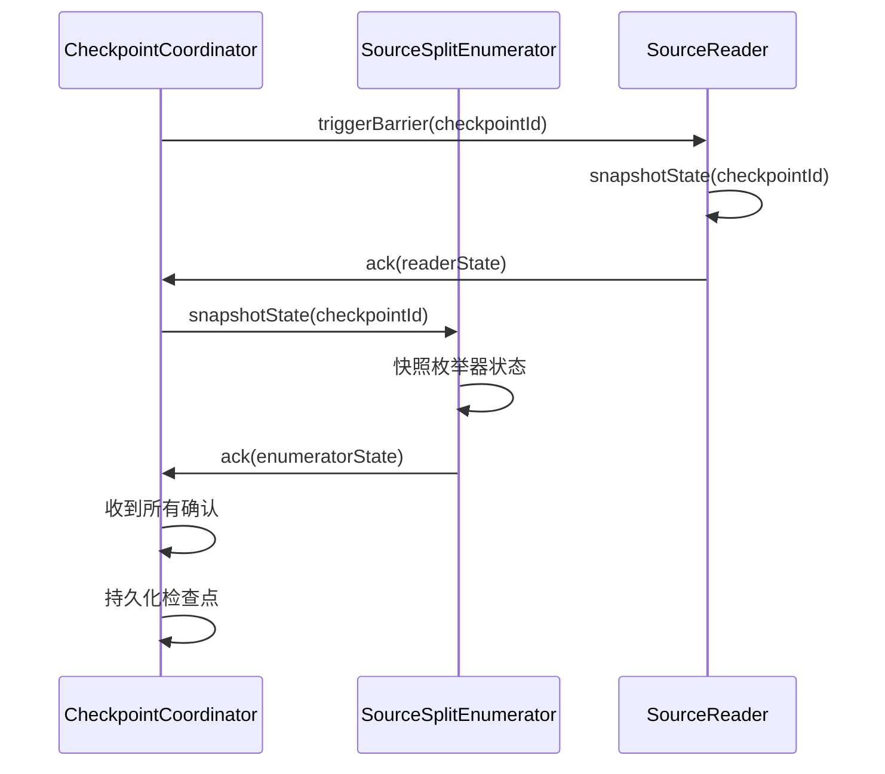
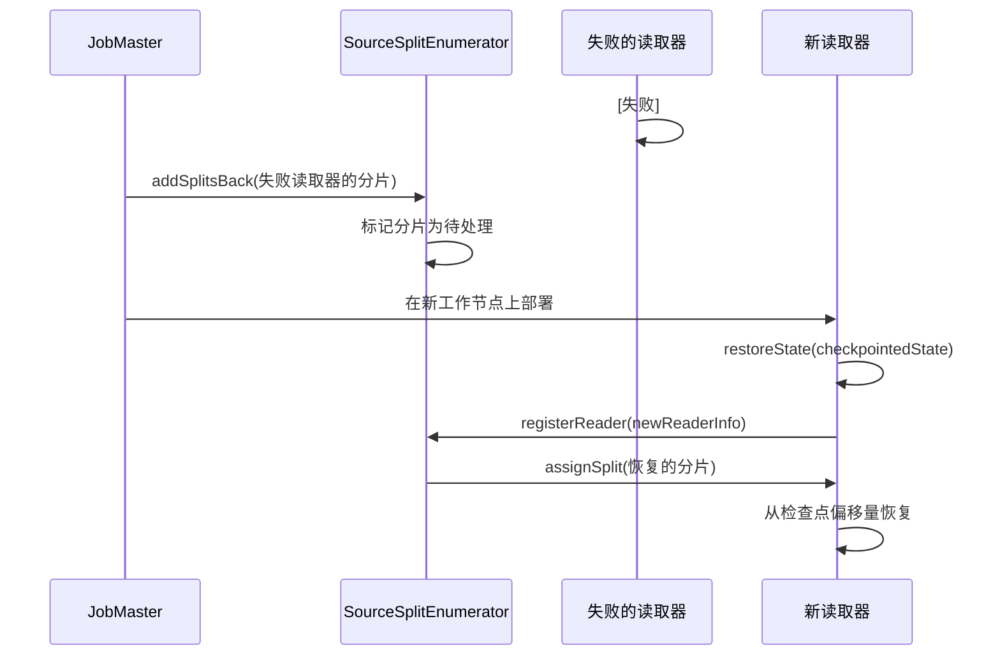

# 数据源架构

## 1. 概述

### 1.1 问题背景

分布式系统中的数据源面临几个挑战：

- **并行度**：如何从单个数据源并行读取数据？
- **容错**：失败后如何从中断处恢复？
- **动态分配**：如何处理工作节点失败并重新分配工作？
- **有界 vs 无界**：如何统一批处理和流式数据源？
- **反压**：如何处理下游处理缓慢的情况？

### 1.2 设计目标

SeaTunnel 的数据源 API 旨在：

1. **启用并行读取**：通过基于分片的并行度支持可扩展性
2. **确保容错**：检查点分片状态以实现精确一次处理
3. **分离协调与执行**：枚举器（主节点）和读取器（工作节点）分离
4. **支持动态分配**：在失败或不平衡时重新分配分片
5. **统一批处理和流处理**：有界和无界数据源的单一 API

### 1.3 适用场景

- 基于文件的数据源（本地文件、HDFS、S3、OSS）
- 数据库数据源（MySQL、PostgreSQL、Oracle、JDBC 兼容）
- 消息队列数据源（Kafka、Pulsar、RabbitMQ）
- CDC 数据源（MySQL CDC、PostgreSQL CDC、Oracle CDC）
- 流式数据源（Socket、HTTP、自定义协议）

## 2. 架构设计

### 2.1 整体架构

```
┌──────────────────────────────────────────────────────────────┐
│                       JobMaster（主节点侧）                   │
│                                                                │
│   ┌────────────────────────────────────────────────────┐     │
│   │         SourceSplitEnumerator<SplitT, StateT>      │     │
│   │                                                      │     │
│   │  • 生成分片（discoverSplits）                       │     │
│   │  • 分配分片给读取器                                 │     │
│   │  • 处理读取器注册                                   │     │
│   │  • 处理分片请求                                     │     │
│   │  • 从失败的读取器回收分片                           │     │
│   │  • 快照枚举器状态                                   │     │
│   │  • 发送/接收自定义事件                              │     │
│   └────────────────────────────────────────────────────┘     │
│                            │                                   │
└────────────────────────────┼───────────────────────────────────┘
                             │ (分片分配)
                             ▼
┌──────────────────────────────────────────────────────────────┐
│                  TaskExecutionService（工作节点侧）           │
│                                                                │
│   ┌────────────────────────────────────────────────────┐     │
│   │          SourceReader<T, SplitT, StateT>           │     │
│   │                                                      │     │
│   │  • 接收分配的分片                                   │     │
│   │  • 从分片读取数据                                   │     │
│   │  • 向下游发送记录                                   │     │
│   │  • 快照读取器状态（分片进度）                       │     │
│   │  • 处理分片完成                                     │     │
│   │  • 发送/接收自定义事件                              │     │
│   └────────────────────────────────────────────────────┘     │
│                            │                                   │
└────────────────────────────┼───────────────────────────────────┘
                             │
                             ▼
                       SeaTunnelRow
                       (到转换/数据汇)
```

### 2.2 核心组件

#### SeaTunnelSource（工厂接口）

作为创建读取器和枚举器的工厂的顶层接口。

```java
public interface SeaTunnelSource<T, SplitT extends SourceSplit, StateT extends Serializable>
    extends Serializable {

    /**
     * 获取数据源有界性（批处理为 BOUNDED，流处理为 UNBOUNDED）
     */
    Boundedness getBoundedness();

    /**
     * 创建 SourceReader（在工作节点上调用）
     */
    SourceReader<T, SplitT> createReader(SourceReader.Context readerContext) throws Exception;

    /**
     * 创建 SourceSplitEnumerator（在主节点上调用）
     */
    SourceSplitEnumerator<SplitT, StateT> createEnumerator(
        SourceSplitEnumerator.Context<SplitT> enumeratorContext) throws Exception;

    /**
     * 从检查点恢复 SourceSplitEnumerator（在主节点上调用）
     */
    SourceSplitEnumerator<SplitT, StateT> restoreEnumerator(
        SourceSplitEnumerator.Context<SplitT> enumeratorContext,
        StateT checkpointState) throws Exception;

    /**
     * 获取输出模式（带 TableSchema 的 CatalogTable）
     */
    CatalogTable getProducedCatalogTable();
}
```

**关键方法**：
- `getBoundedness()`：指示数据源是有界（批处理）还是无界（流处理）
- `createReader()`：读取器实例的工厂（每个工作节点任务一个）
- `createEnumerator()`：枚举器的工厂（主节点上的单个实例）
- `restoreEnumerator()`：从检查点状态恢复枚举器
- `getProducedCatalogTable()`：定义输出模式

#### SourceSplit（最小可序列化单元）

表示数据的可分区单元。

```java
public interface SourceSplit extends Serializable {
    /**
     * 此分片的唯一标识符
     */
    String splitId();
}
```

**实现示例**：

```java
// 基于文件的分片
public class FileSplit implements SourceSplit {
    private final String splitId;
    private final String filePath;
    private final long startOffset;
    private final long length;
}

// 基于 JDBC 的分片（查询范围）
public class JdbcSourceSplit implements SourceSplit {
    private final String splitId;
    private final String query;
    private final Object[] queryParams;
}

// 基于 Kafka 的分片（分区）
public class KafkaSourceSplit implements SourceSplit {
    private final String splitId;
    private final String topic;
    private final int partition;
    private final long startOffset;
}
```

**设计说明**：
- 分片必须可序列化以进行网络传输
- 分片状态（例如，当前偏移量）单独存储在读取器状态中
- 分片可以重新分配给不同的读取器

### 2.3 交互流程

#### 初始启动流程



#### 检查点流程



#### 失败恢复流程



## 3. 关键实现

### 3.1 SourceSplitEnumerator 接口

枚举器在主节点侧运行并协调分片分配。

```java
public interface SourceSplitEnumerator<SplitT extends SourceSplit, StateT> {

    /**
     * 枚举器启动时调用
     */
    void open();

    /**
     * 调用以发现分片（急切或延迟）
     */
    void run() throws Exception;

    /**
     * 新读取器注册时调用
     */
    void addReader(int subtaskId);

    /**
     * 读取器请求分片时调用
     */
    void handleSplitRequest(int subtaskId);

    /**
     * 读取器报告分片完成时调用
     */
    void handleSplitFinished(int subtaskId, String finishedSplit);

    /**
     * 读取器失败时调用 - 回收其分片
     */
    void addSplitsBack(List<SplitT> splits, int subtaskId);

    /**
     * 为检查点快照枚举器状态
     */
    StateT snapshotState(long checkpointId) throws Exception;

    /**
     * 处理来自读取器的自定义事件
     */
    void handleSourceEvent(int subtaskId, SourceEvent sourceEvent);

    /**
     * 检查点完成时调用
     */
    void notifyCheckpointComplete(long checkpointId) throws Exception;

    /**
     * 关闭枚举器
     */
    void close() throws IOException;

    /**
     * 与框架交互的上下文
     */
    interface Context<SplitT extends SourceSplit> {
        int currentParallelism();
        Set<Integer> registeredReaders();
        void assignSplit(int subtaskId, List<SplitT> splits);
        void signalNoMoreSplits(int subtaskId);
        void sendEventToSourceReader(int subtaskId, SourceEvent event);
    }
}
```

**关键职责**：
- **分片发现**：从数据源生成分片（文件、分区、分片）
- **分配策略**：决定哪些分片分配给哪些读取器
- **动态处理**：处理读取器注册、分片请求、失败
- **状态管理**：快照剩余分片和分配状态

**实现示例**：

```java
public class JdbcSourceSplitEnumerator implements SourceSplitEnumerator<JdbcSourceSplit, JdbcSourceState> {

    private final Queue<JdbcSourceSplit> pendingSplits = new LinkedList<>();
    private final Set<String> assignedSplits = new HashSet<>();
    private final Context<JdbcSourceSplit> context;

    @Override
    public void run() throws Exception {
        // 通过查询数据库元数据发现分片
        List<JdbcSourceSplit> splits = generateSplitsByPartition();
        pendingSplits.addAll(splits);
    }

    @Override
    public void handleSplitRequest(int subtaskId) {
        // 分配下一个可用的分片
        JdbcSourceSplit split = pendingSplits.poll();
        if (split != null) {
            context.assignSplit(subtaskId, Collections.singletonList(split));
            assignedSplits.add(split.splitId());
        } else {
            context.signalNoMoreSplits(subtaskId);
        }
    }

    @Override
    public void addSplitsBack(List<JdbcSourceSplit> splits, int subtaskId) {
        // 从失败的读取器回收分片
        pendingSplits.addAll(splits);
        splits.forEach(split -> assignedSplits.remove(split.splitId()));
    }

    @Override
    public JdbcSourceState snapshotState(long checkpointId) {
        // 保存剩余分片和分配信息
        return new JdbcSourceState(new ArrayList<>(pendingSplits), assignedSplits);
    }
}
```

### 3.2 SourceReader 接口

读取器在工作节点上运行并执行实际的数据读取。

```java
public interface SourceReader<T, SplitT extends SourceSplit> {

    /**
     * 读取器启动时调用
     */
    void open() throws Exception;

    /**
     * 轮询下一批记录（非阻塞或超时）
     */
    void pollNext(Collector<T> output) throws Exception;

    /**
     * 添加新分配的分片
     */
    void addSplits(List<SplitT> splits);

    /**
     * 信号不会再分配更多分片
     */
    void handleNoMoreSplits();

    /**
     * 为检查点快照读取器状态
     */
    List<StateT> snapshotState(long checkpointId) throws Exception;

    /**
     * 处理来自枚举器的自定义事件
     */
    void handleSourceEvent(SourceEvent sourceEvent);

    /**
     * 通知检查点完成
     */
    void notifyCheckpointComplete(long checkpointId) throws Exception;

    /**
     * 关闭读取器
     */
    void close() throws IOException;

    /**
     * 与框架交互的上下文
     */
    interface Context {
        int getIndexOfSubtask();
        void sendSplitRequest();
        void sendSourceEventToEnumerator(SourceEvent event);
    }
}
```

**关键职责**：
- **数据读取**：从分配的分片拉取记录
- **进度跟踪**：跟踪每个分片内的偏移量/位置
- **状态管理**：快照分片进度以进行恢复
- **分片管理**：处理分片分配、完成和删除

**实现示例**：

```java
public class JdbcSourceReader implements SourceReader<SeaTunnelRow, JdbcSourceSplit> {

    private final Queue<JdbcSourceSplit> pendingSplits = new LinkedList<>();
    private JdbcSourceSplit currentSplit;
    private ResultSet currentResultSet;

    @Override
    public void pollNext(Collector<SeaTunnelRow> output) throws Exception {
        if (currentResultSet == null) {
            // 获取下一个分片
            currentSplit = pendingSplits.poll();
            if (currentSplit == null) {
                context.sendSplitRequest(); // 请求更多分片
                return;
            }
            // 为当前分片执行查询
            currentResultSet = executeQuery(currentSplit);
        }

        // 读取批量行
        int count = 0;
        while (currentResultSet.next() && count++ < BATCH_SIZE) {
            SeaTunnelRow row = convertToRow(currentResultSet);
            output.collect(row);
        }

        // 检查分片是否完成
        if (!currentResultSet.next()) {
            currentResultSet.close();
            currentResultSet = null;
            currentSplit = null;
        }
    }

    @Override
    public void addSplits(List<JdbcSourceSplit> splits) {
        pendingSplits.addAll(splits);
    }

    @Override
    public List<JdbcSourceState> snapshotState(long checkpointId) {
        // 保存当前分片和偏移量
        List<JdbcSourceState> states = new ArrayList<>();
        if (currentSplit != null) {
            states.add(new JdbcSourceState(currentSplit, currentRow));
        }
        pendingSplits.forEach(split ->
            states.add(new JdbcSourceState(split, 0)));
        return states;
    }
}
```

### 3.3 SourceEvent（自定义通信）

允许枚举器和读取器交换自定义消息。

```java
public interface SourceEvent extends Serializable {
}

// 示例：读取器通知枚举器发现的分区
public class PartitionDiscoveredEvent implements SourceEvent {
    private final List<String> newPartitions;
}

// 示例：枚举器通知读取器配置更改
public class ConfigChangeEvent implements SourceEvent {
    private final Map<String, String> newConfig;
}
```

**使用场景**：
- 动态分区发现（Kafka、HDFS）
- 运行时配置更改
- 自定义协调逻辑

### 3.4 代码参考

**API 接口**：
- [SeaTunnelSource.java](../../../seatunnel-api/src/main/java/org/apache/seatunnel/api/source/SeaTunnelSource.java)
- [SourceSplitEnumerator.java](../../../seatunnel-api/src/main/java/org/apache/seatunnel/api/source/SourceSplitEnumerator.java)
- [SourceReader.java](../../../seatunnel-api/src/main/java/org/apache/seatunnel/api/source/SourceReader.java)
- [SourceSplit.java](../../../seatunnel-api/src/main/java/org/apache/seatunnel/api/source/SourceSplit.java)

**示例实现**：
- JDBC 数据源：`seatunnel-connectors-v2/connector-jdbc/src/main/java/org/apache/seatunnel/connectors/seatunnel/jdbc/source/`
- Kafka 数据源：`seatunnel-connectors-v2/connector-kafka/src/main/java/org/apache/seatunnel/connectors/seatunnel/kafka/source/`
- 文件数据源：`seatunnel-connectors-v2/connector-file/connector-file-base/src/main/java/org/apache/seatunnel/connectors/seatunnel/file/source/`

## 4. 设计考量

### 4.1 设计权衡

#### 枚举器-读取器分离

**优点**：
- 清晰分离协调（主节点）和执行（工作节点）
- 枚举器可以在读取器不知情的情况下重新分配分片
- 集中协调简化分片分配逻辑
- 容错：枚举器和读取器独立失败

**缺点**：
- 额外的网络通信（分片分配消息）
- 连接器开发人员的 API 更复杂
- 如果枚举器速度慢，可能成为瓶颈

**缓解措施**：
- 异步分片分配
- 批量分片请求/分配
- 延迟分片发现

#### 分片粒度

**粗粒度分片**（少量大分片）：
- **优点**：较少的协调开销
- **缺点**：负载均衡差，恢复时间长

**细粒度分片**（许多小分片）：
- **优点**：更好的负载均衡，更快的恢复
- **缺点**：更高的协调开销

**最佳实践**：文件使用 ~128MB 的分片大小，数据库使用 ~1GB，消息队列使用分区级别。

### 4.2 性能考量

#### 批量读取

```java
@Override
public void pollNext(Collector<SeaTunnelRow> output) throws Exception {
    // 读取批量而不是单条记录
    for (int i = 0; i < BATCH_SIZE && hasNext(); i++) {
        output.collect(readNextRow());
    }
}
```

**好处**：
- 摊销每条记录的开销
- 更好的 CPU 缓存利用率
- 减少锁竞争

#### 非阻塞轮询

```java
@Override
public void pollNext(Collector<SeaTunnelRow> output) throws Exception {
    // 如果没有可用数据立即返回
    if (!hasNext()) {
        return; // 框架稍后会再次调用
    }
    output.collect(readNextRow());
}
```

**好处**：
- 避免阻塞工作线程
- 启用反压处理
- 更好的资源利用率

#### 连接池

```java
public class JdbcSourceReader {
    private final HikariDataSource dataSource; // 连接池

    @Override
    public void pollNext(Collector<SeaTunnelRow> output) {
        try (Connection conn = dataSource.getConnection()) {
            // 重用池化连接
        }
    }
}
```

### 4.3 可扩展性

#### 自定义分片分配策略

```java
public class CustomEnumerator implements SourceSplitEnumerator<...> {

    @Override
    public void handleSplitRequest(int subtaskId) {
        // 自定义逻辑：根据数据局部性分配分片
        JdbcSourceSplit split = findClosestSplit(subtaskId);
        context.assignSplit(subtaskId, Collections.singletonList(split));
    }

    private JdbcSourceSplit findClosestSplit(int subtaskId) {
        // 检查工作节点位置并在同一机架/区域分配分片
        WorkerLocation location = getWorkerLocation(subtaskId);
        return pendingSplits.stream()
            .filter(split -> split.location().equals(location))
            .findFirst()
            .orElse(pendingSplits.poll());
    }
}
```

#### 动态分片发现

```java
public class KafkaSourceSplitEnumerator {

    @Override
    public void run() throws Exception {
        // 发现初始分区
        discoverPartitions();

        // 定期检查新分区
        scheduledExecutor.scheduleAtFixedRate(
            this::discoverPartitions,
            60, 60, TimeUnit.SECONDS
        );
    }

    private void discoverPartitions() {
        List<TopicPartition> newPartitions = kafkaAdmin.listPartitions();
        // 将新分区分配给读取器
        assignNewPartitions(newPartitions);
    }
}
```

## 5. 最佳实践

### 5.1 使用建议

**1. 分片大小**
- 文件：每个分片 128MB - 256MB
- 数据库：每个分片 1M - 10M 行
- 消息队列：使用原生分区（Kafka 分区、RabbitMQ 队列）

**2. 状态管理**
- 保持分片状态小（每个分片 < 1MB）
- 使用偏移量/位置而不是缓冲数据
- 高效序列化（Kryo、Protobuf）

**3. 错误处理**
```java
@Override
public void pollNext(Collector<SeaTunnelRow> output) throws Exception {
    try {
        // 读取数据
    } catch (TransientException e) {
        // 重试瞬态错误
        Thread.sleep(1000);
        retry();
    } catch (FatalException e) {
        // 致命错误应该传播
        throw e;
    }
}
```

**4. 资源管理**
```java
@Override
public void close() throws IOException {
    // 始终关闭资源
    if (resultSet != null) resultSet.close();
    if (connection != null) connection.close();
    if (dataSource != null) dataSource.close();
}
```

### 5.2 常见陷阱

**1. 阻塞 pollNext()**
```java
// ❌ 错误：无限期阻塞
public void pollNext(Collector<SeaTunnelRow> output) {
    while (true) {
        Record record = queue.take(); // 阻塞直到数据可用
        output.collect(record);
    }
}

// ✅ 正确：非阻塞或超时
public void pollNext(Collector<SeaTunnelRow> output) {
    Record record = queue.poll(100, TimeUnit.MILLISECONDS);
    if (record != null) {
        output.collect(record);
    }
}
```

**2. 大状态**
```java
// ❌ 错误：在状态中缓冲整个分片
public class BadReaderState {
    private List<SeaTunnelRow> bufferedRows; // 可能很大！
}

// ✅ 正确：只跟踪偏移量
public class GoodReaderState {
    private long currentOffset; // 小且高效
}
```

**3. 忘记请求分片**
```java
// ❌ 错误：读取器永远不会获得分片
public void pollNext(Collector<SeaTunnelRow> output) {
    if (pendingSplits.isEmpty()) {
        return; // 糟糕，应该请求更多分片！
    }
}

// ✅ 正确：显式请求分片
public void pollNext(Collector<SeaTunnelRow> output) {
    if (pendingSplits.isEmpty()) {
        context.sendSplitRequest();
        return;
    }
}
```

### 5.3 调试技巧

**1. 启用调试日志**
```java
private static final Logger LOG = LoggerFactory.getLogger(JdbcSourceReader.class);

public void pollNext(Collector<SeaTunnelRow> output) {
    LOG.debug("Polling split: {}, offset: {}", currentSplit.splitId(), currentOffset);
    // ...
}
```

**2. 跟踪指标**
```java
public class JdbcSourceReader {
    private long recordsRead = 0;
    private long bytesRead = 0;

    public void pollNext(Collector<SeaTunnelRow> output) {
        SeaTunnelRow row = readRow();
        recordsRead++;
        bytesRead += row.getBytesSize();
        output.collect(row);
    }
}
```

**3. 测试分片重新分配**
```java
// 模拟读取器失败以测试分片恢复
@Test
public void testSplitReassignment() {
    // 将分片分配给读取器 0
    enumerator.handleSplitRequest(0);

    // 模拟读取器 0 失败
    enumerator.addSplitsBack(assignedSplits, 0);

    // 新读取器 1 应该获得这些分片
    enumerator.addReader(1);
    enumerator.handleSplitRequest(1);

    // 验证分片已重新分配
    assertThat(assignedSplits).isNotEmpty();
}
```

## 6. 相关资源

- [架构概览](../overview.md)
- [设计理念](../design-philosophy.md)
- [数据汇架构](sink-architecture.md)
- [检查点机制](../fault-tolerance/checkpoint-mechanism.md)
- [如何创建您的连接器](../../developer/how-to-create-your-connector.md)

## 7. 参考资料

### 示例连接器

- **简单数据源**：FakeSource（生成测试数据）
- **文件数据源**：FileSource（本地/HDFS/S3 文件）
- **数据库数据源**：JdbcSource（JDBC 兼容数据库）
- **流式数据源**：KafkaSource（Apache Kafka）
- **CDC 数据源**：MySQLCDCSource（MySQL binlog）

### 进一步阅读

- Apache Flink FLIP-27：["Refactored Source API"](https://cwiki.apache.org/confluence/display/FLINK/FLIP-27%3A+Refactor+Source+Interface)
- Kafka Consumer：[Consumer Groups and Partition Assignment](https://kafka.apache.org/documentation/#consumerconfigs)
