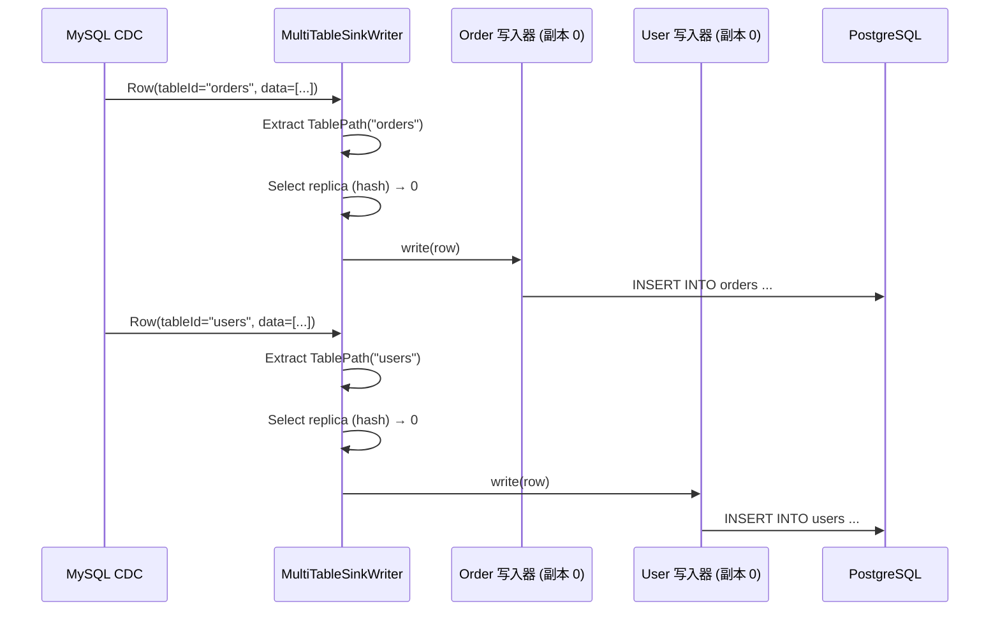
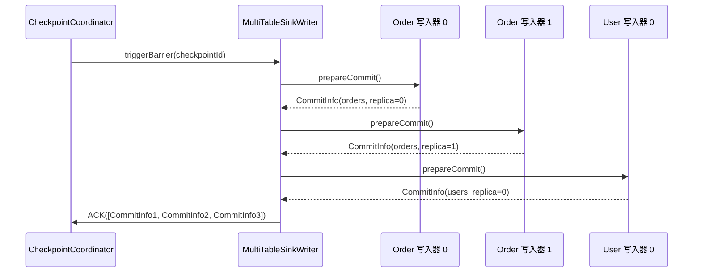

# 多表同步架构

## 1. 概述

### 1.1 问题背景

数据库迁移和 CDC 场景通常需要同步数百张表:

- **资源效率**: 如何避免为每张表创建一个作业?
- **一致快照**: 如何确保所有表从同一时间点开始?
- **模式路由**: 如何将数据路由到正确的目标表?
- **独立模式**: 如何处理每张表的不同模式?
- **并行写入**: 如何最大化多表的吞吐量?

### 1.2 设计目标

SeaTunnel 的多表同步旨在:

1. **单作业,多表**: 在一个作业中同步数百张表
2. **资源效率**: 跨表共享资源
3. **模式独立**: 每张表维护自己的模式
4. **动态路由**: 根据表标识将记录路由到正确的目标端
5. **水平扩展**: 支持副本写入器以实现高吞吐量

### 1.3 用例

**数据库迁移**:
```hocon
source {
  MySQL-CDC {
    # 捕获数据库中的所有表
    database-name = "my_db"
    table-name = ".*" # 正则表达式: 所有表
  }
}

sink {
  Jdbc {
    # 写入 PostgreSQL
    url = "jdbc:postgresql://..."
  }
}
```

**多表 CDC**:
```hocon
source {
  MySQL-CDC {
    table-name = "order_.*|user_.*|product_.*" # 多个表模式
  }
}

sink {
  Elasticsearch {
    # 每张表对应不同的索引
  }
}
```

## 2. 核心抽象

### 2.1 TablePath

用于将记录路由到表的唯一标识符。

TablePath 由三段信息组成:
- **databaseName**: 数据库名
- **schemaName**: schema 名(对无 schema 的系统可为空或使用默认值)
- **tableName**: 表名

它需要满足两个要求:
- **可稳定序列化**: 能被序列化为唯一字符串(例如 `db.schema.table`)并在链路上传播
- **可逆**: 能从字符串/结构化字段反解析回 TablePath

**示例**:

- my_db.public.orders
- my_db.public.users

### 2.2 SeaTunnelRow 带 TableId

记录携带表标识用于路由。

多表场景中，一条记录除了字段本身，还必须携带:
- **tableId**: 表标识(通常是 TablePath 的序列化形式)
- **rowKind**: 变更类型(INSERT/UPDATE/DELETE 等)

路由侧通过 tableId 还原出 TablePath，再决定写入到哪个目标表/索引。

### 2.3 SinkIdentifier

目标端写入器的唯一标识符(表 + 副本索引)。

SinkIdentifier 的作用是把“写入目标”精确到:
- **表标识**: TablePath/TableIdentifier
- **副本索引**: index(用于同一张表的多 writer 副本并行写入)

示例:
- (orders, 0), (orders, 1)
- (users, 0), (users, 1)

## 3. MultiTableSource 架构

### 3.1 结构

MultiTableSource 可以理解为一个“按表聚合”的 Source:
- 内部维护 **TablePath → SeaTunnelSource** 的映射(每张表一个底层 source)
- 同时对外暴露该作业会产生的 CatalogTable 列表(用于下游 schema/路由)

### 3.2 创建

创建过程通常来自配置解析:
1. 根据 table-name/正则/白名单枚举出表集合
2. 为每张表构建对应的底层 Source(或共享同一个 Source 但按 TablePath 区分 split)
3. 汇总各表的 CatalogTable，作为后续转换/落库的 schema 输入

### 3.3 枚举器: 统一分片分配

枚举器的核心责任是把“多表 split 生产”统一起来:
- 将 reader 的注册事件分发到各表的 enumerator(让每张表都知道有哪些 reader 可用)
- 在多个表之间做公平/权重分配，避免小表被大表“饿死”
- 对 split request 做路由：既可以轮询所有表，也可以基于 backlog/速率进行调度

### 3.4 读取器: 多表数据读取

读取器的核心责任是“按表读取并标记 tableId”:
- 维护 **TablePath → SourceReader** 的映射
- 当收到 splits 时，将其路由到对应表的 reader，并把该表加入轮询队列
- pollNext 时按轮询/权重从各表 reader 拉取数据
- 对每条输出记录补齐/覆盖 tableId，保证下游能正确路由

## 4. MultiTableSink 架构

### 4.1 结构

MultiTableSink 是一个“按表路由 + 可多副本并行写入”的 Sink:
- 内部维护 **TablePath → SeaTunnelSink** 的映射(每张表一个底层 sink)
- 通过 **replicaNum** 为每张表创建多个 writer 副本以提升写入吞吐
- 依赖 catalogTables 提供各表 schema 信息(用于写入/类型转换/DDL 处理)

### 4.2 写入器: 带副本的多表写入

写入器的关键流程:
1. 从输入记录中解析 TablePath(tableId)
2. 为该表选择一个 writer 副本(replicaIndex)
3. 路由到 (TablePath, replicaIndex) 对应的底层 writer 执行写入

副本选择需要兼顾两类诉求:
- **顺序性**: 对同一主键的 UPDATE/DELETE 需要尽量落到同一副本，避免乱序导致的写入冲突
- **吞吐量**: 对 INSERT 等可并行写入的场景，尽量均匀分散到不同副本

在 checkpoint 边界:
- prepareCommit: 汇总所有表/所有副本的 CommitInfo，并打包为多表级提交信息
- snapshotState: 快照所有 writer 状态；恢复时必须能通过 SinkIdentifier 将状态路由回正确的(表,副本)

### 4.3 提交器: 多表提交协调

提交器的核心责任是把多表提交信息“拆回每张表”，并委托给对应表的底层 committer:
1. 解析 commitInfos，将其按 TablePath 分组
2. 对每个表调用对应的 SinkCommitter.commit(tableCommitInfos)
3. 汇总失败列表并按框架约定触发重试/回滚

注意事项:
- commit 必须幂等(可能被重试)
- 单表提交失败的处理策略需要明确：是整体失败(保守)还是允许部分表推进(取决于端到端一致性要求)

## 5. 副本机制

### 5.1 为什么需要副本?

**问题**: 每张表的单个写入器成为高吞吐量表的瓶颈。

**解决方案**: 每张表多个副本写入器用于并行写入。

```
无副本:
  orders 表(1000 写入/秒) → [单个写入器] → 瓶颈

有副本(replicaNum=4):
  orders 表(1000 写入/秒) → [写入器 0] (250 写入/秒)
                          → [写入器 1] (250 写入/秒)
                          → [写入器 2] (250 写入/秒)
                          → [写入器 3] (250 写入/秒)
```

### 5.2 副本配置

```hocon
sink {
  Jdbc {
    url = "..."

    # 多表配置
    multi-table.replica = 4 # 每张表 4 个副本
  }
}
```

### 5.3 副本选择策略

**基于哈希(一致性)**:

要点:
- 以主键(或业务唯一键)做哈希，将同一键稳定映射到同一副本
- 典型映射: $replica = hash(pk) \bmod replicaNum$

**轮询(负载均衡)**:

要点:
- 按顺序在副本之间轮转，追求均匀分配
- 适合 INSERT 等无顺序约束或可被幂等覆盖的写入

**混合(SeaTunnel 默认)**:

要点:
- UPDATE/DELETE 优先使用哈希策略，尽量保持同一键的顺序与写入落点一致
- INSERT 可使用轮询/随机策略提高吞吐
- 混合策略的核心是“顺序优先于均匀”与“吞吐优先于稳定”的权衡在不同 rowKind 下做切换

## 6. 多表中的模式管理

### 6.1 独立模式


每张表维护自己的 CatalogTable/Schema:
- 运行时根据 TablePath 查询对应的 schema，用于类型转换与写入
- 不同表之间 schema 互不影响，避免“全局 schema”导致的兼容性冲突

### 6.2 模式演化路由

模式演化需要被路由到“正确的表”，并应用到该表的所有 writer 副本:
1. 从 SchemaChangeEvent 中解析出 TablePath
2. 选择该表对应的 schema/元数据更新逻辑
3. 将变更广播到该表的所有副本 writer，保证后续写入使用一致的 schema

## 7. 数据流示例

### 7.1 完整流水线

```
┌──────────────────────────────────────────────────────────────┐
│                    MySQL CDC 数据源                           │
│  • 从 100 张表捕获变更                                        │
│  • 用 TablePath 标记每行                                      │
└──────────────────────────────┬───────────────────────────────┘
                               │
                               ▼
         ┌─────────────────────────────────────┐
         │ SeaTunnelRow (带 TablePath)         │
         │  tableId: "my_db.public.orders"     │
         │  fields: [1, "order-001", 99.99]    │
         └─────────────────────────────────────┘
                               │
                               ▼
┌──────────────────────────────────────────────────────────────┐
│                  MultiTableSinkWriter                         │
│  • 从行中提取 TablePath                                       │
│  • 选择副本(哈希或轮询)                                       │
│  • 路由到正确的写入器                                         │
└──────────────────────────────┬───────────────────────────────┘
                               │
        ┌──────────────────┼──────────────────┐
        ▼                  ▼                  ▼
┌──────────────┐   ┌──────────────┐   ┌──────────────┐
│ orders       │   │ users        │   │ products     │
│ 写入器 0     │   │ 写入器 0     │   │ 写入器 0     │
│ 写入器 1     │   │ 写入器 1     │   │ 写入器 1     │
│ 写入器 2     │   │              │   │              │
│ 写入器 3     │   │              │   │              │
└──────────────┘   └──────────────┘   └──────────────┘
        │                  │                  │
        ▼                  ▼                  ▼
┌──────────────┐   ┌──────────────┐   ┌──────────────┐
│ PostgreSQL   │   │ PostgreSQL   │   │ PostgreSQL   │
│ orders       │   │ users        │   │ products     │
└──────────────┘   └──────────────┘   └──────────────┘
```

### 7.2 写入流程



### 7.3 检查点流程



## 8. 性能优化

### 8.1 副本大小设置

**经验法则**:
```
replicaNum = ceil(表写入速率 / 单个写入器吞吐量)

示例:
  orders: 10,000 写入/秒
  单个写入器: 2,500 写入/秒
  replicaNum = ceil(10,000 / 2,500) = 4
```

### 8.2 表特定副本

优化思路:
- 不同表的写入速率差异很大时，应允许按表配置不同的 replicaNum
- 常见配置方式是提供 per-table 覆盖项，并提供 default 兜底

### 8.3 批量写入

优化思路:
- 为每个 (TablePath, replicaIndex) 维护独立缓冲区，避免不同表/不同副本相互干扰
- 达到 batch-size 或超时阈值时触发 flush，将外部系统交互开销摊薄
- 需要关注内存上限：多表 × 多副本 × 批次缓存会放大峰值占用

## 9. 监控和可观测性

### 9.1 关键指标

**每张表指标**:
- `table.{tableName}.records_written`: 每张表写入的记录数
- `table.{tableName}.bytes_written`: 每张表写入的字节数
- `table.{tableName}.write_latency`: 每张表写入延迟

**每个副本指标**:
- `table.{tableName}.replica.{index}.records`: 每个副本的记录数
- `table.{tableName}.replica.{index}.utilization`: 副本利用率

**全局指标**:
- `multitable.tables.total`: 表总数
- `multitable.writers.total`: 写入器总数(表 × 副本)
- `multitable.throughput`: 聚合吞吐量

### 9.2 监控仪表板

```
多表作业: mysql-to-postgres

表: 100
写入器: 250 (平均每张表 2.5 个副本)
吞吐量: 50,000 记录/秒

按吞吐量排名的表:
  1. orders: 15,000 记录/秒 (4 个副本)
  2. events: 10,000 记录/秒 (4 个副本)
  3. users: 5,000 记录/秒 (2 个副本)
  ...

副本分布:
  orders:
    副本 0: 3,750 记录/秒 (25%)
    副本 1: 3,800 记录/秒 (25.3%)
    副本 2: 3,700 记录/秒 (24.7%)
    副本 3: 3,750 记录/秒 (25%)
```

## 10. 最佳实践

### 10.1 表选择

**使用正则表达式模式**:
```hocon
source {
  MySQL-CDC {
    # 包含特定模式
    table-name = "order_.*|user_.*"

    # 排除系统表
    table-exclude = ".*_bak|.*_temp"
  }
}
```

### 10.2 副本配置

**保守开始**:
```hocon
sink {
  Jdbc {
    # 从 1 个副本开始,如果出现瓶颈则增加
    multi-table.replica = 1
  }
}
```

**监控和调优**:
```bash
# 检查单个副本是否为瓶颈
# 如果写入延迟高 → 增加副本
multi-table.replica = 2  # 双倍容量
```

### 10.3 模式管理

**预创建目标表**:
```sql
-- 更好: 预创建所有目标表
CREATE TABLE orders (...);
CREATE TABLE users (...);
CREATE TABLE products (...);
```

**谨慎启用自动创建**:
```hocon
sink {
  Jdbc {
    # 作业启动阶段：若表不存在则创建（用于首次建表）
    schema_save_mode = "CREATE_SCHEMA_WHEN_NOT_EXIST"

    # 说明：运行时 schema 变更由 CDC source 的 `schema-changes.enabled` 控制；
    # 是否能自动应用新增/删除列等变更取决于 JDBC 方言与目标端能力。
  }
}
```

### 10.4 错误处理

**每张表错误容忍**:
```hocon
sink {
  Jdbc {
    # 即使某些表失败也继续
    multi-table.continue-on-error = true
    multi-table.max-errors-per-table = 1000
  }
}
```

## 11. 限制和注意事项

### 11.1 当前限制

**共享并行度**:
- 所有表共享相同的并行度
- 不能为每张表设置不同的并行度

**固定副本**:
- 所有表的副本数相同
- 高吞吐量和低吞吐量表被同等对待

**内存开销**:
- 每个写入器维护单独的缓冲区
- 100 张表 × 4 个副本 = 内存中 400 个写入器

### 11.2 解决方法

**高吞吐量表**:
```hocon
# 选项 1: 为热表单独作业
job-1 { source { table-name = "orders" } } # 专用作业

job-2 { source { table-name = "user_.*|product_.*" } } # 其余表
```

**内存优化**:
```hocon
# 减少每个写入器的缓冲区大小
sink {
  Jdbc {
    batch-size = 500 # 更小的批次
  }
}
```

## 12. 未来增强

### 12.1 动态副本

```hocon
# 计划中: 每张表副本配置
sink {
  Jdbc {
    multi-table.replicas {
      orders = 8      # 高吞吐量
      users = 4       # 中等
      config = 1      # 低
      default = 2     # 其他
    }
  }
}
```

### 12.2 自适应副本

设想方向:
- 根据每张表的实时写入速率与延迟指标自动调整副本数
- 需要考虑副本变更的副作用：重分配/热迁移成本、顺序性破坏风险、checkpoint 一致性边界等

## 13. 相关资源

- [CatalogTable 和元数据](../api-design/catalog-table.md)
- [目标端架构](../api-design/sink-architecture.md)
- [DAG 执行](../engine/dag-execution.md)
- [模式演化](../../introduction/concepts/schema-evolution.md)

## 14. 参考资料

本主题更侧重“路由与执行语义”。如需进一步了解 Schema、Sink 语义与 DAG 执行，请从“相关资源”章节继续阅读。
