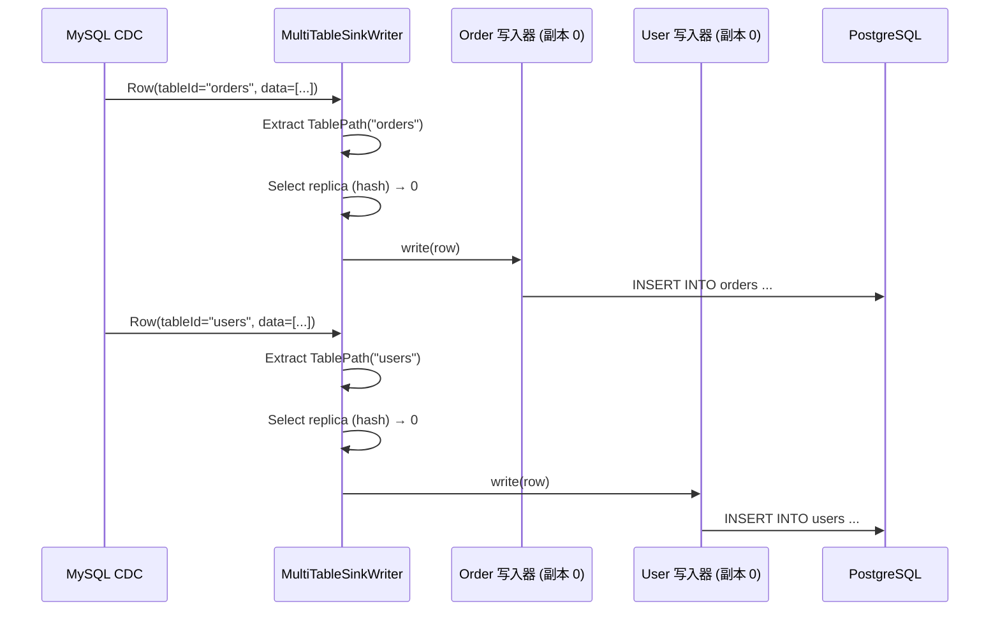
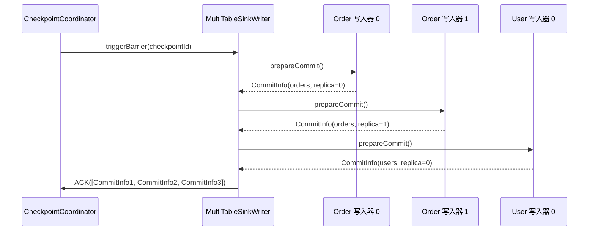

# 多表同步架构

## 1. 概述

### 1.1 问题背景

数据库迁移和 CDC 场景通常需要同步数百张表:

- **资源效率**: 如何避免为每张表创建一个作业?
- **一致快照**: 如何确保所有表从同一时间点开始?
- **模式路由**: 如何将数据路由到正确的目标表?
- **独立模式**: 如何处理每张表的不同模式?
- **并行写入**: 如何最大化多表的吞吐量?

### 1.2 设计目标

SeaTunnel 的多表同步旨在:

1. **单作业,多表**: 在一个作业中同步数百张表
2. **资源效率**: 跨表共享资源
3. **模式独立**: 每张表维护自己的模式
4. **动态路由**: 根据表标识将记录路由到正确的目标端
5. **水平扩展**: 支持副本写入器以实现高吞吐量

### 1.3 用例

**数据库迁移**:
```hocon
source {
  MySQL-CDC {
    # 捕获数据库中的所有表
    database-name = "my_db"
    table-name = ".*" # 正则表达式: 所有表
  }
}

sink {
  JDBC {
    # 写入 PostgreSQL
    url = "jdbc:postgresql://..."
  }
}
```

**多表 CDC**:
```hocon
source {
  MySQL-CDC {
    table-name = "order_.*|user_.*|product_.*" # 多个表模式
  }
}

sink {
  Elasticsearch {
    # 每张表对应不同的索引
  }
}
```

## 2. 核心抽象

### 2.1 TablePath

用于将记录路由到表的唯一标识符。

```java
public class TablePath implements Serializable {
    private final String databaseName;
    private final String schemaName;
    private final String tableName;

    // 唯一字符串表示
    public String getFullName() {
        return String.join(".", databaseName, schemaName, tableName);
    }
}
```

**示例**:
```java
TablePath orderTable = TablePath.of("my_db", "public", "orders");
TablePath userTable = TablePath.of("my_db", "public", "users");
```

### 2.2 SeaTunnelRow 带 TableId

记录携带表标识用于路由。

```java
public class SeaTunnelRow {
    private final String tableId; // TablePath 序列化
    private final SeaTunnelRowKind rowKind; // INSERT, UPDATE, DELETE
    private final Object[] fields;

    public TablePath getTablePath() {
        return TablePath.deserialize(tableId);
    }
}
```

### 2.3 SinkIdentifier

目标端写入器的唯一标识符(表 + 副本索引)。

```java
public class SinkIdentifier implements Serializable {
    private final TableIdentifier tableIdentifier;
    private final int index; // 副本索引

    // 对于多表: 每张表每个副本一个标识符
    // 示例: (orders, 0), (orders, 1), (users, 0), (users, 1)
}
```

## 3. MultiTableSource 架构

### 3.1 结构

```java
public class MultiTableSource<T, SplitT, StateT>
    implements SeaTunnelSource<T, SplitT, StateT> {

    // 底层数据源(每张表一个)
    private final Map<TablePath, SeaTunnelSource<T, SplitT, StateT>> sources;

    // 生产的目录表
    private final List<CatalogTable> catalogTables;
}
```

### 3.2 创建

```java
// 从配置
MultiTableSource<SeaTunnelRow, ?, ?> multiSource =
    MultiTableSource.builder()
        .addSource(orderTablePath, orderSource)
        .addSource(userTablePath, userSource)
        .addSource(productTablePath, productSource)
        .build();
```

### 3.3 枚举器: 统一分片分配

```java
public class MultiTableSourceSplitEnumerator {
    private final Map<TablePath, SourceSplitEnumerator> enumerators;

    @Override
    public void handleSplitRequest(int subtaskId) {
        // 在表枚举器之间轮询
        for (Map.Entry<TablePath, SourceSplitEnumerator> entry : enumerators.entrySet()) {
            TablePath tablePath = entry.getKey();
            SourceSplitEnumerator enumerator = entry.getValue();

            // 从表枚举器请求分片
            enumerator.handleSplitRequest(subtaskId);
        }
    }

    @Override
    public void addReader(int subtaskId) {
        // 向所有表枚举器注册读取器
        for (SourceSplitEnumerator enumerator : enumerators.values()) {
            enumerator.addReader(subtaskId);
        }
    }
}
```

### 3.4 读取器: 多表数据读取

```java
public class MultiTableSourceReader {
    private final Map<TablePath, SourceReader> readers;
    private final Queue<TablePath> readOrder; // 轮询队列

    @Override
    public void pollNext(Collector<SeaTunnelRow> output) {
        if (readOrder.isEmpty()) {
            return;
        }

        // 从表中轮询读取
        TablePath currentTable = readOrder.poll();
        SourceReader reader = readers.get(currentTable);

        // 从当前表读取
        reader.pollNext(new Collector<SeaTunnelRow>() {
            @Override
            public void collect(SeaTunnelRow row) {
                // 用表路径标记行
                row.setTableId(currentTable.serialize());
                output.collect(row);
            }
        });

        // 重新添加到队列以进行下一轮
        readOrder.offer(currentTable);
    }

    @Override
    public void addSplits(List<SplitT> splits) {
        // 将分片路由到正确的表读取器
        for (SplitT split : splits) {
            TablePath tablePath = extractTablePath(split);
            SourceReader reader = readers.get(tablePath);
            reader.addSplits(Collections.singletonList(split));

            // 如果不存在,则添加表到读取顺序
            if (!readOrder.contains(tablePath)) {
                readOrder.offer(tablePath);
            }
        }
    }
}
```

## 4. MultiTableSink 架构

### 4.1 结构

```java
public class MultiTableSink<IN, StateT, CommitInfoT, AggregatedCommitInfoT>
    implements SeaTunnelSink<IN, StateT, CommitInfoT, AggregatedCommitInfoT> {

    // 底层目标端(每张表一个)
    private final Map<TablePath, SeaTunnelSink> sinks;

    // 每张表的写入器副本数
    private final int replicaNum;

    // 输入目录表
    private final List<CatalogTable> catalogTables;
}
```

### 4.2 写入器: 带副本的多表写入

```java
public class MultiTableSinkWriter<IN, CommitInfoT, StateT>
    implements SinkWriter<IN, CommitInfoT, StateT> {

    // 每张表的写入器(每张表多个副本)
    private final Map<SinkIdentifier, SinkWriter<IN, CommitInfoT, StateT>> writers;

    // 每张表的副本数
    private final int replicaNum;

    // 上下文
    private final int writerIndex; // 此写入器的全局索引

    @Override
    public void write(IN element) throws IOException {
        SeaTunnelRow row = (SeaTunnelRow) element;

        // 1. 确定目标表
        TablePath tablePath = row.getTablePath();

        // 2. 为此表选择副本(负载均衡)
        int replicaIndex = selectReplica(tablePath, row);

        // 3. 获取(表,副本)的写入器
        SinkIdentifier identifier = new SinkIdentifier(
            new TableIdentifier(tablePath),
            replicaIndex
        );

        SinkWriter<IN, CommitInfoT, StateT> writer = writers.get(identifier);

        // 4. 写入所选写入器
        writer.write(element);
    }

    private int selectReplica(TablePath tablePath, SeaTunnelRow row) {
        // 策略 1: 基于哈希(一致性分配)
        if (row.getKind() == SeaTunnelRowKind.UPDATE_BEFORE ||
            row.getKind() == SeaTunnelRowKind.UPDATE_AFTER) {
            // 更新使用相同副本(维护顺序)
            Object primaryKey = extractPrimaryKey(row);
            return Math.abs(primaryKey.hashCode()) % replicaNum;
        }

        // 策略 2: 轮询(负载均衡)
        return (int) (System.nanoTime() % replicaNum);
    }

    @Override
    public Optional<CommitInfoT> prepareCommit() throws IOException {
        // 从所有写入器收集提交信息
        List<CommitInfoT> allCommitInfos = new ArrayList<>();

        for (SinkWriter<IN, CommitInfoT, StateT> writer : writers.values()) {
            Optional<CommitInfoT> commitInfo = writer.prepareCommit();
            commitInfo.ifPresent(allCommitInfos::add);
        }

        // 包装在多表提交信息中
        return Optional.of((CommitInfoT) new MultiTableCommitInfo(allCommitInfos));
    }

    @Override
    public List<StateT> snapshotState(long checkpointId) throws IOException {
        // 快照所有写入器
        List<StateT> allStates = new ArrayList<>();

        for (Map.Entry<SinkIdentifier, SinkWriter> entry : writers.entrySet()) {
            List<StateT> states = entry.getValue().snapshotState(checkpointId);

            // 用目标端标识符标记状态以便恢复
            for (StateT state : states) {
                allStates.add(wrapWithIdentifier(entry.getKey(), state));
            }
        }

        return allStates;
    }
}
```

### 4.3 提交器: 多表提交协调

```java
public class MultiTableSinkCommitter<CommitInfoT>
    implements SinkCommitter<CommitInfoT> {

    // 每张表的提交器
    private final Map<TablePath, SinkCommitter<CommitInfoT>> committers;

    @Override
    public List<CommitInfoT> commit(List<CommitInfoT> commitInfos) throws IOException {
        List<CommitInfoT> failed = new ArrayList<>();

        // 按表分组提交信息
        Map<TablePath, List<CommitInfoT>> groupedInfos = groupByTable(commitInfos);

        // 每张表提交
        for (Map.Entry<TablePath, List<CommitInfoT>> entry : groupedInfos.entrySet()) {
            TablePath tablePath = entry.getKey();
            List<CommitInfoT> tableCommitInfos = entry.getValue();

            SinkCommitter<CommitInfoT> committer = committers.get(tablePath);

            // 为此表提交
            List<CommitInfoT> tableFailed = committer.commit(tableCommitInfos);
            failed.addAll(tableFailed);
        }

        return failed;
    }

    private Map<TablePath, List<CommitInfoT>> groupByTable(List<CommitInfoT> commitInfos) {
        Map<TablePath, List<CommitInfoT>> grouped = new HashMap<>();

        for (CommitInfoT commitInfo : commitInfos) {
            TablePath tablePath = extractTablePath(commitInfo);
            grouped.computeIfAbsent(tablePath, k -> new ArrayList<>()).add(commitInfo);
        }

        return grouped;
    }
}
```

## 5. 副本机制

### 5.1 为什么需要副本?

**问题**: 每张表的单个写入器成为高吞吐量表的瓶颈。

**解决方案**: 每张表多个副本写入器用于并行写入。

```
无副本:
  orders 表(1000 写入/秒) → [单个写入器] → 瓶颈

有副本(replicaNum=4):
  orders 表(1000 写入/秒) → [写入器 0] (250 写入/秒)
                          → [写入器 1] (250 写入/秒)
                          → [写入器 2] (250 写入/秒)
                          → [写入器 3] (250 写入/秒)
```

### 5.2 副本配置

```hocon
sink {
  JDBC {
    url = "..."

    # 多表配置
    multi-table.replica = 4 # 每张表 4 个副本
  }
}
```

### 5.3 副本选择策略

**基于哈希(一致性)**:
```java
// 确保相同的主键总是到达相同的副本(保持顺序)
int replica = Math.abs(primaryKey.hashCode()) % replicaNum;
```

**轮询(负载均衡)**:
```java
// 在副本之间均匀分配负载
int replica = (writeCounter.getAndIncrement()) % replicaNum;
```

**混合(SeaTunnel 默认)**:
```java
// 更新/删除使用哈希(顺序),插入使用轮询(负载均衡)
if (row.getKind() == SeaTunnelRowKind.UPDATE_AFTER ||
    row.getKind() == SeaTunnelRowKind.DELETE) {
    return Math.abs(primaryKey.hashCode()) % replicaNum; // 一致性
} else {
    return (int) (System.nanoTime() % replicaNum); // 负载均衡
}
```

## 6. 多表中的模式管理

### 6.1 独立模式

每张表维护自己的模式:

```java
public class MultiTableSink {
    // 每张表的模式
    private final Map<TablePath, CatalogTable> catalogTables;

    public CatalogTable getCatalogTable(TablePath tablePath) {
        return catalogTables.get(tablePath);
    }
}
```

### 6.2 模式演化路由

```java
public class MultiTableSinkWriter {
    public void handleSchemaChange(SchemaChangeEvent event) {
        // 将模式变更路由到正确的表写入器
        TablePath tablePath = event.getTableId().toTablePath();

        // 应用到此表的所有副本
        for (int i = 0; i < replicaNum; i++) {
            SinkIdentifier identifier = new SinkIdentifier(
                new TableIdentifier(tablePath),
                i
            );

            SinkWriter writer = writers.get(identifier);
            writer.applySchemaChange(event);
        }
    }
}
```

## 7. 数据流示例

### 7.1 完整流水线

```
┌──────────────────────────────────────────────────────────────┐
│                    MySQL CDC 数据源                           │
│  • 从 100 张表捕获变更                                        │
│  • 用 TablePath 标记每行                                      │
└──────────────────────────────┬───────────────────────────────┘
                               │
                               ▼
         ┌─────────────────────────────────────┐
         │ SeaTunnelRow (带 TablePath)         │
         │  tableId: "my_db.public.orders"     │
         │  fields: [1, "order-001", 99.99]    │
         └─────────────────────────────────────┘
                               │
                               ▼
┌──────────────────────────────────────────────────────────────┐
│                  MultiTableSinkWriter                         │
│  • 从行中提取 TablePath                                       │
│  • 选择副本(哈希或轮询)                                       │
│  • 路由到正确的写入器                                         │
└──────────────────────────────┬───────────────────────────────┘
                               │
        ┌──────────────────┼──────────────────┐
        ▼                  ▼                  ▼
┌──────────────┐   ┌──────────────┐   ┌──────────────┐
│ orders       │   │ users        │   │ products     │
│ 写入器 0     │   │ 写入器 0     │   │ 写入器 0     │
│ 写入器 1     │   │ 写入器 1     │   │ 写入器 1     │
│ 写入器 2     │   │              │   │              │
│ 写入器 3     │   │              │   │              │
└──────────────┘   └──────────────┘   └──────────────┘
        │                  │                  │
        ▼                  ▼                  ▼
┌──────────────┐   ┌──────────────┐   ┌──────────────┐
│ PostgreSQL   │   │ PostgreSQL   │   │ PostgreSQL   │
│ orders       │   │ users        │   │ products     │
└──────────────┘   └──────────────┘   └──────────────┘
```

### 7.2 写入流程



### 7.3 检查点流程



## 8. 性能优化

### 8.1 副本大小设置

**经验法则**:
```
replicaNum = ceil(表写入速率 / 单个写入器吞吐量)

示例:
  orders: 10,000 写入/秒
  单个写入器: 2,500 写入/秒
  replicaNum = ceil(10,000 / 2,500) = 4
```

### 8.2 表特定副本

```java
// 未来增强: 每张表不同的副本数
Map<TablePath, Integer> replicaConfig = Map.of(
    TablePath.of("orders"), 4,      // 高吞吐量表
    TablePath.of("users"), 2,       // 中等吞吐量
    TablePath.of("config"), 1       // 低吞吐量
);
```

### 8.3 批量写入

```java
public class MultiTableSinkWriter {
    private final Map<SinkIdentifier, List<SeaTunnelRow>> buffers;
    private static final int BATCH_SIZE = 1000;

    @Override
    public void write(SeaTunnelRow row) {
        SinkIdentifier identifier = selectWriter(row);

        List<SeaTunnelRow> buffer = buffers.computeIfAbsent(
            identifier,
            k -> new ArrayList<>()
        );

        buffer.add(row);

        if (buffer.size() >= BATCH_SIZE) {
            flushBuffer(identifier, buffer);
        }
    }
}
```

## 9. 监控和可观测性

### 9.1 关键指标

**每张表指标**:
- `table.{tableName}.records_written`: 每张表写入的记录数
- `table.{tableName}.bytes_written`: 每张表写入的字节数
- `table.{tableName}.write_latency`: 每张表写入延迟

**每个副本指标**:
- `table.{tableName}.replica.{index}.records`: 每个副本的记录数
- `table.{tableName}.replica.{index}.utilization`: 副本利用率

**全局指标**:
- `multitable.tables.total`: 表总数
- `multitable.writers.total`: 写入器总数(表 × 副本)
- `multitable.throughput`: 聚合吞吐量

### 9.2 监控仪表板

```
多表作业: mysql-to-postgres

表: 100
写入器: 250 (平均每张表 2.5 个副本)
吞吐量: 50,000 记录/秒

按吞吐量排名的表:
  1. orders: 15,000 记录/秒 (4 个副本)
  2. events: 10,000 记录/秒 (4 个副本)
  3. users: 5,000 记录/秒 (2 个副本)
  ...

副本分布:
  orders:
    副本 0: 3,750 记录/秒 (25%)
    副本 1: 3,800 记录/秒 (25.3%)
    副本 2: 3,700 记录/秒 (24.7%)
    副本 3: 3,750 记录/秒 (25%)
```

## 10. 最佳实践

### 10.1 表选择

**使用正则表达式模式**:
```hocon
source {
  MySQL-CDC {
    # 包含特定模式
    table-name = "order_.*|user_.*"

    # 排除系统表
    table-exclude = ".*_bak|.*_temp"
  }
}
```

### 10.2 副本配置

**保守开始**:
```hocon
sink {
  JDBC {
    # 从 1 个副本开始,如果出现瓶颈则增加
    multi-table.replica = 1
  }
}
```

**监控和调优**:
```bash
# 检查单个副本是否为瓶颈
# 如果写入延迟高 → 增加副本
multi-table.replica = 2  # 双倍容量
```

### 10.3 模式管理

**预创建目标表**:
```sql
-- 更好: 预创建所有目标表
CREATE TABLE orders (...);
CREATE TABLE users (...);
CREATE TABLE products (...);
```

**谨慎启用自动创建**:
```hocon
sink {
  JDBC {
    # 自动创建缺失的表
    schema-evolution {
      enabled = true
      auto-create-table = true
    }
  }
}
```

### 10.4 错误处理

**每张表错误容忍**:
```hocon
sink {
  JDBC {
    # 即使某些表失败也继续
    multi-table.continue-on-error = true
    multi-table.max-errors-per-table = 1000
  }
}
```

## 11. 限制和注意事项

### 11.1 当前限制

**共享并行度**:
- 所有表共享相同的并行度
- 不能为每张表设置不同的并行度

**固定副本**:
- 所有表的副本数相同
- 高吞吐量和低吞吐量表被同等对待

**内存开销**:
- 每个写入器维护单独的缓冲区
- 100 张表 × 4 个副本 = 内存中 400 个写入器

### 11.2 解决方法

**高吞吐量表**:
```hocon
# 选项 1: 为热表单独作业
job-1 { source { table-name = "orders" } } # 专用作业

job-2 { source { table-name = "user_.*|product_.*" } } # 其余表
```

**内存优化**:
```hocon
# 减少每个写入器的缓冲区大小
sink {
  JDBC {
    batch-size = 500 # 更小的批次
  }
}
```

## 12. 未来增强

### 12.1 动态副本

```hocon
# 计划中: 每张表副本配置
sink {
  JDBC {
    multi-table.replicas {
      orders = 8      # 高吞吐量
      users = 4       # 中等
      config = 1      # 低
      default = 2     # 其他
    }
  }
}
```

### 12.2 自适应副本

```java
// 根据吞吐量自动调整副本
if (table.getWriteRate() > threshold) {
    increaseReplicas(table);
} else if (table.getWriteRate() < lowThreshold) {
    decreaseReplicas(table);
}
```

## 13. 相关资源

- [CatalogTable 和元数据](../api-design/catalog-table.md)
- [目标端架构](../api-design/sink-architecture.md)
- [DAG 执行](../engine/dag-execution.md)
- [模式演化](../../introduction/concepts/schema-evolution.md)

## 14. 参考资料

### 关键源文件

- [MultiTableSink.java](../../../seatunnel-api/src/main/java/org/apache/seatunnel/api/sink/MultiTableSink.java)
- [SinkIdentifier.java](../../../seatunnel-api/src/main/java/org/apache/seatunnel/api/sink/SinkIdentifier.java)
- [TablePath.java](../../../seatunnel-api/src/main/java/org/apache/seatunnel/api/table/catalog/TablePath.java)

### 示例实现

- MySQL CDC 数据源: `seatunnel-connectors-v2/connector-cdc/connector-cdc-mysql/`
- JDBC 目标端: `seatunnel-connectors-v2/connector-jdbc/`
