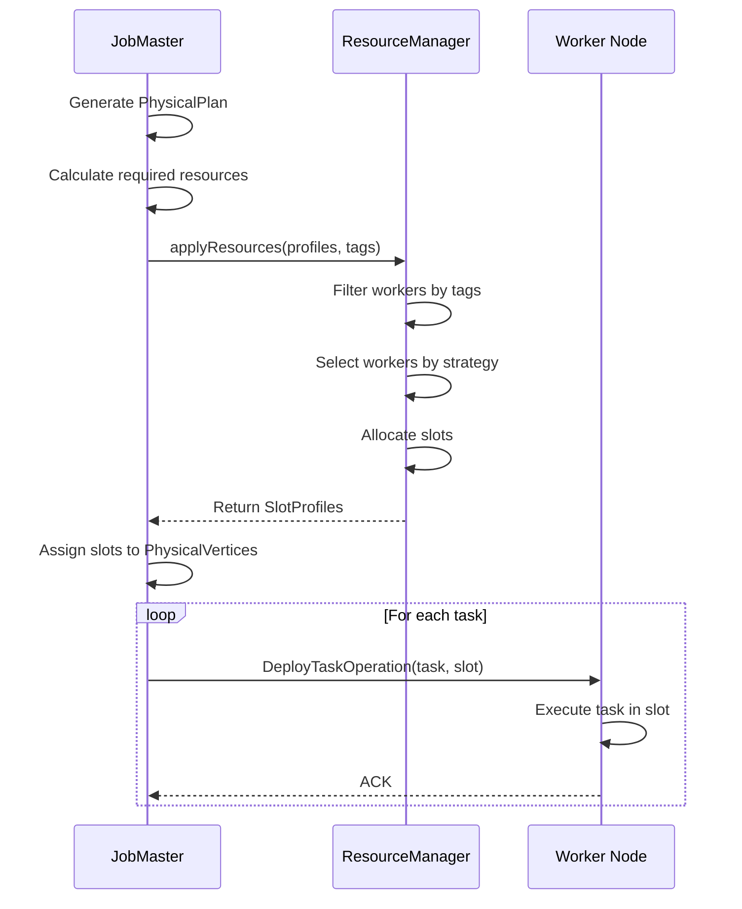
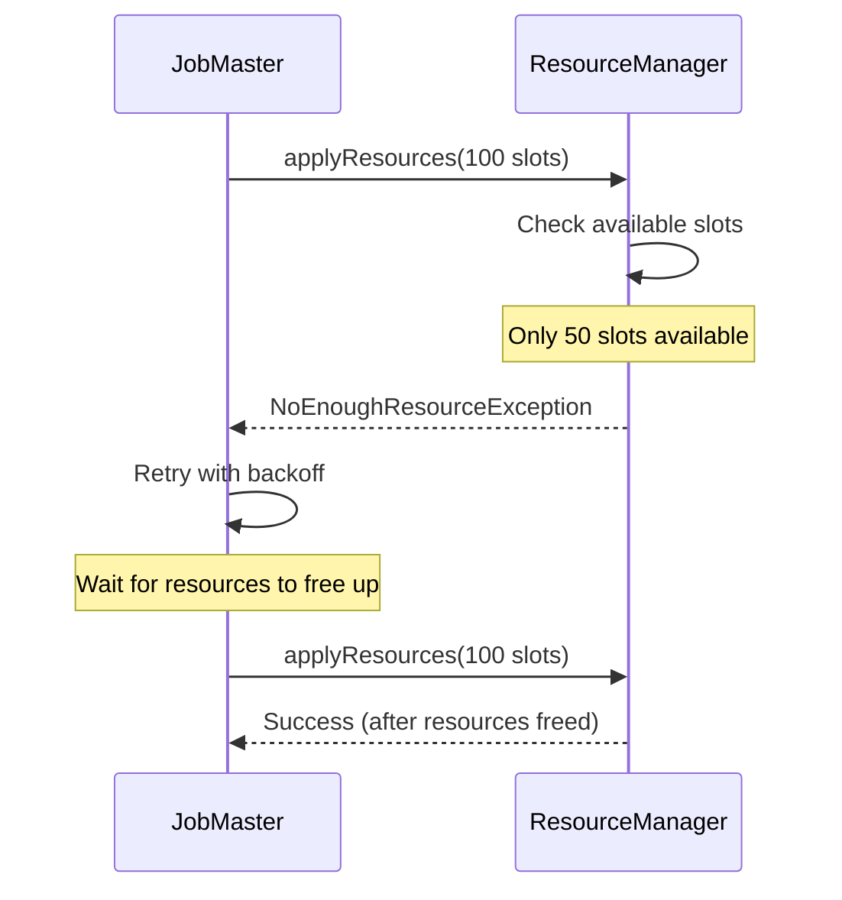
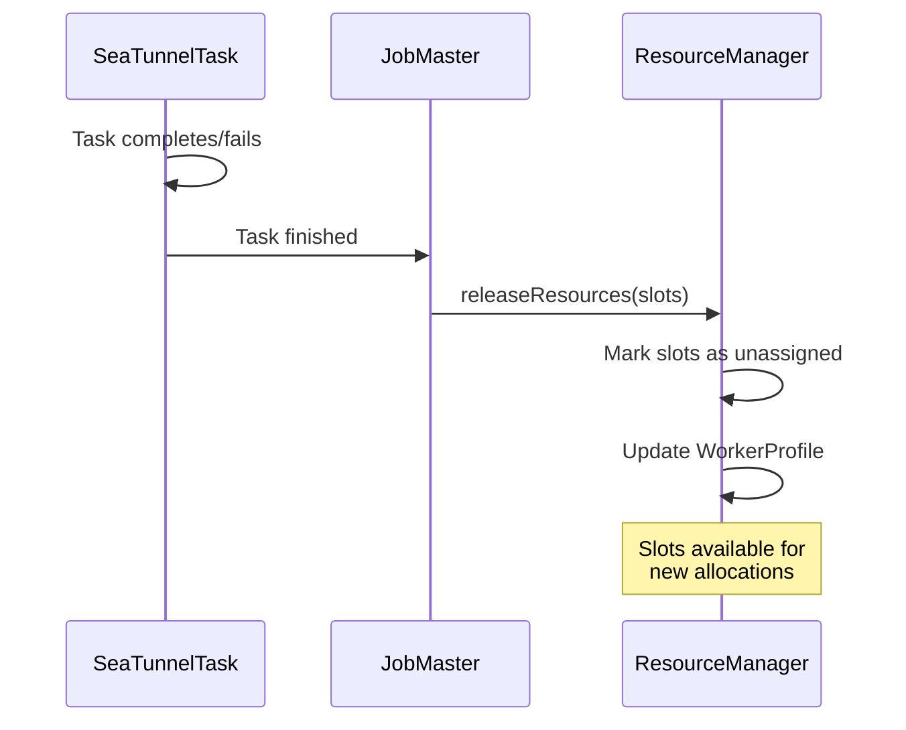

# 资源管理

## 1. 概述

### 1.1 问题背景

分布式执行引擎必须高效管理计算资源:

- **资源分配**: 如何公平高效地将任务分配给工作节点?
- **负载均衡**: 如何在工作节点之间均匀分布工作负载?
- **资源隔离**: 如何防止作业之间的资源争用?
- **动态扩缩容**: 如何在不中断作业的情况下添加/删除工作节点?
- **异构资源**: 如何处理具有不同能力的工作节点?

### 1.2 设计目标

SeaTunnel 的资源管理系统旨在:

1. **细粒度控制**: 基于槽位的分配实现精确资源管理
2. **灵活策略**: 针对不同场景的多种分配策略
3. **基于标签的过滤**: 将任务分配给特定的工作节点组
4. **高可用性**: 容忍工作节点故障并自动重新分配
5. **可观测性**: 实时跟踪资源使用和可用性

### 1.3 架构概览

```
┌──────────────────────────────────────────────────────────────┐
│                         JobMaster                             │
│                                                                │
│  ┌────────────────────────────────────────────────────┐      │
│  │  请求资源                                            │      │
│  │  • 计算所需槽位                                       │      │
│  │  • 指定资源配置文件(CPU、内存)                         │      │
│  │  • 应用标签过滤器(可选)                               │      │
│  └────────────────────────────────────────────────────┘      │
└──────────────────────────────┬───────────────────────────────┘
                               │
                               ▼
┌──────────────────────────────────────────────────────────────┐
│                     ResourceManager                           │
│                                                                │
│  ┌────────────────────────────────────────────────────┐      │
│  │  工作节点注册表                                       │      │
│  │  • WorkerProfile (每个工作节点)                      │      │
│  │    - 总资源                                          │      │
│  │    - 可用资源                                        │      │
│  │    - 已分配槽位                                      │      │
│  │    - 未分配槽位                                      │      │
│  └────────────────────────────────────────────────────┘      │
│                                                                │
│  ┌────────────────────────────────────────────────────┐      │
│  │  分配策略                                            │      │
│  │  • RandomSlotAssignStrategy                        │      │
│  │  • SlotRatioSlotAssignStrategy                     │      │
│  │  • SystemLoadSlotAssignStrategy                    │      │
│  └────────────────────────────────────────────────────┘      │
│                                                                │
│  ┌────────────────────────────────────────────────────┐      │
│  │  槽位管理                                            │      │
│  │  • 分配槽位                                          │      │
│  │  • 释放槽位                                          │      │
│  │  • 跟踪槽位使用                                      │      │
│  └────────────────────────────────────────────────────┘      │
└──────────────────────────────┬───────────────────────────────┘
                               │
                               ▼
┌──────────────────────────────────────────────────────────────┐
│                      工作节点                                  │
│                                                                │
│  Worker 1                Worker 2                Worker N     │
│  ┌──────────┐           ┌──────────┐           ┌──────────┐  │
│  │ Slot 1   │           │ Slot 1   │           │ Slot 1   │  │
│  │ Slot 2   │           │ Slot 2   │           │ Slot 2   │  │
│  │ ...      │           │ ...      │           │ ...      │  │
│  └──────────┘           └──────────┘           └──────────┘  │
└──────────────────────────────────────────────────────────────┘
```

## 2. 核心概念

### 2.1 槽位(Slot)

**槽位**是资源分配的基本单位。

```java
public class SlotProfile {
    // 唯一槽位标识符
    private final long slotID;

    // 此槽位所在的工作节点地址
    private final Address worker;

    // 此槽位的资源容量
    private final ResourceProfile resourceProfile;

    // 用于过滤的可选标签
    private final Map<String, String> tags;
}
```

**关键属性**:
- **粒度化**: 每个槽位可以托管一个或多个任务(任务融合)
- **类型化**: 槽位具有资源配置文件(CPU、内存)
- **标签化**: 槽位可以被标记用于专门分配
- **有状态**: 槽位跟踪分配状态(已分配/未分配)

**示例**:
```java
SlotProfile slot = new SlotProfile(
    slotID: 1001,
    worker: new Address("worker-1", 5801),
    resourceProfile: new ResourceProfile(
        cpu: new CPU(1.0),           // 1 CPU 核心
        heapMemory: new Memory(512), // 512MB 堆内存
        offHeapMemory: new Memory(256) // 256MB 堆外内存
    ),
    tags: Map.of("zone", "us-west-1a", "type", "compute")
);
```

### 2.2 ResourceProfile

描述资源需求或容量。

```java
public class ResourceProfile {
    private final CPU cpu;
    private final Memory heapMemory;
    private final Memory offHeapMemory;
}

public class CPU {
    private final double cores; // CPU 核心数
}

public class Memory {
    private final long megabytes; // 内存(MB)
}
```

**用途**:
- **任务需求**: JobMaster 指定每个任务所需的资源
- **槽位容量**: 每个槽位公布其可用资源
- **匹配**: ResourceManager 将任务需求与槽位容量匹配

### 2.3 WorkerProfile

表示工作节点的资源和槽位清单。

```java
public class WorkerProfile {
    // 工作节点地址
    private final Address address;

    // 总资源(所有槽位的总和)
    private final ResourceProfile totalResourceProfile;

    // 当前可用资源
    private final ResourceProfile availableResourceProfile;

    // 分配给作业的槽位
    private final List<SlotProfile> assignedSlots;

    // 可供分配的槽位
    private final List<SlotProfile> unassignedSlots;

    // 工作节点元数据
    private final Map<String, String> tags;
}
```

**生命周期**:
1. **注册**: 工作节点启动时向 ResourceManager 注册
2. **心跳**: 工作节点定期发送心跳及更新的资源信息
3. **分配**: ResourceManager 从未分配池中分配槽位
4. **释放**: 完成的任务释放槽位,将其移回未分配池
5. **注销**: 工作节点离开集群(优雅或故障)

## 3. ResourceManager

### 3.1 接口

```java
public interface ResourceManager {
    /**
     * 申请资源(由 JobMaster 调用)
     */
    CompletableFuture<List<SlotProfile>> applyResources(
        long jobId,
        List<ResourceProfile> resourceProfiles,
        List<TagFilter> tagFilters
    ) throws NoEnoughResourceException;

    /**
     * 释放资源(由 JobMaster 在任务完成后调用)
     */
    void releaseResources(long jobId, List<SlotProfile> slots);

    /**
     * 工作节点心跳(由 TaskExecutionService 调用)
     */
    void heartbeat(WorkerProfile workerProfile);

    /**
     * 处理工作节点移除(故障或优雅关闭)
     */
    void memberRemoved(MembershipEvent event);
}
```

### 3.2 实现: AbstractResourceManager

```java
public abstract class AbstractResourceManager implements ResourceManager {
    // 已注册的工作节点
    protected final ConcurrentMap<Address, WorkerProfile> registerWorker;

    // 槽位分配策略
    protected final SlotAssignStrategy slotAssignStrategy;

    // 心跳超时
    protected final long heartbeatTimeout;

    @Override
    public CompletableFuture<List<SlotProfile>> applyResources(
        long jobId,
        List<ResourceProfile> resourceProfiles,
        List<TagFilter> tagFilters
    ) {
        // 1. 按标签过滤工作节点
        List<WorkerProfile> candidates = filterWorkersByTags(tagFilters);

        // 2. 使用策略选择工作节点
        List<SlotProfile> allocatedSlots = new ArrayList<>();
        for (ResourceProfile profile : resourceProfiles) {
            SlotProfile slot = slotAssignStrategy.selectSlot(candidates, profile);
            if (slot == null) {
                throw new NoEnoughResourceException("No available slot for " + profile);
            }
            allocatedSlots.add(slot);

            // 标记槽位为已分配
            markSlotAssigned(slot);
        }

        return CompletableFuture.completedFuture(allocatedSlots);
    }

    @Override
    public void releaseResources(long jobId, List<SlotProfile> slots) {
        for (SlotProfile slot : slots) {
            // 标记槽位为未分配
            markSlotUnassigned(slot);
        }
    }
}
```

## 4. 槽位分配策略

### 4.1 RandomSlotAssignStrategy

随机选择具有可用槽位的工作节点。

```java
public class RandomSlotAssignStrategy implements SlotAssignStrategy {
    private final Random random = new Random();

    @Override
    public SlotProfile selectSlot(
        List<WorkerProfile> workers,
        ResourceProfile requiredProfile
    ) {
        // 过滤具有足够资源的工作节点
        List<WorkerProfile> eligible = workers.stream()
            .filter(w -> hasEnoughResources(w, requiredProfile))
            .collect(Collectors.toList());

        if (eligible.isEmpty()) {
            return null;
        }

        // 随机选择
        WorkerProfile selected = eligible.get(random.nextInt(eligible.size()));

        // 返回第一个可用槽位
        return selected.getUnassignedSlots().stream()
            .filter(s -> s.getResourceProfile().satisfies(requiredProfile))
            .findFirst()
            .orElse(null);
    }
}
```

**优点**:
- 简单快速
- 无协调开销
- 适用于同构集群

**缺点**:
- 无负载均衡
- 可能造成热点

### 4.2 SlotRatioSlotAssignStrategy

优先选择可用槽位比率更高的工作节点。

```java
public class SlotRatioSlotAssignStrategy implements SlotAssignStrategy {
    @Override
    public SlotProfile selectSlot(
        List<WorkerProfile> workers,
        ResourceProfile requiredProfile
    ) {
        // 为每个工作节点计算槽位比率
        WorkerProfile best = workers.stream()
            .filter(w -> hasEnoughResources(w, requiredProfile))
            .max(Comparator.comparingDouble(w ->
                (double) w.getUnassignedSlots().size() /
                (w.getAssignedSlots().size() + w.getUnassignedSlots().size())
            ))
            .orElse(null);

        if (best == null) {
            return null;
        }

        return best.getUnassignedSlots().stream()
            .filter(s -> s.getResourceProfile().satisfies(requiredProfile))
            .findFirst()
            .orElse(null);
    }
}
```

**优点**:
- 更好的负载均衡
- 均匀分布任务
- 防止工作节点过载

**缺点**:
- 计算稍多
- 可能不考虑实际 CPU/内存负载

### 4.3 SystemLoadSlotAssignStrategy

选择系统负载(CPU/内存使用)最低的工作节点。

```java
public class SystemLoadSlotAssignStrategy implements SlotAssignStrategy {
    @Override
    public SlotProfile selectSlot(
        List<WorkerProfile> workers,
        ResourceProfile requiredProfile
    ) {
        // 找到负载最低的工作节点
        WorkerProfile best = workers.stream()
            .filter(w -> hasEnoughResources(w, requiredProfile))
            .min(Comparator.comparingDouble(w -> calculateLoad(w)))
            .orElse(null);

        if (best == null) {
            return null;
        }

        return best.getUnassignedSlots().stream()
            .filter(s -> s.getResourceProfile().satisfies(requiredProfile))
            .findFirst()
            .orElse(null);
    }

    private double calculateLoad(WorkerProfile worker) {
        // CPU 负载 + 内存负载(加权平均)
        double cpuLoad = 1.0 - (worker.getAvailableResourceProfile().getCpu().getCores() /
                                worker.getTotalResourceProfile().getCpu().getCores());
        double memLoad = 1.0 - (worker.getAvailableResourceProfile().getHeapMemory().getMegabytes() /
                                worker.getTotalResourceProfile().getHeapMemory().getMegabytes());

        return 0.7 * cpuLoad + 0.3 * memLoad; // 加权
    }
}
```

**优点**:
- 考虑实际资源使用
- 最适合异构集群
- 优化集群利用率

**缺点**:
- 需要实时指标
- 计算成本更高
- 如果负载快速变化可能抖动

## 5. 基于标签的槽位过滤

### 5.1 用例

**数据局部性**:
```hocon
source {
  JDBC {
    url = "jdbc:mysql://db-west-1:3306/..."
    tag = "zone:us-west-1" # 分配到同一区域的工作节点
  }
}
```

**资源专业化**:
```hocon
transform {
  ML-Transform {
    model = "..."
    tag = "resource:gpu" # 分配到 GPU 工作节点
  }
}
```

**多租户**:
```hocon
env {
  job.name = "tenant-a-job"
  tag = "tenant:a" # 仅分配到租户 A 的工作节点
}
```

### 5.2 TagFilter

```java
public class TagFilter {
    private final String key;
    private final String value;

    public boolean matches(Map<String, String> tags) {
        return value.equals(tags.get(key));
    }
}
```

**过滤过程**:
```java
List<WorkerProfile> filterWorkersByTags(List<TagFilter> filters) {
    return registerWorker.values().stream()
        .filter(worker -> {
            for (TagFilter filter : filters) {
                if (!filter.matches(worker.getTags())) {
                    return false;
                }
            }
            return true;
        })
        .collect(Collectors.toList());
}
```

## 6. 资源分配流程

### 6.1 正常分配



### 6.2 资源不足



### 6.3 资源释放



## 7. 故障处理

### 7.1 工作节点故障

**检测**:
- 心跳超时(默认: 60 秒)
- Hazelcast 成员移除事件

**恢复**:
```java
@Override
public void memberRemoved(MembershipEvent event) {
    Address failedWorker = event.getMember().getAddress();

    // 1. 从注册表中移除工作节点
    WorkerProfile failed = registerWorker.remove(failedWorker);

    // 2. 通知 JobMasters 槽位丢失
    List<SlotProfile> lostSlots = failed.getAssignedSlots();
    for (SlotProfile slot : lostSlots) {
        long jobId = getJobIdForSlot(slot);
        JobMaster jobMaster = getJobMaster(jobId);

        // 3. 触发作业故障转移
        jobMaster.notifySlotLost(slot);
    }
}
```

**JobMaster 响应**:
1. 标记失败槽位上的任务为 FAILED
2. 从最新检查点恢复
3. 从 ResourceManager 请求新槽位
4. 重新部署任务

### 7.2 ResourceManager 故障

**高可用性**:
- ResourceManager 状态是无状态的(工作节点注册表从心跳重建)
- 新的 ResourceManager 实例在主节点故障转移时启动
- 工作节点通过心跳机制重新注册

**恢复**:
```java
public void start() {
    // 开始接受工作节点心跳
    scheduledExecutor.scheduleAtFixedRate(() -> {
        // 检查超时的工作节点
        long now = System.currentTimeMillis();
        registerWorker.entrySet().removeIf(entry -> {
            long lastHeartbeat = entry.getValue().getLastHeartbeat();
            return (now - lastHeartbeat) > heartbeatTimeout;
        });
    }, heartbeatInterval, heartbeatInterval, TimeUnit.MILLISECONDS);
}
```

## 8. 配置

### 8.1 槽位配置

```hocon
seatunnel.engine {
  # 每个工作节点的槽位配置
  slot-service {
    # 每个工作节点的槽位数
    number-of-slots = 2

    # 动态槽位分配(未来特性)
    dynamic-slot = false
  }
}
```

### 8.2 资源策略

```hocon
seatunnel.engine {
  resource-manager {
    # 槽位分配策略
    # 选项: random, slot-ratio, system-load
    slot-assign-strategy = "slot-ratio"

    # 心跳配置
    heartbeat.interval = 10000 # ms
    heartbeat.timeout = 60000  # ms
  }
}
```

### 8.3 资源配置文件

```hocon
seatunnel.engine {
  # 每个槽位的默认资源配置文件
  slot-service {
    default-resource-profile {
      cpu.cores = 1.0
      heap-memory.mb = 512
      off-heap-memory.mb = 256
    }
  }
}
```

## 9. 监控和指标

### 9.1 关键指标

**集群级别**:
- `cluster.workers.total`: 已注册工作节点总数
- `cluster.workers.active`: 最近有心跳的工作节点
- `cluster.slots.total`: 所有工作节点的槽位总数
- `cluster.slots.available`: 未分配的槽位
- `cluster.slots.assigned`: 使用中的槽位

**每个工作节点**:
- `worker.cpu.available`: 可用 CPU 核心
- `worker.memory.available`: 可用内存(MB)
- `worker.slots.total`: 工作节点上的总槽位数
- `worker.slots.assigned`: 已分配的槽位
- `worker.heartbeat.last`: 最后一次心跳时间戳

**每个作业**:
- `job.slots.requested`: 作业请求的槽位数
- `job.slots.allocated`: 成功分配的槽位数
- `job.resource.wait_time`: 等待资源的时间

### 9.2 可观测性

**资源仪表板示例**:
```
集群资源:
  工作节点: 10 (全部健康)
  总槽位: 20
  可用槽位: 8
  利用率: 60%

资源消费者排名:
  job-123: 6 个槽位 (mysql-cdc → elasticsearch)
  job-456: 4 个槽位 (kafka → jdbc)
  job-789: 2 个槽位 (file → s3)

工作节点分布:
  worker-1: 2/2 槽位 (100%)
  worker-2: 1/2 槽位 (50%)
  worker-3: 2/2 槽位 (100%)
  ...
```

## 10. 最佳实践

### 10.1 槽位大小设置

**一般指南**:
```
每个工作节点的槽位数 = CPU 核心数 - 1 (为操作系统保留 1 个)

示例:
  8 核机器 → 6-7 个槽位
  16 核机器 → 14-15 个槽位
```

**每个槽位的内存**:
```
堆内存 = 总内存 * 0.7 / 槽位数

示例:
  32GB 机器, 6 个槽位
  每个槽位的堆内存 = 32GB * 0.7 / 6 ≈ 3.7GB
```

### 10.2 策略选择

**使用 RandomSlotAssignStrategy 当**:
- 同构集群(所有工作节点相同)
- 简单部署
- 快速分配比完美平衡更重要

**使用 SlotRatioSlotAssignStrategy 当**:
- 需要良好的负载均衡
- 混合作业大小
- 中等集群规模(< 100 个工作节点)

**使用 SystemLoadSlotAssignStrategy 当**:
- 异构集群
- 工作节点具有不同的 CPU/内存
- 优化资源利用率至关重要

### 10.3 标签使用

**数据局部性**:
```hocon
# 按区域/可用区标记工作节点
worker-1: tag = "zone:us-west-1a"
worker-2: tag = "zone:us-east-1b"

# 将数据源分配到与数据相同的区域
source {
  S3 {
    path = "s3://bucket-us-west-1/..."
    tag = "zone:us-west-1a" # 最小化跨区域流量
  }
}
```

**资源隔离**:
```hocon
# 为关键作业分配专用工作节点
worker-1,2,3: tag = "priority:high"
worker-4,5,6: tag = "priority:normal"

env {
  job.name = "critical-job"
  tag = "priority:high"
}
```

## 11. 相关资源

- [引擎架构](engine-architecture.md)
- [DAG 执行](dag-execution.md)
- [架构概述](../overview.md)

## 12. 参考资料

### 关键源文件

- [ResourceManager.java](../../../seatunnel-engine/seatunnel-engine-server/src/main/java/org/apache/seatunnel/engine/server/resourcemanager/ResourceManager.java)
- [AbstractResourceManager.java](../../../seatunnel-engine/seatunnel-engine-server/src/main/java/org/apache/seatunnel/engine/server/resourcemanager/AbstractResourceManager.java)
- [SlotProfile.java](../../../seatunnel-engine/seatunnel-engine-common/src/main/java/org/apache/seatunnel/engine/common/runtime/SlotProfile.java)
- [WorkerProfile.java](../../../seatunnel-engine/seatunnel-engine-common/src/main/java/org/apache/seatunnel/engine/common/runtime/WorkerProfile.java)

### 进一步阅读

- [Google Borg](https://research.google/pubs/pub43438/) - 大规模集群管理
- [Apache YARN](https://hadoop.apache.org/docs/current/hadoop-yarn/hadoop-yarn-site/YARN.html) - Hadoop 中的资源管理
- [Kubernetes](https://kubernetes.io/docs/concepts/scheduling-eviction/kube-scheduler/) - 容器编排和调度
