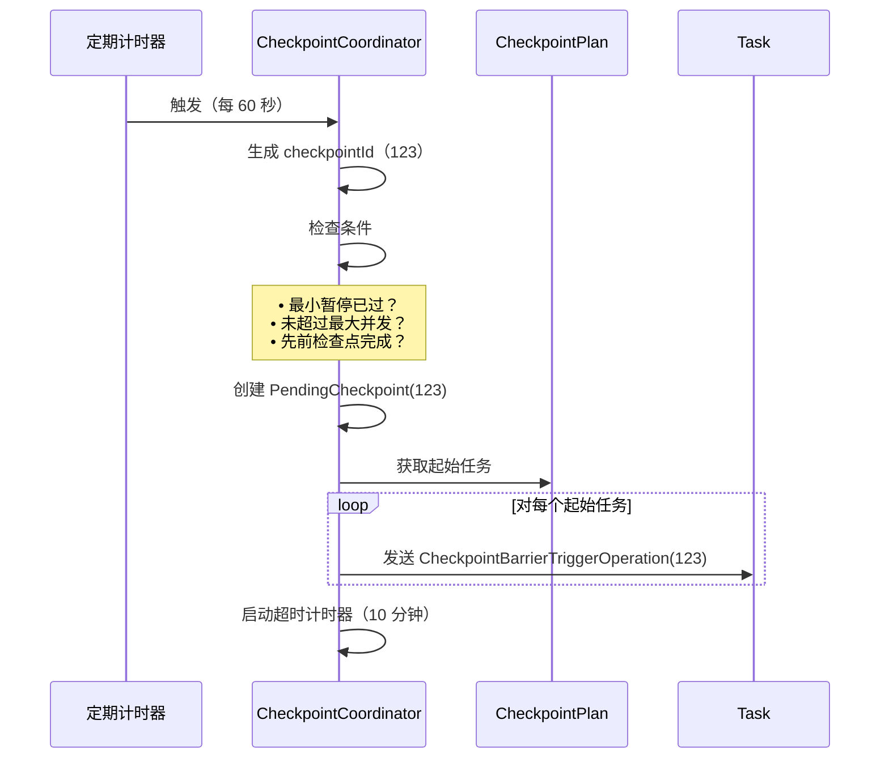
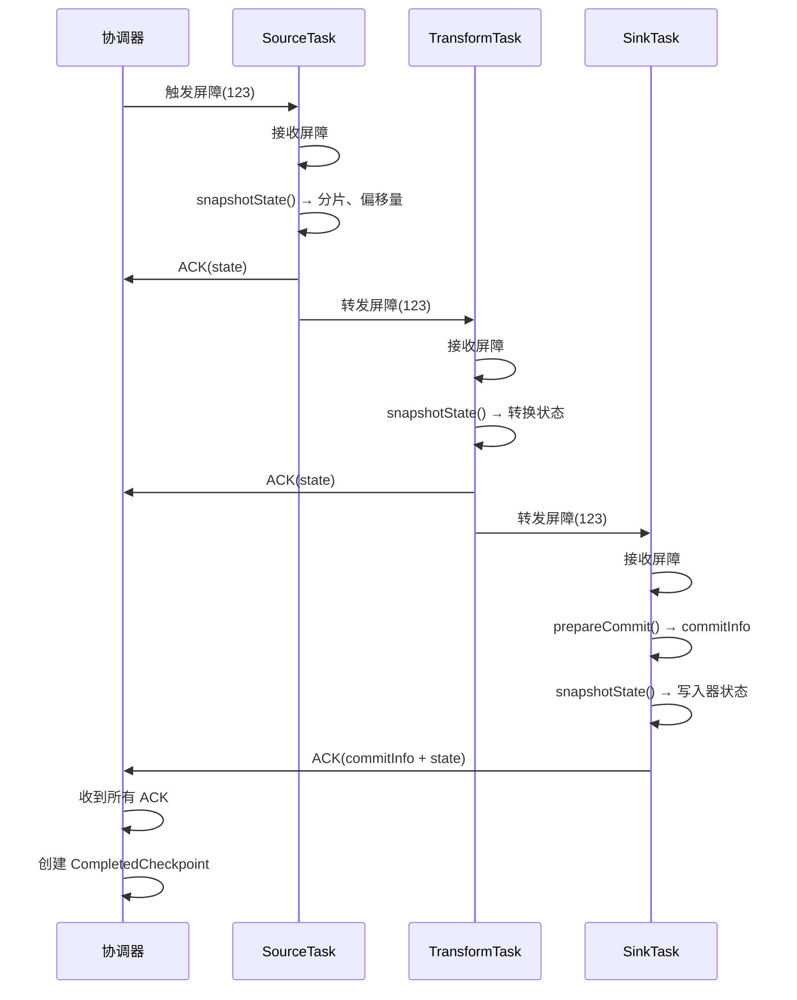
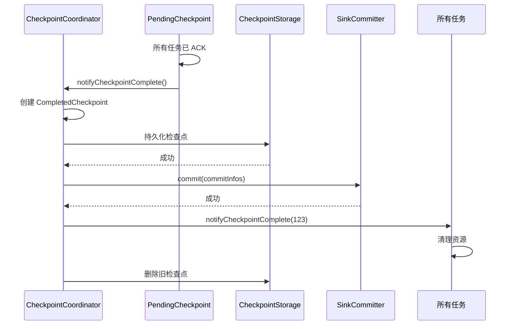
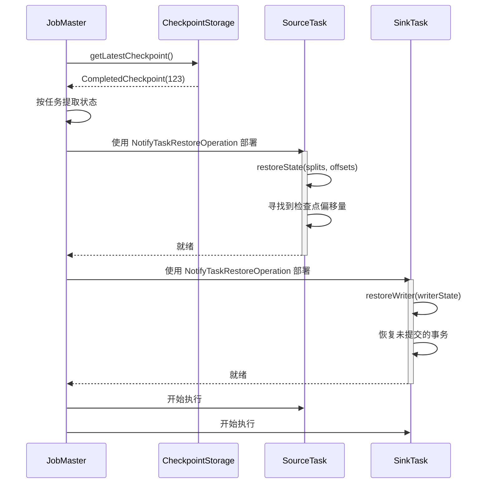

# 检查点机制

## 1. 概述

### 1.1 问题背景

分布式数据处理系统面临容错的关键挑战：

- **状态丢失**：如何在失败时保留处理状态？
- **精确一次**：如何确保每条记录被精确处理一次？
- **分布式一致性**：如何在分布式任务之间创建一致性快照？
- **性能**：如何在不阻塞数据处理的情况下执行检查点？
- **恢复**：如何在失败后高效恢复状态？

### 1.2 设计目标

SeaTunnel 的检查点机制旨在：

1. **保证精确一次语义**：一致性状态快照 + 两阶段提交
2. **最小化开销**：异步检查点，不阻塞数据处理
3. **快速恢复**：在数秒内从最新检查点恢复
4. **分布式协调**：协调数百个任务的检查点
5. **可插拔存储**：支持多种存储后端（HDFS、S3、本地、OSS）

### 1.3 理论基础

SeaTunnel 的检查点基于 **Chandy-Lamport 分布式快照算法**：

**核心思想**：在数据流中插入特殊标记（屏障）。当任务收到屏障时：
1. 快照其本地状态
2. 向下游转发屏障
3. 继续处理

结果：无需暂停整个系统即可获得全局一致性快照。

**参考**：["Distributed Snapshots: Determining Global States of Distributed Systems"](https://lamport.azurewebsites.net/pubs/chandy.pdf)（Chandy & Lamport，1985）

## 2. 架构设计

### 2.1 检查点架构

```
┌─────────────────────────────────────────────────────────────────┐
│                    JobMaster（每个管道）                         │
│                                                                   │
│   ┌───────────────────────────────────────────────────────┐     │
│   │         CheckpointCoordinator                         │     │
│   │                                                         │     │
│   │  • 触发检查点（定期/手动）                             │     │
│   │  • 生成检查点 ID                                       │     │
│   │  • 跟踪待处理的检查点                                  │     │
│   │  • 收集任务确认                                        │     │
│   │  • 持久化完成的检查点                                  │     │
│   │  • 清理旧检查点                                        │     │
│   └───────────────────────────────────────────────────────┘     │
│                            │                                      │
│                            │ (触发屏障)                           │
│                            ▼                                      │
└─────────────────────────────────────────────────────────────────┘
                             │
                             │ (CheckpointBarrier)
                             ▼
┌─────────────────────────────────────────────────────────────────┐
│                         工作节点                                  │
│                                                                   │
│   ┌──────────────┐      ┌──────────────┐      ┌──────────────┐ │
│   │ SourceTask 1 │      │ SourceTask 2 │      │ SourceTask N │ │
│   │              │      │              │      │              │ │
│   │ 1. 接收      │      │ 1. 接收      │      │ 1. 接收      │ │
│   │    屏障      │      │    屏障      │      │    屏障      │ │
│   │ 2. 快照      │      │ 2. 快照      │      │ 2. 快照      │ │
│   │    状态      │      │    状态      │      │    状态      │ │
│   │ 3. ACK       │      │ 3. ACK       │      │ 3. ACK       │ │
│   └──────┬───────┘      └──────┬───────┘      └──────┬───────┘ │
│          │                     │                     │          │
│          │ (屏障传播)           │                     │          │
│          ▼                     ▼                     ▼          │
│   ┌──────────────┐      ┌──────────────┐      ┌──────────────┐ │
│   │ Transform 1  │      │ Transform 2  │      │ Transform N  │ │
│   │              │      │              │      │              │ │
│   │ 1. 接收      │      │ 1. 接收      │      │ 1. 接收      │ │
│   │    屏障      │      │    屏障      │      │    屏障      │ │
│   │ 2. 快照      │      │ 2. 快照      │      │ 2. 快照      │ │
│   │    状态      │      │    状态      │      │    状态      │ │
│   │ 3. ACK       │      │ 3. ACK       │      │ 3. ACK       │ │
│   │ 4. 转发      │      │ 4. 转发      │      │ 4. 转发      │ │
│   └──────┬───────┘      └──────┬───────┘      └──────┬───────┘ │
│          │                     │                     │          │
│          ▼                     ▼                     ▼          │
│   ┌──────────────┐      ┌──────────────┐      ┌──────────────┐ │
│   │  SinkTask 1  │      │  SinkTask 2  │      │  SinkTask N  │ │
│   │              │      │              │      │              │ │
│   │ 1. 接收      │      │ 1. 接收      │      │ 1. 接收      │ │
│   │    屏障      │      │    屏障      │      │    屏障      │ │
│   │ 2. 准备      │      │ 2. 准备      │      │ 2. 准备      │ │
│   │    提交      │      │    提交      │      │    提交      │ │
│   │ 3. 快照      │      │ 3. 快照      │      │ 3. 快照      │ │
│   │    状态      │      │    状态      │      │    状态      │ │
│   │ 4. ACK       │      │ 4. ACK       │      │ 4. ACK       │ │
│   └──────────────┘      └──────────────┘      └──────────────┘ │
└─────────────────────────────────────────────────────────────────┘
                             │
                             │ (收到所有 ACK)
                             ▼
┌─────────────────────────────────────────────────────────────────┐
│                    CheckpointStorage                             │
│                  (HDFS / S3 / 本地 / OSS)                        │
│                                                                   │
│   CompletedCheckpoint {                                          │
│     checkpointId: 123                                            │
│     taskStates: {                                                │
│       SourceTask-1: { splits: [...], offsets: [...] }           │
│       SinkTask-1: { commitInfo: XidInfo(...) }                  │
│       ...                                                        │
│     }                                                            │
│   }                                                              │
└─────────────────────────────────────────────────────────────────┘
```

### 2.2 关键数据结构

#### CheckpointCoordinator

```java
public class CheckpointCoordinator {
    // 检查点 ID 生成器
    private final CheckpointIDCounter checkpointIdCounter;

    // 检查点执行计划
    private final CheckpointPlan checkpointPlan;

    // 待处理的检查点（进行中）
    private final Map<Long, PendingCheckpoint> pendingCheckpoints;

    // 已完成的检查点（成功）
    private final ArrayDeque<String> completedCheckpointIds;

    // 最新完成的检查点
    private CompletedCheckpoint latestCompletedCheckpoint;

    // 检查点存储
    private final CheckpointStorage checkpointStorage;

    // 配置
    private final long checkpointInterval;      // 触发间隔（毫秒）
    private final long checkpointTimeout;       // 超时时间（毫秒）
    private final int maxConcurrentCheckpoints; // 最大并发数
    private final int minPauseBetweenCheckpoints; // 最小暂停时间（毫秒）
}
```

#### PendingCheckpoint

表示进行中的检查点。

```java
public class PendingCheckpoint {
    private final long checkpointId;
    private final CheckpointType checkpointType; // CHECKPOINT 或 SAVEPOINT
    private final long triggerTimestamp;

    // 尚未确认的任务
    private final Set<Long> notYetAcknowledgedTasks;

    // 收集的操作状态（来自任务 ACK）
    private final Map<ActionStateKey, ActionState> actionStates;

    // 任务统计（已处理的记录、字节等）
    private final Map<Long, TaskStatistics> taskStatistics;

    // 当所有任务 ACK 时完成的 Future
    private final CompletableFuture<CompletedCheckpoint> completableFuture;

    /**
     * 任务确认检查点时调用
     */
    public void acknowledgeTask(long taskId, List<ActionSubtaskState> states,
                                TaskStatistics statistics) {
        notYetAcknowledgedTasks.remove(taskId);

        // 收集状态
        for (ActionSubtaskState state : states) {
            actionStates.computeIfAbsent(state.getKey(), k -> new ActionState())
                        .putSubtaskState(state);
        }

        // 收集统计
        taskStatistics.put(taskId, statistics);

        // 检查是否所有任务都已确认
        if (notYetAcknowledgedTasks.isEmpty()) {
            completeCheckpoint();
        }
    }

    private void completeCheckpoint() {
        CompletedCheckpoint completed = new CompletedCheckpoint(
            checkpointId, actionStates, taskStatistics, System.currentTimeMillis()
        );
        completableFuture.complete(completed);
    }
}
```

#### CompletedCheckpoint

持久化的检查点数据。

```java
public class CompletedCheckpoint implements Serializable {
    private final long checkpointId;
    private final Map<ActionStateKey, ActionState> taskStates;
    private final Map<Long, TaskStatistics> taskStatistics;
    private final long completedTimestamp;
}

public class ActionState implements Serializable {
    private final ActionStateKey key; // (pipelineId, actionId)
    private final Map<Integer, ActionSubtaskState> subtaskStates;
}

public class ActionSubtaskState implements Serializable {
    private final int subtaskIndex;
    private final byte[] state; // 序列化的状态
}
```

### 2.3 CheckpointStorage

检查点持久化的抽象。

```java
public interface CheckpointStorage {
    /**
     * 存储已完成的检查点
     */
    void storeCheckpoint(CompletedCheckpoint checkpoint) throws IOException;

    /**
     * 获取最新检查点
     */
    Optional<CompletedCheckpoint> getLatestCheckpoint() throws IOException;

    /**
     * 根据 ID 获取特定检查点
     */
    Optional<CompletedCheckpoint> getCheckpoint(long checkpointId) throws IOException;

    /**
     * 删除旧检查点
     */
    void deleteCheckpoint(long checkpointId) throws IOException;
}
```

**实现**：
- `LocalFileCheckpointStorage`：本地文件系统（测试）
- `HdfsCheckpointStorage`：HDFS
- `S3CheckpointStorage`：AWS S3
- `OssCheckpointStorage`：阿里云 OSS

## 3. 检查点流程

### 3.1 触发检查点



**触发条件**：
1. 检查点间隔已过（例如，60 秒）
2. 检查点之间的最小暂停已过（例如，10 秒）
3. 并发检查点数 < 最大值（例如，1）
4. 没有检查点正在进行（对于单个并发）

### 3.2 屏障传播



**屏障流动规则**：
1. **数据源任务**：管道起点，从协调器接收屏障
2. **转换任务**：从上游接收，快照，向下游转发
3. **数据汇任务**：管道终点，从上游接收，快照，不转发

**屏障对齐**（对于具有多个输入的任务）：
```java
// 具有 2 个输入的任务
输入 1: ──data──data──[barrier-123]──data──data──
                         │ 等待！
输入 2: ──data──data──data──data──[barrier-123]──
                                     │
                                     ▼
                        两个屏障都已接收，快照状态
```

### 3.3 状态快照

每种任务类型快照不同的状态：

**SourceTask**：
```java
@Override
public void triggerBarrier(long checkpointId) {
    // 1. 快照 SourceReader 状态（分片 + 偏移量）
    List<byte[]> states = sourceFlowLifeCycle.snapshotState(checkpointId);

    // 2. 创建 ActionSubtaskState
    ActionSubtaskState state = new ActionSubtaskState(subtaskIndex, states);

    // 3. 向协调器发送 ACK
    sendAcknowledgement(checkpointId, Collections.singletonList(state));

    // 4. 向下游转发屏障
    forwardBarrierToDownstream(checkpointId);
}
```

**TransformTask**：
```java
@Override
public void triggerBarrier(long checkpointId) {
    // 1. 快照转换状态（通常是无状态的，空状态）
    List<byte[]> states = transformFlowLifeCycle.snapshotState(checkpointId);

    // 2. 创建 ActionSubtaskState
    ActionSubtaskState state = new ActionSubtaskState(subtaskIndex, states);

    // 3. 发送 ACK
    sendAcknowledgement(checkpointId, Collections.singletonList(state));

    // 4. 转发屏障
    forwardBarrierToDownstream(checkpointId);
}
```

**SinkTask**：
```java
@Override
public void triggerBarrier(long checkpointId) {
    // 1. 准备提交（两阶段提交）
    Optional<CommitInfoT> commitInfo = sinkWriter.prepareCommit();

    // 2. 快照写入器状态
    List<StateT> writerStates = sinkWriter.snapshotState(checkpointId);

    // 3. 创建 ActionSubtaskState（包含提交信息和状态）
    ActionSubtaskState state = new ActionSubtaskState(
        subtaskIndex,
        serialize(writerStates),
        commitInfo.orElse(null)
    );

    // 4. 发送 ACK（无转发 - 管道终点）
    sendAcknowledgement(checkpointId, Collections.singletonList(state));
}
```

### 3.4 检查点完成



**完成步骤**：
1. 所有任务已确认
2. 从 `PendingCheckpoint` 创建 `CompletedCheckpoint`
3. 将检查点持久化到存储
4. 触发数据汇提交（两阶段提交）
5. 通知所有任务完成
6. 清理旧检查点（保留最后 N 个）

### 3.5 检查点超时

```java
// CheckpointCoordinator
private void startCheckpointTimeout(long checkpointId, long timeoutMs) {
    scheduledExecutor.schedule(() -> {
        PendingCheckpoint pending = pendingCheckpoints.get(checkpointId);
        if (pending != null && !pending.isCompleted()) {
            LOG.warn("Checkpoint {} timeout after {}ms, {} tasks not yet acknowledged",
                     checkpointId, timeoutMs, pending.getNotYetAcknowledgedTasks());

            // 失败检查点
            pending.abort();
            pendingCheckpoints.remove(checkpointId);

            // 如果需要触发作业故障转移
            handleCheckpointFailure(checkpointId);
        }
    }, timeoutMs, TimeUnit.MILLISECONDS);
}
```

**超时处理**：
- 默认超时：10 分钟
- 如果超时，检查点失败
- 作业继续使用先前的检查点
- 下一个检查点将按计划触发

## 4. 恢复过程

### 4.1 从检查点恢复



**恢复步骤**：
1. JobMaster 从存储检索最新的 `CompletedCheckpoint`
2. 为每个任务提取状态（按 ActionStateKey 和 subtaskIndex）
3. 使用包含状态的 `NotifyTaskRestoreOperation` 部署任务
4. 任务恢复状态：
   - **SourceReader**：恢复分片和偏移量，寻找到位置
   - **Transform**：恢复转换状态（通常为无）
   - **SinkWriter**：恢复写入器状态，可能有未提交的事务
5. 任务转换到 READY_START 状态
6. 作业恢复执行

**示例：JDBC 数据源恢复**：
```java
public class JdbcSourceReader {
    @Override
    public void restoreState(List<JdbcSourceState> states) {
        for (JdbcSourceState state : states) {
            JdbcSourceSplit split = state.getSplit();
            long offset = state.getCurrentOffset();

            // 使用偏移量恢复分片
            pendingSplits.add(split);

            // 处理分片时，从偏移量开始
            String query = split.getQuery() + " OFFSET " + offset;
        }
    }
}
```

### 4.2 精确一次恢复

检查点恢复 + 数据汇两阶段提交的组合确保精确一次：

```
检查点 N（已完成）：
  数据源偏移量：[100, 200, 300]
  数据汇准备的提交：[XID-1, XID-2, XID-3]
  数据汇提交器提交 XID-1、XID-2、XID-3

                    ↓ [失败]

从检查点 N 恢复：
  1. 恢复数据源偏移量：[100, 200, 300]
  2. 数据源从偏移量 100、200、300 开始读取
  3. 数据汇写入器恢复状态（可能有未提交的 XID）
  4. 数据汇提交器重试提交 XID（幂等）

结果：记录 0-99、100-199、200-299 精确提交一次
      从 100+ 开始的记录重新处理但不重复（幂等提交）
```

## 5. 配置和调优

### 5.1 检查点配置

```hocon
env {
  # 启用检查点
  checkpoint.interval = 60000 # 每 60 秒触发一次

  # 检查点超时
  checkpoint.timeout = 600000 # 10 分钟

  # 最大并发检查点
  checkpoint.max-concurrent = 1 # 对于精确一次通常为 1

  # 检查点之间的最小暂停
  checkpoint.min-pause = 10000 # 10 秒

  # 检查点存储
  checkpoint.storage.type = "hdfs" # hdfs / s3 / local / oss
  checkpoint.storage.path = "hdfs:///seatunnel/checkpoints"

  # 保留
  checkpoint.retention.max-retained-checkpoints = 3
}
```

### 5.2 调优指南

**检查点间隔**：
- **短间隔（10-30s）**：快速恢复，但开销更高
- **中间隔（60-120s）**：平衡（推荐）
- **长间隔（300-600s）**：低开销，但恢复较慢

**权衡**：
- 更短的间隔 → 更频繁的 I/O → 更高的存储成本
- 更长的间隔 → 更少的开销 → 更长的恢复时间

**经验法则**：将间隔设置为可容忍的恢复时间（数据丢失窗口）。

**检查点超时**：
- 应该 >> 检查点间隔
- 取决于状态大小和存储速度
- 大多数情况下默认 10 分钟是合理的

**最大并发检查点**：
- 对于精确一次设置为 1（推荐）
- 对于低延迟的至少一次设置为 2+

**存储选择**：
- **本地**：仅测试，无 HA
- **HDFS**：生产环境，适合大状态
- **S3**：生产环境，云原生，延迟稍高
- **OSS**：生产环境，阿里云

## 6. 性能优化

### 6.1 异步检查点

状态快照不阻塞数据处理：

```java
public class AsyncSnapshotSupport {
    @Override
    public void snapshotState(long checkpointId) {
        // 1. 创建当前状态的快照（快速，内存复制）
        StateSnapshot snapshot = createSnapshot();

        // 2. 继续数据处理（不等待序列化/上传）
        // ...

        // 3. 异步序列化和上传
        CompletableFuture.runAsync(() -> {
            byte[] serialized = serialize(snapshot);
            checkpointStorage.upload(checkpointId, serialized);
        }, executorService);
    }
}
```

### 6.2 增量检查点（未来）

仅检查点更改的状态：

```java
// 完整检查点（第一次）
检查点 1：状态 = 1GB → 上传 1GB

// 增量检查点（后续）
检查点 2：状态 = 1.1GB → 上传 100MB（增量）
检查点 3：状态 = 1.05GB → 上传 0MB（删除不上传）
```

**好处**：
- 减少检查点时间
- 降低存储 I/O
- 更快的检查点完成

**挑战**：
- 更复杂的状态管理
- 需要跟踪状态变化
- 恢复需要增量链

### 6.3 本地状态后端（未来）

在本地存储热状态，仅检查点摘要：

```java
// RocksDB 本地状态后端
class RocksDBStateBackend {
    private final RocksDB rocksDB; // 快速本地 SSD

    @Override
    public void put(String key, byte[] value) {
        rocksDB.put(key.getBytes(), value); // 本地写入（快速）
    }

    @Override
    public byte[] snapshotState() {
        // 仅检查点 RocksDB 快照引用
        return rocksDB.createCheckpoint().getBytes();
    }
}
```

## 7. 最佳实践

### 7.1 状态大小优化

**1. 保持状态小**：
```java
// ❌ 错误：缓冲整个数据集
class BadSourceReader {
    private List<SeaTunnelRow> bufferedRows = new ArrayList<>(); // 可能很大！

    List<State> snapshotState() {
        return serialize(bufferedRows); // 大状态
    }
}

// ✅ 正确：仅跟踪偏移量
class GoodSourceReader {
    private long currentOffset = 0;

    List<State> snapshotState() {
        return serialize(currentOffset); // 小状态
    }
}
```

**2. 使用高效的序列化**：
- 优先使用 Protobuf、Kryo 而不是 Java 序列化
- 压缩大状态（gzip、snappy）

### 7.2 监控

**关键指标**：
- `checkpoint_duration`：从触发到完成的时间
- `checkpoint_size`：持久化检查点的大小
- `checkpoint_failure_rate`：失败检查点的百分比
- `checkpoint_alignment_duration`：屏障对齐所花费的时间

**告警**：
- 如果 `checkpoint_duration` > 阈值（例如，5 分钟）则告警
- 如果 `checkpoint_failure_rate` > 10% 则告警
- 如果在 2x 间隔内没有完成检查点则告警

### 7.3 故障排除

**问题**：检查点超时

**可能原因**：
1. 任务卡住（数据处理缓慢）
2. 大状态（序列化/上传缓慢）
3. 慢速存储（网络/磁盘 I/O）
4. 屏障对齐缓慢（数据倾斜）

**解决方案**：
- 增加检查点超时
- 优化状态大小
- 使用更快的存储
- 调整并行度

**问题**：高检查点开销

**可能原因**：
1. 检查点间隔太短
2. 大状态大小
3. 慢速存储

**解决方案**：
- 增加检查点间隔
- 优化状态大小
- 启用增量检查点（可用时）

## 8. 相关资源

- [架构概览](../overview.md)
- [设计理念](../design-philosophy.md)
- [引擎架构](../engine/engine-architecture.md)
- [数据汇架构](../api-design/sink-architecture.md)
- [精确一次语义](exactly-once.md)

## 9. 参考资料

### 关键源文件

- [CheckpointCoordinator.java](../../../seatunnel-engine/seatunnel-engine-server/src/main/java/org/apache/seatunnel/engine/server/checkpoint/CheckpointCoordinator.java)
- [PendingCheckpoint.java](../../../seatunnel-engine/seatunnel-engine-server/src/main/java/org/apache/seatunnel/engine/server/checkpoint/PendingCheckpoint.java)
- [CheckpointStorage.java](../../../seatunnel-engine/seatunnel-engine-storage/checkpoint-storage-api/src/main/java/org/apache/seatunnel/engine/checkpoint/storage/api/CheckpointStorage.java)

### 学术论文

- Chandy, K. M., & Lamport, L. (1985). ["Distributed Snapshots: Determining Global States of Distributed Systems"](https://lamport.azurewebsites.net/pubs/chandy.pdf)
- Carbone, P., et al. (2017). ["State Management in Apache Flink"](http://www.vldb.org/pvldb/vol10/p1718-carbone.pdf)

### 进一步阅读

- [Apache Flink 检查点](https://nightlies.apache.org/flink/flink-docs-stable/docs/dev/datastream/fault-tolerance/checkpointing/)
- [Spark 结构化流检查点](https://spark.apache.org/docs/latest/structured-streaming-programming-guide.html#recovering-from-failures-with-checkpointing)
