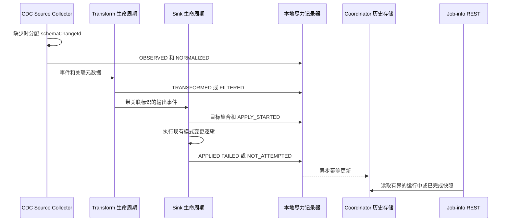

# 模式演进时间线设计

本文档提出 [GH-11355](https://github.com/apache/seatunnel/issues/11355) 和 [STIP-36](https://github.com/apache/seatunnel/issues/11790) 的第一版后端契约。当前文档描述的是设计方案，并不表示相关 API 已经实现。

## 问题

SeaTunnel 会将 CDC 源产生的模式变更事件传递到 Transform 和 Sink Writer，但是当前运行时只能从各阶段的独立日志中查看信息。运维人员无法通过一份作业级记录确认：

- 观察到了哪个模式变更；
- Transform 是否修改或过滤了事件；
- 源表如何解析为一个或多个目标表；
- 每个目标是否支持并成功应用变更；
- 某个目标失败时，其他目标是否已经成功变更。

当前运行时已经具备可复用的集成点：

- `SeaTunnelSourceCollector` 接收标准化后的 `SchemaChangeEvent`；
- `TransformFlowLifeCycle` 调用每个 Transform 的 `mapSchemaChangeEvent`，可以观察事件替换和过滤；
- `SinkFlowLifeCycle` 为单个 Writer 调用模式演进；
- `MultiTableSinkWriter` 在共享屏障处解析完整目标集合并应用模式变更。

本方案在这些边界记录由框架拥有的决策事实，但不会引入另一套模式变更状态机。

## 与模式变更正确性契约的关系

[GH-11402](https://github.com/apache/seatunnel/issues/11402) 负责模式顺序、重放、检查点、恢复和 schema epoch 的正确性。本设计只消费并记录这些决策。

时间线存储绝不能：

- 确认或拒绝模式变更；
- 改变目标分发顺序；
- 让检查点等待；
- 触发重试或恢复；
- 把成功的模式变更转换为失败。

时间线记录不可用时，现有模式变更路径继续保持原有行为。

## 范围

第一版应为运行中和已完成的 Zeta 作业提供有界时间线。

第一版应当：

- 在 Source、Transform、路由和 Sink 阶段关联同一个标准化事件；
- 保留源表和最终目标表标识；
- 暴露标准化决策、目标结果和原因码；
- 保留多目标部分成功结果，避免报告错误的整体成功；
- 默认响应中不包含原始 DDL；
- 在受支持的任务传输和 Active Master 故障切换后保留数据；
- 使用现有已完成作业历史的生命周期进行过期清理。

第一版不包含：

- 持久合规审计保证；
- 无限事件保留；
- 第二套顺序或重放协议；
- 稳定响应中的原始连接器载荷；
- 自动模式修复；
- 在后端契约验证前实现 Web UI。

## 运行时流程



记录器调用只能进行本地非阻塞操作。网络和 HA 写入必须在 Source、Transform、Sink 和检查点关键路径之外异步执行。

## 关联标识

### 载体

第一版建议在 `SchemaChangeEvent` 中增加可选关联元数据，同时保留现有事件构造函数：

```java
default String getSchemaChangeId() {
    return null;
}

default void setSchemaChangeId(String schemaChangeId) {
    // 旧连接器事件可以暂时忽略关联元数据。
}
```

SeaTunnel 内置模式变更事件的基类 `TableEvent` 保存该值。内置事件第一次进入运行时且没有 ID 时，Source Collector 分配一个不透明 UUID。

未保存可选元数据的自定义事件实现仍保持兼容，但后续阶段应标记为关联信息不可用。时间线不得为此类事件声明精确的端到端关联。

当 Transform 返回替换事件时，通过框架辅助方法复制事件元数据：

```java
SchemaChangeEventMetadata.copy(sourceEvent, replacementEvent);
```

辅助方法只复制关联 ID、作业标识等框架元数据，不复制连接器 statement 或由 Transform 拥有的模式字段。

该方案优于对象引用、表名/类型/时间戳哈希和外部 side map，因为这些替代方案无法可靠跨越事件替换、序列化或重放。

### 兼容性门槛

实现必须把新字段视为可选字段，并在合并前验证旧版本和新版本 Java 序列化。如果需要显式声明 `serialVersionUID`，必须先获取当前类自动生成的值并沿用该值，不能随意选择新值。

同一个已序列化事件在任务传输或引擎重放时保留关联 ID。如果连接器从更早的源位置重新读取并重新构造事件，则这是一次新的运行时观察，应分配新 ID；除非 GH-11402 后续提供持久的原生重放标识。时间线不能根据表名、事件类型、DDL 或时间戳猜测两个事件相同。

## 执行尝试和去重

每个记录更新还携带由引擎提供的当前 Pipeline 执行尝试标识。去重键为：

```text
schemaChangeId + executionAttemptId + stage + targetIdentity
```

同一执行尝试中重复投递同一阶段是幂等的。新执行尝试下的重放保留在同一个逻辑事件中，不会覆盖较早的结果。

某条路径无法提供执行尝试标识时，该值标记为不可用，不能被展示为精确的重放信息。

## 记录模型

一个逻辑事件对应一个 `SchemaEvolutionRecord`：

```json
{
  "schemaChangeId": "2cb23eb5-9716-42b2-b3a4-7f07a79c9368",
  "sequence": 42,
  "jobId": "123456789",
  "sourceTable": "inventory.products",
  "eventType": "ADD_COLUMN",
  "eventCreatedAt": 1786900000000,
  "observedAt": 1786900000100,
  "state": "TERMINAL",
  "outcome": "PARTIALLY_APPLIED",
  "attempts": [
    {
      "executionAttemptId": "attempt-2",
      "decisions": [],
      "targets": []
    }
  ],
  "totalTargetCount": 2,
  "returnedTargetCount": 2,
  "targetsTruncated": false,
  "omittedAttemptCount": 0
}
```

稳定字段只包含由框架拥有的事实。连接器 offset、原始 DDL、厂商异常对象和任意载荷不属于默认契约。

## 决策阶段

第一版在对应路径确实发生时记录以下阶段：

- `OBSERVED`：Source Collector 收到事件；
- `NORMALIZED`：事件成为 SeaTunnel 支持的 `SchemaChangeEvent`；
- `TRANSFORMED`：Transform 返回了变化后的事件；
- `FILTERED`：源规则或 Transform 有意移除了事件；
- `TARGET_RESOLVED`：完成 Sink 目标解析；
- `POLICY_EVALUATED`：评估了已配置的行为策略；
- `CAPABILITY_EVALUATED`：确定 Sink 支持能力；
- `APPLY_STARTED`：某个目标开始应用；
- `COMPLETED`：目标或在 Sink 前被过滤的事件到达终态。

不是每条路径都会产生所有阶段。缺少的阶段标记为不可用，不能通过推测补齐。

## 目标标识和多目标分发

目标标识必须区分并行和多 Sink 路径。它包含 Sink Vertex 标识、可获得时的 Writer 或 Sub-writer 标识，以及最终物理目标表。连接器对象引用不会对外暴露。

`MultiTableSinkWriter` 在开始应用前已经知道完整分发目标集合。它应先记录目标集合，再围绕现有 `applySchemaChange` 调用记录每个目标结果。

目标结果包括：

- `APPLIED`；
- `IGNORED`；
- `FILTERED`；
- `UNSUPPORTED`；
- `FAILED`；
- `NOT_ATTEMPTED`。

Fail-fast 行为因前一个目标失败而停止后续分发时使用 `NOT_ATTEMPTED`，原因码为 `ABORTED_AFTER_TARGET_FAILURE`。不能把它报告为 `FAILED` 或 `UNKNOWN`。

父记录结果只根据已记录的目标集合计算：

- 所有必要目标均成功时为 `APPLIED`；
- 在目标分发前结束时为 `FILTERED`；
- 策略有意忽略所有目标时为 `IGNORED`；
- 没有目标成功且至少一个失败时为 `FAILED`；
- 至少一个目标成功且另一个失败或未尝试时为 `PARTIALLY_APPLIED`；
- 目标集合或终态尚不完整时为 `UNKNOWN`。

该计算只用于诊断，不决定作业失败还是继续。

## 记录器失败契约

每个阶段的记录都采用尽力而为语义：

1. 生产端更新很小的本地不可变快照，或写入有界更新队列。
2. Worker Operation 异步批量发送到 Coordinator。
3. Coordinator 将更新原子合并到作业级历史条目。
4. 生产、传输或存储失败增加低基数指标，并输出限频警告。

Coordinator 能保留健康更新时，历史响应包含 `droppedUpdateCount` 和 `lastRecorderErrorAt`。整个历史存储不可用时，只能通过日志和指标观察故障。运行时不能伪造成功目标结果来隐藏缺失的记录数据。

记录器异常必须在现有模式变更结果之外捕获，不能替换、抑制或包装 Source、Transform 或 Sink 异常。

## 存储和保留

Coordinator 拥有一个独立的 HA 作业条目。原子作业条目更新负责 sequence 分配、去重、合并和淘汰。

第一版使用以下限制：

- 每个作业最多保留 500 个逻辑事件记录；
- 每个逻辑事件最多保留 16 个执行尝试；
- 每个执行尝试最多保留 100 个目标结果；
- 每个可选错误摘要最多保留 4 KiB 有效 UTF-8；
- 优先淘汰最旧的终态逻辑记录；
- 已完成历史按照 `history-job-expire-minutes` 过期。

不能为了新事件而淘汰进行中的记录。如果所有已保留记录都处于进行中且达到上限，则丢弃新记录，增加 `droppedRecordCount`，并继续正常模式处理。这样可以保证存储严格有界，同时不会静默删除活跃操作。

执行尝试或目标详情超过限制时，省略最旧的终态尝试或多余目标详情，并在响应中暴露总数、返回数和截断标记。

作业终止时，`JobHistoryService` 写入一份有界的已完成快照，并设置相同的 TTL。快照写入采用尽力而为语义，不能改变作业终态。

## REST 契约

建议的端点为：

```text
GET /job-info/{jobId}/schema-evolution?limit=100&beforeSequence=42
```

可选过滤条件：

- `table`：精确匹配源表或目标表；
- `outcome`：标准化父结果。

行为：

- 按 sequence 降序返回记录；
- `limit` 默认为 100，并限制到最大保留数量；
- 运行中和已完成作业返回相同模型；
- 已知作业没有记录时返回空集合；
- 未知或已过期作业沿用现有 job-not-found 行为；
- 明确暴露丢弃和截断数据；
- 保持现有 `/job-info/{jobId}` 字段不变。

路由只接受精确路径格式。额外路径段沿用现有 not-found 行为。

## 安全和隐私

端点沿用其他引擎作业详情端点的 `BasicAuthFilter` 边界。

持久化之前：

- 排除原始 DDL 和连接器原生载荷；
- 对可选错误摘要进行脱敏和 UTF-8 有界截断；
- 不存储任意异常对象；
- 表和 Worker 元数据沿用现有作业详情授权边界。

文档必须说明：未启用 REST 认证时，表名和有界错误摘要仍可能包含运维敏感信息。

## 兼容性

该功能是增量功能：

- 现有作业不需要修改配置；
- 模式变更顺序、过滤和 Sink 行为保持不变；
- 现有 REST 字段保持不变；
- 记录器失败不会改变作业正确性；
- 缺少关联元数据的旧事件仍然可读；
- 连接器初期可以只提供框架拥有的事实。

只有在关联序列化、多目标行为、恢复/重放标识和已完成历史保留得到端到端验证后，才冻结公共 REST 模型。

## 验证计划

测试应覆盖：

- Source 观察和标准化；
- Transform 替换事件时保留关联元数据；
- Source 和 Transform 过滤；
- 单目标成功和失败；
- 多目标全部成功、fail-fast、continue-on-error 和部分成功；
- 重复阶段投递不会产生重复决策；
- 在另一个执行尝试下重放；
- Active Master 切换后保留已确认记录；
- 严格的记录、尝试、目标和错误大小限制；
- 记录器或存储失败不改变模式行为；
- 运行中和已完成 REST 响应；
- 旧版本和新版本事件序列化兼容性。

至少一个 E2E 路径应使用 MySQL CDC 和支持模式演进的 JDBC Sink。负向路径应使用不支持的事件或 Sink。

## 交付计划

1. 先就本文档中的关联、多目标、保留、记录器和 REST 契约达成一致。
2. 增加内部记录模型、可选事件关联元数据、序列化兼容性测试和本地记录器接口。
3. 增加有界 HA 运行中/已完成历史存储和原子合并测试。
4. 增加 Source 和 Transform 决策捕获。
5. 增加单 Writer 和多表目标结果捕获。
6. 增加 REST 路由、校验、认证边界和兼容性测试。
7. 增加 E2E 恢复、多目标测试和运维文档。
8. 后端模型稳定后，在独立 PR 中增加 Web UI。

设计被接受后，每个实现切片应创建独立 Issue。GH-11355 继续作为功能总 Issue，STIP-36 继续作为设计事实来源。

## 验收标准

1. 一个内置模式变更事件在 Source、Transform 替换、任务传输和受支持重放中保持同一个关联 ID。
2. 重新构造的源事件不会根据表名、类型、DDL 或时间戳被错误去重。
3. 同一执行尝试中的重复更新具有幂等性。
4. 新执行尝试下的重放保持可见，不覆盖较早尝试。
5. 多目标结果明确展示成功、失败和未尝试目标，不产生错误的整体成功。
6. 记录、执行尝试、目标和错误摘要严格有界，并暴露丢弃或截断信息。
7. 默认存储和 REST 模型中不包含原始 DDL。
8. 记录器、传输或存储失败不改变模式变更或作业行为。
9. 运行中和已完成作业暴露相同响应模型。
10. 现有模式演进和 job-info 行为保持向后兼容。
11. 添加可选关联元数据后，旧事件序列化仍然可读。
12. 中英文文档描述最终契约及其限制。
