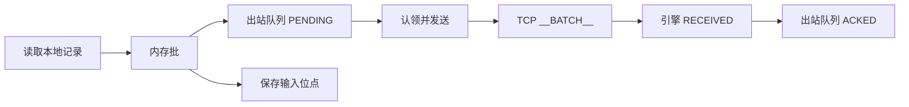
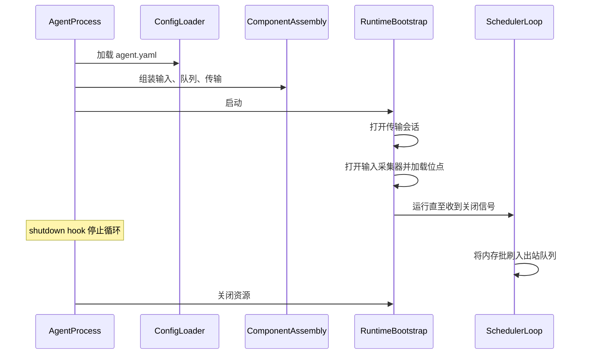
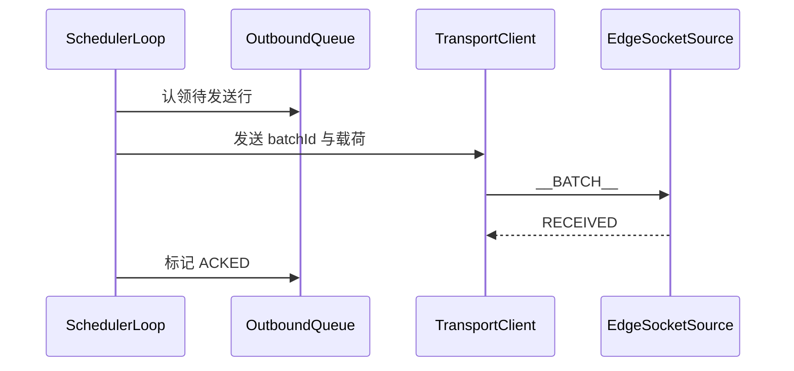

# 架构概览

本文描述 SeaTunnel Edge Agent 的系统设计：边界、数据流、持久化模型以及与引擎的集成方式。安装、agent.yaml 全量参数与日常运维请参阅 [Edge Agent](./about.md)。

## 1. 背景与目标

### 1.1 问题背景

在很多生产网络中，Zeta 集群无法直接访问边缘节点上的本地文件（含应用日志、NDJSON 等路径上的数据）。因此需要一个专门的边缘采集进程，用于：

- 在数据源附近读取本地记录，
- 在网络波动时保持可恢复投递能力，
- 在不把 engine worker 部署到边缘节点的前提下，把数据送入运行中的 SeaTunnel 作业。

### 1.2 设计目标

SeaTunnel Edge Agent 遵循以下目标：

1. 独立部署：打包与生命周期与引擎 worker 解耦，在边缘主机上以独立进程运行。安装布局见 [Edge Agent — 部署指南](./deployment-guide.md)。
2. 出站持久化：基于 WAL 的出站队列，具备明确的状态流转。
3. 协议与 Zeta 对齐：复用 EdgeSocket 行协议（`__AUTH__` / `__BATCH__` → RECEIVED）；详见 [EdgeSocket Source](../connectors/source/EdgeSocket.md)。
4. 运维简单：YAML 配置与可预测的调度循环；运维细节集中在 [Edge Agent](./about.md)。
5. 边界清晰：发送链路与投递语义边界明确，便于稳定运维与扩展实现。

### 1.3 架构定位对比

| 维度 | Edge Agent | SeaTunnel Engine |
|------|------------|-------------------|
| 运行位置 | 边缘主机独立进程 | 集群内协调节点与 worker task |
| 输入访问 | 边缘本地文件（glob 路径，含日志文件） | 连接器生态可达的数据源（数据库、消息系统、对象存储等） |
| 持久化与状态 | 本地 WAL 出站队列与输入位点存储 | Checkpoint、作业状态与任务容错恢复 |
| 网络角色 | 主动连接 Engine EdgeSocket 接入端口 | 对外提供作业接入与内部任务调度执行 |
| 主要职责 | Edge Agent 采集 + 转发 | 端到端数据集成与计算编排执行 |

### 1.4 责任边界

为避免架构语义漂移，以下边界应视为稳定契约：

| 边界 | Edge Agent 负责 | Engine / Job 负责 |
|------|-----------------|-------------------|
| 耐久边界 | 本地出站行持久化并重试，直到引擎返回 RECEIVED | 接入后的持久处理与下游一致性 |
| Checkpoint 边界 | 本版本不感知 checkpoint（不使用 `__COMMIT__`） | checkpoint 生命周期与 exactly-once 语义 |
| 故障归属 | 本地文件读取、WAL 状态、传输重连行为 | Source 接入策略、下游转换与 Sink 正确性 |

## 2. 逻辑架构

### 2.1 部署拓扑

```text
┌─────────────────────────────────────────────────────────────────┐
│                          边缘主机                               │
│  ┌───────────────────────────────────────────────────────────┐  │
│  │                    Edge Agent 进程                          │  │
│  │  输入采集器 ──► 调度与批处理                                │  │
│  │         │              │                                 │  │
│  │         │              ├──► 出站队列（WAL）                │  │
│  │         └──► 输入位点存储（本地持久化）                    │  │
│  │                            │                              │  │
│  │                            └──► 传输客户端                │  │
│  └───────────────────────────────────────────────────────────┘  │
└─────────────────────────────────────────────────────────────────┘
                                │ TCP 行协议
                                ▼
┌─────────────────────────────────────────────────────────────────┐
│                  SeaTunnel Engine (Zeta)                        │
│  按 output.endpoint 接入的 EdgeSocket Source                    │
└─────────────────────────────────────────────────────────────────┘
```

信任边界：Agent 信任本地文件系统访问及自身本地持久化存储；引擎通过 `__AUTH__` 校验配置的 output.token。不做集群端点自动发现，output.endpoint 为静态配置。

### 2.2 数据面

记录在 Agent 内由单线程调度循环推进：



控制面（配置加载、插件选择、启停生命周期）在启动与关闭时执行；上图热路径为数据面。

### 2.3 代码仓库模块

实现按三个 Maven 模块划分（名称仅便于在仓库中定位）：

| 层次 | 职责 | 模块 |
|------|------|------|
| 运行时核心 | YAML 解析、进程生命周期、调度循环、出站队列与输入位点持久化 | seatunnel-edge-agent-starter |
| 传输与编码 | EdgeSocket 或 console 出站、重连策略、raw/packet 载荷模式 | seatunnel-edge-agent-transport |
| 输入插件 | file 采集、NDJSON 规范化、多行合并 | seatunnel-edge-agent-connector |

分发包由 seatunnel-dist 的 edge-agent 装配产出；见 [下载](./download.md)。

## 3. 运行时行为

### 3.1 启动与关闭



优雅关闭时，调度循环会在退出前将内存中的批次写入出站队列，避免仅驻留在内存中的记录丢失。

### 3.2 主循环

调度循环每次迭代：

1. 轮询输入 — 从配置的输入采集器读取至多 queue.poll-batch-size 条事件（input.*）。
2. 内存缓冲 — 累积至 agent.bulk-max-size 或 agent.flush-interval-ms。
3. 刷入持久化 — 将事件追加为出站队列 PENDING 行；持久化每条事件对应的输入位点（文件偏移 / 行元数据）。
4. 发送出站 — 认领待发送行、编码载荷、经传输层发送；收到 RECEIVED 后标记为 ACKED。
5. 维护 — 将超限 PENDING 标为 DEAD、复活 SENDING 行、按 queue.acked-retention-ms 清理已确认行、空闲时休眠 agent.idle-sleep-ms。

### 3.3 出站队列状态机

每条出站记录的状态流转：

```text
PENDING
  │ 认领发送（attempt_count++）
  ▼
SENDING
  │ 发送成功且引擎返回 RECEIVED
  ├──────────────► ACKED
  │
  └ 发送失败 / 超时 / RECEIVED 前崩溃
                 ▼
               PENDING（尝试次数递增；经 resurrect 恢复）
  │
  └ attempt_count >= retry.max-attempts
          ▼
        DEAD（不再发送，需运维处理）
```

resurrect 定期将 SENDING 行恢复为 PENDING，避免在「认领」与「RECEIVED」之间崩溃导致数据悬挂。超过 retry.max-attempts 的行不再被认领；markExceededAsDead 将其标为 DEAD。

文件位点在事件写入出站队列（与 WAL append 同一 flush）时持久化，而非引擎返回 RECEIVED 之后。恢复依赖 WAL 行与已保存的输入位点。

## 4. 出站队列与输入位点

Agent 维护 两条独立的持久化路径：

| 存储 | 用途 | 更新时机 | 重启后恢复 |
|------|------|----------|------------|
| 出站队列 | 保证数据在引擎对批次返回 RECEIVED 前不丢失 | 内存刷盘；行状态 PENDING → SENDING → ACKED | SENDING 恢复为 PENDING，未发送数据重试 |
| 输入位点存储 | 从本地文件正确续读，避免重复读取已持久化事件 | 与出站刷盘同步（按事件位点） | 采集器从已保存的字节偏移 / 行号继续 |

二者分离，避免把「网络上是否已送达」与「磁盘上下次读哪里」绑在一起。网络中断不应重置文件尾读位置；反之，推进文件游标也不代表远端管道已提交。

Agent 将出站记录与位点信息写入本地持久化存储：出站记录用于发送重试，位点信息用于续读恢复。

## 5. 网络与 EdgeSocket 契约

### 5.1 端点模型

传输客户端连接静态配置的 output.endpoint（host:port）。不做集群服务发现。变更接入地址需修改配置并重启 Agent。

### 5.2 线路协议

Agent 实现 [EdgeSocket](../connectors/source/EdgeSocket.md) 的采集端。不发送 `__COMMIT__`；Agent 侧耐久性以收到 RECEIVED 后的 WAL 行 ACKED 状态为准，而非轮询引擎 checkpoint。

| 步骤 | Agent → 引擎 | 引擎 → Agent | Agent 处理 |
|------|--------------|--------------|------------|
| 认证 | `__AUTH__:<token>` | ACK / AUTH_FAILED / REJECTED | REJECTED：快速失败，不自动重连（重复采集实例） |
| 批次 | `__BATCH__:<batchId>:<payload>` | RECEIVED / RETRY / `QUEUE_FULL:<ms>` / DECRYPT_FAILED | QUEUE_FULL：等待后重发；DECRYPT_FAILED：配置致命错误 |

:::note ACK 与 RECEIVED

ACK 属于认证阶段；RECEIVED 属于批次接入阶段，也是唯一会将 WAL 行从 SENDING 推进到 ACKED 的成功响应。

:::

batchId 是线上使用的 WAL 行 batch_id（`__BATCH__:<batchId>:...`），由 edge_agent_meta.next_batch_id 分配并在该 Agent 数据库内单调递增；它不是 WAL 行主键 id。



### 5.3 重连策略

发生 I/O 故障（及可重试的传输层失败）时：

1. 失效当前 socket 会话，
2. 重试配置的端点（通常为单一静态地址），
3. 重连并重新认证后继续认领待发送出站行。传输层重连退避遵循 output.* 传输参数；调度侧重放节奏遵循 retry.*。

### 5.4 协议契约与实现细节分层

稳定协议契约：

- Agent 通过 `__AUTH__:<token>` 认证，使用 `__BATCH__:<batchId>:<payload>` 发送数据。
- RECEIVED 表示该批次已被接入侧接受。
- 本版本 Agent 不发送 `__COMMIT__`。

当前运行机制：

- batchId 持久化为 WAL 行 batch_id，由 edge_agent_meta.next_batch_id 分配。
- 当前运行时采用单调度循环发送。

## 6. 可靠性与投递语义

### 6.1 故障场景

| 故障 | 行为 |
|------|------|
| Agent 进程崩溃 | 重启后 SENDING 出站行恢复为 PENDING；未优雅关闭时内存批可能丢失 |
| 短暂网络中断 | 发送失败时行保持 SENDING；调度器退避；resurrectSending 将陈旧 SENDING 行恢复为 PENDING 后重连重试 |
| 采集端地址变更 | 更新 output.endpoint 并重启 Agent |
| 优雅关闭 | 退出前将内存批刷入出站队列 |

### 6.2 投递模式

agent.delivery-guarantee 未配置时默认 BEST_EFFORT。

#### BEST_EFFORT（默认）

- Agent 使用本地 WAL 出站队列，在引擎返回 RECEIVED 前自动重试（或超过 retry.max-attempts 后标为 DEAD）。
- 同一 WAL 行可能因发送失败、claim 与 RECEIVED 之间崩溃、resurrectSending 或运维 db wal-retry-dead 而多次发送。
- Agent 不发送 `__COMMIT__`；耐久性在引擎对批次 RECEIVED 时结束。

下游设计：按可能重复投递处理输出边界；需要严格唯一性时使用幂等 Sink 或去重键。见 [配置说明 — agent](./configuration.md#agent)。

#### NON

- 不使用 WAL 和位点持久化，Agent 完全无状态运行。
- 事件从 input 读取后在内存中批处理，直接通过 transport 发送。发送失败时丢弃该事件，记录 warn 日志。
- 重启后根据 input 配置（如 `read-from-beginning`）决定读取起点，不恢复已保存位点。已发送的数据可能被重新读取和重发。
- NON 模式下 `queue.*` 和 `retry.*` 配置被忽略。

### 6.3 与引擎 Checkpoint 的边界

| 关注点 | Edge Agent | SeaTunnel Engine |
|--------|------------|------------------|
| 直至引擎返回 RECEIVED 的耐久 | 本地 WAL 出站队列 | — |
| 管道 exactly-once / checkpoint | — | Task checkpoint 机制 |
| 向 Agent 回传提交游标 | 不使用（不发送 `__COMMIT__`） | — |

Agent 的契约在引擎对批次返回 RECEIVED 时结束；后续正确性由作业与 Sink 负责。

### 6.4 故障到操作闭环

| 现象 | 首要观测信号 | 主要归属方 | 首个操作 |
|------|--------------|------------|----------|
| AUTH_FAILED | Agent 传输/认证日志 | Agent + 作业配置 | 对齐 output.token 与 Engine token 后重启 Agent |
| REJECTED | Agent 传输/认证日志 | 部署策略 | 检查是否有重复采集端身份或监听策略冲突 |
| backlog 持续增长（PENDING/SENDING） | WAL 汇总与队列深度 | 先看 Agent 侧 | 检查端点连通性、传输重试与 Engine 接入压力 |
| DEAD 行持续增加 | WAL 状态迁移 | Agent 配置 + 载荷兼容性 | 先定位根因，再决定 purge 还是 retry |

## 7. 配置与扩展

### 7.1 配置面

运行时由单一 agent.yaml 驱动，顶层节为 agent、input、queue、retry、output。典型部署配置 input.paths 与生产环境 output（transport + endpoint）；未配置 queue、retry 时分别使用默认 sqlite-path: data/wal.db 与内置重试策略。

全部键名、类型、默认值与校验规则以 [Edge Agent — 配置说明](./configuration.md) 为准。仓库与安装包示例：安装根目录下 [config/agent.yaml](../../../seatunnel-edge-agent/config/agent.yaml)。

### 7.2 输入

当前仅实现 file 输入（input.type 默认为 file）。通过 input.paths 配置 glob，尾随本地文件；应用日志、NDJSON、轮转日志等均用路径表达（例如 /var/log/*.log），无需单独的 log 或 event 类型。

参数与场景示例见 [输入配置指南](./input-configuration.md)。新增其它 input.type 属于 SPI 扩展点，需实现 EdgeInputReaderFactory 并注册插件。

### 7.3 输出与载荷编码

transport 与 console、与 Engine 的端点对齐、RAW/PACKET 场景见 [输出配置指南](./output-configuration.md)。线路级响应见 [EdgeSocket Source](../connectors/source/EdgeSocket.md)。

通过 YAML 中的 input.type、output.type 选择插件；新增输入或传输实现属于扩展点，无需改动调度循环契约。
