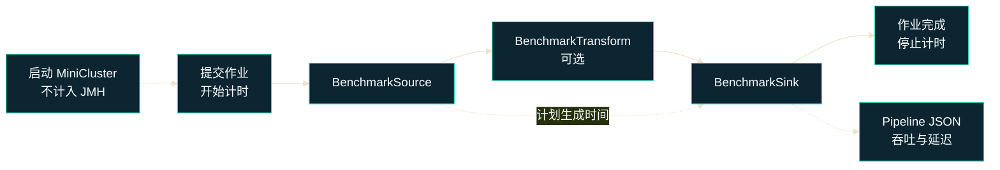

# Zeta 基准测试

本章说明如何在固定资源和固定负载下运行可重复的 Zeta 基准测试，以及如何解释吞吐、延迟和
稳定性而不过度推断结果。只有记录并保持代码版本、JDK、机器、JVM 限制、负载和 JMH 配置
一致，两个结果才具有可比性。

该测试直接运行当前仓库中的 Zeta 代码，适合建立可重复的本地基线。它不包含真实 Connector、
外部系统、网络和多节点开销，因此不能替代生产环境 PoC。

## 工作原理

`seatunnel-benchmarks` 提供三类测试：

- `SeaTunnelRowBenchmark`：测试 Row 创建、读取、复制、投影和大小计算等热点代码。
- `SeaTunnelPipelineBenchmark`：启动单节点嵌入式 Zeta 集群，并通过正常的 Client 和配置
  解析 API 运行完整的有界作业。
- `CheckpointingTimeBenchmark`：保持一个流式作业运行，并测量显式触发普通 Checkpoint 的
  完成耗时。

MiniCluster 在每个 JMH Trial 的 Setup 阶段启动，不计入测量。作业提交、调度、Source、
Transform、Sink 和作业完成都计入 JMH 测量。



Source 使用基于绝对时间的开环调度。每条记录都携带计划生成时间；当 Zeta 跟不上时，计划
时间仍持续向前推进，因此排队和 backlog 会体现在 event-time latency 中，不会因 Source
等待引擎而被隐藏。

### 测试范围

| JMH 选择器 | 数据链路与目的 |
|---|---|
| `sourceSink` | `Source -> Sink`，作为 Zeta 数据链路基线。 |
| `sourceTransformSink` | `Source -> Transform -> Sink`，增加 Row 复制和确定性的 Transform 工作。 |
| `sourceTransformSinkWithObservability` | 在相同 Transform 链路上开启实时忙碌度观测和有界 async boundary。 |
| `sourceTransformSinkWithTrace` | 在相同 Transform 链路上开启 StainTrace。 |
| `sourceTransformSinkWithObservabilityAndTrace` | 同时开启实时可观测性与 StainTrace，用于隔离组合开销。 |

这些场景保持数据链路一致，只改变 Transform 或可观测能力。Observability 场景测量指标采集
与 async boundary 的开销，不会人为限制 Sink 或制造背压。要测试过载，应将
`offeredRatePerSecond` 设置到高于引擎容量，再检查吞吐、P99 和延迟增长。

### 默认测试资源

| 配置 | 默认值 |
|---|---:|
| JVM 堆内存 | 固定 4 GiB `-Xms` / `-Xmx` |
| JVM 可见处理器 | 4 |
| 垃圾回收器 | G1，并启用 pre-touch |
| Zeta slot / Pipeline 并行度 | 12 / 4 |
| 每次 invocation 记录数 | 1,000,000 |
| 输入速率 | 600,000 行/秒 |
| Payload 大小 | 256 个字符 |
| Transform 工作量 | 每行 64 次 hash 操作 |
| StainTrace 采样间隔 | 10,000 行 |
| StainTrace 文件刷新间隔 | 1 秒 |
| JMH fork | 3 |
| 预热 / 测量 iteration | 3 / 5 |

这些 JVM 限制由 Benchmark 类传给 fork JVM，启动时不需要额外配置堆内存。在默认负载和
并行度下，StainTrace 每次 invocation 约采样 100 行，每个 Worker 每秒约采样 15 行，低于
默认的每 Worker 每秒 50 条限制。1 秒刷新间隔保证本地 Trace 输出发生在每个测量作业内，
避免文件写入延后到后续多个 invocation。

## 运行基准测试

### 构建 Benchmark Runner

```bash
./mvnw -Pbenchmark -pl seatunnel-benchmarks -am -DskipTests package
```

### 在 IntelliJ IDEA 中导入模块

该模块位于默认未启用的 `benchmark` Maven profile 中，因此首次打开根项目时 IDEA 可能不会
自动导入。在 Maven 工具窗口中展开 `Profiles`，启用 `benchmark`，然后点击
`Reload All Maven Projects`。如果仍未显示该模块，右键点击
`seatunnel-benchmarks/pom.xml`，选择 `Add as Maven Project`，再重新加载一次 Maven。

查看全部 JMH 方法：

```bash
java -jar seatunnel-benchmarks/target/benchmarks.jar -l
```

### 运行完整 Pipeline

评估固定负载时，建议先固定一条链路和一种 Payload，并保存标准 JMH JSON。下面的命令用于
检查 Zeta 能否持续处理每秒计划输入的 600,000 行数据：

```bash
java -jar seatunnel-benchmarks/target/benchmarks.jar \
  'sourceTransformSink$' \
  -p offeredRatePerSecond=600000 \
  -p parallelism=4 \
  -p payloadSize=256 \
  -p transformOperations=64 \
  -rf json \
  -rff seatunnel-benchmarks/target/zeta-pipeline-result.json
```

寻找容量边界时，每次只修改 `offeredRatePerSecond`。先从高于预期容量的速率开始，再逐步
降低，直到输出完整并且 P99 不再随运行持续增长。例如，可以先设置
`-p offeredRatePerSecond=1000000`，从高于默认负载的位置开始扫描容量。只有在
测量不控速的吞吐上限时才使用 `0`；该模式没有开环调度，无法暴露输入排队产生的延迟。

使用默认负载运行全部五个 Pipeline 场景：

```bash
java -jar seatunnel-benchmarks/target/benchmarks.jar SeaTunnelPipelineBenchmark
```

JMH 支持按类名、方法名或正则选择测试。例如运行全部 Trace 相关方法：

```bash
java -jar seatunnel-benchmarks/target/benchmarks.jar \
  'SeaTunnelPipelineBenchmark.*Trace'
```

JMH 的选择器本质上是正则表达式。只运行一个方法时应在末尾加 `$`；否则
`sourceTransformSink` 还会匹配所有以该文本开头的方法。

### 运行 SeaTunnelRow 微基准

```bash
java -jar seatunnel-benchmarks/target/benchmarks.jar SeaTunnelRowBenchmark \
  -rf json \
  -rff seatunnel-benchmarks/target/seatunnel-row-result.json
```

快速功能验证时可以增加 `-f 1 -wi 0 -i 1 -r 1s` 缩短运行时间。没有预热且只有一个样本的
结果不能用于性能结论。

### 运行 Checkpoint 基准测试

```bash
java -jar seatunnel-benchmarks/target/benchmarks.jar CheckpointingTimeBenchmark
```

该测试覆盖 `recordSize=1b` 和 `recordSize=1kb`。`checkpointSingleInput` 使用受控输入速率
以及相同的 Source/Sink 并行度。专用 JMH 环境会在每个 Trial 中启动 master/worker 角色
分离的双节点 Zeta 集群和一个流式作业。master 不提供 worker slot，pipeline 只在 worker
执行，IMap backup count 为 0。该环境使用一份独立的 Checkpoint Engine 配置（不复用普通
Benchmark 的 Engine 配置），为 `engine*` 开启基于本地文件系统的 HDFS MapStore，并通过
HDFS Checkpoint 插件的 local 模式保存状态。每次 invocation 显式触发一个普通 Checkpoint，
并等待 Zeta 完成持久化。Score 使用 `s/op`，数值越低越好；作业启动、负载建立、持久化
校验和作业关闭不计入 invocation 时间。

### 查看 Workflow 报告

定时或手动触发的 `Benchmarks` workflow 会在 Java 8 和 Java 11 上运行所选 benchmark。
每个 Java job 会上传一个 artifact，其中包含：

- 原始 `*.jmh.json`，保留所有 fork 和 iteration 样本；
- 带版本的 `*.report.json`，统一记录 benchmark 名称、参数、Score、Error、单位、优化方向、
  Commit、JVM、CPU 和 Runner 元数据；
- `summary.md`，同时展示在 GitHub Actions Job Summary 中；
- 环境指纹和完整 Pipeline 的样本 JSON（如有）。

标准化报告还包含 Pipeline 吞吐中位数、P50/P95/P99/最大延迟、延迟增长、完整性和可持续样本
数量。保留原始样本和 Schema 版本后，后续工具无需解析控制台日志即可消费已有 artifact。
该 workflow 不会把结果推送到仓库分支。

手动运行可以通过 `benchmarks` 选择常用 selector；`custom_benchmarks` 可以填写类名、方法名或
正则表达式，并覆盖前者。`.*` 会选择当前及未来的所有 benchmark。设置 `pr_number` 后，
workflow 会在同一 Worker 上按 `baseline -> PR -> PR -> baseline` 顺序运行，比较两个版本各自
两次结果的中位数，并输出经过优化方向校正的百分比；正值表示 Candidate 向更优方向变化。

绝对结果仍会受到机器负载、预热、CPU 频率和 Runner 硬件影响。GitHub 托管 Runner 的结果
适合用于趋势与功能检查。精确比较应像 PR 对比一样，在同一台机器上重复运行 Base 与 Change；
未来如需作为回归门禁，则应使用固定的 Self-hosted Runner。

### 诊断不稳定的 Benchmark

只有正常运行出现异常的 Score、Error 或 CV 后，才使用 profiling 继续定位。Profiler 会引入
额外开销，因此诊断报告与正常报告完全分开，诊断 Score 不能用于性能回归比较。诊断 selector
必须且只能匹配一个 benchmark 方法；`.*` 或能够匹配多个方法的类名会被拒绝。

运行 CPU、wall-clock 或 lock profiling 前，需要安装完整的 async-profiler，并设置
`ASYNC_PROFILER_HOME`。Runner 会先生成 JFR，再使用安装包内的 `jfrconv` 生成正向和反向
火焰图。GC profiling 和 JFR capture 使用 JMH 内置 profiler，不依赖 async-profiler：

```bash
bash tools/benchmarks/profile_benchmarks.sh profile cpu --benchmark 'IntermediateQueueBenchmark.disruptorRecordHandoff$'
bash tools/benchmarks/profile_benchmarks.sh profile wall --benchmark 'IntermediateQueueBenchmark.disruptorRecordHandoff$'
bash tools/benchmarks/profile_benchmarks.sh profile lock --benchmark 'IntermediateQueueBenchmark.disruptorRecordHandoff$'
bash tools/benchmarks/profile_benchmarks.sh profile gc --benchmark 'IntermediateQueueBenchmark.disruptorRecordHandoff$'
bash tools/benchmarks/profile_benchmarks.sh capture jfr --benchmark 'IntermediateQueueBenchmark.disruptorRecordHandoff$'
```

CPU、wall-clock 和 lock 模式直接使用 JMH 的 async-profiler 集成，GC 模式使用 JMH GC
profiler，`capture jfr` 使用 JMH JFR profiler。Runner 始终使用一个 fork，防止后续 fork
覆盖文件型 profiler 的产物。预热和测量设置默认仍来自 benchmark 注解；如需覆盖，将参数
放在 `--` 后，例如 `-- -wi 1 -i 1 -w 1s -r 1s`。默认输出目录每次运行都不同；显式指定
的 `--output` 目录必须为空，避免旧产物混入报告。

async-profiler 产生文件而不是数值型 secondary metric，因此原始 JMH JSON 中的
`secondaryMetrics.async` Score 为 `NaN`，这是预期行为。诊断报告会显示采集到的样本数；
lock profiling 没有观察到竞争时会报告 0 个样本，并且不会生成没有内容的火焰图。

手动触发 `Benchmarks Diagnostics` workflow 时，必须指定一个精确的 `benchmark` 方法和一个
`java_version`。该 workflow 与定时或手动触发的 `Benchmarks` workflow 相互独立，后者继续
运行 Java 8/11 matrix。选择 `all` 会分别执行 CPU、wall-clock、lock 和 GC step，并上传四个
可以独立下载的 artifact；`capture_jfr` 会增加第五个 JFR artifact。每个 artifact 只包含对应
模式的 JFR、火焰图、文本摘要、JMH 日志和 JSON 报告。Job Summary 会集中显示目标、
benchmark 设置、各模式结果和独立 artifact 名称，不再重复完整文件清单。GitHub 托管的
Linux runner 使用 async-profiler 的 `ctimer` 事件进行 CPU profiling，不依赖 `perf_event`
权限。

## 指标

### 样本有效性

解释性能指标前，先检查：

- `processed_rows` 等于 `expected_rows`；
- `sourceSink` 的 `checksum` 为 0；
- 所有 Transform 场景的 `checksum` 非 0。

这些条件用于拒绝输出不完整的运行，并证明 Transform 工作确实到达 Sink。

### JMH 指标

| 字段 | 说明 |
|---|---|
| `Score` | Pipeline Benchmark 每秒处理的行数，越大越好；Row 微基准使用 `ops/ms`；Checkpoint Benchmark 使用 `s/op`，越低越好。 |
| `Error` | 根据本次 JMH 运行内部样本计算的不确定性。 |
| `Cnt` | 参与聚合的 Measurement 样本数，不是处理行数。 |
| `Units` | Score 的单位。 |

`SeaTunnelPipelineBenchmark` 声明每个 invocation 包含 1,000,000 个逻辑操作，因此 JMH
会把一次完整 Job 换算成处理行数，并使用 `ops/s` 输出。JMH 计时包含作业提交、调度和
完整链路执行；它和只计算 Sink 接收区间的 `throughput_rows_per_second` 不是同一个测量边界。

JMH `Error` 不包含不同机器之间的差异，不能只根据两台机器上的 JMH 置信区间是否重叠
来判断性能回归。

### Pipeline 指标

每次 invocation 会在 `seatunnel-benchmarks/target/pipeline-results` 写入一份 JSON：

| 字段 | 说明 |
|---|---|
| `offered_rate_rows_per_second` | Source 计划输入的目标速率；它表示负载，不是实际吞吐。 |
| `throughput_rows_per_second` | Sink 从接收第一条到最后一条记录期间的实际完成速率。 |
| `event_time_latency_p50_ms` | 从计划生成到 Sink 接收的中位耗时。 |
| `event_time_latency_p95_ms` / `event_time_latency_p99_ms` | 尾延迟；引擎跟不上时包含 backlog 等待。 |
| `event_time_latency_max_ms` | 最大记录延迟，应和百分位一起分析。 |
| `first_half_p99_ms` / `second_half_p99_ms` | 前半段和后半段 P99，用于判断 backlog 是否持续增长。 |
| `latency_growth_ratio` | `(后半段 P99 + 1) / (前半段 P99 + 1)`；大于 1 表示延迟在恶化。 |
| `latency_percentiles_clamped` | 是否有已报告的百分位落入 Histogram overflow bucket，因此只能视为下界。 |
| `latency_overflow_rows` | 延迟超过 Histogram 统计范围的记录数。 |
| `sustainable` | 默认要求输出完整、没有被截断的百分位、P99 不超过 1,000 ms、增长比例不超过 1.20。 |

`sustainable` 是便捷保护条件，不是通用 SLA。最终是否满足要求，应由目标业务的吞吐和延迟
目标决定。

## 判断测试结果

建议先判断负载是否稳定，再定位是哪一部分造成差异。

| 观察结果 | 结论 | 下一步 |
|---|---|---|
| 输出完整，实际吞吐接近输入速率，前后半段 P99 相近 | 当前负载处于稳态 | 提高输入速率，继续寻找容量边界。 |
| 实际吞吐低于输入速率，后半段 P99 持续升高 | 正在积累 backlog，超过当前配置的可持续容量 | 降低输入速率，或增加资源与并行度后重测。 |
| `sourceSink` 稳定，`sourceTransformSink` 明显变慢 | Transform 工作是主要增量 | 调整 `transformOperations`，检查 Row copy 和 Transform 热点。 |
| 基础 Transform 稳定，Observability 或 Trace 场景明显变慢 | 对应功能产生可见开销 | 使用相同参数重复运行，比较单独开启与同时开启的结果。 |
| 同一 Commit 的全部 Benchmark 在某次运行中同时大幅变化 | 执行机器的 CPU 性能可能不同 | 将本次标记为不确定，检查 CPU 指纹，不更新精细性能基线。 |

容量评估应使用多个固定速率进行扫描，每个速率都在同一台空闲机器上通过独立 JVM 重复运行，
并保留全部样本。比较两个场景或两个 Commit 时，JDK、机器、Payload、并行度、输入速率和
Transform 工作量必须相同。

## 可视化

使用 `-rf json -rff <file>` 生成 JMH JSON，打开
[JMH Visualizer](https://jmh.morethan.io/)，按方法名和参数比较 Score、Error、fork 和
iteration。

JMH Visualizer 会把参数值拼成标签。例如 `600000:4:256:64` 依次表示
`offeredRatePerSecond=600000`、`parallelism=4`、`payloadSize=256` 和
`transformOperations=64`，顺序与图例一致。JMH Score 包含作业提交、调度和完整 Pipeline
执行时间。判断该负载是否可持续时，还需要结合 Pipeline JSON 的吞吐、延迟和完整性字段。

`pipeline-results` 下的 JSON 不是 JMH 格式，应直接查看，或者使用
`tools/benchmarks/save_jmh_result.py` 和 `tools/benchmarks/regression_report.py` 生成
标准化 JSON 和 Markdown 报告。

## 添加 Benchmark

Benchmark 应保持小而专注，优先选择无需外部服务、可以在单机运行的热点路径，例如
`SeaTunnelRow` 操作、格式解析与序列化、Transform 热点、Connector 参数解析和 Split 生成。

新 Benchmark 应继承 `BenchmarkBase`，复用统一的 JMH Mode、Fork、预热、测量、State 和输出
单位配置；Benchmark 自身只保留场景相关的状态与 Setup。完整 Pipeline 的引擎生命周期和控制
逻辑应放在 `SeaTunnelEnvironmentContext` 或职责明确的子类中，以便后续增加 Checkpoint、
故障恢复和 Metrics 场景时无需复制集群 Setup。

## 开销与限制

- Pipeline Benchmark 会在本机启动嵌入式 Zeta 集群，需要至少 4 GiB 可用堆内存。
- 完整测试包含 3 个 fork、3 次预热和 5 次测量；运行全部五个场景会花费较长时间。
- `ActiveProcessorCount=4` 只限制 JVM 可见处理器数量，不提供操作系统级 CPU 绑核。
- 精细性能对比应使用固定机器，或在同一台其他负载保持空闲的机器上交替运行 Base 与
  Candidate。
- 本测试不包含真实 Connector、外部消息队列、网络、磁盘和多节点通信成本。

测量生产端到端性能时，应使用所需 Connector 和外部系统重复实验，并结合错误日志、Checkpoint
状态和外部系统监控解释结果。

## 参考资料

1. Andy Georges、Dries Buytaert、Lieven Eeckhout，
   [Statistically Rigorous Java Performance Evaluation](https://dri.es/files/oopsla07-georges.pdf)，
   OOPSLA 2007。
2. Tomas Kalibera、Richard Jones，
   [Rigorous Benchmarking in Reasonable Time](https://dl.acm.org/doi/10.1145/2491894.2464160)，
   ISMM 2013。
3. Jeyhun Karimov 等，
   [Benchmarking Distributed Stream Data Processing Systems](https://arxiv.org/pdf/1802.08496)，
   ICDE 2018。

## 相关文档

- [忙碌度与背压](./busyness-and-backpressure.md)
- [监控与指标](./telemetry.md)
- [调优指南](./tuning-guide.md)
