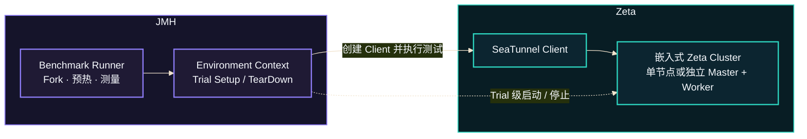

# Zeta 基准测试

本文依次介绍 SeaTunnel 为什么需要基准测试、测试架构、指标解读、本地运行、性能诊断与对比，
以及相关研究论文。架构图与操作示例共同说明各类测试的测量边界。

## 为什么需要基准测试

:::tip 更稳定、更高效的引擎

基准测试的目标，是让 SeaTunnel Zeta 引擎在持续演进中运行得更稳定、处理得更快，
并更高效地利用计算与存储资源。

:::

随着数据规模增长和使用场景丰富，引擎需要在更高负载下保持吞吐、控制延迟，并承担
Checkpoint、状态存储和可观测性等能力的开销。基准测试帮助我们发现限制处理能力的瓶颈，
识别负载增长时出现的性能波动，为提升引擎的处理效率和运行稳定性提供依据。

它也为社区提供了一套共同的性能验证方式：让优化收益可以被量化，让潜在的性能回退更早
被发现，让不同贡献者能够复现和比较结果。通过持续积累基线与测试场景，我们可以更有
依据地评估每次改动，推动引擎性能持续改进。

## 架构



### 职责与生命周期

JMH 负责独立 JVM、预热、测量和结果采集。环境上下文负责准备测试数据，并在需要时启动
上图中的运行环境。被测方法调用要研究的生产操作，测试结束后统一释放资源。

测试数据准备、环境启动和清理通常放在计时之外；只有它们本身就是研究对象时，才纳入测量。
基准测试应明确这个边界，并校验被测工作确实产生了有效结果。

### 运行配置

共享 JMH 配置定义 3 个 fork、3 次预热和 5 次测量。每个 fork 在独立 JVM 中运行，预热在
用于计算 Score 的样本采集之前完成；方法注解和命令行参数可以覆盖共享默认值。

线程数、堆大小、垃圾回收器和 JVM 可见处理器数都属于实验条件。应记录最终生效的值，
并在跨版本对比时保持一致。限制 JVM 可见处理器数量不等于操作系统级 CPU 绑核。

### 环境与可复现性

资源需求取决于所选负载。尽量减少机器上的无关任务，在同一台机器上运行 Baseline 和
Candidate，并随原始结果记录 JDK、JVM 设置、输入参数和代码版本。

基准测试的结论适用于它所测量的操作和负载。评估更广泛的生产收益时，还需要在对应的
部署条件下验证。

## 指标与结果解读

### JMH 指标

一行 JMH 结果由“测什么、怎么测、结果多少、结果有多稳定”四部分组成：

```text
Benchmark    (Parameters)    Mode    Cnt    Score    Error    Units
```

| 字段 | 含义 | 解读方式 |
|---|---|---|
| `Benchmark` / `Parameters` | 被测方法与负载参数 | 对比时必须一致。 |
| `Mode` | `thrpt` 测吞吐；`avgt` 测平均耗时；`sample` 测耗时分布；`ss` 测单次执行耗时 | `thrpt` 越大越好，其余耗时模式越小越好。 |
| `Cnt` | 参与统计的测量样本数，不包含预热 | 吞吐与平均耗时模式通常为 `fork 数 × 测量 iteration 数`。 |
| `Score` | 测量样本的平均性能 | `Score = Σxᵢ / n`。结合 Mode 和 Units 判断方向。 |
| `Error` | Score 置信区间的半宽，与 Score 单位相同 | `置信区间 = [Score − Error, Score + Error]`。越小表示均值估计越精确。 |
| `Units` | Score 的单位 | `ops/time` 表示吞吐；`time/op` 表示单次操作耗时。 |
| `CV` | SeaTunnel 报告计算的样本相对波动 | `CV = 样本标准差 / abs(Score) × 100%`。越小表示样本越集中。 |

其中 `xᵢ` 为单个测量样本，`n` 为 Cnt，`abs` 表示绝对值。比较不同结果前，
还要确认 JDK、线程数和 JVM 参数一致。

### 对比报告指标

`B` 为 Baseline，`C` 为 Candidate；`median` 为各轮有效结果的中位数。
B/C 分别按各自版本计算，比较前先核对 SHA、方法、参数和运行环境。

| 字段 | 用途 | 计算方式 | 如何解读 |
|---|---|---|---|
| Benchmark | 标识被测方法 | 按完整方法名与参数配对 | 表中显示简写名称。 |
| Parameters | 标识负载条件 | 取测试参数 | 两侧应一致。 |
| Score B / C | 两个版本的代表性能 | `median(各轮 Score)` | 吞吐越大越好，耗时越小越好。 |
| Score Change | 性能变化幅度 | 吞吐：`(C / B − 1) × 100%`；耗时：`(1 − C / B) × 100%` | 正值改善，负值回退。 |
| CV B / C | 两个版本的样本波动 | `median(各轮 CV)` | 越小表示样本越集中。 |
| CV Change | 波动变化幅度 | `(CV C / CV B − 1) × 100%` | 负值表示波动减小。 |
| Error B / C | 两个版本的相对不确定性 | `median(各轮 Error / abs(Score) × 100%)` | 百分比，不是原始 JMH 的绝对 Error。 |
| Error Change | 相对不确定性变化幅度 | `(Error C / Error B − 1) × 100%` | 负值表示相对不确定性减小。 |
| Unit | Score 的共同单位 | 如 `ops/ms`、`us/op` | 其余数值列均为百分比。 |

`abs` 表示绝对值。缺少有效数据或变化公式的分母为 0 时显示 `n/a`；
`0.00%` 可能来自舍入，复算使用原始 JSON。

:::info 变化幅度与统计结论

表中的变化幅度不是显著性检验；Workflow 执行成功也不等于性能没有回退。

:::

### 判断结果是否可信

先确认运行的是目标版本与方法、输出通过了正确性检查，且两个版本使用相同设置。
再结合 Score、Error、CV 以及各个 fork/iteration 的原始样本判断变化。

| 观察结果 | 解读与下一步 |
|---|---|
| 多轮运行都表现出一致改善，且波动较小 | 连同负载条件和测量边界一起报告收益。 |
| 差异接近波动幅度，或多轮变化方向不一致 | 暂不下结论，在受控环境下复测。 |
| 同一版本的多数方法同时明显变化 | 先检查机器负载、CPU 频率、JDK 和环境信息，再判断是否来自代码。 |
| 某个方法持续回退 | 使用 Profiler 定位新增开销，再重复不带 Profiler 的对比。 |

保留全部样本。单次更好的 iteration 或较大的提升百分比，都不足以单独证明改善可以重复。

### 可视化

使用 `-rf json -rff <file>` 生成 JMH JSON，打开
[JMH Visualizer](https://jmh.morethan.io/)，按方法名和参数比较 Score、Error、fork 和
iteration。

图表可能将多个参数值组合成标签，应结合图例和原始 JSON 确认各组实验条件。分享图表时
保留原始 JMH 文件，让其他人能够查看底层样本。`tools/benchmarks/save_jmh_result.py`
和 `tools/benchmarks/regression_report.py` 可生成标准化 JSON 与 Markdown 报告。

## 本地运行

### 构建与准备

在仓库根目录执行命令，启用 `benchmark` profile，构建 JMH Runner：

```bash
./mvnw -Pbenchmark -pl seatunnel-benchmarks -am -DskipTests package
git rev-parse HEAD
java -version
```

Runner 产物为 `seatunnel-benchmarks/target/benchmarks.jar`。切换代码版本或修改 Benchmark
后必须重新构建：当前 Git HEAD 不能证明已有 JAR 包含该版本。未提交的生产代码或 Fixture
改动也应与 SHA 一起记录。

在 IntelliJ IDEA 中，启用 Maven `Profiles` 下的 `benchmark`，点击
`Reload All Maven Projects`。如果仍未显示模块，将 `seatunnel-benchmarks/pom.xml`
添加为 Maven 项目后重新加载。

### 通过 JAR 执行

通过 `-l` 列出可用方法。以下示例中的 `<benchmark-method>` 应替换为输出中的完整方法名，
保留末尾的 `$`；再用 `-lp` 查看它支持的参数：

```bash
java -jar seatunnel-benchmarks/target/benchmarks.jar -l
java -jar seatunnel-benchmarks/target/benchmarks.jar \
  '<benchmark-method>$' -lp
```

使用方法配置的预热、测量和 fork 运行，并保存 JMH JSON：

```bash
java -jar seatunnel-benchmarks/target/benchmarks.jar \
  '<benchmark-method>$' \
  -rf json -rff seatunnel-benchmarks/target/benchmark-result.json
```

选择器是正则表达式。使用完整方法名并在末尾加 `$`，即可选择一个方法。
长时间运行前先用 `-l` 确认匹配范围。

:::caution 短跑只用于功能验证

冒烟验证可以追加 `-f 1 -wi 1 -i 1 -w 1s -r 1s`，
短跑结果仅用于确认功能可用。

:::

使用 `-p` 覆盖所选方法支持的负载参数。将 `<parameter>` 替换为 `-lp` 列出的参数名，
将 `<value>` 替换为要测试的值：

```bash
java -jar seatunnel-benchmarks/target/benchmarks.jar \
  '<benchmark-method>$' \
  -p '<parameter>=<value>' \
  -rf json -rff seatunnel-benchmarks/target/benchmark-result.json
```

研究负载的影响时，每轮只改变一个参数。跨版本对比时，选择器、参数、线程数、JDK 和
JVM 设置应保持一致。

## 性能诊断与对比

### PR 对比

`Benchmarks` Workflow 用相同的负载和运行环境比较 Baseline 与 PR，回答一个核心问题：
这次改动让目标操作变快了，还是引入了回退？

#### Workflow 参数

进入 GitHub Actions，选择 `Benchmarks`，点击 `Run workflow`：

| 输入项 | 填写内容 |
|---|---|
| `Use workflow from` | Workflow 所在分支，通常选择 `dev`；它不代表被测代码版本。 |
| `seatunnel_ref` | Baseline 的分支、Tag 或 SHA；推荐填写固定 SHA。 |
| `pr_number` | Candidate PR 的数字编号；留空则只测试 Baseline。 |
| `benchmarks` | 选择预设的测试套件或测试项。 |
| `custom_benchmarks` | 可选，填写精确方法 `<benchmark-method>$`；填写后覆盖 `benchmarks`。 |

Baseline 和 Candidate 必须包含相同的测试方法与 Fixture，否则结果无法配对。不要使用 `.*`
做日常 PR 对比，它会运行全部方法和参数组合；只选择改动影响的操作即可。

Workflow 会在同一个 Worker 上按以下顺序交替运行，降低机器状态随时间变化带来的偏差：

```text
Baseline → Candidate → Candidate → Baseline
```

Java 8 和 Java 11 分别执行这组对比，报告汇总每个版本的两轮结果。

运行完成后，确认 Job 已执行到 JMH 测量，并核对 Summary 中的 SHA、方法和参数。各字段及
变化公式见[对比报告指标](#对比报告指标)；结论不明确时应重新运行。原始 JMH JSON、标准化
报告和环境信息可从 artifact 下载。

### 性能诊断

:::info 诊断用于解释性能变化

使用 Profiling 解释已经观察到的性能变化、异常 Score 或较高的 Error/CV。Profiler 会引入
额外开销，因此诊断报告与正常报告完全分开，诊断 Score 不能用于性能回归比较。

:::

诊断选择器必须且只能匹配一个 benchmark 方法；`.*` 或能够匹配多个方法的类名会被拒绝。

#### Workflow 参数

`Benchmarks Diagnostics` 每次诊断一个版本，不执行 Baseline/Candidate 对比。

| 输入项 | 填写方式 |
|---|---|
| `Use workflow from` | 诊断 Workflow 与工具所在分支，通常为 `dev`。 |
| `seatunnel_ref` | 未选择 PR 时，要诊断的分支、Tag 或 SHA。 |
| `pr_number` | 可选可信 PR 编号；填写后以 PR Head 替代 `seatunnel_ref` 作为诊断目标。 |
| `benchmark` | 填写从 `-l` 查询到的方法选择器 `<benchmark-method>$`；匹配多个方法的选择器会被拒绝。 |
| `java_version` | `8` 或 `11`，与待分析的正常运行保持一致。 |
| `profile` | `cpu` 查看执行热点，`wall` 查看含等待在内的耗时栈，`lock` 查看锁竞争，`gc` 查看分配与 GC 指标；`all` 分别运行这四种模式。 |
| `capture_jfr` | 勾选后增加一次独立 JFR 录制，用于离线分析。 |
| `jmh_args` | 可选 JMH 参数或负载参数，以所选方法的 `-lp` 输出为准；留空使用默认值，fork 固定为 1。 |

#### 本地运行 Profiler

使用同一脚本可以在本地诊断已构建的 Benchmark。下面以 CPU 分析为例；将 `cpu` 替换为
`wall`、`lock` 或 `gc` 即可切换模式：

```bash
bash tools/benchmarks/profile_benchmarks.sh profile cpu \
  --benchmark '<benchmark-method>$'

bash tools/benchmarks/profile_benchmarks.sh capture jfr --benchmark '<benchmark-method>$'
```

| 参数 | 用途 |
|---|---|
| `profile <mode>` | 选择 CPU 热点、耗时栈、锁竞争或 GC 分配分析。 |
| `--benchmark` | 指定一个精确的 Benchmark 方法。 |
| `--repository` | 可选，指定已构建 Benchmark JAR 的代码目录。 |
| `--output` | 可选，指定一个不存在或内容为空的输出目录。 |
| `-- <JMH 参数>` | 可选，覆盖预热、测量或负载参数。 |

CPU、wall-clock 和 lock 模式需要安装 async-profiler 并设置 `ASYNC_PROFILER_HOME`；GC 和
JFR 使用 JMH 内置 Profiler。诊断运行固定使用一个 fork，默认在
`seatunnel-benchmarks/target/profiles` 下创建独立输出目录。

#### 查看诊断产物

先在 Job Summary 中确认目标版本、测试参数和采样结果，再下载对应模式的 artifact。CPU、
wall-clock 和 lock 模式提供火焰图，GC 模式提供分配与回收摘要；JMH 日志和 JSON 用于复核
本次运行。启用 `capture_jfr` 时还会生成可供离线分析的 JFR 文件。

lock 模式显示 0 个样本通常表示本次运行未观察到锁竞争。Profiler 会改变程序执行成本，
因此诊断结果只用于定位原因，性能提升或回退仍应由不带 Profiler 的 PR 对比确认。

## 参考论文

1. Andy Georges、Dries Buytaert、Lieven Eeckhout，
   [Statistically Rigorous Java Performance Evaluation](https://dri.es/files/oopsla07-georges.pdf)，
   OOPSLA 2007。
2. Tomas Kalibera、Richard Jones，
   [Rigorous Benchmarking in Reasonable Time](https://dl.acm.org/doi/10.1145/2491894.2464160)，
   ISMM 2013。
3. Jeyhun Karimov 等，
   [Benchmarking Distributed Stream Data Processing Systems](https://arxiv.org/pdf/1802.08496)，
   ICDE 2018。
