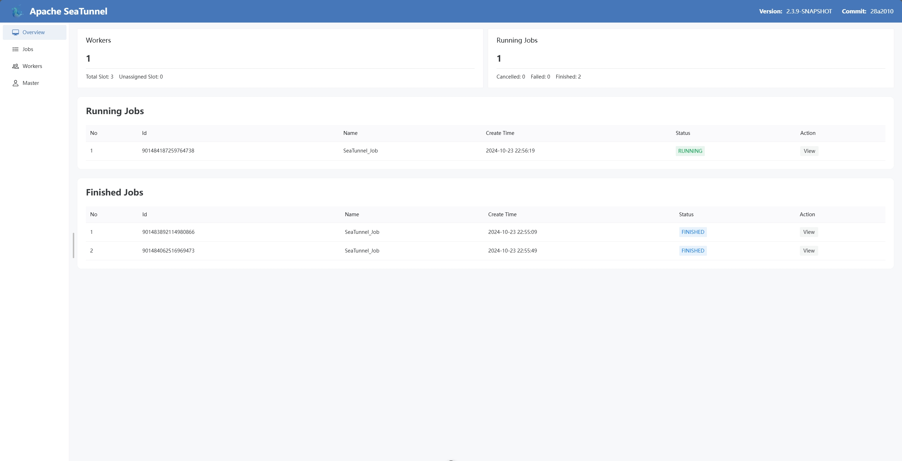
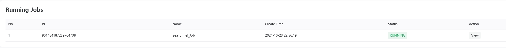
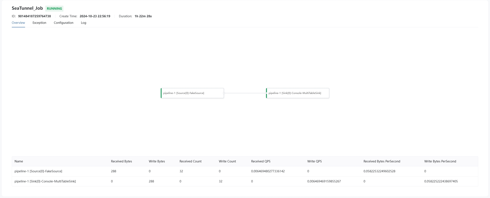
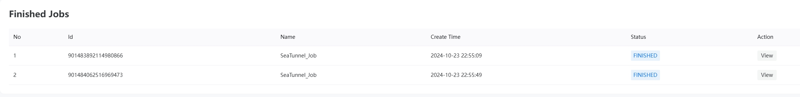
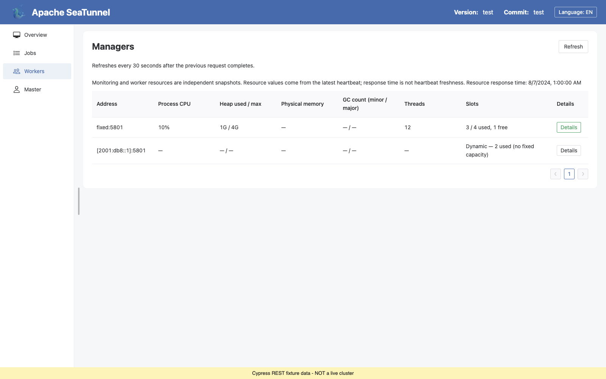
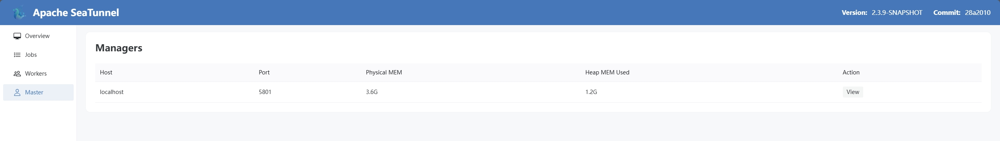

# Web UI

## 从这里开始

建议把 [REST API 与 Web UI](./rest-api-and-web-ui.md) 作为运维入口页先读完。那一页会先解释什么时候启用 HTTP 服务、接下来该看哪些 REST API 页面，以及 Web UI 在日常运维里的位置。

本页聚焦 Web UI 各个界面本身，以及当前内置控制台的能力边界。

## 访问

访问 Web UI 前，需要先在 `seatunnel.yaml` 中开启 SeaTunnel Engine HTTP 服务：

```yaml
seatunnel:
  engine:
    http:
      enable-http: true
      port: 8080
```

然后访问：

```text
http://<host>:8080/#/overview
```

如果配置了 `context-path`，需要把它放在 hash 路由之前：

```text
http://<host>:8080/<context-path>/#/overview
```

## 概述

Apache SeaTunnel 的 Web UI 是 SeaTunnel Engine 的可视化巡检控制台。它可以帮助运维人员查看集群概览、运行中和已完成作业、作业详情页、日志、实时 DAG 指标，以及 worker 和 master 节点状态。

Web UI 在可视化巡检之外，也提供常用运维操作：可以提交和恢复作业，并为运行中作业提供需要确认的 cancel、stop 和 savepoint 控件。自动化场景或 UI 未暴露的工作流仍请使用 REST API 或命令行。


## 能力总览

| UI 区域    | 当前能力                                                                                                              |
| ---------- | --------------------------------------------------------------------------------------------------------------------- |
| Overview   | 查看集群版本、slot 使用、worker 数量和作业数量                                                                        |
| Jobs       | 通过配置文本或上传文件提交作业、从 savepoint 状态恢复启动作业、查看运行中和已完成作业、分页浏览作业列表、进入作业详情 |
| Job Detail | 查看 DAG、作业指标、异常文本、作业配置、checkpoint 概览与历史、日志，以及开启后的实时可观测指标                       |
| Operations | 浏览 Connector OptionRule 元数据，并查看安全过滤后的 HTTP、HTTPS、认证和 mTLS 状态                                    |
| Workers    | 查看 worker 节点系统监控信息，并更新当前节点 tags                                                                     |
| Master     | 查看 master 节点系统监控信息                                                                                          |

## 作业

### 提交作业

Jobs 页面提供 “Submit Job” 面板，可以直接在 Web UI 中提交新的 SeaTunnel 作业。用户可以粘贴 JSON、HOCON 或 SQL 任务配置，也可以上传 `.json`、`.conf`、`.config` 或 `.sql` 配置文件。

同一个面板也支持从 savepoint 状态恢复启动作业：开启恢复模式并填写已有作业 ID 后，会复用 REST API 的 `isStartWithSavePoint=true` 和 `jobId=<existing-job-id>` 契约，因此提交的配置仍需与被恢复的作业匹配。

### 运行中的作业

“运行中的作业”模块列出当前正在执行的 SeaTunnel 作业。用户可以查看作业 ID、作业名称、创建时间、状态，并进入具体作业的详情页。

列表会周期性刷新，并支持分页。Action 列提供 `View`、`Stop`、`Savepoint` 和 `Cancel` 控件。`Stop` 发送不带 savepoint 的平滑停止请求，`Savepoint` 通过 savepoint 停止作业，`Cancel` 面向异常场景发送强制停止请求。所有会改变状态的操作都需要确认，并会在页面展示状态反馈。




### 作业详情

作业详情页包含五个主要 tab：

- **Overview**：展示作业 DAG、source 和 sink 吞吐指标、flush signal 指标，以及开启可观测性后的 vertex 或 edge 实时指标。
- **Exception**：当作业失败或上报异常时，展示异常文本。
- **Configuration**：展示引擎暴露的运行时作业配置。
- **Checkpoints**：展示 checkpoint 计数、最近完成的 checkpoint、最近的 savepoint 和 checkpoint 历史记录。“恢复最新状态”操作会打开提交面板，并自动带入源作业 ID，用于从 savepoint 或最新 checkpoint 状态恢复提交。
- **Log**：展示引擎日志 API 返回的作业日志文件。

#### 实时可观测性（Realtime Observability）

在 Job Detail 页面中，DAG 图支持展示“最近 N 分钟”的实时指标（默认 3 分钟，最大 10 分钟）：

- **节点忙碌度**：Source/Transform/Sink 的忙闲比例（例如 Source Read/Idle，Transform Busy，Sink Busy）。
- **边的下游等待占比**：当作业在某些位置插入了队列（例如 async boundary 队列、sink 前拆分 IO 队列）时，边会根据下游等待占比与队列填充率进行着色/加粗。
- **交互**：点击节点或边可在右侧抽屉查看该对象的实时曲线与关键字段。
- **Pin 实时图**：可从抽屉 pin 一条或多条数值指标，关闭抽屉后 Overview 上仍保留实时折线。图表按量纲拆分（占比 / 耗时 / 条数），同量纲才叠线对比。Pin 生命周期、6 条上限与共享轮询成本见：[实时指标图](live-metrics-chart.md)。

> 该能力需要作业侧开启 `env.engine.observability`（或满足默认开启条件），并按需配置 `async_boundaries`、`split_sink_io` 等。
> 详细配置与指标说明请参考：[实时可观测性](realtime-observability.md)。

运行时图的设计边界与大 DAG 降级规则请参考：[运行时执行图](runtime-execution-graph.md)。

### 已完成的作业

“已完成的作业”模块展示已进入终态的作业，例如 finished、failed、cancelled 或 savepoint done。用户可以回看历史记录，并进入详情页查看配置、异常文本、引擎保留的指标和日志。



## 工作节点

### 工作节点信息

“工作节点”模块展示 worker 节点的系统监控信息。可以用它查看 worker 地址、资源状态和引擎暴露的运行时健康信号。

Workers 页面也可以更新当前 Web UI 请求所在本地 worker 的 tags。远端 worker 仅用于查看，其 tags 更新按钮会禁用；如果需要修改某个目标节点的 tags，需要访问该目标节点自己的 Web UI 地址。



## 运维

“Operations” 页面提供只读和元数据驱动的运维辅助能力：

- 查询 `source`、`sink` 和 `transform` 插件的 Connector OptionRule 元数据，包括必填项、可选项、条件规则和值约束。
- 查看安全过滤后的 HTTP 服务状态，包括 HTTP、HTTPS、context path、动态端口、basic authentication 和 mutual TLS 开关。

密码、token、证书路径、keystore 凭据等敏感信息不会在页面展示。

## 管理节点

### 管理节点信息

“管理节点”模块展示 master 节点的系统监控信息。可以用它查看当前 master 侧运行状态和引擎暴露的资源信号。



## 下一步

- [REST API 与 Web UI](./rest-api-and-web-ui.md)
- [REST API V2](./rest-api-v2.md)
- [运行时执行图](./runtime-execution-graph.md)
- [实时指标图](./live-metrics-chart.md)
- [作业生命周期 API](./rest-api-job-lifecycle.md)
- [安全](./security.md)
