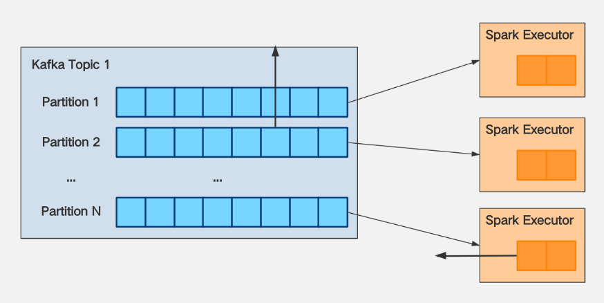

# 常见问题解答

## 为什么要安装Spark或者Flink这样的计算引擎？

SeaTunnel现在使用Spark、Flink等计算引擎来完成资源调度和节点通信，因此我们可以专注于数据同步的易用性和高性能组件的开发。 但这只是暂时的。

## 我有一个问题，我自己无法解决

我在使用SeaTunnel时遇到了问题，无法自行解决。 我应该怎么办？ 首先，在[问题列表](https://github.com/apache/seatunnel/issues)或[邮件列表](https://lists.apache.org/list.html?dev@seatunnel.apache.org)中搜索 ）看看是否有人已经问过同样的问题并得到答案。 如果您找不到问题的答案，您可以通过[这些方式](https://github.com/apache/seatunnel#contact-us)联系社区成员寻求帮助。

## 如何声明变量？

您想知道如何在 SeaTunnel 的配置中声明一个变量，然后在运行时动态替换该变量的值吗？

从“v1.2.4”开始，SeaTunnel 支持配置中的变量替换。 该功能常用于定时或非定时离线处理，以替代时间、日期等变量。 用法如下：

在配置中配置变量名称。 下面是一个sql转换的例子（实际上，配置文件中任何地方“key = value”中的值都可以使用变量替换）：

```
...
transform {
  sql {
    query = "select * from user_view where city ='"${city}"' and dt = '"${date}"'"
  }
}
...
```

以Spark Local模式为例，启动命令如下：

```bash
./bin/start-seatunnel-spark.sh \
-c ./config/your_app.conf \
-e client \
-m local[2] \
-i city=shanghai \
-i date=20190319
```

您可以使用参数“-i”或“--variable”后跟“key=value”来指定变量的值，其中key需要与配置中的变量名称相同。

## 如何在配置文件中写入多行文本的配置项？

当配置的文本很长并且想要将其换行时，可以使用三个双引号来指示其开始和结束：

```
var = """
 whatever you want
"""
```

## 如何实现多行文本的变量替换？

在多行文本中进行变量替换有点麻烦，因为变量不能包含在三个双引号中：

```
var = """
your string 1
"""${you_var}""" your string 2"""
```

请参阅：[lightbend/config#456](https://github.com/lightbend/config/issues/456)。

## Azkaban、Oozie、DolphinScheduler 是否支持 SeaTunnel？

当然！ 请参阅下面的屏幕截图：


## SeaTunnel是否有配置多个源的情况，例如同时在源中配置elasticsearch和hdfs？

```
env {
	...
}

source {
  hdfs { ... }	
  elasticsearch { ... }
  jdbc {...}
}

transform {
    ...
}

sink {
	elasticsearch { ... }
}
```

## 有 HBase 插件吗？

有一个 HBase 输入插件。 您可以从这里下载：https://github.com/garyelephant/waterdrop-input-hbase

## 如何使用SeaTunnel将数据写入Hive？

```
env {
  spark.sql.catalogImplementation = "hive"
  spark.hadoop.hive.exec.dynamic.partition = "true"
  spark.hadoop.hive.exec.dynamic.partition.mode = "nonstrict"
}

source {
  sql = "insert into ..."
}

sink {
    // The data has been written to hive through the sql source. This is just a placeholder, it does not actually work.
    stdout {
        limit = 1
    }
}
```

此外，SeaTunnel 在 `1.5.7` 版本之后在 `1.x` 分支中实现了 `Hive` 输出插件； 在“2.x”分支中。 Spark 引擎的 Hive 插件已从版本“2.0.5”开始支持：https://github.com/apache/seatunnel/issues/910。

## SeaTunnel如何编写ClickHouse的多个实例来实现负载均衡？

1.直接写分布式表（不推荐）

2.在ClickHouse的多个实例前面添加代理或域名（DNS）：

```
{
    output {
        clickhouse {
            host = "ck-proxy.xx.xx:8123"
            # Local table
            table = "table_name"
        }
    }
}
```

3. 在配置文件中配置多个ClickHouse实例:

   ```
   {
       output {
           clickhouse {
               host = "ck1:8123,ck2:8123,ck3:8123"
               # Local table
               table = "table_name"
           }
       }
   }
   ```
4. 使用集群模式:

   ```
   {
       output {
           clickhouse {
               # Configure only one host
               host = "ck1:8123"
               cluster = "clickhouse_cluster_name"
               # Local table
               table = "table_name"
           }
       }
   }
   ```

## SeaTunnel 消费 Kafka 时如何解决 OOM？

大多数情况下，OOM是由于没有对消费进行速率限制而导致的。 解决方法如下：

对于目前Kafka的Spark消费限制：

1. 假设您使用 KafkaStream 消费的 Kafka `Topic 1` 的分区数量 = N。

2. 假设“Topic 1”的消息生产者（Producer）的生产速度为K条消息/秒，则向分区写入消息的速度必须一致。

3、假设经过测试发现Spark Executor每核每秒的处理能力为M。

可以得出以下结论：

1、如果想让Spark对`Topic 1`的消耗跟上它的生产速度，那么需要 `spark.executor.cores` * `spark.executor.instances` >= K / M

2、当出现数据延迟时，如果希望消耗速度不要太快，导致spark执行器OOM，那么需要配置 `spark.streaming.kafka.maxRatePerPartition` <= (`spark.executor.cores` * `spark.executor.instances`) * M / N

3、一般来说，M和N都确定了，从2可以得出结论：`spark.streaming.kafka.maxRatePerPartition`的大小与`spark.executor.cores` * `spark的大小正相关 .executor.instances`，可以在增加资源`maxRatePerPartition`的同时增加，以加快消耗。



## 如何解决错误 `Exception in thread "main" java.lang.NoSuchFieldError: INSTANCE`？

原因是Spark的CDH版本自带的httpclient.jar版本较低，而ClickHouse JDBC基于的httpclient版本是4.5.2，包版本冲突。 解决办法是将CDH自带的jar包替换为httpclient-4.5.2版本。

## 我的Spark集群默认的JDK是JDK7。 安装JDK8后，如何指定SeaTunnel以JDK8启动？

在 SeaTunnel 的配置文件中，指定以下配置：

```shell
spark {
 ...
 spark.executorEnv.JAVA_HOME="/your/java_8_home/directory"
 spark.yarn.appMasterEnv.JAVA_HOME="/your/java_8_home/directory"
 ...
}
```

## Spark local[*]模式运行SeaTunnel时总是出现OOM怎么办？

如果以本地模式运行，则需要修改`start-seatunnel.sh`启动脚本。 在 `spark-submit` 之后添加参数 `--driver-memory 4g` 。 一般情况下，生产环境中不使用本地模式。 因此，On YARN时一般不需要设置该参数。 有关详细信息，请参阅：[应用程序属性](https://spark.apache.org/docs/latest/configuration.html#application-properties)。

## 我可以在哪里放置自己编写的插件或第三方 jdbc.jar 以供 SeaTunnel 加载？

将Jar包放置在plugins目录指定结构下：

```bash
cd SeaTunnel
mkdir -p plugins/my_plugins/lib
cp third-part.jar plugins/my_plugins/lib
```

`my_plugins` 可以是任何字符串。

## 如何在 SeaTunnel-V1(Spark) 中配置日志记录相关参数？

可以通过三种方式配置日志相关参数（例如日志级别）：

- [不推荐] 更改默认的`$SPARK_HOME/conf/log4j.properties`。
  - 这将影响通过 `$SPARK_HOME/bin/spark-submit` 提交的所有程序。
- [不推荐]直接在SeaTunnel的Spark代码中修改日志相关参数。
  - 这相当于写死了，每次改变都需要重新编译。
- [推荐] 使用以下方法更改 SeaTunnel 配置文件中的日志记录配置（更改仅在 SeaTunnel >= 1.5.5 时生效）：

  ```
  env {
      spark.driver.extraJavaOptions = "-Dlog4j.configuration=file:<file path>/log4j.properties"
      spark.executor.extraJavaOptions = "-Dlog4j.configuration=file:<file path>/log4j.properties"
  }
  source {
    ...
  }
  transform {
   ...
  }
  sink {
    ...
  }
  ```

可供参考的log4j配置文件内容如下：

```
$ cat log4j.properties
log4j.rootLogger=ERROR, console

# set the log level for these components
log4j.logger.org=ERROR
log4j.logger.org.apache.spark=ERROR
log4j.logger.org.spark-project=ERROR
log4j.logger.org.apache.hadoop=ERROR
log4j.logger.io.netty=ERROR
log4j.logger.org.apache.zookeeper=ERROR

# add a ConsoleAppender to the logger stdout to write to the console
log4j.appender.console=org.apache.log4j.ConsoleAppender
log4j.appender.console.layout=org.apache.log4j.PatternLayout
# use a simple message format
log4j.appender.console.layout.ConversionPattern=%d{yyyy-MM-dd HH:mm:ss} %-5p %c{1}:%L - %m%n
```

## 如何在 SeaTunnel-V2(Spark、Flink) 中配置日志记录相关参数？

目前，无法直接设置它们。 您需要修改SeaTunnel启动脚本。 相关参数在任务提交命令中指定。 具体参数请参考官方文档：

- Spark官方文档：http://spark.apache.org/docs/latest/configuration.html#configuring-logging
- Flink 官方文档：https://ci.apache.org/projects/flink/flink-docs-stable/monitoring/logging.html

参考：

https://stackoverflow.com/questions/27781187/how-to-stop-info-messages-displaying-on-spark-console

http://spark.apache.org/docs/latest/configuration.html#configuring-logging

https://medium.com/@iacomini.riccardo/spark-logging-configuration-in-yarn-faf5ba5fdb01

## 如何配置SeaTunnel-E2E Test的日志记录相关参数？

`seatunnel-e2e` 的 log4j 配置文件位于 `seatunnel-e2e/seatunnel-e2e-common/src/test/resources/log4j2.properties` 中。 您可以直接在配置文件中修改日志记录相关参数。

例如，如果您想输出更详细的E2E Test日志，只需将配置文件中的“rootLogger.level”降级即可。

## 写入 ClickHouse 时出错：ClassCastException

在SeaTunnel中，不会主动转换数据类型。 Input读取数据后，对应的
架构。 编写ClickHouse时，需要严格匹配字段类型，不匹配的情况需要解决。

数据转换可以通过以下两个插件实现：

1.过滤器转换插件
2.过滤Sql插件

详细数据类型转换参考：[ClickHouse数据类型检查列表](https://interestinglab.github.io/seatunnel-docs/#/en/configuration/output-plugins/Clickhouse?id=clickhouse-data-type-check-list)

请参阅问题：[#488](https://github.com/apache/seatunnel/issues/488)[#382](https://github.com/apache/seatunnel/issues/382)。

## SeaTunnel 如何访问经过 kerberos 验证的 HDFS、YARN、Hive 等资源？

请参考：[#590](https://github.com/apache/seatunnel/issues/590)。

## 如何排查 NoClassDefFoundError、ClassNotFoundException 等问题？

有很大概率是Java类路径中加载了多个不同版本的对应Jar包类，是因为加载顺序冲突，而不是因为Jar确实丢失了。 修改这条SeaTunnel启动命令，在spark-submit提交部分添加如下参数，通过输出日志进行详细调试。

```
spark-submit --verbose
    ...
   --conf 'spark.driver.extraJavaOptions=-verbose:class'
   --conf 'spark.executor.extraJavaOptions=-verbose:class'
    ...
```

## 我想学习SeaTunnel的源代码。 我应该从哪里开始？

SeaTunnel 拥有完全抽象、结构化的代码实现，很多人都选择 SeaTunnel 作为学习 Spark 的方式。 您可以从主程序入口了解源代码：SeaTunnel.java

## SeaTunnel开发者开发自己的插件时，是否需要了解SeaTunnel代码？ 这些插件是否应该集成到 SeaTunnel 项目中？

开发者开发的插件与SeaTunnel项目无关，不需要包含您的插件代码。

该插件可以完全独立于 SeaTunnel 项目，因此您可以使用 Java、Scala、Maven、sbt、Gradle 或任何您想要的方式编写它。 这也是我们推荐开发者开发插件的方式。

## 当我导入项目时，编译器出现异常“找不到类`org.apache.seatunnel.shade.com.typesafe.config.Config`”

首先运行“mvn install”。 在 `seatunnel-config/seatunnel-config-base` 子项目中，包 `com.typesafe.config` 已重新定位到 `org.apache.seatunnel.shade.com.typesafe.config` 并安装到 maven 本地存储库 在子项目 `seatunnel-config/seatunnel-config-shade` 中。
