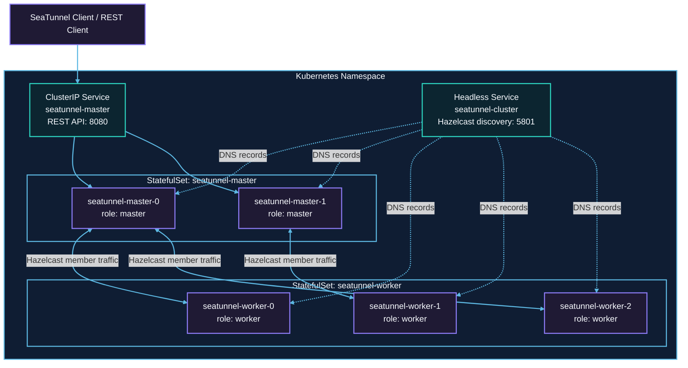

# Kubernetes 部署

本文介绍如何在 Kubernetes 上部署 SeaTunnel Zeta Engine。SeaTunnel 支持本地模式、混合集群模式和分离集群模式。生产环境推荐使用分离集群模式，并且 Master 与 Worker 都使用 StatefulSet 部署。

## 部署模式

| 模式 | Kubernetes 工作负载 | 适用场景 | 生产建议 |
| --- | --- | --- | --- |
| [本地模式](local-mode.md) | Pod 或 Job | 本地验证、功能演示、临时任务 | 不推荐作为长期集群 |
| [混合集群模式](hybrid-cluster-mode.md) | StatefulSet | 小规模集群，Master 与 Worker 在同一进程中 | 可用于简单场景，但不作为首选 |
| [分离集群模式](separated-cluster-mode.md) | Master StatefulSet + Worker StatefulSet | 生产集群、稳定调度、独立扩缩容 | 推荐 |

## 为什么集群模式推荐 StatefulSet

在 Zeta 集群模式下，Master 和 Worker 都推荐使用 StatefulSet 部署，不建议使用 Deployment。

StatefulSet 能提供稳定的 Pod 名称、稳定的网络身份和有序滚动更新。Master 节点负责选主、作业调度、REST API 与 IMap 状态管理，稳定的 Pod 身份有利于集群成员发现和故障恢复。Worker 节点即使在分离集群模式下不存储 IMap 数据，也仍然提供作业执行所需的 slot 资源。如果使用 Deployment，滚动更新、节点驱逐或重新调度时可能同时终止多个 Worker Pod，导致可用 slot 突然不足，并触发任务调度、容错恢复或集群稳定性问题。

推荐的生产拓扑如下。这个画法与 Kubernetes StatefulSet 的推荐模型一致：StatefulSet 管理有序 Pod，Headless Service 提供 Pod 网络身份，以及 Hazelcast 成员发现使用的稳定 Service 目标。



其中 `seatunnel-cluster` 是 Headless Service，只用于 Hazelcast 成员发现；`seatunnel-master` 是普通 ClusterIP Service，用于暴露 Master 的 REST API。

## 前置条件

部署前需要准备：

- Kubernetes 集群。
- 可执行 `kubectl` 命令的客户端环境。
- SeaTunnel 镜像，例如 `seatunnel:3.0.0`。
- 集群可访问的镜像仓库；私有镜像需要配置 `imagePullSecrets`。
- 生产环境中的 checkpoint 和 IMap MapStore 需要使用共享存储或对象存储。

以 Minikube 为例，可以使用以下命令启动本地 Kubernetes 集群：

```bash
minikube start --kubernetes-version=v1.23.3
```

## 镜像建议

生产环境建议固定 SeaTunnel 镜像 tag，并将常用连接器、依赖和基础配置构建到镜像中，避免运行时下载依赖带来的不确定性。

```Dockerfile
FROM eclipse-temurin:11-jdk

ARG SEATUNNEL_VERSION
ENV SEATUNNEL_HOME="/opt/seatunnel"

RUN wget https://dlcdn.apache.org/seatunnel/${SEATUNNEL_VERSION}/apache-seatunnel-${SEATUNNEL_VERSION}-bin.tar.gz
RUN tar -xzvf apache-seatunnel-${SEATUNNEL_VERSION}-bin.tar.gz
RUN mv apache-seatunnel-${SEATUNNEL_VERSION} ${SEATUNNEL_HOME}
RUN mkdir -p ${SEATUNNEL_HOME}/logs
RUN cd ${SEATUNNEL_HOME} && sh bin/install-plugin.sh ${SEATUNNEL_VERSION}
```

构建并加载镜像：

```bash
SEATUNNEL_VERSION=your-release-version
docker build --build-arg SEATUNNEL_VERSION=${SEATUNNEL_VERSION} -t seatunnel:${SEATUNNEL_VERSION} -f Dockerfile .
minikube image load seatunnel:${SEATUNNEL_VERSION}
```

请将 `your-release-version` 替换为已发布的 Apache SeaTunnel 版本。

在生产集群中，应将镜像推送到 Kubernetes 节点可访问的镜像仓库。

## 托管 Kubernetes 注意事项

下面的示例可以适配到 Amazon EKS、Google Kubernetes Engine、Azure Kubernetes Service、阿里云 ACK、腾讯云 TKE、华为云 CCE、火山引擎 VKE 和 Red Hat OpenShift 等托管 Kubernetes 服务。上线前需要确认：

| 项目 | 需要确认的内容 |
| --- | --- |
| 镜像仓库 | SeaTunnel 镜像和插件镜像必须能被集群拉取。私有镜像需要配置 `imagePullSecrets`。 |
| 命名空间与权限 | 建议使用独立命名空间，并按需配置 ServiceAccount、Role、RoleBinding。 |
| 网络发现 | Hazelcast Kubernetes discovery 依赖 Headless Service。使用 API 发现时，`hazelcast*.yaml` 中的 `namespace`、`service-name` 和 `service-port` 需要与 Service 保持一致；使用 DNS 发现时，`service-dns` 需要指向同一个 Headless Service。 |
| 配置与密钥 | 非敏感配置放入 ConfigMap，密码、访问密钥、token 等敏感信息应通过 Secret 或云厂商密钥服务挂载。 |
| Checkpoint 与状态存储 | 多节点集群必须使用共享存储或对象存储，保证任意 Pod 重建后仍能恢复状态。 |
| 资源调度 | Worker 的 request/limit、slot 数和任务并行度应一起规划。启用集群自动扩缩容时，Worker request 需要足以触发节点扩容。 |
| 可观测性 | 建议接入日志采集和指标系统，并保留 SeaTunnel 引擎日志。 |

## 下一步

- 快速体验请阅读 [本地模式](local-mode.md)。
- 小规模集群请阅读 [混合集群模式](hybrid-cluster-mode.md)。
- 生产部署请优先阅读 [分离集群模式](separated-cluster-mode.md)。
- 配置说明请阅读 [Kubernetes 配置](configuration.md)。
- 运维操作请阅读 [Kubernetes 运维](operations.md)。
