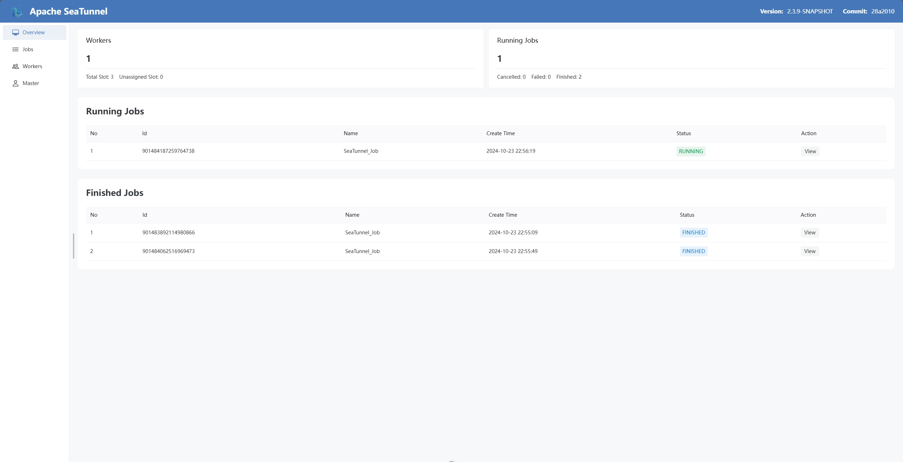
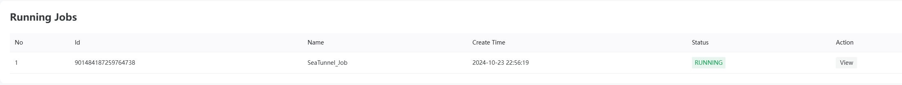
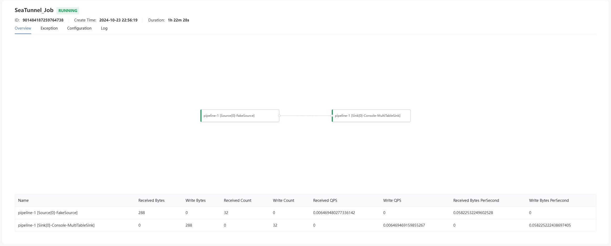
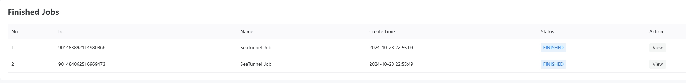
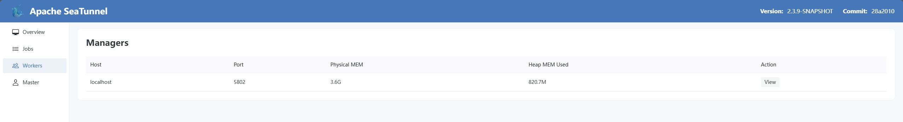
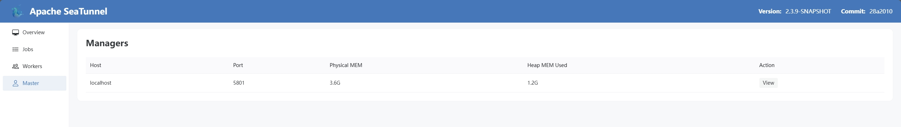

# Apache SeaTunnel Web UI 文档

## 概述

Apache SeaTunnel 的 Web UI 提供了一个友好的用户界面，用于监控和管理 SeaTunnel 作业。通过 Web UI，用户可以实时查看当前运行的作业、已完成的作业，以及集群中工作节点和管理节点的状态。主要功能模块包括 Jobs、Workers 和 Master，每个模块都提供了详细的状态信息和操作选项，帮助用户高效地管理和优化其数据处理流程。

## 作业

### 运行中的作业

“运行中的作业”模块列出了当前正在执行的所有 SeaTunnel 作业。用户可以查看每个作业的基本信息，包括作业 ID、提交时间、状态、执行时间等。点击具体作业可以查看更多详细信息，如任务分布、资源使用情况和日志输出，便于用户实时监控作业进度并及时处理潜在问题。

### 已完成的作业

“已完成的作业”模块展示了所有已成功完成或失败的 SeaTunnel 作业。此部分提供了每个作业的执行结果、完成时间、耗时以及失败原因（如果有）。用户可以通过此模块回顾过去的作业记录，分析作业性能，进行故障排查或重复执行某些特定作业。

## 工作节点

### 工作节点信息

“工作节点”模块展示了集群中所有工作节点的详细信息，包括每个工作节点的地址、运行状态、CPU 和内存使用情况、正在执行的任务数量等。通过该模块，用户可以监控各个工作节点的健康状况，及时发现和处理资源瓶颈或节点故障，确保 SeaTunnel 集群的稳定运行。

## 管理节点

### 管理节点信息

“管理节点”模块提供了 SeaTunnel 集群中主节点的状态和配置信息。用户可以查看 Master 节点的地址、运行状态、负责的作业调度情况以及整体集群的资源分配情况。该模块帮助用户全面了解集群的核心管理部分，便于进行集群配置优化和故障排查。

