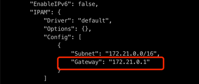

# 使用Docker启用本地模式

## Zeta 引擎

### 下载镜像

```shell
docker pull apache/seatunnel:<version_tag>
```

当下载完成后，可以使用如下命令来提交任务

```shell
# Run fake source to console sink
docker run --rm -it apache/seatunnel:<version_tag> ./bin/seatunnel.sh -m local -c config/v2.batch.config.template

# Run job with custom config file
docker run --rm -it -v /<The-Config-Directory-To-Mount>/:/config apache/seatunnel:<version_tag> ./bin/seatunnel.sh -m local -c /config/fake_to_console.conf

# Example
# If you config file is in /tmp/job/fake_to_console.conf
docker run --rm -it -v /tmp/job/:/config apache/seatunnel:<version_tag> ./bin/seatunnel.sh -m local -c /config/fake_to_console.conf

# Set JVM options when running
docker run --rm -it -v /tmp/job/:/config apache/seatunnel:<version_tag> ./bin/seatunnel.sh -DJvmOption="-Xms4G -Xmx4G" -m local -c /config/fake_to_console.conf
```

### 自己构建镜像

从源代码构建。下载源码的方式和下载二进制包的方式是一样的。
你可以从[下载地址](https://seatunnel.apache.org/download/)下载源码， 或者从[GitHub 仓库](https://github.com/apache/seatunnel/releases)克隆源代码

#### 一个命令来构建容器
```shell
cd seatunnel
# Use already sett maven profile
mvn -B clean install -Dmaven.test.skip=true -Dmaven.javadoc.skip=true -Dlicense.skipAddThirdParty=true -D"docker.build.skip"=false -D"docker.verify.skip"=false -D"docker.push.skip"=true -D"docker.tag"=2.3.8 -Dmaven.deploy.skip --no-snapshot-updates -Pdocker,seatunnel

# Check the docker image
docker images | grep apache/seatunnel
```

#### 分步骤构建
```shell
# Build binary package from source code
mvn clean package -DskipTests -Dskip.spotless=true

# Build docker image
cd seatunnel-dist
docker build -f src/main/docker/Dockerfile --build-arg VERSION=2.3.8 -t apache/seatunnel:2.3.8 .

# If you build from dev branch, you should add SNAPSHOT suffix to the version
docker build -f src/main/docker/Dockerfile --build-arg VERSION=2.3.8-SNAPSHOT -t apache/seatunnel:2.3.8-SNAPSHOT .

# Check the docker image
docker images | grep apache/seatunnel
```

Dockerfile文件内容为：
```dockerfile
FROM openjdk:8

ARG VERSION
# Build from Source Code And Copy it into image
COPY ./target/apache-seatunnel-${VERSION}-bin.tar.gz /opt/

# Download From Internet
# Please Note this file only include fake/console connector, You'll need to download the other connectors manually
# wget -P /opt https://dlcdn.apache.org/seatunnel/2.3.6/apache-seatunnel-${VERSION}-bin.tar.gz

RUN cd /opt && \
    tar -zxvf apache-seatunnel-${VERSION}-bin.tar.gz && \
    mv apache-seatunnel-${VERSION} seatunnel && \
    rm apache-seatunnel-${VERSION}-bin.tar.gz

WORKDIR /opt/seatunnel
```

## Spark/Flink引擎


### 挂载 Spark/Flink 

默认设值下，Spark的目录为`/opt/spark`, Flink的目录为 `/opt/flink`.
如果你需要运行Spark或Flink引擎，你需要将相关依赖挂载到`/opt/spark`或`/opt/flink`目录下.

```shell
docker run \ 
 -v <SPARK_BINARY_PATH>:/opt/spark \
 -v <FLINK_BINARY_PATH>:/opt/flink \
  ...
```

或者你可以在Dockerfile中修改 `SPARK_HOME`, `FLINK_HOME`环境变量，并且重新构建基础镜像，然后再进行挂载.

```dockerfile
FROM apache/seatunnel

ENV SPARK_HOME=<YOUR_CUSTOMIZATION_PATH>

...

```

```shell
docker run \ 
 -v <SPARK_BINARY_PATH>:<YOUR_CUSTOMIZATION_PATH> \
  ...
```

### 提交任务

不同引擎和同一引擎的不同版本命令不同，请选择正确的命令。

- Spark

```shell
# spark2
docker run --rm -it apache/seatunnel bash ./bin/start-seatunnel-spark-2-connector-v2.sh -c config/v2.batch.config.template

# spark3
docker run --rm -it apache/seatunnel bash ./bin/start-seatunnel-spark-3-connector-v2.sh -c config/v2.batch.config.template
```

- Flink
  在提交作业之前，您需要先启动 Flink 集群。

```shell
# flink version between `1.12.x` and `1.14.x`
docker run --rm -it apache/seatunnel bash -c '<YOUR_FLINK_HOME>/bin/start-cluster.sh && ./bin/start-seatunnel-flink-13-connector-v2.sh -c config/v2.streaming.conf.template'
# flink version between `1.15.x` and `1.16.x`
docker run --rm -it apache/seatunnel bash -c '<YOUR_FLINK_HOME>/bin/start-cluster.sh && ./bin/start-seatunnel-flink-15-connector-v2.sh -c config/v2.streaming.conf.template'
```


# 使用Docker配置集群模式

docker下的集群模式仅支持Zeta引擎

有两种方式可以来创建SeaTunnel集群
1. 使用docker-compose
2. 直接使用docker来创建

## 1. 使用Docker-compose
配置文件为：
```yaml
version: '3.8'

services:
  master:
    image: apache/seatunnel
    container_name: seatunnel_master
    environment:
      - ST_DOCKER_MEMBER_LIST=172.16.0.2,172.16.0.3,172.16.0.4
    entrypoint: >
      /bin/sh -c "
      /opt/seatunnel/bin/seatunnel-cluster.sh -r master
      "    
    ports:
      - "5801:5801"
    networks:
      seatunnel_network:
        ipv4_address: 172.16.0.2

  worker1:
    image: apache/seatunnel
    container_name: seatunnel_worker_1
    environment:
      - ST_DOCKER_MEMBER_LIST=172.16.0.2,172.16.0.3,172.16.0.4
    entrypoint: >
      /bin/sh -c "
      /opt/seatunnel/bin/seatunnel-cluster.sh -r worker
      " 
    depends_on:
      - master
    networks:
      seatunnel_network:
        ipv4_address: 172.16.0.3

  worker2:
    image: apache/seatunnel
    container_name: seatunnel_worker_2
    environment:
      - ST_DOCKER_MEMBER_LIST=172.16.0.2,172.16.0.3,172.16.0.4
    entrypoint: >
      /bin/sh -c "
      /opt/seatunnel/bin/seatunnel-cluster.sh -r worker
      " 
    depends_on:
      - master
    networks:
      seatunnel_network:
        ipv4_address: 172.16.0.4

networks:
  seatunnel_network:
    driver: bridge
    ipam:
      config:
        - subnet: 172.16.0.0/24

```

运行 `docker-compose up`命令来启动集群，该配置会启动一个master节点，2个worker节点

## 2. 直接使用docker来创建

1. 创建一个Network
```shell
docker network create seatunnel-network
```

2. 查看刚刚创建Network的Gateway IP
```shell
docker network inspect seatunnel-network
```


3. 启动节点
```shell
## start master and export 5801 port 
docker run -d --name seatunnel_master \
    --network seatunnel-network \
    --rm \
    -e ST_DOCKER_MEMBER_LIST=172.18.0.1:5801 \ # set to the Gateway IP
    -p 5801:5801 \
    apache/seatunnel \
    ./bin/seatunnel-cluster.sh -r master

## start worker1
docker run -d --name seatunnel_worker_1 \
    --network seatunnel-network \
    --rm \
    -e ST_DOCKER_MEMBER_LIST=172.18.0.1:5801 \
    apache/seatunnel \
    ./bin/seatunnel-cluster.sh -r worker

## start worker2
docker run -d --name seatunnel_worker_2 \ 
    --network seatunnel-network \
    --rm \
     -e ST_DOCKER_MEMBER_LIST=172.18.0.1:5801 \   
    apache/seatunnel \
    ./bin/seatunnel-cluster.sh -r worker    

```

启动完成后，可以运行`docker logs -f seatunne_master`, `docker logs -f seatunnel_worker_1`来查看节点的日志  
当你访问`http://localhost:5801/hazelcast/rest/maps/system-monitoring-information` 时，可以看到集群的状态为1个master节点，2个worker节点.