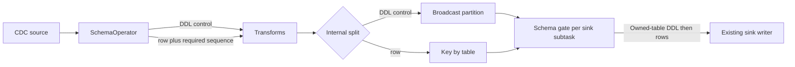

# Flink Schema Evolution V3: Data-Plane Sequence Gate

## Decision

Replace both the process-local `LocalSchemaCoordinator` and the Stage 2
`OperatorCoordinator` protocol with a small, checkpointed data-plane gate.

The Stage 2 direction is not a good fit for this problem:

- It adds a coordinator state machine, serializers, event protocols, factories, and separate
  legacy/attempt-aware Flink bridges.
- It requires different coordinator callback implementations for different Flink releases.
- A coordinator-based owner/follower protocol would require an acknowledgement bridge and usually
  a second public sink-writer operation for follower refresh, leaking a Flink execution concern
  into the engine-neutral sink API.
- It still leaves SeaTunnel responsible for a substantial amount of acknowledgement and recovery
  logic.

The replacement uses only stable DataStream and managed-state APIs and does not change
`SupportSchemaEvolutionSinkWriter` or any other public API.

## Runtime protocol

1. `SchemaOperator` keeps the checkpoint/XA fence introduced by PR #10648.
2. When the fence is satisfied, it assigns the DDL a checkpointed internal ID
   `(producerId, sequence)`, emits the DDL control record, and immediately releases its buffered
   rows. Each later row carries only the latest required sequence ID.
3. Transforms map or filter the schema event through the existing
   `mapSchemaChangeEvent` hook. Replacement and flat-map output rows retain the internal dependency
   ID. A filtered DDL becomes a no-op control so dependent rows cannot wait forever.
4. Immediately before a schema-capable sink, the stream is split. DDL controls use Flink's
   broadcast partitioner, while data is key-partitioned by table. Both branches are then unioned
   into one schema gate per sink subtask. Consequently all rows for one table reach exactly one
   gate and its forward-connected sink writer.
5. A gate tracks the next expected sequence for every producer. If controls arrive out of order
   after a shuffle or parallelism change, it retains them in a bounded buffer and advances only a
   contiguous sequence prefix. If a row overtakes its broadcast control on the network, the gate
   buffers the row until the control arrives.
6. Each gate derives the table owner with the same key-group assignment used by Flink's data
   partitioner. Only that owner sends the DDL through the existing `applySchemaChange(event)` path.
   The other gates consume the lightweight control only to advance the global producer sequence;
   they never apply physical DDL and never receive rows for that table.
7. The owner emits the DDL control and then releases dependent rows on the same forward channel to
   its writer. This per-channel ordering remains valid with unaligned checkpoints. If the data and
   broadcast branches are captured or replayed in different orders, the existing required-sequence
   gate buffers the overtaking row until its DDL control arrives.
8. Any owner writer exception is rethrown and fails the Flink task.

This serializes physical DDL per table while preserving command-before-row ordering on the owning
writer's input channel, without cross-operator RPC, static JVM state, ACK futures, a new sink SPI,
blocking coordinator callbacks, or treating checkpoint completion as a writer acknowledgement.
Different tables can use different sink subtasks, but each individual table deliberately has one
sink-writer owner.

## Recovery contract

Flink checkpoints operator state and in-flight channel data. SeaTunnel stores compact protocol
state rather than a DDL history. Because most SeaTunnel sink writers do not checkpoint their
in-memory schema, each gate retains the latest transformed event with its complete `changeAfter`
snapshot per table. The initial sink schemas are serialized with the gate as immutable job-graph
input; they are not mutable runtime state.

After recovery, the gate derives one bounded `AlterTableColumnsEvent` that transforms the initial
schema B into the latest checkpointed target schema T. The plan drops baseline columns absent from
T, then adds every target column in final order. SeaTunnel's existing local schema dispatcher treats
an add of an existing column as a modify/reposition operation, so applying the plan to B
reconstructs column definitions and order without retaining intermediate DDLs. The gate validates
`apply(B, plan) == T` before accepting a control. It fails immediately if the baseline, target
snapshot, or reconstruction is incomplete.

Union state gives every restored gate the compact table snapshots needed after rescaling. Each gate
recomputes ownership using the restored execution's key-group assignment and sends plans only for
the tables whose rows it now owns. It emits those plans before processing the first restored row or
live control. Non-owners do not refresh unused writer schemas, and no checkpoint-completion
notification is interpreted as proof that another writer applied DDL.

This is deterministic reconstruction from Flink managed state, not coordinator-owned recovery or
an ever-growing event log. It adds no option, connector SPI, or engine-specific branch to a shared
sink writer.

| Failure point | Recovery behavior |
| --- | --- |
| Before the control reaches a gate | The source/operator or Flink channel state replays it. |
| After the owner emits DDL but before a checkpoint contains the applied sequence | The control may execute again. The connector's DDL handling must converge on the already-achieved schema. |
| After a checkpoint containing the applied sequence completes | The restored table owner derives one initial-to-target plan and delivers it before restored data. Physical DDL converges as a no-op. |
| While a dependent row is waiting | The bounded pending-row state is restored by Flink and released only after its required sequence is known to be applied. |
| During physical DDL | The writer exception fails the task; no dependent row from that gate is emitted. |

External DDL is not transactionally atomic with a Flink checkpoint. Therefore no in-process
coordination design can provide exactly-once physical DDL after an arbitrary failure. The required
contract is at-least-once control delivery plus idempotent schema convergence.

The Flink adapter does not change `JdbcSinkWriter` or any other engine-neutral sink writer. It uses
the existing `applySchemaChange(event)` path for both live controls and the generated restore plan.
JDBC's local dispatcher can therefore rebuild its incremental in-memory schema from the compact
plan, while its physical add/drop/rename checks make already-achieved operations no-ops.

A writer failure fails the Flink task; managed state and channel replay then redeliver the control.
Every `SupportSchemaEvolutionSinkWriter` must therefore be verified for **schema-DDL convergence**
before this design is declared production-ready for that connector: applying an already-achieved
schema operation must succeed or be skipped. This requirement is separate from idempotent data-row
writes. A connector's at-least-once data path may still produce duplicate rows without preventing
schema recovery, but a non-convergent DDL handler cannot safely consume replayed schema controls.

## State and memory bounds

`SchemaOperator` retains only:

- the XA/checkpoint fence fields;
- one producer ID, one monotonically increasing sequence, and the last emitted sequence ID;
- pending DDL/data records while the checkpoint fence is active.

`TableEvent.getCreatedTime()` is intentionally not used as an event identity. Two legitimate DDLs
can be created in the same millisecond, and replay order is not safely represented by wall-clock
time. The checkpointed `(producerId, sequence)` identifies translation-layer controls instead. The
producer and sequence are stored together in the redistributable state entry so a scale-down does
not combine an active producer with another subtask's sequence; the previous separate sequence
state remains readable for savepoint compatibility.

The source pending queue is capped at 100,000 records and an estimated 64 MiB. Removing the sink ACK
wait means this queue exists only for the checkpoint safety window, not for a distributed
acknowledgement timeout.

Each sink gate retains:

- one latest applied sequence per upstream source operator, so metadata is proportional to source
  parallelism rather than the number of historical DDLs;
- one latest transformed event with a complete target snapshot per table, so writer reconstruction
  is proportional to the number of tables and columns rather than the number of historical DDLs;
- bounded out-of-order controls until each producer's missing sequence arrives;
- rows that actually overtook their control record, capped at 100,000 records and an estimated
  64 MiB.

There is no union DDL history, no unbounded set of applied event IDs, and no JVM-global job map.
Overflow fails the task instead of dropping a DDL or data row.

Sequence prefixes and pending controls use union state because every gate sees the broadcast
control stream and must reconstruct the same sequence state after rescaling. To avoid checkpointing
one complete copy per sink subtask, each gate snapshots only the deterministic shard assigned to
its subtask. The latest table snapshot is checkpointed only by the current table owner. Union
restore then gives the complete compact snapshots to every restored gate, which recomputes the new
owner before replaying a plan. Pending data rows remain in ordinary operator `ListState`, so Flink
redistributes each row rather than copying it to every restored subtask.

The hard-coded limits are suitable for validating the architecture. A later focused change can make
them job options and add metrics without changing this protocol.

## Preservation of the existing fixes

### PR #10648: XA/MDL safety

- The first completed checkpoint only records the fence checkpoint.
- Normal processing still waits the extra completed-checkpoint round before emitting DDL.
- JDBC still calls `prepareCommit()` before physical DDL.
- Schema handling never invokes a committer or global committer directly.

### PR #10951: Flink 1.13 checkpoint stall

- The Flink 1.13 source-reader keep-alive path remains unchanged.
- `SchemaOperator13` continues to use the typed `ProcessingTimeService` callback on the task thread.
- Exactly-once mode never treats timer expiry as proof of XA completion. If the second completed
  checkpoint stalls, the timer fails the task with a diagnostic so Flink can restore it.
- At-least-once mode may retain the timer-based release after the first completed checkpoint because
  it does not promise the additional XA commit fence.

## Flink version strategy

The new protocol uses APIs present across all requested versions: `filter`, `broadcast`, `union`,
`transform`, `ListState`, and checkpoint callbacks.

- Flink 1.13 retains only its already-existing source keep-alive/fallback specialization.
- Flink 1.15 and 1.18 share the same translation and starter implementation.
- Flink 1.20 retains its already-existing Sink V2 adapter; it does not need a special coordinator.

There are no four protocol implementations and no reflection bridge. Compatibility validation for
this prototype includes:

- Flink 1.13.6: versioned starter clean compilation and fallback-fence unit coverage;
- Flink 1.15.3: shared translation/starter compilation and focused unit tests;
- Flink 1.18.1: the same shared translation and starter compiled with an explicit dependency
  override, plus the focused unit tests;
- Flink 1.20.1: versioned translation and starter clean compilation.

## Code scope

The implementation is intentionally confined to the Flink adapter:

- three small internal classes for control metadata, topology wiring, and restore-plan generation;
- `SchemaOperator` and the existing sink-side gate;
- the existing transform adapter, so internal metadata survives transforms;
- three starter call sites, each reduced to the same common helper;
- common and Flink 1.20 sink adapters, only to remove local ACK handling.

The Stage 2 coordinator protocol, factories, bridges, serializers, and tests are deleted. No
`seatunnel-api` source is modified.

## Known limitations and release gates

This is a working architectural prototype, not yet a claim of universal connector readiness.

1. Audit and test schema-DDL convergence for each advertised
   `SupportSchemaEvolutionSinkWriter`. This is not a requirement for idempotent row writes: an
   at-least-once sink may still produce duplicate data rows. It only requires replaying or following
   an already-achieved schema transition to succeed or become a no-op. The Flink layer does not
   depend on connector-private state, and the shared JDBC writer remains unchanged and
   engine-neutral.
2. Add a distributed failure test with chaining disabled and separate TaskManagers, including
   failure after DDL success but before checkpoint completion.
3. Add the MySQL CDC XA regression test for both the normal fence and Flink 1.13 controlled
   failure/recovery path.
4. Per-table event ordering and out-of-order control recovery have focused unit coverage, but
   rescaling while a DDL or dependent row is pending still needs a distributed test.
5. The sink topology/state differs from the Stage 2 coordinated operator. Ordinary failure recovery
   of a job submitted with this topology is supported, but migration from a Stage 2 savepoint is not
   guaranteed. Upgrade only from a clean savepoint with no pending DDL, and document the topology
   incompatibility before release.
6. Compact writer restoration assumes CDC and transforms preserve a complete `changeAfter` schema
   on the latest event and that column changes do not alter unsupported table-level constraints.
   The gate fails closed when its generated plan cannot reconstruct the target. Debezium CDC
   supplies complete snapshots; other schema-event producers must be audited before they use the
   compact replay path.
7. Table-key routing intentionally limits each table to one sink subtask while this protocol is
   active. Multi-table jobs can still distribute different tables across sink subtasks. A future
   design that restores within-table sink parallelism would need a real writer acknowledgement or
   another connector-neutral way to refresh follower writer schemas.

## Recommendation

Continue Stage 3 with this data-plane design and stop extending the Stage 2 coordinator protocol.
Before merging, treat connector schema-DDL convergence and distributed failover tests as hard
gates. This keeps the refactor centered on the three original problems: remove JVM-local
coordination, bound state, and let Flink own checkpoint recovery while retaining only compact writer
reconstruction state.
