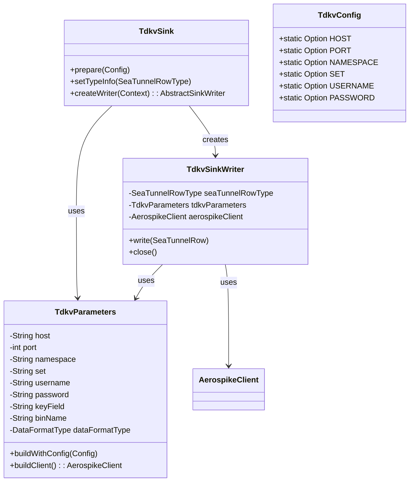
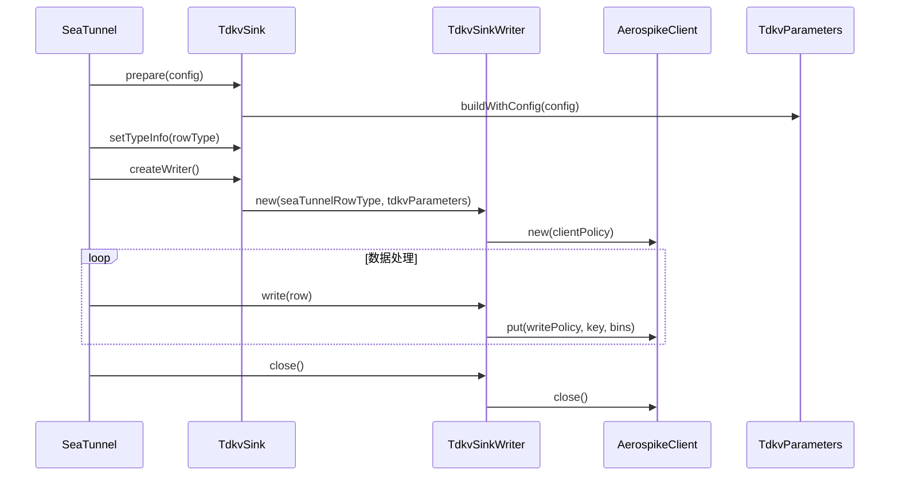

# TDKV Connector 详细设计文档

## 1. 概述
本连接器基于Aerospike实现TDKV（Time-series Distributed Key-Value）数据存储的写入功能，主要特性包括：
- 支持多种数据格式写入（MAP_FORMAT, STRING_FORMAT, KEY_VALUE_FORMAT）
- 支持批量写入
- 支持连接池管理
- 支持写入策略配置

## 2. 模块结构
```
src/main/java/org/apache/seatunnel/connectors/seatunnel/tdkv/
├── config/
│   ├── TdkvConfig.java       # 配置选项定义
│   ├── TdkvParameters.java   # 连接参数封装
│   └── DataFormatType.java   # 数据格式枚举
├── sink/
│   ├── TdkvSink.java         # Sink主类
│   └── TdkvSinkWriter.java   # 数据写入实现
```

## 3. 核心类设计



## 4. 插件加载流程



## 5. 关键参数说明

### TdkvParameters 配置参数
| 参数名 | 类型 | 必填 | 默认值 | 描述 |
|--------|------|------|--------|------|
| host | String | 是 | 无 | Aerospike服务地址 |
| port | int | 是 | 3000 | Aerospike服务端口 |
| namespace | String | 是 | 无 | 命名空间 |
| set | String | 是 | 无 | 集合名称 |
| username | String | 否 | 无 | 用户名 |
| password | String | 否 | 无 | 密码 |
| keyField | String | 否 | 无 | 主键字段 |
| binName | String | 否 | set名称 | 数据存储bin名称 |
| dataFormatType | DataFormatType | 否 | MAP_FORMAT | 数据格式类型 |

### 数据格式类型
| 类型 | 描述 |
|------|------|
| MAP_FORMAT | 将整个JSON数据解析为Map结构存储 |
| STRING_FORMAT | 直接使用字符串格式存储 |
| KEY_VALUE_FORMAT | 每个字段作为单独的bin存储 |
