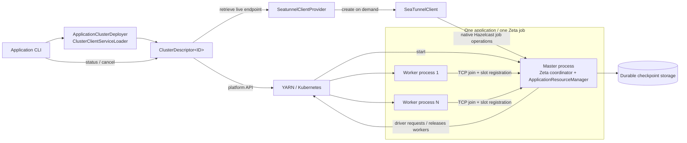
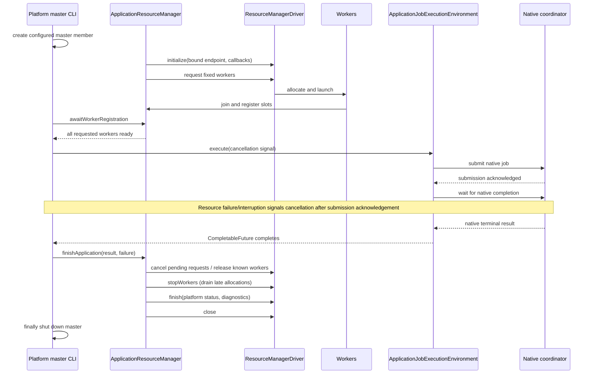

# STIP-41: Native Zeta Application Mode on YARN and Kubernetes

Design discussion: https://github.com/apache/seatunnel/issues/12457

This proposal introduces a native Application Mode for Zeta. One submission creates one isolated Zeta cluster for one SeaTunnel job: one master coordinates a fixed number of workers, submits the job after worker registration, and releases application-owned resources when execution ends.

This STIP turns the umbrella discussion in #11857 into a concrete design. It specifies both YARN and Kubernetes in full. It is a design and acceptance contract, not a claim that the implementation in #12460 is complete, approved, or passing CI.

The revised design separates deployment, native job execution, and resource lifecycle. It does not introduce a resource-manager core module, a custom application-ID wrapper, an ApplicationResult wrapper, or an all-in-one ApplicationClusterEntrypoint.

## 1. Background, goals, and scope

Zeta's long-running standalone cluster model is useful for multiple jobs sharing a cluster. Teams using YARN or Kubernetes also need job-level isolation without operating a permanent SeaTunnel cluster.

Application Mode provides:

- one platform application for exactly one Zeta job;
- isolated compute resources, dependencies, membership, and lifecycle;
- automatic resource release after normal batch completion;
- platform-visible state for independently running streaming applications;
- resubmission into a new application using an earlier job's durable checkpoint.

The implementation reuses Zeta's coordinator, DAG parser, scheduler, worker registration, SlotService, connector runtime, and checkpoint service.

### MVP boundaries

- One master and a fixed number of workers.
- The master coordinates; it does not provide task slots.
- Workers execute task groups using fixed slots.
- No automatic master failover, worker replacement, or autoscaling.
- No multi-job application or new session-cluster mode.
- No Kerberos/delegation-token/keytab support in the YARN MVP.
- No savepoint-based application upgrade protocol.
- No replacement of Hazelcast membership or the Zeta slot scheduler.
- No new REST application-management service or separate release archive.
- Existing standalone, Flink, and Spark behavior remains unchanged.

Review sequencing is separate from design coverage. The YARN-first acceptance request in the review comments is recorded in section 16; Kubernetes remains fully specified here.

## 2. Process topology and identity



There are three different identities, not one interchangeable ID:

| Identity | Meaning | Representation |
| --- | --- | --- |
| Application ID | Platform deployment and resource ownership | Hadoop `ApplicationId` on YARN; Job name `String` on Kubernetes, within the selected namespace/cluster |
| Zeta job ID | Native job execution and checkpoint namespace | Positive native job ID |
| Worker resource ID | One allocated external worker process | `YarnWorkerNode` / `KubernetesWorkerNode`, exposing `ResourceID` through `ResourceIDRetrievable` |

No custom application-ID class is needed. CLI text is parsed by the selected platform factory. A native job ID is generated once before submission when absent; restoring uses a different historical source job ID.

The Hazelcast cluster name is derived consistently from the native application ID. Every member and retrieved client uses that same name. It is discovery isolation, not an authentication boundary.

Only the master is a non-lite member. Workers are lite members configured with the WORKER role. Application discovery uses explicit TCP membership and the advertised master endpoint, with no inherited standalone peers, multicast, or cloud auto-discovery. Workers require the master and must not bootstrap their own independent cluster. With no standby master, Engine `backup-count` is zero.

Fixed capacity is:

```text
application.worker-count × application.worker.slots
```

This is slot capacity, not a promise that every job operator runs at that parallelism. Native topology and scheduling rules still apply.

## 3. Module layout and responsibility boundaries

There is no `seatunnel-resource-managers/core` module. Shared types belong to the existing Engine layer that owns their responsibility.

| Module / package | Responsibility |
| --- | --- |
| `engine-common/config/spec` | Immutable `ApplicationSpecification` and `WorkerSpecification`; job content, fixed resource requirements, resolved deployment options |
| `engine-common/config/server` | Common `ApplicationOptions` |
| `engine-common/config` | `ApplicationClusterConfig`: prepare caller-owned configuration before member creation; no process lifecycle |
| `engine-common/runtime` | `ApplicationStatus` and existing deployment/role types |
| `engine-core/classloader` | `ApplicationJarPathResolver`: resolve distribution-local connector/plugin paths |
| `engine-client/deployment` | `ClusterDescriptor`, `SeatunnelClientProvider`, `ApplicationClusterDescriptorFactory`, `ClusterClientServiceLoader`, `ApplicationClusterDeployer` |
| `engine-client/job` | `ApplicationJobExecutionEnvironment`: parse, build DAG, submit one native job, expose native completion |
| `engine-server/resourcemanager` | `ApplicationResourceManager`, driver/context contracts, registration and resource lifecycle |
| `seatunnel-starter` | Parse application CLI arguments and delegate submit/status/cancel |
| `resource-managers/yarn` | YARN descriptor, uploader/localization, driver, platform options, master/worker CLIs |
| `resource-managers/kubernetes` | Kubernetes descriptor, API/object construction, driver, platform options, master/worker CLIs |

Platform SDK dependencies stay in the optional platform modules. Engine server must not depend on engine-client or a platform provider. Existing engine-client-to-server usage for in-master job execution must not introduce a reverse dependency or a cycle.

### Migration from the existing third-party resource managers

The platform-specific `YarnResourceManager` and `KubernetesResourceManager` classes and their factories are removed. One concrete `ResourceManagerFactory` selects `StandaloneResourceManager` or `ApplicationResourceManager`.

- `ApplicationResourceManager` remains the coordinator's normal resource/slot registry and directly calls the injected platform `ResourceManagerDriver`.
- Platform Master CLIs construct the specification and driver externally and capture them with the deployment type and application ID in ResourceManagerFactory, passing only the factory through member creation. Engine does not load platform SDKs.
- `ApplicationResourceManager` coordinates startup, worker readiness, asynchronous failure, cleanup, and application terminal reporting.
- The driver alone performs external allocation/launch/release through the platform SDK.
- Worker registration and task-group slot assignment remain in the existing Engine resource manager and SlotService.
- No independent allocation retry loop, worker replacement policy, or competing terminal-cleanup owner is introduced.

`ResourceManagerFactory` retains deployment dependencies before a node engine exists. The coordinator calls `createResourceManager(nodeEngine, engineConfig)` to create an uninitialized manager. The coordinator initializes that manager once before publishing it; each concrete manager owns initialization and failed-initialization cleanup. It is not a deployment factory. `ApplicationClusterDescriptorFactory` selects the submission-side platform descriptor through SPI. These factories serve different boundaries.

## 4. Submission and client contracts

### ClusterDescriptor: application operations

```java
public interface ClusterDescriptor<ID> extends AutoCloseable {
    ID deployApplication(ApplicationSpecification specification) throws Exception;

    SeatunnelClientProvider retrieve(ID id) throws Exception;

    ApplicationStatus getApplicationStatus(ID id) throws Exception;

    void cancelApplication(ID id) throws Exception;

    @Override
    void close() throws Exception;
}
```

The only generic parameter is the platform's native application ID. Deployment returns that ID directly; it does not construct a native Engine client merely to obtain an ID.

Application status and cancellation use platform APIs. They do not require a live master, Hazelcast connectivity, or a Zeta job ID. Status remains available only as long as the platform retains the application record.

`close()` releases descriptor-owned local connections. It does not stop the remote application.

### SPI and Deployer

`ClusterClientServiceLoader` discovers `ApplicationClusterDescriptorFactory<ID>` through `ServiceLoader`. Exactly one installed provider must match the selected deployment type. Missing or ambiguous providers fail explicitly; discovery itself must not allocate remote resources.

The platform factory:

- declares its deployment type;
- parses a textual application ID;
- creates a descriptor from deployment options.

`ApplicationClusterDeployer` receives the loader through its constructor. Its `run(specification)` method selects a factory, opens a descriptor, calls `deployApplication`, closes the descriptor, and returns the native ID. It does not own the remotely running master or wait for the native job to finish.

There is no parallel `ApplicationClusterDescriptors` utility with overlapping responsibility.

### SeatunnelClientProvider: native job operations

```java
@FunctionalInterface
public interface SeatunnelClientProvider {
    SeaTunnelClient getClusterClient();
}
```

`retrieve(id)` discovers the running master's connection configuration and returns a provider without opening an Engine connection. Each `getClusterClient()` call creates a new `SeaTunnelClient`, which the caller must close independently.

This is the existing Hazelcast-native client path, not HTTP. It requires a reachable live master. A Kubernetes Pod IP is not automatically reachable from an external workstation; no public ingress or port-forwarding service is implied.

Closing a descriptor or native client must not implicitly cancel the application. A finished platform application is not converted into a fabricated native `JobResult`.

### Results and cancellation are not conflated

- Deployment returns the native application ID.
- Application status returns `ApplicationStatus` directly.
- Application cancellation returns normally when the platform request succeeds, or throws on failure; the platform may still be completing asynchronous termination.
- Native execution returns a future of the existing `JobResult`.
- No `ApplicationResult` wrapper is introduced.
- Native job cancellation and platform application cancellation are distinct operations.

## 5. Master startup and native job execution

YARN and Kubernetes each have distinct master and worker entrypoints:

| Platform | Master | Worker |
| --- | --- | --- |
| YARN | `SeatunnelYarnMasterCli` | `SeatunnelYarnWorkerCli` |
| Kubernetes | `SeatunnelKubernetesMasterCli` | `SeatunnelKubernetesWorkerCli` |

There is no `ApplicationClusterEntrypoint` or `ApplicationWorkerRunner`, and no replacement catch-all runner.

The existing `SeaTunnelServerStarter.main` remains unchanged. Application entrypoints prepare configuration externally and invoke `SeaTunnelServerStarter.createHazelcastInstance(config, instanceName, jarPathResolver, resourceManagerFactory)`. This overload only passes dependencies through to member construction. It must not acquire application orchestration responsibilities. Worker entrypoints pass `new ResourceManagerFactory()` and do not receive platform drivers.

### Master entrypoint responsibilities

1. Read localized application configuration and initialize platform-specific dependencies.
2. Prepare master membership, checkpoint retention, and distribution-local jar resolution.
3. Construct the driver and unified ResourceManagerFactory externally, then pass the factory into native master creation. The coordinator supplies its NodeEngine and EngineConfig when asking that factory for a manager.
4. Wait for `ApplicationResourceManager.awaitWorkerRegistration()`.
5. Construct and execute `ApplicationJobExecutionEnvironment`.
6. Observe native completion together with the resource manager's asynchronous failure future.
7. On interruption/resource failure, signal native cancellation and wait within a bounded shutdown interval.
8. Ask the resource manager to finish the application.
9. Finally shut down the master and close remaining entrypoint-owned resources.

The entrypoint owns the master member and shutdown hook. Before the Engine resource manager assumes the driver lifecycle, a member-creation failure must close the partially initialized driver. YARN's outer lifecycle also owns post-submission staging cleanup.

### ApplicationJobExecutionEnvironment

This class belongs in `engine-client/job` and extends `AbstractJobEnvironment`, following `ClientJobExecutionEnvironment`'s parsing/DAG-building structure.

It owns only:

- the native JobConfig/JobContext and assigned job identity;
- `getJobConfigParser()`, including checkpoint lookup when restoring;
- `getLogicalDag()`, using the master's classloader and localized jars;
- `execute(cancellation)`, which submits through the local coordinator and returns `CompletableFuture<JobResult>`.

The future represents native job termination, not submission acknowledgement. Waiting for completion is chained after the coordinator acknowledges submission, so the caller does not observe an unknown job merely because registration has not happened yet.

A caller-owned cancellation signal is also chained after submission acknowledgement. Cancellation arriving during submission must still cancel a subsequently accepted job. Canceling only the returned Java future is not a substitute for canceling the actual Zeta job.

The execution environment does not allocate workers, wait for cluster readiness, publish platform state, shut down the master, or clean up application resources. It does not connect a SeaTunnelClient to its own master or use a REST execution environment as an adapter.

Application-mode asynchronous APIs use SeaTunnel's `org.apache.seatunnel.engine.common.utils.concurrent.CompletableFuture`.

## 6. Resource lifecycle and driver contract

### Runtime context is deliberately small

```java
public interface ResourceManagerContext {
    String getMasterAddress();
    void onError(Throwable error);
    void onWorkerTerminated(String workerId, String diagnostics);
}
```

There is no `getApplicationId()`, `getSpecification()`, or `getClusterName()` in this context. Fixed platform identity, cluster name, and deployment settings are supplied when constructing the driver. The context provides only the bound master endpoint and runtime failure callbacks.

### Platform driver

The essential operations are:

```java
void initialize(ResourceManagerContext context) throws Exception;

CompletableFuture<WorkerType> requestWorker(WorkerSpecification specification);

CompletableFuture<Void> releaseWorker(WorkerType worker);

void stopWorkers() throws Exception;

void finish(ApplicationStatus status, String diagnostics) throws Exception;

void close() throws Exception;
```

`WorkerType` exposes its resource identity through `ResourceIDRetrievable`.

- `initialize` creates/registers platform clients and starts necessary observation.
- A successful request future means the external worker was launched, not that Zeta has registered its slots.
- `releaseWorker` completes only after the driver's release operation succeeds, or completes exceptionally. Repeated release must be harmless.
- Canceling a pending request stops demand but does not absolve the driver of resources allocated concurrently.
- `stopWorkers` stops new allocation and observation, drains in-flight launches, and reclaims late/ambiguous allocations. It keeps clients needed for terminal reporting usable.
- `finish` publishes platform terminal state where the platform supports explicit reporting.
- `close` attempts outstanding cleanup, stops callbacks, and closes clients, including after partial initialization. It must tolerate repeated cleanup.

### One owner for each lifecycle

| Resource / concern | Owner |
| --- | --- |
| Local submission API client | ClusterDescriptor |
| Partial submission rollback | Platform descriptor, with uploader/resource helper handling its own partial creation |
| Master member and shutdown hook | Platform master CLI |
| Driver startup/readiness/failure/terminal sequence | ApplicationResourceManager |
| External worker requests, launches, release and late allocations | Platform driver |
| Engine membership, worker registration and slots | Existing Engine resource manager / SlotService |
| Parse, DAG, native submission and completion | ApplicationJobExecutionEnvironment |
| YARN staged application files after successful submission | Application lifecycle; terminal status/cancel can retry cleanup |
| Kubernetes Job-owned Secret, Service and worker Pods | Explicit cleanup plus Kubernetes owner/TTL lifecycle |
| Persistent checkpoint storage / caller-provided PVC | User/operator; never application cleanup |
| Each retrieved SeaTunnelClient | Its caller |

### Normal and exceptional sequence



The worker-readiness deadline includes driver initialization, allocation, launch, and Engine registration. It is one provisioning deadline for the whole fixed worker set, not a fresh timeout per worker. Submitter-side waiting for the master has its own startup deadline using the same configured duration.

First unexpected driver/worker failure wakes the application lifecycle. Expected worker exits during cleanup must not be reported as new application failures. Shutdown and callbacks must coordinate without holding a platform callback thread while waiting for the entire shutdown.

Cleanup must attempt remaining steps after a failure, preserve the original cause, and attach cleanup failures. Worker-release/drain failure can turn an otherwise successful result into FAILED. Cancellation timeout is not clean cancellation. Once a platform has accepted an immutable terminal report, a later client-close failure cannot be represented as if that report had been changed; it must remain visible in diagnostics/process failure.

No automatic worker replacement or application restart is hidden inside these methods.

## 7. YARN design

### Submission and localization

1. Merge Hadoop settings from `yarn.config-dir` or `HADOOP_CONF_DIR`; validate the supported authentication mode.
2. Validate application/job/resource options and the distribution archive. Production staging must be on a shared filesystem such as HDFS, not a submitter-local path.
3. Ask YARN for its native ApplicationId and maximum resource capability.
4. Check master/worker requests against that capability.
5. Use `YarnApplicationFileUploader` to create the application-private staging directory, upload the distribution, serialized specification, and merged Hadoop configuration, and register the LocalResource metadata.
6. Build the AM launch context with the localized distribution and `SeatunnelYarnMasterCli`.
7. Submit a single-attempt application, then wait within the master-startup deadline before returning its ID.

`YarnApplicationFileUploader` owns validation/localization bookkeeping and an independently owned filesystem connection. `upload()` returns the local-resource descriptor and distribution root required by the launch context. The caller need not manually coordinate each uploaded file. Closing the uploader closes its filesystem client; it must not delete files needed by a successfully submitted application.

An upload failure removes only the directory created by that upload. A submit failure or lost response may mean the RM accepted the application: rollback must attempt to kill that application and clean its staging, retaining rollback errors. Existing staging directories are not overwritten.

### AM and worker behavior

`SeatunnelYarnMasterCli` creates the driver externally and captures it, the application ID and specification in ResourceManagerFactory with `DeployType.YARN`, then passes that factory into master creation. The unified `ResourceManagerFactory` creates `ApplicationResourceManager`. `YarnResourceManagerDriver` uses AMRMClient for registration, heartbeats, requests and release, and NMClient for worker launch/stop.

The driver registers the actual bound master host/port for later discovery. It requests the fixed worker count, launches `SeatunnelYarnWorkerCli`, and reports allocation/launch/worker-exit failures through the runtime context.

Master and workers use the same localized archive. Worker arguments carry the cluster name, advertised master endpoint, fixed slot count, and the master's distribution root. `ApplicationJarPathResolver` maps master-local jar paths to each worker's localized distribution root; no assumption is made that YARN container work directories match.

A worker creates only the configured native worker member. It does not create AMRMClient/NMClient, submit another application, or own global staging cleanup.

### Completion, cancellation, and master loss

- The resource manager cancels outstanding requests, releases workers, drains races, and unregisters the AM with the terminal status and diagnostics.
- The outer lifecycle shuts down the master and removes application staging.
- Detached status reads YARN's application report. Terminal status/cancellation can retry staging cleanup left by an abrupt AM exit.
- Platform cancellation calls YARN kill by ApplicationId; it does not require a native job ID.
- `maxAppAttempts=1`: master failure fails this application; YARN reclaims its containers. Recovery is a new submission, not automatic AM takeover.
- No staging cleanup may remove checkpoint directories. After SIGKILL/host loss, staging may need a later status/cancel operation or operator cleanup.

Queue, priority, tags, and master/worker node-label expressions remain YARN configuration, not generic Engine scheduling policy.

## 8. Kubernetes design

### Resource topology and submission transaction

| Resource | Purpose / ownership |
| --- | --- |
| `batch/v1 Job` | Native application identity and master lifecycle |
| Master Pod | One Zeta master; created by the Job controller |
| Application Secret | Serialized application/job configuration; owned by the Job and mounted only in the master |
| Headless Service | Select only this application's master |
| Worker Pods | Created by the master driver; labeled and owner-referenced to this Job |
| Optional runtime ConfigMap | Existing user-owned SeaTunnel configuration mounted read-only; not deleted by the application |
| Optional checkpoint PVC | Existing user-owned storage mounted on the master; not deleted by the application |

Submission proceeds as follows:

1. Validate namespace/image/options and any referenced runtime configuration.
2. Generate a DNS-compatible Job name and create the Job suspended.
3. Obtain its server-assigned UID.
4. Create the application Secret and master Service using that owner UID.
5. Unsuspend/start the Job only after its dependencies exist.
6. Wait for deployment progress within the startup deadline and return the Job name.

The Job has one completion, one parallel master, `backoffLimit=0`, and Pod `restartPolicy=Never`. Retry/replacement is not an implicit HA mechanism.

Failure rolls back the application-owned resources, including ambiguous creates where the response was lost. A name conflict with a pre-existing Job must not trigger deletion of that unrelated Job. Cleanup must remain scoped to this application's identity/ownership.

The submitter's local kubeconfig path is removed from the in-cluster serialized specification. The master uses its ServiceAccount credentials.

### Driver and worker behavior

`SeatunnelKubernetesMasterCli` constructs `KubernetesResourceManagerDriver` directly with its API client, deployment parameters, application ID, and cluster name, and captures the dependencies in ResourceManagerFactory with `DeployType.KUBERNETES` and passes that factory into master creation. The unified `ResourceManagerFactory` creates `ApplicationResourceManager`. Neither a platform-specific Engine manager factory nor a one-line driver factory is needed.

The driver reads the owner Job, creates the fixed worker Pods, tracks pending/allocated resources, and observes worker failure. Each worker Pod receives the isolated cluster name, master endpoint and fixed slots, and runs `SeatunnelKubernetesWorkerCli`.

Master and workers use the same image containing the Engine, selected provider, connectors, and checkpoint plugins. CPU and memory are specified on platform resources. The optional runtime ConfigMap is shared read-only. Workers do not mount the private application specification or require Kubernetes API credentials.

### Status, retention, and cleanup

- Job Complete/Failed conditions are the durable terminal record while the Job exists.
- A running master Pod is platform RUNNING, not proof that every worker is registered or that the job has begun.
- On graceful completion/failure, the driver deletes workers before the master exits. Job metadata, Secret and Service follow configured terminal retention.
- Explicit application cancellation deletes the Job and its dependent application resources.
- A missing/deleted/expired Job is UNKNOWN to a later stateless query. This design does not introduce a durable cancellation tombstone or fabricate CANCELED after deletion.
- Owner references cause garbage collection when the owner Job is deleted; they do not immediately delete workers merely because the master Pod died or the retained Job reached a terminal condition.
- Consequently, SIGKILL/host-loss cleanup may be delayed until explicit cancellation/deletion or terminal Job TTL cleanup. Immediate orphan cleanup would require an additional platform-level mechanism and is not guaranteed by this MVP.
- A Job that cannot become terminal under a platform outage also cannot rely on terminal TTL timing. Operational reconciliation/manual cleanup remains necessary.

No worker-orphan membership shutdown is added to SeaTunnelServerStarter. Abrupt process-loss recovery belongs to the platform lifecycle, with the above limitation made explicit.

## 9. Application status and detached operations

Application state is handled inside the platform/resource-management implementation, not the job execution environment.

| Meaning | YARN | Kubernetes |
| --- | --- | --- |
| CREATED / DEPLOYING | NEW, NEW_SAVING, SUBMITTED / ACCEPTED | Job exists but master is not yet running |
| RUNNING | YARN RUNNING | Active Job with a running master Pod |
| SUCCEEDED | FINISHED with SUCCEEDED final status | Job Complete |
| FAILED | FAILED, or unsuccessful final outcome | Job Failed |
| CANCELED | KILLED / killed final status | Explicit delete is the cancellation action; no retained tombstone is promised |
| UNKNOWN | State cannot be mapped; API/record errors remain explicit | Job absent after deletion or retention expiry |

Permission/network/API failures must not be silently treated as successful cancellation or job success.

`submit` returns the application ID and native job ID. `status --id` and `cancel --id` target the application; `--wait` for submit/status polls platform state. Disconnecting or closing the submitter does not cancel remote work.

Cancellation via the platform may terminate processes before graceful native job cancellation completes. It is not a savepoint request and does not promise completion of in-flight sink transactions. Connector and checkpoint semantics remain native Zeta semantics.

## 10. Checkpoint recovery and the HA boundary

Persistent checkpoints and live master replication solve different problems.

| Mechanism | Purpose |
| --- | --- |
| Hazelcast backup replicas | Replicate live coordination state to eligible surviving masters |
| Durable checkpoints | Preserve source/operator/sink state for a later execution |
| Platform restart/fencing/reconciliation | Additional mechanisms required for automatic application HA |

Raising backup-count cannot provide HA without another eligible master. The MVP does not implement standby masters, fencing, process replacement, or live-state reconciliation.

### Restore identity and lookup

1. Application A executes native Job A and writes completed checkpoints to the configured native storage.
2. A new submission creates Application B and Job B, with `application.restore-job-id=Job A`.
3. `ApplicationJobExecutionEnvironment` uses `RestoreMode.CHECKPOINT` and calls the existing `CheckpointService.getLatestCheckpointData(String.valueOf(Job A), restoreMode)`.
4. CheckpointService discovers the configured native CheckpointStorage implementation from the master's checkpoint configuration. It reads Job A within that backend's configured filesystem/bucket/endpoint and namespace.
5. Existing parser and checkpoint-manager paths restore compatible source/action/subtask state. Later checkpoints belong to Job B.

For file-oriented backends the lookup is conceptually `<configured namespace>/<historical job ID>/...`; the storage plugin owns actual layout and filenames. There is no new application-ID-to-checkpoint registry and no lookup inside application staging.

The historical job ID alone is insufficient if the new application points at a different storage namespace or lacks access. Backend, namespace, credentials, and required job/state compatibility must be supplied correctly.

### Eligible checkpoint

The existing native restore selection is reused:

- persisted completed checkpoints readable by the configured storage plugin;
- checkpoint types accepted by CHECKPOINT restore mode: regular CHECKPOINT_TYPE or COMPLETED_POINT_TYPE, not SAVEPOINT_TYPE;
- selection per pipeline by the latest eligible checkpoint ID, with native completed-timestamp tie-breaking where applicable;
- state interpretation and compatibility remain with the native parser/checkpoint machinery.

No eligible checkpoint causes explicit failure instead of a silent fresh start. Storage access/deserialization failures must remain visible according to the native storage contract; Application Mode introduces no alternate checkpoint format or reader.

### Retention

The full existing checkpoint storage configuration is preserved, including HDFS/object-store endpoints, filesystem options, namespace, and credentials.

Application cleanup may cancel an unfinished native job after resource failure. Application-specific retention defaults retain checkpoints on cancellation so a replacement application can restore; explicit job retention settings still take precedence. This does not change standalone retention defaults.

Checkpoint storage outlives compute:

- YARN checkpoint directories must be outside per-application staging.
- Kubernetes PVCs are caller-owned and must not receive application owner references.
- Remote object storage needs no PVC.
- Application cleanup never deletes caller-owned checkpoint storage.

## 11. Configuration and CLI contract

All user-facing deployment settings use SeaTunnel `Option` definitions. Names/defaults below are the proposed contract; changes must be documented rather than silently renamed.

### Common options

| Key | Default | Meaning |
| --- | --- | --- |
| `application.name` | `seatunnel` | Display name |
| `application.job-id` | Unset; generated before submission | Positive native ID for this execution |
| `application.restore-job-id` | Unset | Historical native job ID to restore; different from the new job ID |
| `application.worker-count` | `1` | Fixed worker count |
| `application.worker.memory-mb` | `1024` | Memory MiB per worker |
| `application.worker.cpu-cores` | `1` | CPU cores per worker |
| `application.worker.slots` | `2` | Fixed slots per worker |
| `application.master.memory-mb` | `1024` | Master memory MiB |
| `application.master.cpu-cores` | `1` | Master CPU cores |
| `application.master.port` | `5801` | Hazelcast master port |
| `application.startup-timeout-millis` | `120000` | Duration for each of master startup and worker provisioning/registration |

Counts, resource sizes and IDs must be valid positive values; port and platform-specific constraints are validated before their corresponding remote side effects. Submission does not require a custom validation framework.

### YARN options

| Key | Default | Meaning |
| --- | --- | --- |
| `yarn.deployment-target` | `APPLICATION` | Only supported topology in the MVP |
| `yarn.distribution` | Required | Local SeaTunnel .tar.gz/.tgz/.zip archive with required provider/connectors |
| `yarn.config-dir` | Empty | Hadoop configuration directory; fallback to HADOOP_CONF_DIR |
| `yarn.staging-dir` | `.seatunnel/applications` | Shared-filesystem root; relative to submitting user's filesystem home |
| `yarn.queue` | `default` | Scheduling queue |
| `yarn.priority` | `-1` | Negative leaves the cluster default |
| `yarn.tags` | Empty | Comma-separated application tags |
| `yarn.master.node-label` | Empty | AM node-label expression |
| `yarn.worker.node-label` | Empty | Worker expression; empty inherits the master's setting |

### Kubernetes options

| Key | Default | Meaning |
| --- | --- | --- |
| `kubernetes.namespace` | `default` | Existing namespace |
| `kubernetes.image` | Required | Distribution image including provider and required connectors |
| `kubernetes.image-pull-policy` | `IfNotPresent` | Always / IfNotPresent / Never |
| `kubernetes.image-pull-secrets` | Empty | Existing image-pull Secret names |
| `kubernetes.service-account` | `default` | Existing account authorized for master-side resource operations |
| `kubernetes.seatunnel-home` | `/opt/seatunnel` | Absolute distribution path in image |
| `kubernetes.config-map` | Unset | Existing read-only runtime configuration mounted at SeaTunnel config directory |
| `kubernetes.kubeconfig` | Unset | Submitter-side config; in-cluster master uses ServiceAccount |
| `kubernetes.finished-job-retention-seconds` | `86400` | Terminal Job retention before TTL deletion |
| `kubernetes.checkpoint-pvc` | Unset | Existing PVC mounted at `/opt/seatunnel/checkpoints` on master |
| `kubernetes.master.labels` / `kubernetes.worker.labels` | Empty | Additional role-specific labels |
| `kubernetes.master.annotations` / `kubernetes.worker.annotations` | Empty | Role-specific annotations |
| `kubernetes.master.node-selector` / `kubernetes.worker.node-selector` | Empty | Role-specific scheduling selectors |

Label/annotation/selector maps use the configured comma-separated `key:value` syntax. Application ownership/role labels are reserved and must not be overridden. Existing Secrets, ConfigMaps, ServiceAccounts and PVCs remain caller-owned.

### Commands

The dedicated launcher is `bin/seatunnel-application.sh`. Job configuration and deployment configuration remain separate:

```bash
# Submit YARN application
bin/seatunnel-application.sh -p submit -d yarn \
  -c job.conf -dc yarn.conf

# Submit Kubernetes application
bin/seatunnel-application.sh -p submit -d kubernetes \
  -c job.conf -dc kubernetes.conf

# Query / wait for a detached application
bin/seatunnel-application.sh -p status -d yarn \
  -dc yarn.conf --id application_... --wait

# Cancel by platform application identity
bin/seatunnel-application.sh -p cancel -d kubernetes \
  -dc kubernetes.conf --id seatunnel-...

# Restore into a new application / new native job ID
bin/seatunnel-application.sh -p submit -d yarn \
  -c job.conf -dc yarn.conf --restore-job-id 123456789
```

Deployment configuration is HOCON. Non-sensitive `-Dkey=value` arguments override file options; explicit `--job-id` / `--restore-job-id` populate their corresponding common options. Secrets should not be placed in command-line arguments.

Submit needs job/deployment configuration and no existing application ID. Status/cancel need the platform ID and deployment connection settings, not the job file or a job ID. `--wait` is for submit/status. Validation should be performed at the responsible parsing/configuration boundary without redundant lifecycle checks.

## 12. Distribution and dependencies

Application Mode uses the standard SeaTunnel binary distribution, with optional platform bundles:

```text
SeaTunnel distribution
├── bin/seatunnel-application.sh
├── lib/                         existing Engine/client/starter jars
├── connectors/                  job connector jars
└── resource-managers/
    ├── yarn/                    selected YARN provider
    └── kubernetes/              selected Kubernetes provider
```

- The `yarn` and `kubernetes` build profiles select their provider artifacts.
- The launcher loads only the requested provider.
- YARN reuses the Hadoop runtime distributed with SeaTunnel.
- Kubernetes SDK dependencies with conflict risk are shaded/relocated while preserving SPI metadata.
- Engine modules depend on shared contracts, never on an optional provider's SDK.
- Master/worker distributions must agree on Engine, connector, and checkpoint plugin versions.
- No shared resource-manager-core artifact is built or shipped.

SPI selection must be testable with no provider, one provider, and duplicate providers. Another platform can supply its own descriptor/driver without changing the existing standalone entrypoint.

## 13. Failure and cleanup semantics

| Event | Required behavior |
| --- | --- |
| Invalid CLI/deployment options | Fail before corresponding platform resource creation |
| Upload/localization failure | Remove only files created by this submission; close local handles |
| Partial/ambiguous platform submission | Attempt scoped rollback; preserve original and rollback failures |
| Driver initialization failure | Fail readiness and close partial driver state |
| Allocation/launch failure | Fail application; cancel pending requests and reclaim all allocated workers |
| Worker registration timeout | Fail within the shared provisioning deadline |
| Worker process exit / cluster departure | Fail the application without replacement |
| Cancellation before submission acknowledgement | Ensure a subsequently accepted native job is canceled |
| Native job failure | Preserve native diagnostics; perform resource cleanup |
| Owner-thread interruption | Signal cancellation, perform bounded cleanup, restore interrupt status |
| Late allocation during cleanup | Driver drains/releases it before relinquishing lifecycle ownership |
| Cleanup failure | Continue remaining steps; preserve diagnostics; do not report false success |
| Master SIGKILL / host loss | Platform records failure; no claim that in-process hooks ran |
| Kubernetes retained Job after master loss | Worker reclamation may await explicit deletion or terminal TTL |
| Status record expired/deleted | Do not fabricate a terminal job result |
| Persistent storage unavailable / no eligible checkpoint | Restore fails; no silent fresh execution |

All cleanup is application-scoped. One application's cancellation must not delete another application's containers, Pods, staging, or user-owned persistent resources.

## 14. Security and operations

- Treat job/deployment configuration as sensitive and never log it wholesale.
- YARN staging is submitter-private (directory permissions 0700); localized files are application-private.
- Kubernetes job/specification content is stored in a Secret, not a generated ConfigMap. Kubernetes Secret storage still requires appropriate RBAC and cluster encryption-at-rest policy; base64 is not encryption.
- The master receives platform API credentials; worker Pods disable automatic ServiceAccount-token mounting.
- Namespace-scoped RBAC should grant only the resources/verbs required for application operations.
- Existing runtime ConfigMaps should not be treated as a confidential secret store.
- Image-pull credentials are supplied by existing Secrets/ServiceAccounts.
- Application ownership selectors and Job UIDs must not be overridden by custom labels.
- Cluster names and labels provide discovery/ownership boundaries, not protection against an untrusted party with network/API access.
- Logs should identify application ID, native job ID and worker ID so platform and Engine diagnostics can be correlated without exposing credentials.
- Operators must distinguish compute cleanup, staged-file cleanup, terminal-record retention and checkpoint retention.

## 15. Compatibility and migration

Standalone, Flink and Spark entrypoints/defaults remain unchanged. `SeaTunnelApplication` is not repurposed for application lifecycle orchestration, and `SeaTunnelServerStarter.main` stays the ordinary server entrypoint.

The internal draft evolves as follows:

| Previous draft | Revised design |
| --- | --- |
| `resource-managers/core` | Responsibilities placed in engine-common/core/client/server |
| Custom ApplicationId / ApplicationResult | Native platform ID / direct ApplicationStatus and native JobResult |
| `ApplicationClusterDescriptors` | Constructor-injected ApplicationClusterDeployer + ClusterClientServiceLoader |
| Catch-all ApplicationClusterEntrypoint | Platform master CLI + job environment + resource manager, each with an explicit lifecycle |
| ApplicationWorkerRunner / role-dispatch entrypoint | Separate platform MasterCli and WorkerCli calling native member creation |
| Context exposes identity/specification/cluster name | Constructor-supplied fixed settings; context only endpoint and callbacks |
| Platform allocation mixed with Engine slots | Driver owns external resources; Engine retains registration/scheduling |

These are draft API/module migrations, not permission to silently break a released public API. Any published compatibility impact must be listed in the project's incompatible-changes documentation with migration guidance. Option names/defaults are stable contracts once accepted.

## 16. Validation and review plan

Validation evidence must distinguish unit/runtime tests, module compilation, real platform E2E, and CI. Compilation or mocked tests alone do not establish platform lifecycle correctness.

### Contract and unit tests

- Option parsing/precedence/validation and immutable specification serialization.
- SPI discovery and native ID parsing.
- Descriptor close does not cancel an application.
- Lazy client provider creates independently owned native clients.
- Platform status/cancel requires no live master or native job ID.
- Launch resources/commands carry correct role, cluster name, master endpoint and slots.
- Upload/partial-create rollback, name conflicts and ownership scoping.
- Worker release futures, duplicate cleanup, canceled/late allocation and ambiguous launch responses.
- Kubernetes owner UID, private Secret, token settings, resource requests and retention.

### Native runtime tests

- Successful batch execution and native terminal-result future.
- Invalid job and failed native submission.
- Cancellation before/after submission acknowledgement.
- Worker readiness including blocked initialization and allocation timeout.
- Unexpected worker loss and asynchronous driver failure.
- Owner interruption, late allocation, cleanup failure and preserved diagnostics.
- Historical checkpoint restore and explicit missing-checkpoint failure.
- Master remains available until worker cleanup/draining completes.
- Existing Starter entrypoint behavior remains unchanged.

### Real platform E2E

YARN: MiniYARN + MiniDFS with actual AM and worker JVMs, localization, normal completion, detached status/cancel, worker/master loss, startup failure, resource cleanup, and HDFS checkpoint restore.

Kubernetes: a disposable cluster with actual Job/worker Pods, namespace isolation, Secret/Service ownership, normal completion, cancellation/deletion, worker/master loss, terminal retention, and restore using a persistent volume. Test abrupt-master-loss cleanup separately from graceful cleanup; do not count retained orphan workers as immediately reclaimed.

Both platforms use representative FakeSource/Console/Assert jobs. Parallel applications must not join each other's cluster or delete each other's resources.

### Reviewable slices

The requested YARN-first rollout is a review proposal, distinct from the complete two-platform architecture:

1. Agree the lifecycle, ownership, timeout, status/cancel, ID and checkpoint contracts.
2. Review shared contracts plus the YARN descriptor/launcher/driver integration.
3. Establish real MiniYARN/HDFS lifecycle and restore evidence.
4. Review Kubernetes implementation, platform-specific cleanup limits and real-cluster E2E independently.
5. Review provider packaging, dependency isolation, documentation and CI evidence for each accepted platform.

The final acceptance sequence still needs agreement; this update does not invent follow-up issue/PR links, claim either platform is accepted, or change #12460. Focused follow-up links and actual test evidence should be added as the review slices exist.
