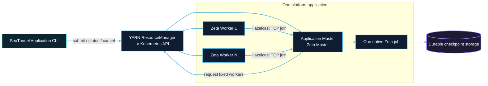
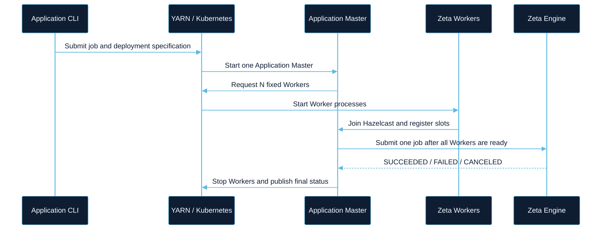
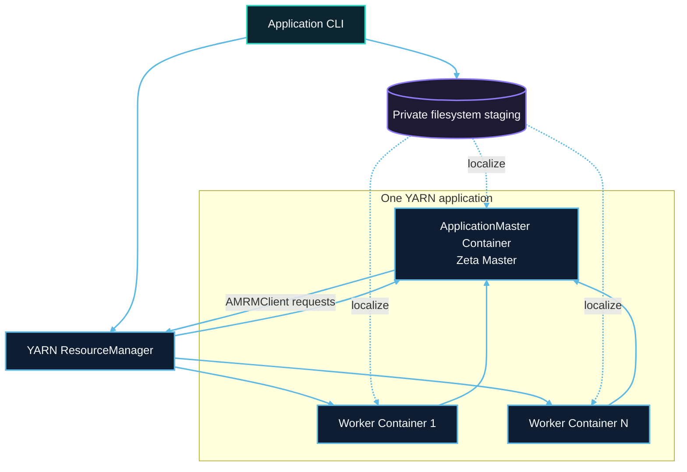
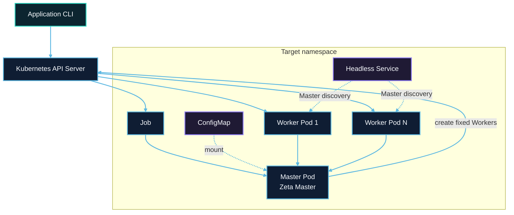
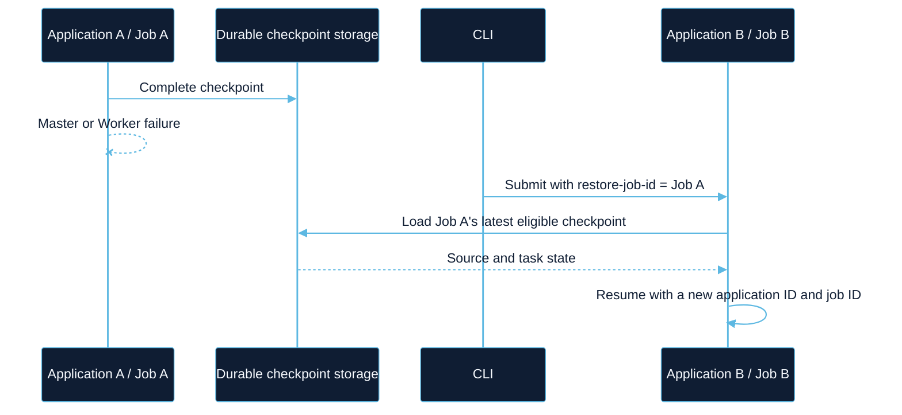

# STIP-41: Native Zeta Application Mode on YARN and Kubernetes

## Motivation

### What problem does this solve?

SeaTunnel currently supports submitting jobs to a long-running Zeta cluster. That model is efficient when many jobs share one managed cluster, but it also couples their resource capacity, dependencies, lifecycle, and failure boundary.

Many organizations already use YARN or Kubernetes as the control plane for compute workloads. They expect one submitted data job to create one isolated application, request its own workers, expose its status through the platform, and release resources when it terminates. Running Zeta in that model currently requires users to build platform-specific wrappers around SeaTunnel startup scripts and Hazelcast configuration. Those wrappers are difficult to keep correct because they must coordinate resource allocation, worker registration, job submission, failure handling, artifact localization, and cleanup.

This proposal introduces a native Application Mode for the Zeta engine. One submission creates one platform application containing one Zeta Master, a fixed number of Zeta Workers, and exactly one SeaTunnel job.

### Why add this to SeaTunnel?

Native Application Mode provides the following benefits:

- **Per-job isolation.** Each job owns its Master, Workers, classpath, configuration, and failure boundary.
- **Platform-native lifecycle.** YARN and Kubernetes create, observe, terminate, and clean up the application resources.
- **Elastic resource ownership.** Batch jobs release resources after completion, while streaming jobs keep only the resources assigned to that application.
- **Consistent deployment semantics.** Both providers implement the same submission, status, cancellation, worker-allocation, and cleanup contracts.
- **Checkpoint-based recovery.** A failed application can be submitted again with the historical Zeta job ID and recover from durable checkpoint storage.
- **A foundation for later work.** The lifecycle contracts leave room for worker replacement, autoscaling, Kerberos, and Master HA without including them in the first release.

## Goals

The first release provides:

1. One application for one native Zeta job.
2. One Master and a fixed, configurable number of Workers.
3. Parallel execution across multiple Workers and task slots.
4. YARN and Kubernetes providers behind independent Maven profiles.
5. Submit, detached submit, status, wait, and cancel operations.
6. Platform-aware allocation, monitoring, failure propagation, and cleanup.
7. The standard SeaTunnel distribution layout, with optional provider bundles.
8. Durable checkpoint recovery using local persistent storage, HDFS, and the object stores already supported by Zeta.
9. End-to-end coverage for batch, streaming, cancellation, invalid jobs, isolation, and checkpoint recovery.

## Non-goals

The following capabilities are intentionally deferred:

- Multiple Masters or automatic Master failover.
- Hazelcast state replication between Master processes. The application cluster uses `backup-count=0`.
- Automatic Worker replacement after an unexpected exit.
- Reactive scaling or autoscaling.
- YARN and HDFS Kerberos authentication.
- A separate Application Mode distribution.
- Application deployment for the Flink or Spark engines.

These exclusions define the first release boundary. They do not change Zeta's existing task checkpointing semantics.

## Proposal

### High-level architecture



The platform controls processes and resource objects. Zeta continues to control cluster membership, slot registration, task scheduling, execution, and checkpointing. Application Mode does not introduce a second scheduler.

### Lifecycle



The Master does not contribute task slots. Fixed application capacity is:

```text
application.worker-count × application.worker.slots
```

The runtime waits for both platform allocation and Zeta registration. A launched container or Pod is not considered ready until its Worker joins the application cluster and registers the configured slots.

## Module and package structure

The shared contracts are always built. Platform implementations and their SDK dependencies are enabled independently through the `yarn` and `kubernetes` Maven profiles.

```text
seatunnel-resource-managers/
├── core/                         seatunnel-resource-manager-core
│   └── org.apache.seatunnel.resource.core
│       ├── application/          specification, id, status, result
│       ├── client/               deployer and client contracts
│       ├── config/               shared application options
│       └── classloader/          localized JAR path resolution
├── yarn/                         seatunnel-resource-manager-yarn
│   └── org.apache.seatunnel.resource.yarn
│       ├── YarnApplicationMaster
│       ├── client/               submit, retrieve, status, cancel
│       ├── cluster/              container allocation and launch
│       └── config/               YARN options and configuration
└── kubernetes/                   seatunnel-resource-manager-kubernetes
    └── org.apache.seatunnel.resource.kubernetes
        ├── KubernetesApplicationEntrypoint
        ├── client/               submit, retrieve, status, cancel
        ├── cluster/              Pod allocation and reconciliation
        └── config/               Kubernetes options
```

The Engine client remains responsible for Hazelcast communication with an existing Zeta cluster. Platform submission contracts therefore live in `seatunnel-resource-manager-core`, while the Zeta server owns a separate driver contract for requesting external Workers after the Master starts.

## Core interfaces

The shared resource-manager core defines platform-independent value objects and client contracts. Platform SDK types do not cross this boundary.

| Interface | Responsibility |
| --- | --- |
| `ApplicationDeployerFactory` | Discovers a provider and creates its client-side deployer. |
| `ApplicationDeployer` | Submits a new platform application or retrieves an existing one. |
| `ApplicationClient` | Reads status and result, or cancels an application. |
| `ResourceManagerDriverFactory` | Creates the Worker resource driver inside the Zeta Master. |
| `ResourceManagerDriver` | Requests, releases, and stops platform Worker resources. |
| `JarPathResolver` | Maps localized Master-side JAR paths to Worker-side paths. |

### `ApplicationDeployerFactory`

```java
public interface ApplicationDeployerFactory {
    DeployType getDeployType();

    ApplicationDeployer create(Map<String, String> options) throws Exception;
}
```

Providers are discovered with Java `ServiceLoader`. A factory performs local validation and creates a deployer; discovery itself must not create remote resources.

### `ApplicationDeployer`

```java
public interface ApplicationDeployer extends AutoCloseable {
    ApplicationClient deploy(ApplicationSpecification specification) throws Exception;

    ApplicationClient retrieve(
            ApplicationId applicationId, Map<String, String> options) throws Exception;
}
```

`deploy` validates the immutable application specification, stages or references launch artifacts, and submits the Master. It returns after the external platform accepts the application. It does not wait for Workers or job completion.

`retrieve` creates a client for a previously submitted application and is used by later status and cancellation commands.

### `ApplicationClient`

```java
public interface ApplicationClient extends AutoCloseable {
    ApplicationId getApplicationId();

    ApplicationStatus getStatus() throws Exception;

    ApplicationResult getResult() throws Exception;

    void cancel() throws Exception;
}
```

Closing a client releases only local handles. It never cancels a remote application. This rule enables detached submission.

### External Worker driver

The Zeta server uses a separate `ResourceManagerDriver` contract for Worker resources:

```java
public interface ResourceManagerDriver extends AutoCloseable {
    void initialize(ResourceManagerContext context) throws Exception;

    CompletableFuture<WorkerRegistration> requestWorker(WorkerSpecification specification);

    CompletableFuture<Void> releaseWorker(WorkerRegistration worker);

    void stopWorkers() throws Exception;

    void finish(ApplicationStatus status, String diagnostics) throws Exception;
}
```

The deployment API owns client-side submission. The Worker driver owns resources after the Master starts. Zeta's existing `ResourceManager` still owns slot selection and task scheduling.

The driver reports an unexpected Worker exit through `ResourceManagerContext`. The fixed-size first release fails the application instead of silently continuing with reduced capacity or requesting a replacement.

## Configuration

All user-facing configuration is defined with SeaTunnel `Option` objects. Common options use the `application.*` namespace, while providers use `yarn.*` or `kubernetes.*`.

### Shared options

| Option | Default | Meaning |
| --- | --- | --- |
| `application.name` | `seatunnel` | Platform display name |
| `application.job-id` | generated | Positive native Zeta job ID for the new execution |
| `application.restore-job-id` | unset | Historical Zeta job ID used to locate a checkpoint |
| `application.worker-count` | `1` | Fixed Worker count |
| `application.worker.memory-mb` | `1024` | Memory for each Worker |
| `application.worker.cpu-cores` | `1` | CPU cores for each Worker |
| `application.worker.slots` | `2` | Task slots for each Worker |
| `application.master.memory-mb` | `1024` | Memory for the Master |
| `application.master.cpu-cores` | `1` | CPU cores for the Master |
| `application.master.port` | `5801` | Master Hazelcast port |
| `application.startup-timeout-millis` | `120000` | Bound for Master startup and Worker provisioning/registration |

Checkpoint paths remain Engine storage configuration. The Application Mode layer does not validate storage by enumerating URI schemes. The selected Zeta checkpoint storage plugin validates and opens the configured path, which preserves support for filesystem implementations and credential providers already supported by the Engine.

## YARN provider

### Resource model

- One YARN application contains one ApplicationMaster Container.
- The ApplicationMaster process also runs the Zeta Master.
- The ApplicationMaster requests a fixed number of Worker Containers through `AMRMClient`.
- `NMClient` launches each Worker JVM.
- The distribution, job configuration, and resolved Hadoop configuration are localized from a private staging directory.



### Cleanup

Normal termination releases Worker Containers, unregisters the ApplicationMaster with the final state, and deletes the application staging directory. Cancellation kills the YARN application and retries staging cleanup. Checkpoint storage must be outside the staging directory and is never deleted as application cleanup.

Kerberos is rejected in the first release so the system does not imply support for token renewal or long-running credential management.

## Kubernetes provider

### Resource model

- One `batch/v1` Job runs the Master Pod.
- A ConfigMap carries the job and deployment configuration.
- A headless Service provides a stable Master discovery name.
- The Master creates a fixed number of Worker Pods through the Kubernetes API.
- The Master and Workers run the same immutable SeaTunnel image.



The Job is initially suspended. The client creates the Job, obtains its UID, creates owned supporting resources, and then resumes it. This ordering gives the ConfigMap and Service a valid Job `OwnerReference`.

Only the Master mounts a ServiceAccount token. Worker Pods do not need Kubernetes API credentials. The application ServiceAccount manages only Worker Pods; the submitting identity manages Job, ConfigMap, Service, and application cancellation.

An optional existing PVC is mounted for local-file checkpoint storage. The PVC is supplied by the user and does not receive a Job owner reference, so Job deletion and TTL cleanup do not remove checkpoint data.

## Artifact and classloader model

YARN localizes one distribution into different absolute directories on different NodeManagers. Zeta serializes Master-side plugin JAR URLs as part of job metadata, so a Worker cannot load the original absolute path directly.

Application Mode adds a typed `JarPathResolver` extension to the existing classloader service. `ApplicationJarPathResolver` maps a file URL under the Master distribution root to the same relative path under the Worker's localized distribution root. It rejects missing files, path traversal, and symbolic-link escape. Non-local URLs and paths outside the distribution keep their original identity.

The resolver is injected explicitly when an application member starts. Application-specific paths are not stored as ad hoc Hazelcast properties and the default standalone classloader behavior is unchanged.

## Distribution and build profiles

Application Mode uses the standard SeaTunnel binary archive. It does not create a second distribution.

```text
apache-seatunnel-<version>/
├── bin/seatunnel-application.sh
├── starter/seatunnel-starter.jar
├── config/
├── lib/
├── connectors/
└── resource-managers/
    ├── yarn/
    └── kubernetes/
```

The shared `seatunnel-resource-manager-core` module is part of the default reactor and is consumed by the starter. The `yarn` and `kubernetes` Maven profiles independently add their provider modules and distribution dependencies. Release builds can enable both profiles; focused platform builds can enable only one.

Provider dependencies remain in their provider directory. The application launcher loads only the selected provider so Hadoop and Kubernetes SDK dependencies do not enter the normal standalone runtime classpath.

## Checkpoint recovery and availability

Master availability and checkpoint durability solve different failure modes.

The first release has one Master and `backup-count=0`; therefore, it does not provide live Master failover. Losing the Master or a Worker fails the current platform application. A durable checkpoint still allows a new application to resume the data job:



The restore operation is explicit. It creates a new platform application and a new Zeta job ID. Checkpoint data must be accessible with the same storage configuration and credentials, and Connector state must remain compatible.

## First-phase boundary

The feature is experimental in the first release. Existing local and standalone Zeta submission, Connector APIs, job APIs, and configuration keys remain unchanged. The first phase must prove the single-Master lifecycle, multiple-Worker execution, cleanup, and checkpoint recovery before adding multiple Masters, Worker replacement, autoscaling, or Kerberos.
